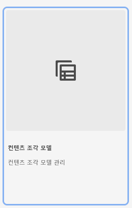

# AEM에서의 콘텐츠 조각 모델 만들기에 대해 알아보기 {#architect-headless-content-fragment-models}

## 지금까지의 스토리 {#story-so-far}

[AEM Headless 콘텐츠 작성자 여정](overview.md) 시작 부분의 [AEM을 통한 Headless용 콘텐츠 모델링 기본 사항](basics.md)에서는 Headless 작성과 관련된 기본 개념 및 용어를 다룹니다.

이 문서는 해당 사항을 기본으로 하며, 이를 통해 자체 AEM Headless 프로젝트의 콘텐츠 조각 모델을 만드는 방법을 이해할 수 있습니다.

## 목표 {#objective}

* **대상자**: 초급
* **목표**: 콘텐츠 조각 모델을 사용하여 Headless CMS용 콘텐츠를 모델링하는 개념 및 메커니즘에 대해 알아봅니다.

<!-- which persona does this? -->
<!-- and who allows the configuration on the folders? -->

<!--
## Enabling Content Fragment Models {#enabling-content-fragment-models}

At the very start you need to enable Content Fragment Models for your site, this is done in the Configuration Browser; under Tools -> General -> Configuration Browser. You can either select to configure the global entry, or create a new configuration. For example:

>[!NOTE]
>
>See Additional Resources - Content Fragments in the Configuration Browser
-->

## 콘텐츠 조각 모델 만들기 {#creating-content-fragment-models}

그런 다음 콘텐츠 조각 모델을 만들고 구조를 정의할 수 있습니다. **도구** -> **일반** -> **콘텐츠 조각 모델**&#x200B;에서 수행할 수 있습니다.

이를 선택하면 모델 위치로 이동하고 **만들기**&#x200B;를 선택합니다. 여기에서 여러 주요 세부 정보를 입력할 수 있습니다.

**모델 활성화** 옵션은 기본적으로 활성화됩니다. 즉, 모델은 저장하는 즉시 사용할 수 있습니다(콘텐츠 조각 생성 시). 필요한 경우 비활성화할 수 있음. 나중에 기존 모델을 활성화(또는 비활성화)할 수 있는 기회가 있습니다.

**만들기**&#x200B;를 사용하여 확인한 다음 모델을 **열어**&#x200B;서 구조 정의를 시작할 수 있습니다.

## 콘텐츠 조각 모델 정의 {#defining-content-fragment-models}

새 모델을 처음 열면 왼쪽에는 큰 공백이, 오른쪽에는 긴 **데이터 유형** 목록이 표시됩니다.

그럼 어떤 작업을 수행해야 합니까?

**데이터 유형** 인스턴스를 왼쪽 공간으로 드래그하여 모델을 미리 정의할 수 있습니다.

데이터 유형이 추가되면 해당 필드에 대한 **속성**&#x200B;을 정의해야 합니다. 이는 사용 중인 유형에 따라 다릅니다. 예:

필요에 따라 여러 필드를 추가할 수 있습니다. 예:

### 콘텐츠 작성자 {#your-content-authors}

콘텐츠 작성자는 모델 생성에 사용된 실제 데이터 유형 및 속성을 확인할 수 없습니다. 즉, 특정 필드를 완료하는 방법에 대한 도움말 및 정보를 제공해야 할 수도 있습니다. 기본 정보에는 필드 레이블 및 기본값을 사용할 수 있지만 복잡한 정보에는 프로젝트 관련 설명서를 고려해야 합니다.

>[!NOTE]
>
>추가 리소스 - 콘텐츠 조각 모델을 참조하십시오.

## 콘텐츠 조각 모델 관리 {#managing-content-fragment-models}

<!-- needs more details -->

콘텐츠 조각 모델 관리에는 다음 내용이 포함됩니다.

* 모델 활성화(또는 비활성화) - 콘텐츠 조각을 만들 때 작성자는 모델을 사용할 수 있습니다.
* 삭제 - 삭제는 항상 필요하지만 콘텐츠 조각(특히 이미 게시된 조각)에 이미 사용된 모델의 삭제에 대해 알고 있어야 합니다.

## 게시 {#publishing}

<!-- needs more details -->

콘텐츠 조각 모델은 종속된 콘텐츠 조각이 게시될 때/게시되기 전에 게시해야 합니다.

>[!NOTE]
>
>작성자가 모델이 아직 게시되지 않은 콘텐츠 조각을 게시하려는 경우 선택 목록에 이것이 표시되고 모델이 조각과 함께 게시됩니다.

모델이 게시되는 즉시 작성자의 읽기 전용 모드로 *잠깁니다*. 목표는 특히 게시 환경에서 기존 GraphQL 스키마 및 쿼리에 오류를 발생시킬 수 있는 변경 사항을 방지하는 것입니다. 콘솔에 **잠김**&#x200B;으로 표시됩니다.

모델이 읽기 전용 모드에서 **잠금**&#x200B;인 경우 모델의 콘텐츠 및 구조를 볼 수 있지만 이를 편집할 수는 없습니다. 단, 콘솔 또는 모델 편집기에서 **잠금** 모델을 관리할 수 있습니다.

## 다음 단계 {#whats-next}

이제 기본 사항을 배웠으므로 다음 단계는 자체 콘텐츠 조각 모델 만들기 시작입니다.

## 추가 리소스 {#additional-resources}

* [작성 개념](/help/sites-cloud/authoring/getting-started/concepts.md)

* [기본 처리](/help/sites-cloud/authoring/getting-started/basic-handling.md) - 이 페이지는 주로 **Sites** 콘솔을 기반으로 하지만 여러/대부분의 기능은 **일반** 콘솔에서의 **콘텐츠 조각 모델** 이동 및 작업 수행과 관련성이 있기도 합니다.

* [콘텐츠 조각을 사용하여 작업](/help/sites-cloud/administering/content-fragments/content-fragments.md)

   * [콘텐츠 조각 모델](/help/sites-cloud/administering/content-fragments/content-fragments-models.md)

      * [콘텐츠 조각 모델 정의](/help/sites-cloud/administering/content-fragments/content-fragments-models.md#defining-your-content-fragment-model)

      * [콘텐츠 조각 모델 활성화 또는 비활성화](/help/sites-cloud/administering/content-fragments/content-fragments-models.md#enabling-disabling-a-content-fragment-model)

      * [에셋 폴더에서 콘텐츠 조각 모델 허용](/help/sites-cloud/administering/content-fragments/content-fragments-models.md#allowing-content-fragment-models-assets-folder)

      * [콘텐츠 조각 모델 삭제](/help/sites-cloud/administering/content-fragments/content-fragments-models.md#deleting-a-content-fragment-model)

      * [콘텐츠 조각 모델 게시](/help/sites-cloud/administering/content-fragments/content-fragments-models.md#publishing-a-content-fragment-model)

      * [콘텐츠 조각 모델 게시 취소](/help/sites-cloud/administering/content-fragments/content-fragments-models.md#unpublishing-a-content-fragment-model)

      * [잠긴(게시된) 콘텐츠 조각 모델](/help/sites-cloud/administering/content-fragments/content-fragments-models.md#locked-published-content-fragment-models)

* 시작 안내서

   * [콘텐츠 조각 모델 Headless 설정 만들기](/help/headless/setup/create-content-model.md)
