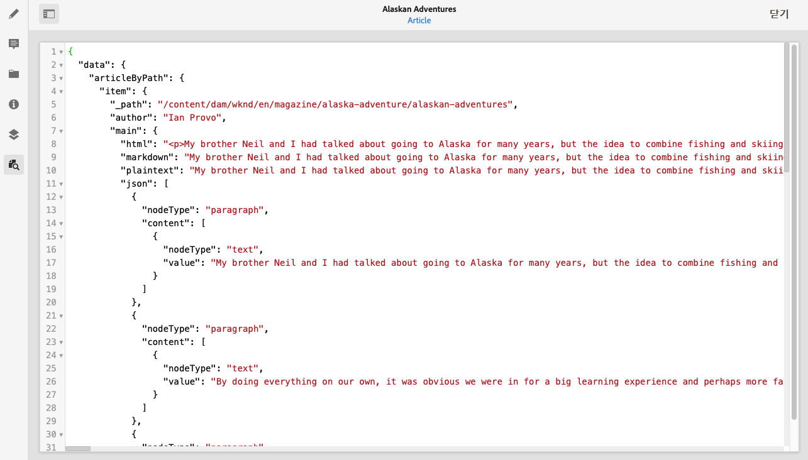
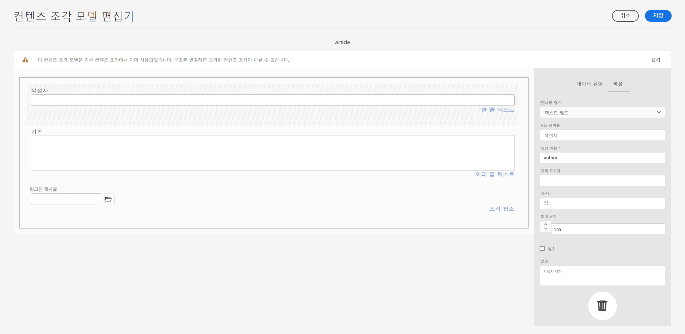
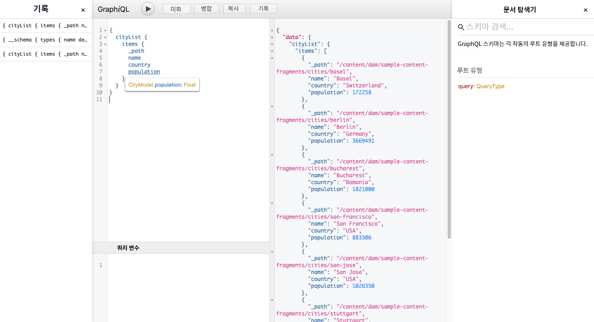

# AEM 게재 API를 통해 콘텐츠에 액세스하는 방법 {#access-your-content}

이 [AEM Headless 개발자 여정](overview.md)의 부분에서 GraphQL 쿼리를 통해 콘텐츠 조각의 콘텐츠에 액세스하고 앱에 피드하는 방법(Headless 게재)에 대해 알아볼 수 있습니다.

## 지금까지의 스토리 {#story-so-far}

AEM Headless 여정의 이전 문서인 [콘텐츠를 모델링하는 방법](model-your-content.md)에서는 AEM의 콘텐츠 모델링에 대한 기본 사항을 살펴보았으므로 이제 콘텐츠 구조를 모델링하는 방법을 이해하고 AEM 콘텐츠 조각 모델 및 콘텐츠 조각을 사용하여 해당 구조를 실현해야 합니다.

* 콘텐츠 모델링 관련 개념과 용어를 인식합니다.
* Headless 콘텐츠 게재에 콘텐츠 모델링이 필요한 이유를 이해합니다.
* AEM 콘텐츠 조각 모델을 사용(및 콘텐츠 조각으로 콘텐츠 작성)하여 이 구조를 실현하는 방법을 이해합니다.
* 기본 샘플을 사용하여 콘텐츠와 원칙을 모델링하는 방법을 이해합니다.

이 문서는 해당 기본 사항을 기본으로 하며, 이를 통해 AEM GraphQL API를 통해 AEM의 기존 Headless 콘텐츠에 액세스하는 방법에 대해 살펴볼 수 있습니다.

* **대상자**: 초급
* **목표**: AEM GraphQL 쿼리를 통해 콘텐츠 조각의 콘텐츠에 액세스하는 방법에 대해 알아보기:
   * GraphQL 및 AEM GraphQL API를 소개합니다.
   * AEM GraphQL API에 대해 자세히 알아봅니다.
   * 몇 가지 샘플 쿼리를 통해 실제로 작동하는 방식을 살펴봅니다.

## 콘텐츠에 액세스하시겠습니까? {#so-youd-like-to-access-your-content}

이에 이 모든 콘텐츠는 (콘텐츠 조각에) 깔끔히 구조화되어 새로운 앱 피드 대기 중입니다. 질문 - 콘텐츠를 가져오는 방법은 무엇입니까?

추가적인 처리가 필요하면 특정 콘텐츠를 타겟팅하고 필요한 사항을 선택한 다음 앱으로 반환해야 합니다.

Adobe Experience Manager(AEM) as a Cloud Service에서 AEM GraphQL API를 사용하면 콘텐츠 조각에 선택적으로 액세스하여 필요한 콘텐츠만 반환할 수 있습니다. 즉, 애플리케이션에 사용할 구조화된 콘텐츠의 Headless 게재를 실현할 수 있습니다.

>[!NOTE]
>
>AEM GraphQL API는 표준 GraphQL API 사양에 따라 사용자 정의된 구현입니다.

## GraphQL - 소개 {#graphql-introduction}

GraphQL은 다음 사항을 제공하는 오픈 소스 사양입니다.

* 구조화된 오브젝트에서 특정 콘텐츠를 선택할 수 있는 쿼리 언어.
* 구조화된 콘텐츠로 해당 쿼리를 수행하는 런타임.

GraphQL은 강력한 포맷의 API입니다. 즉, GraphQL이 액세스하는 대상 및 방법을 *이해*&#x200B;할 수 있도록 *모든* 데이터를 유형별로 명확하게 구조화하고 구성해야 합니다. 콘텐츠 오브젝트의 구조를 정의하는 GraphQL 스키마 내에서 데이터 필드를 정의합니다.

그런 다음 GraphQL 엔드포인트는 GraphQL 쿼리에 응답하는 경로를 제공합니다.

즉, 앱이 AEM에서 사용되는 경우 필요한 사항을 정확하고 안정적이며 효율적으로 선택할 수 있습니다.

>[!NOTE]
>
>*GraphQL*.org 및 *GraphQL*.com을 참조하십시오.

<!--
## AEM and GraphQL {#aem-graphql}

GraphQL is used in various locations in AEM; for example:

* Content Fragments
  * A customized API has been developed for this use-case (Headless Delivery to your app).
    * This is the AEM GraphQL API.
* Commerce
  * AEM Commerce consumes data from a Commerce platform via GraphQL.
  * There are GraphQL integrations between AEM and various third-party commerce solutions, used with the extension hooks provided by the CIF Core Components.
    * This does not use the AEM GraphQL API.

>[!NOTE]
>
>This step of the Headless Journey is only concerned with the AEM GraphQL API and Content Fragments.
-->

## AEM GraphQL API {#aem-graphql-api}

AEM GraphQL API는 표준 GraphQL API 사양을 기반으로 사용자 정의된 버전으로 콘텐츠 조각에서 (복잡한) 쿼리를 수행하도록 특별히 구성되었습니다.

콘텐츠는 콘텐츠 조각 모델에 따라 구조화되므로 콘텐츠 조각을 사용합니다. 이로써 GraphQL의 기본 요구 사항을 충족합니다.

* 콘텐츠 조각 모델은 한 개 이상의 필드로 만들어집니다.
   * 각 필드는 데이터 유형에 따라 정의됩니다.
* 콘텐츠 조각 모델은 해당 AEM GraphQL 스키마를 생성하는 데 사용됩니다.

실제로 AEM용 GraphQL(및 콘텐츠)에 액세스하려면 엔드포인트를 사용하여 액세스 경로를 제공합니다.

그런 다음 반환된 콘텐츠를 애플리케이션에서 AEM GraphQL API를 통해 사용할 수 있습니다.

쿼리를 직접 입력하고 테스트하는 데 도움이 되도록 표준 GraphiQL 인터페이스 구현은 AEM GraphQL과 함께 사용할 수도 있습니다(AEM으로 설치할 수 있음). 기록 및 온라인 설명서와 함께 구문 강조, 자동 완성, 자동 제안과 같은 기능을 제공합니다.

>[!NOTE]
>
>AEM GraphQL API 구현은 GraphQL Java 라이브러리를 기반으로 합니다.

<!--
### Use Cases for Author and Publish Environments {#use-cases-author-publish-environments}

The use cases for the AEM GraphQL API can depend on the type of AEM as a Cloud Service environment:

* Publish environment; used to: 
  * Query content for JS application (standard use-case)

* Author environment; used to: 
  * Query content for "content management purposes":
    * GraphQL in AEM as a Cloud Service is currently a read-only API.
    * The REST API can be used for CR(u)D operations.
-->

## AEM GraphQL API과 함께 사용하기 위한 콘텐츠 조각 {#content-fragments-use-with-aem-graphql-api}

콘텐츠 조각은 다음과 같이 AEM 스키마 및 쿼리를 위한 GraphQL의 기반으로 사용할 수 있습니다.

* 이를 통해 Headless 방식으로 게재될 페이지 독립적 콘텐츠를 디자인, 작성, 선별 및 게시할 수 있습니다.
* 콘텐츠는 콘텐츠 조각 모델을 기반으로 다양한 데이터 유형을 사용하여 최종 조각의 구조를 사전 정의합니다.
* 모델을 정의할 때 사용할 수 있는 조각 참조 데이터 유형을 사용하여 구조 계층을 추가로 얻을 수 있습니다.

### 콘텐츠 조각 모델 {#content-fragments-models}

해당 콘텐츠 조각 모델은

* **활성화** 시 스키마를 생성하는 데 사용됩니다.
* GraphQL에 필요한 데이터 유형과 필드를 제공합니다. 애플리케이션이 가능한 요청만 수행하고 예상되는 내용을 수신하도록 합니다.
* **조각 참조** 데이터 유형은 다른 콘텐츠 조각을 참조하여 추가적인 구조 수준을 가져오도록 모델에서 사용할 수 있습니다.

### 조각 참조 {#fragment-references}

**조각 참조**:

* 콘텐츠 조각 모델을 정의할 때 사용 가능한 특정 데이터 유형입니다.
* 특정 콘텐츠 조각 모델에 따라 다른 조각을 참조합니다.
* 구조화된 데이터를 만든 다음 검색할 수 있습니다.

   * **다중 피드**&#x200B;로 정의된 경우 주요 조각에서 여러 하위 조각을 참조(검색)할 수 있습니다.

### JSON 미리보기 {#json-preview}

콘텐츠 조각 모델 디자인 및 개발을 지원하기 위해 콘텐츠 조각 편집기에서 JSON 출력을 미리 볼 수 있습니다.



<!--
## GraphQL Schema Generation from Content Fragments {#graphql-schema-generation-content-fragments}

GraphQL is a strongly-typed API, which means that content must be clearly structured and organized by type. The GraphQL specification provides a series of guidelines on how to create a robust API for interrogating content on a certain instance. To do this, a client needs to fetch the Schema, which contains all the types necessary for a query. 

For Content Fragments, the GraphQL schemas (structure and types) are based on **Enabled** Content Fragment Models and their data types.

>[!CAUTION]
>
>All the GraphQL schemas (derived from Content Fragment Models that have been **Enabled**) are readable through the GraphQL endpoint.
>
>This means that you need to ensure that no sensitive content is available, to ensure that no sensitive data is exposed via GraphQL endpoints; for example, this includes information that could be present as field names in the model definition.

For example, if a user created a Content Fragment Model called `Article`, then AEM generates the object `article` that is of a type `ArticleModel`. The fields within this type correspond to the fields and data types defined in the model.

1. A Content Fragment Model:

   

1. The corresponding GraphQL schema (output from GraphiQL automatic documentation):
   

   This shows that the generated type `ArticleModel` contains several [fields](#fields). 
   
   * Three of them have been controlled by the user: `author`, `main` and `referencearticle`.

   * The other fields were added automatically by AEM, and represent helpful methods to provide information about a certain Content Fragment; in this example, `_path`, `_metadata`, `_variations`. These [helper fields](#helper-fields) are marked with a preceding `_` to distinguish between what has been defined by the user and what has been auto-generated.

1. After a user creates a Content Fragment based on the Article model, it can then be interrogated through GraphQL. For examples, see the Sample Queries.md#graphql-sample-queries) (based on a sample Content Fragment structure for use with GraphQL.

In GraphQL for AEM, the schema is flexible. This means that it is auto-generated each and every time a Content Fragment Model is created, updated or deleted. The data schema caches are also refreshed when you update a Content Fragment Model.

The Sites GraphQL service listens (in the background) for any modifications made to a Content Fragment Model. When updates are detected, only that part of the schema is regenerated. This optimization saves time and provides stability.

So for example, if you:

1. Install a package containing `Content-Fragment-Model-1` and `Content-Fragment-Model-2`:
 
   1. GraphQL types for `Model-1` and `Model-2` are generated.

1. Then modify `Content-Fragment-Model-2`:

   1. Only the `Model-2` GraphQL type will get updated.

   1. Whereas `Model-1` will remain the same. 

>[!NOTE]
>
>This is important to note in case you want to do bulk updates on Content Fragment Models through the REST api, or otherwise.

The schema is served through the same endpoint as the GraphQL queries, with the client handling the fact that the schema is called with the extension `GQLschema`. For example, performing a simple `GET` request on `/content/cq:graphql/global/endpoint.GQLschema` will result in the output of the schema with the Content-type: `text/x-graphql-schema;charset=iso-8859-1`.

### Schema Generation - Unpublished Models {#schema-generation-unpublished-models}

When Content Fragments are nested it can happen that a parent Content Fragment Model is published, but a referenced model is not.

>[!NOTE]
>
>The AEM UI prevents this happening, but if publishing is made programmatically, or with content packages, it can occur.

When this happens, AEM generates an *incomplete* Schema for the parent Content Fragment Model. This means that the Fragment Reference, which is dependent on the unpublished model, is removed from the schema.

## AEM GraphQL Endpoints {#aem-graphql-endpoints}

An endpoint is the path used to access GraphQL for AEM. Using this path you (or your app) can:

* access the GraphQL schemas,
* send your GraphQL queries,
* receive the responses (to your GraphQL queries).

AEM allows for:

* A global endpoint - available for use by all sites.
* Endpoints for specific Sites configurations - that you can configure (in the Configuration Browser), specific to a specified site/project.

## Permissions {#permissions}

The permissions are those required for accessing Assets.

## The AEM GraphiQL Interface {#aem-graphiql-interface}

To help you directly input, and test queries, an implementation of the standard GraphiQL interface is available for use with AEM GraphQL. This can be installed with AEM.

>[!NOTE]
>
>GraphiQL is bound the global endpoint (and does not work with other endpoints for specific Sites configurations).

It provides features such as syntax-highlighting, auto-complete, auto-suggest, together with a history and online documentation.


-->

## 실제로 AEM GraphQL API 사용하기 {#actually-using-aem-graphiql}

### 초기 설정 {#initial-setup}

콘텐츠에 대한 쿼리를 시작하기 전에 다음 사항을 수행해야 합니다.

* 엔드포인트 활성화
   * 도구 -> 일반 -> GraphQL 사용
   * [GraphQL 엔드포인트 활성화하기](/help/headless/graphql-api/graphql-endpoint.md)
      * 이러면 GraphiQL IDE도 활성화됩니다.

### 샘플 구조 {#sample-structure}

쿼리에서 실제로 AEM GraphQL API를 사용하려면 두 가지 기본 콘텐츠 조각 모델 구조를 사용할 수 있습니다.

* 회사
   * 이름 - 텍스트
   * CEO(개인) - 조각 참조
   * 직원(개인) - 조각 참조
* 개인
   * 이름 - 텍스트
   * 이름 - 텍스트

이처럼 CEO 및 직원 필드는 개인 조각을 참조합니다.

다음 경우에 조각 모델을 사용합니다.

* 콘텐츠 조각 편집기에서 콘텐츠를 만드는 경우
* 쿼리할 GraphQL 스키마를 생성하는 경우

### 쿼리를 테스트할 위치 {#where-to-test-your-queries}

GraphiQL 인터페이스에 쿼리를 입력할 수 있습니다. 다음 중 하나에서 쿼리 편집기에 액세스할 수 있습니다.

* **도구** -> **일반** -> **GraphQL 쿼리 편집기**
* 직접 (예: `http://localhost:4502/aem/graphiql.html`)


### 쿼리 시작하기 {#getting-Started-with-queries}

간단한 쿼리는 회사 스키마에 있는 모든 항목의 이름을 반환하는 것입니다. 여기에서 모든 회사 이름 목록을 요청합니다.

```xml
query {
  companyList {
    items {
      name
    }
  }
}
```

약간 더 복잡한 쿼리는 “작업” 이름이 없는 모든 사람을 선택하는 것입니다. 작업 이름이 없는 모든 사람이 필터링됩니다. 이는 EQUALS_NOT 연산자로 수행됩니다(추가 연산자 있음).

```xml
query {
  personList(filter: {
    name: {
      _expressions: [
        {
          value: "Jobs"
          _operator: EQUALS_NOT
        }
      ]
    }
  }) {
    items {
      name
      firstName
    }
  }
}
```

더 복잡한 쿼리를 작성할 수도 있습니다. 예: 이름이 “Smith”인 직원이 한 명 이상 있는 모든 회사의 쿼리. 이 쿼리는 이름이 “Smith”인 모든 개인에 대한 필터링을 보여 주고, 중첩된 조각에서 정보를 반환합니다.

```xml
query {
  companyList(filter: {
    employees: {
      _match: {
        name: {
          _expressions: [
            {
              value: "Smith"
            }
          ]
        }
      }
    }
  }) {
    items {
      name
      ceo {
        name
        firstName
      }
      employees {
        name
        firstName
      }
    }
  }
}
```

<!-- need code / curl / cli examples-->

필수 요소 구성과 함께 AEM GraphQL API 사용에 대한 자세한 내용은 다음 자료를 참조하십시오.

* AEM을 통해 GraphQL을 사용하는 방법 알아보기
* 샘플 콘텐츠 조각 구조
* AEM을 통해 GraphQL을 사용하는 방법 알아보기 - 샘플 콘텐츠 및 쿼리

## 다음 단계 {#whats-next}

이제 AEM GraphQL API를 사용하여 Headless 콘텐츠에 액세스하고 쿼리하는 방법을 배웠으므로 [REST API를 사용하여 콘텐츠 조각의 콘텐츠에 액세스하고 업데이트하는 방법](update-your-content.md)에 대해 알아볼 수 있습니다.

## 추가 리소스 {#additional-resources}

* [GraphQL.org](https://graphql.org)
   * [스키마](https://graphql.org/learn/schema/)
   * [변수](https://graphql.org/learn/queries/#variables)
   * [GraphQL Java 라이브러리](https://graphql.org/code/#java)
* [GraphiQL](https://graphql.org/learn/serving-over-http/#graphiql)
* [AEM을 통해 GraphQL을 사용하는 방법 알아보기](/help/headless/graphql-api/content-fragments.md)
   * [GraphQL 엔드포인트 활성화하기](/help/headless/graphql-api/graphql-endpoint.md)
   * [AEM GraphiQL 인터페이스 설치](/help/headless/graphql-api/graphiql-ide.md)
* [샘플 콘텐츠 조각 구조](/help/headless/graphql-api/sample-queries.md#content-fragment-structure-graphql)
* [AEM을 통해 GraphQL을 사용하는 방법 알아보기 - 샘플 콘텐츠 및 쿼리](/help/headless/graphql-api/sample-queries.md)
   * [샘플 쿼리 - 단일 특정 도시 조각](/help/headless/graphql-api/sample-queries.md#sample-single-specific-city-fragment)
   * [메타데이터에 대한 샘플 쿼리 - GB라는 제목의 상에 대한 메타데이터 나열](/help/headless/graphql-api/sample-queries.md#sample-metadata-awards-gb)
   * [샘플 쿼리 - 이름이 붙은 변형이 있는 모든 도시](/help/headless/graphql-api/sample-queries.md#sample-cities-named-variation)
* [구성 브라우저에서 콘텐츠 조각 기능 활성화](/help/sites-cloud/administering/content-fragments/content-fragments-configuration-browser.md#enable-content-fragment-functionality-in-configuration-browser)
* [콘텐츠 조각을 사용하여 작업](/help/sites-cloud/administering/content-fragments/content-fragments.md)
   * [콘텐츠 조각 모델](/help/sites-cloud/administering/content-fragments/content-fragments-models.md)
   * [JSON 출력](/help/sites-cloud/administering/content-fragments/content-fragments-json-preview.md)
* [원본 간 리소스 공유(CORS) 이해](https://experienceleague.adobe.com/docs/experience-manager-learn/foundation/security/understand-cross-origin-resource-sharing.html?lang=ko-KR#understand-cross-origin-resource-sharing-(cors))
* [GraphQL 지속 쿼리 - Dispatcher에서 캐싱 활성화](/help/headless/deployment/dispatcher-caching.md)
* [서버측 API용 액세스 토큰 생성](/help/implementing/developing/introduction/generating-access-tokens-for-server-side-apis.md)
* [AEM Headless 시작하기](https://experienceleague.adobe.com/docs/experience-manager-learn/getting-started-with-aem-headless/graphql/overview.html) - 콘텐츠 모델링 및 GraphQL을 포함하여 AEM의 Headless 기능 사용 개요를 제공하는 짧은 비디오 튜토리얼 시리즈.
