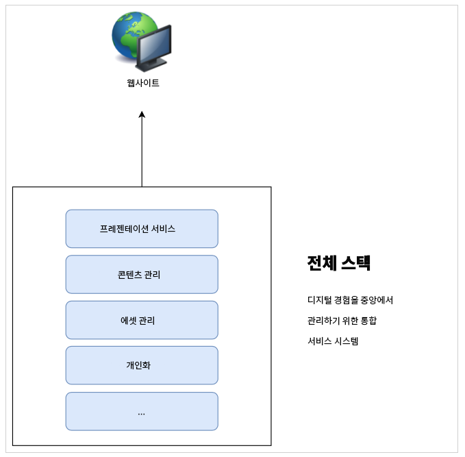
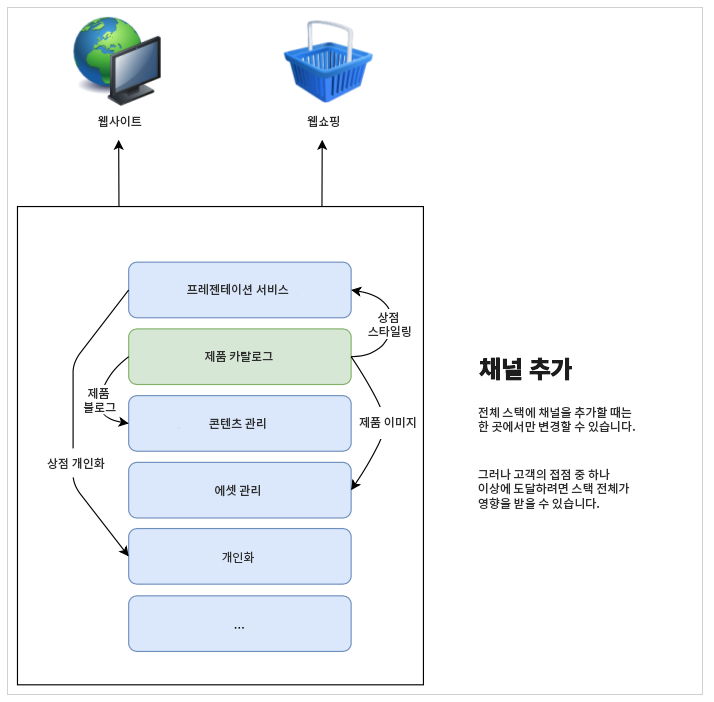
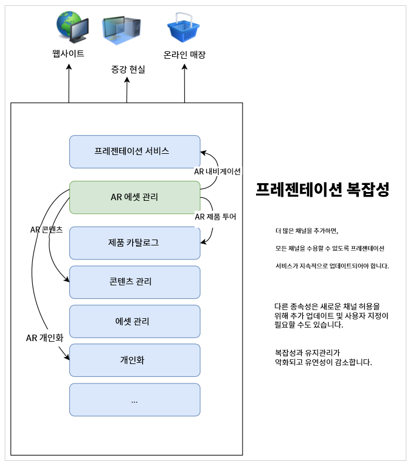
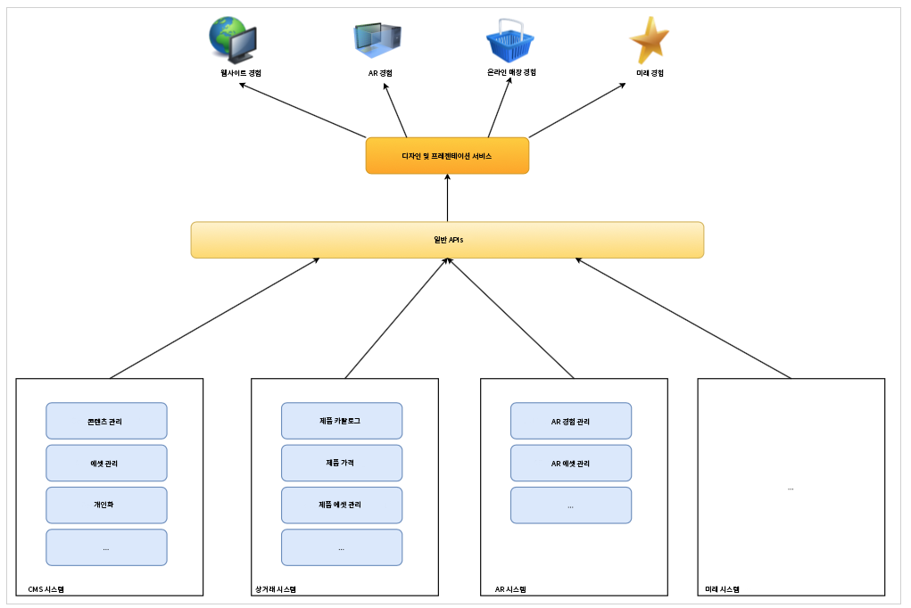

# CMS Headless 개발에 대해 알아보기 {#learn-about}

이 [AEM Headless 개발자 여정](overview.md)의 부분에서는 Headless 기술과 이를 사용하는 이유에 대해 알아봅니다.

## 목표 {#objective}

이 문서는 Headless 콘텐츠 게재와 이를 사용해야 하는 이유를 이해하는 데 도움이 됩니다. 문서를 읽고 나면

* Headless 콘텐츠 게재에 대한 기본적인 개념과 용어를 이해할 수 있습니다.
* Headless가 필요한 이유와 시점을 이해할 수 있습니다.
* 높은 수준에서 Headless 개념이 어떻게 사용되는지, 어떻게 상호 연관되는지를 파악할 수 있습니다.

## 전체 콘텐츠 게재 {#full-stack}

사용이 간편한 대규모 CMS(콘텐츠 관리 시스템)가 등장한 이후 조직에서는 메시지, 브랜딩 및 커뮤니케이션을 관리하는 중앙 위치로 CMS를 사용해 왔습니다. CMS를 경험 관리의 중심점으로 사용하면 효율성이 개선되어 서로 다른 시스템에서 작업을 복제할 필요가 없습니다.

전체 스택 CMS에서 내 콘텐츠 조작에 대한 모든 기능은 CMS에 있습니다. 시스템 기능은 CMS 스택의 다양한 구성 요소를 구성합니다. 전체 스택 솔루션은 장점이 많습니다.

* 유지 관리할 시스템이 한 개 있습니다.
* 콘텐츠는 중앙 집중식으로 관리됩니다.
* 시스템의 모든 서비스가 통합됩니다.
* 콘텐츠 작성이 원활하게 이뤄집니다.

따라서 새 채널을 추가하거나 새로운 경험 유형에 대한 지원이 필요한 경우 한 개(또는 그 이상)의 새 구성 요소를 스택에 삽입할 수 있고 한 위치에서만 변경할 수 있습니다.

스택의 다른 항목을 조정하여 변경 사항을 수용할 수 있으므로 스택 종속성의 복잡성이 빠르게 나타납니다.

## 전체 스택 게재 제한 {#limits}

전체 스택 접근 방식을 통해 기본적으로 모든 경험이 하나의 시스템에 랜딩되는 사일로를 생성합니다. 사일로의 구성 요소 한 개를 변경하거나 추가하려면 다른 구성 요소를 변경해야 하므로 시간과 비용이 많이 들 수 있습니다.

이는 특히 기존 설정에서 CMS에 긴밀하게 바인딩되는 프레젠테이션 시스템에 해당됩니다. 모든 새 채널은 일반적으로 다른 모든 채널에 영향을 미칠 수 있는 프레젠테이션 시스템에 대한 업데이트를 의미합니다.

스택의 모든 구성 요소에 변경 사항을 조정하는 데 추가 역량을 사용하면 이 자연 사일로의 제한 사항이 나타납니다.

사용자는 플랫폼이나 터치 포인트에 관계없이 참여를 기대하므로 경험을 제공하는 방법에 민첩성을 제공합니다.  이 멀티채널 방식은 디지털 경험의 표준이고 전체 스택 접근 방식은 특정 상황에서 유연하지 않을 수 있습니다.

## Headless의 헤드 {#the-head}

모든 시스템의 헤드는 일반적으로 해당 시스템의 출력 렌더러이며, 보통 GUI 또는 기타 그래픽 출력 형식입니다.

예를 들어 Headless 서버는 서버 공간의 랙 어딘가에 있을 수 있고 서버에는 모니터가 연결되어 있지 않습니다. 액세스하려면 원격으로 연결해야 합니다. 이 경우 모니터는 헤드로 서버의 출력 렌더링을 처리합니다. 서비스 소비자는 원격으로 연결할 때 자체 헤드(모니터)를 제공합니다.

Headless CMS에 대해 말하자면 CMS는 콘텐츠를 관리하고 소비자에게 지속적으로 전달합니다. 그러나 **콘텐츠**&#x200B;를 표준화된 방식으로만 제공하면 Headless CMS는 최종 출력 렌더링을 생략하고 사용 서비스에 대한 콘텐츠 **프레젠테이션**&#x200B;를 종료합니다.

AR 경험, 웹 샵, 모바일 경험, 프로그레시브 웹 앱(PWA) 등 소비 서비스는 Headless CMS에서 콘텐츠를 가져와 자체 렌더링을 제공합니다. 콘텐츠에 대한 자체 헤드를 처리합니다.

헤드가 생략되면 복잡성이 제거되어 CMS를 간소화합니다. 이렇게 하면 실제로 콘텐츠가 필요하고 해당 렌더링에 가장 적합한 서비스로 콘텐츠를 렌더링하는 책임이 이전되기도 합니다.

## 분리 {#decoupling}

모든 환경에서 활용할 수 있는 강력하고 유연한 애플리케이션 프로그래밍 인터페이스(API) 세트를 노출하여 Headless를 게재할 수 있습니다. API는 표준화된 콘텐츠 게재를 통해 콘텐츠 수준에서 서비스를 바인딩하지만 자체 솔루션을 구현할 수 있는 유연성을 제공하는 서비스 간의 일반 언어로 사용됩니다.

Headless는 프레젠테이션에서 콘텐츠를 분리하는 예제입니다. 보다 일반적인 차원에서 살펴보면 프론트엔드를 서비스 스택의 백엔드에서 분리합니다. Headless 설정에서 프레젠테이션 시스템(헤드)을 콘텐츠 관리(테일)에서 분리합니다. 두 경우는 API 호출을 통해서만 상호 작용합니다.

해당 분리는 각 사용 서비스(프론트엔드)가 API를 통해서 게재되는 동일한 콘텐츠를 기반으로 경험을 빌드하여 콘텐츠 재사용 및 일관성을 유지할 수 있음을 의미합니다. 그런 다음 사용 서비스는 자체 프레젠테이션 시스템을 구현하여 콘텐츠 관리 스택(백엔드)을 손쉽게 가로로 확장할 수 있습니다.

## 기술적 토대 {#technology}

Headless 방식을 통해 미래의 디지털 경험 수요에 맞게 쉽고 빠르게 적응할 수 있는 기술 스택을 빌드할 수 있습니다.

이전 CMS용 API는 일반적으로 REST 기반이었습니다. Representational State Transfer(REST)는 상태를 저장하지 않는 방식으로 리소스를 텍스트로 제공합니다. 이렇게 하면 사전 정의된 작업 세트를 사용하여 리소스를 읽고 수정할 수 있습니다. REST는 상태를 저장하지 않는 방식으로 콘텐츠를 표현하여 서비스 간의 상호 운용성을 지원할 수 있었습니다.

지속적으로 강력한 REST API가 필요합니다. 단, REST 요청은 대량으로 세부 정보를 표시할 수 있습니다. 모든 채널의 REST를 호출하는 소비자가 여러 명일 경우 이 세부 정보 표시와 성능이 영향을 받을 수 있습니다.

Headless 콘텐츠 게재 시 GraphQL API를 사용하기도 합니다. GraphQL을 통해 이와 유사한 상태를 저장하지 않는 방식으로 전송할 수 있지만, 타겟팅된 쿼리를 추가하면 총 필수 쿼리 개수를 줄이고 성능을 개선할 수 있습니다. 솔루션에서 혼합된 REST와 GraphQL을 사용하는 것이 일반적이며, 기본적으로 작업에 바로 사용할 수 있도록 가장 적합한 도구를 선택합니다.

선택한 API가 무엇이든, 일반 API를 기반으로 Headless 시스템을 정의하여 최신 브라우저와 점진적 웹 앱(PWA)과 같은 기타 웹 기술을 사용할 수 있습니다. API는 손쉽게 확장하고 조종할 수 표준 인터페이스를 생성합니다.

일반적으로 클라이언트측에서 콘텐츠를 렌더링합니다. 일반적으로 누군가 모바일 디바이스에서 콘텐츠를 호출하고 CMS가 콘텐츠를 전달한 다음 모바일 디바이스(클라이언트)는 제공된 콘텐츠의 렌더링을 담당합니다. 디바이스가 이전 버전이거나 속도가 느린 경우 디지털 경험도 마찬가지로 속도가 느립니다.

프레젠테이션에서 콘텐츠를 분리한다는 것은 해당 클라이언트측 성능 문제를 추가로 제어할 수 있음을 의미합니다. 서버측 렌더링(SSR)은 클라이언트 브라우저의 콘텐츠를 서버로 렌더링하는 업무를 전송합니다. 이를 통해 콘텐츠 제공자는 필요한 경우 보장된 성과 수준을 대상자에게 제공할 수 있습니다.

## 조직 과제 {#organization}

Headless는 유연한 솔루션을 통해 디지털 경험을 제공할 수 있는 시대를 열어줍니다. 하지만 해당 유연성은 자체 문제를 제시할 수도 있습니다.

서로 다른 채널들이 많다는 것은 각 채널에 자체 프레젠테이션 시스템이 있다는 것을 의미할 수 있습니다. 모든 채널에서 동일한 API를 통해 동일한 콘텐츠를 사용하더라도 프레젠테이션이 다르기 때문에 경험이 다를 수 있습니다. 고객 경험의 일관성을 유지하려면 관심과 주의를 기울여야 합니다.

신중한 디자인 시스템을 구현하고, 패턴 라이브러리를 공유하고, 재사용 가능한 디자인 구성 요소 및 설정된 개방형 클라이언트측 프레임워크를 활용하여 일관된 경험을 유지할 수 있지만 계획을 수립해야 합니다.

## 미래는 Headless이고 미래는 지금입니다. {#future}

디지털 경험은 브랜드가 고객과 상호 작용하는 방법을 계속 정의합니다. Headless 디자인의 흥미로운 점은 변모하는 고객 기대에 부응할 수 있는 유연성을 제공할 수 있다는 것입니다.

미래를 예측할 수는 없지만 Headless는 미래가 가져올 모든 것에 반응할 수 있는 민첩성을 제공합니다.

## AEM 및 Headless {#aem-and-headless}

이 개발자 여정을 계속 진행하면서 AEM이 전체 스택 게재 기능과 함께 Headless 게재를 지원하는 방법에 대해 알아봅니다.

디지털 경험 관리 업계 리더인 Adobe는 경험 크리에이터가 현실에서 직면하는 문제에 대한 이상적인 솔루션이 양자택일이 될 필요가 없다는 것을 잘 알고 있습니다. 따라서 AEM은 두 모델을 모두 지원할 뿐만 아니라 Headless와 전체 스택의 이점을 혼합한 두 모델의 원활한 하이브리드 조합을 통해 콘텐츠 소비자가 어디에 있든 최상의 서비스를 제공할 수 있습니다.

이 여정은 콘텐츠 게재의 Headless 전용 모델에 중점을 둡니다. 그러나 이러한 기본 지식을 갖추게 되면 두 모델의 기능을 사용하는 방법에 대해 더 탐색할 수 있습니다.

## 다음 단계 {#what-is-next}

AEM Headless 여정을 시작해 주셔서 감사합니다! 이 문서를 읽고 나면

* Headless 콘텐츠 게재에 대한 기본적인 개념과 용어를 이해할 수 있습니다.
* Headless가 필요한 이유와 시점을 이해할 수 있습니다.
* 높은 수준에서 Headless 개념이 어떻게 사용되는지, 어떻게 상호 연관되는지를 파악할 수 있습니다.

이 지식을 기반으로 다음 문서인 [AEM Headless as a Cloud Service 시작하기](getting-started.md)를 검토하여 AEM Headless 번역 여정을 계속하십시오. 여기에서는 필요한 도구를 설정하는 방법과 Headless 콘텐츠 게재 및 사전 요구 사항에 접근하는 방법에 대해 어떻게 생각하고 있는지에 대해 알아보게 됩니다.

## 추가 리소스 {#additional-resources}

다음 문서인 [AEM Headless as a Cloud Service 시작하기](getting-started.md)를 검토하여 Headless 개발 여정의 다음 부분으로 넘어가는 것이 좋습니다. 다음은 이 문서에 나열된 몇 가지 개념을 자세히 알아보는 추가적인 옵션 리소스이며, 이들 리소스를 Headless 여정에서 계속 사용할 필요는 없습니다.

* [Adobe Experience Manager as a Cloud Service의 아키텍처 소개](/help/overview/architecture.md) - AEM as a Cloud Service의 아키텍처 이해
* [AEM Headless 튜토리얼](https://experienceleague.adobe.com/docs/experience-manager-learn/getting-started-with-aem-headless/overview.html) - 이 실습 튜토리얼을 사용하여 AEM을 통해 콘텐츠를 Headless 엔드포인트를 게재하는 옵션을 사용하는 방법을 살펴보고 자신에게 적합한 옵션을 선택합니다.
