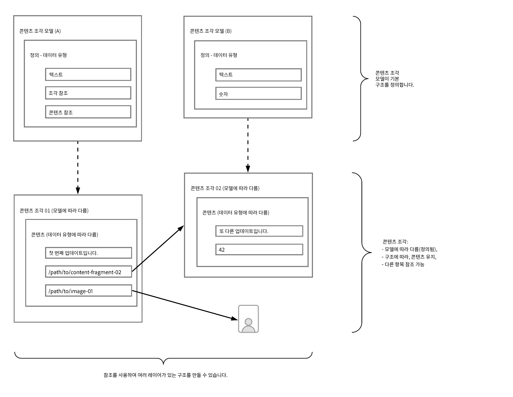
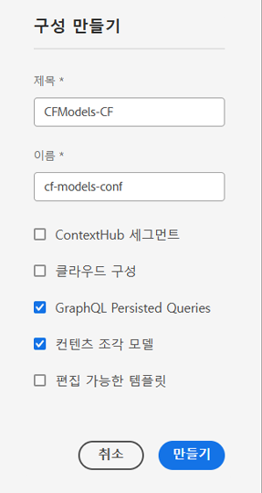
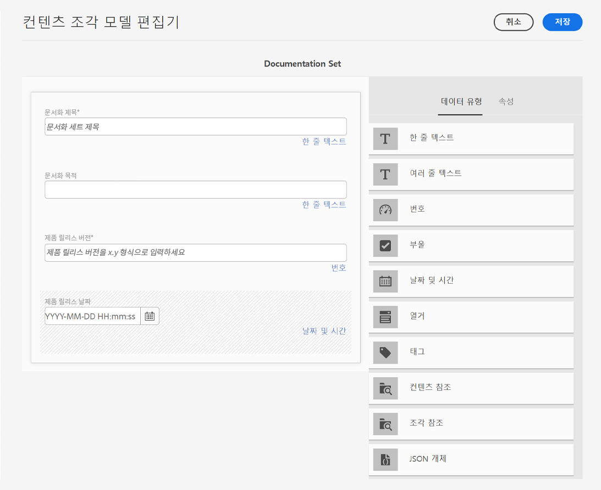
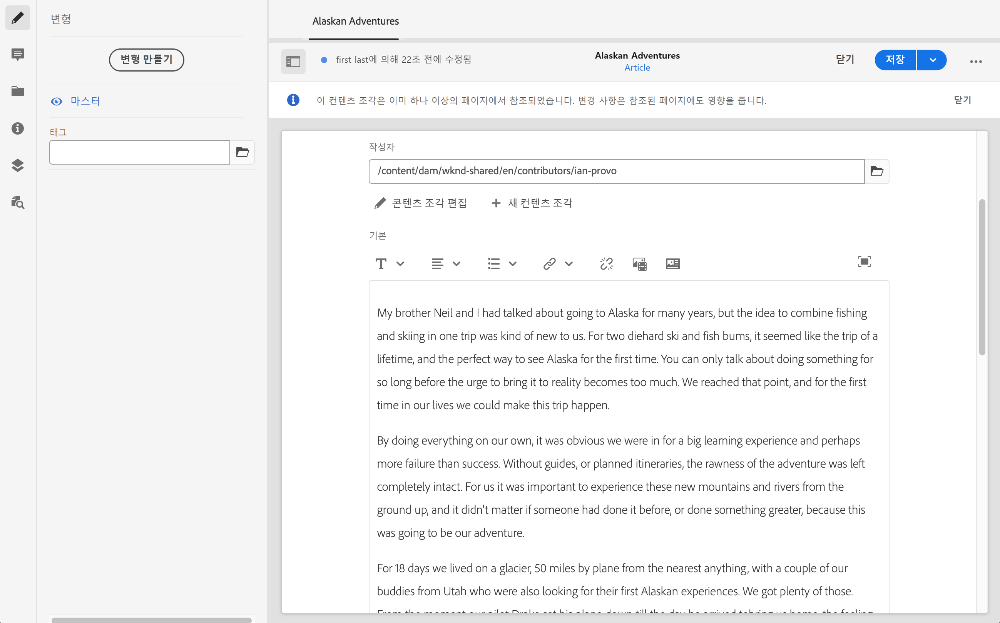

# 컨텐츠를 모델링하는 방법 {#model-your-content}

의 이 부분에서 [AEM Headless Developer 여정](overview.md)를 통해 컨텐츠 구조를 모델링하는 방법을 배울 수 있습니다. 그런 다음 컨텐츠 조각 모델 및 컨텐츠 조각을 사용하여 AEM(Adobe Experience Manager)의 구조를 사용하여 여러 채널에서 재사용할 수 있습니다.

## 지금까지의 이야기 {#story-so-far}

시작 시 [CMS 헤드리스 개발에 대해 알아보기](learn-about.md) 헤드리스 콘텐츠 전달 및 사용해야 하는 이유를 다룹니다. Then [AEM Headless as a Cloud Service 시작하기](getting-started.md) 프로젝트 컨텍스트에서 AEM Headless에 대해 설명합니다.

AEM 헤드리스 여정의 이전 문서에서, [AEM Headless를 사용하여 첫 번째 경험에 대한 경로](path-to-first-experience.md)그런 다음 첫 번째 프로젝트를 구현하는 데 필요한 단계를 알아보았습니다. 읽고 나면 다음을 수행해야 합니다.

* 콘텐츠 디자인을 위한 중요한 계획 고려 사항 이해
* 통합 수준 요구 사항에 따라 헤드리스를 구현하는 단계를 이해합니다.
* 필요한 도구 및 AEM 구성을 설정합니다.
* 헤드리스 여정을 원활하게 하고 컨텐츠 생성을 효율적으로 하며 컨텐츠가 신속히 전달되도록 하는 모범 사례를 알아봅니다.

이 문서는 이러한 기본 사항을 기반으로 하여 AEM 헤드리스 프로젝트를 준비하는 방법을 이해합니다.

## 목표 {#objective}

* **Audience**: 초보
* **목표**: 컨텐츠 구조를 모델링하고 AEM 컨텐츠 조각 모델 및 컨텐츠 조각을 사용하여 해당 구조를 구현하는 방법을 알아봅니다.
   * 데이터/컨텐츠 모델링과 관련된 개념 및 용어를 도입합니다.
   * 헤드리스 콘텐츠 전달을 위해 콘텐츠 모델링이 필요한 이유를 알아봅니다.
   * AEM 컨텐츠 조각 모델(및 컨텐츠 조각으로 컨텐츠 작성)을 사용하여 이 구조를 구현하는 방법을 알아봅니다.
   * 컨텐츠를 모델링하는 방법을 알아봅니다. 기본 샘플을 사용하는 원칙.

>[!NOTE]
>
>데이터 모델링은 관계형 데이터베이스를 개발할 때 사용되는 매우 큰 필드입니다. 많은 책들과 온라인 정보들이 이용할 수 있습니다.
>
>AEM Headless에서 사용할 데이터를 모델링할 때만 관심이 있는 측면을 고려합니다.

## 컨텐츠 모델링 {#content-modeling}

*그것은 크고 나쁜 세상입니다*.

아마도, 아닐지도 모르지만, 그것은 확실히 큰 것입니다 ***복잡해*** 외부 세계 및 데이터 모델링에서는 특정 목적에 필요한 특정 정보를 사용하여 매우 작은 하위 섹션의 단순화 표현을 정의하는 데 사용됩니다.

>[!NOTE]
>
>AEM에서 컨텐츠를 처리함에 따라 데이터 모델링을 컨텐츠 모델링이라고 합니다.

예:

많은 학교가 있지만, 그들은 모두 다양한 공통점을 가지고 있다:

* 위치
* 수석 교사
* 많은 교사
* 많은 비교사 직원
* 많은 학생들
* 많은 전직 교사
* 많은 이전 학생들
* 많은 교실
* 많은 책
* 다수의 장비
* 많은 추가 교육 과정 활동
* 그리고...

이런 작은 예시에서도 그 목록은 끝이 없어 보인다. 그러나 애플리케이션이 간단한 작업을 수행하도록 하려면 정보를 핵심 요소로 제한해야 합니다.

예를 들어, 지역 내 모든 학교를 위한 특별 행사 광고를 할 수 있습니다.

* 학교 이름
* 학교 위치
* 헤드교사
* 이벤트 유형
* 이벤트 날짜
* 행사 준비 교사

### 개념 {#concepts}

설명하고자 하는 내용을 **엔티티** &quot; 기본적으로 우리가 정보를 저장하고 싶은 &quot;물건들&quot; 입니다.

우리가 그들에게 저장하고자 하는 정보는 **속성** (등록 정보) - 교사 이름 및 자격

그럼 여러 가지가 있습니다 **관계** 사이에 있을 수 있습니다. 예를 들어, 보통 학교에는 한 명의 수석선생님만 있고, 많은 선생님들(그리고 보통 수석선생님은 선생님도 선생님이기도 해).

이 정보를 분석하고 정의하는 과정을 그 사이의 관계와 함께 라고 한다 **컨텐츠 모델링**.

### 기본 사항 {#basics}

종종 먼저 **개념 스키마** 엔티티 및 해당 관계를 설명합니다. 일반적으로 높은 수준(개념)입니다.

이렇게 안정되면 모델을 **논리 스키마** 속성과 관계를 함께 설명하는 개체입니다. 이 수준에서 정의를 면밀히 검토하여 중복을 제거하고 디자인을 최적화해야 합니다.

>[!NOTE]
>
>때로는 시나리오의 복잡성에 따라 이 두 단계가 병합되는 경우가 있습니다.

예를 들어, `Head Teacher` 및 `Teacher`또는 Analytics 도구에서 `Teacher` 모델?

### 데이터 무결성 보장 {#data-integrity}

전체 라이프 사이클에서 컨텐츠의 정확성과 일관성을 보장하려면 데이터 무결성이 필요합니다. 여기에는 컨텐츠 작성자가 저장할 위치를 쉽게 이해할 수 있도록 함으로써 다음 사항이 매우 중요합니다.

* 명확한 구조
* 정확성을 유지하면서 가능한 한 간결한 구조
* 개별 필드 유효성 검사
* 적절한 경우 특정 필드의 내용을 의미 있는 내용으로 제한합니다

### 데이터 중복 제거 {#data-redundancy}

동일한 정보가 컨텐츠 구조 내에 두 번 저장될 때 데이터 중복이 발생합니다. 이 기능은 컨텐츠를 만들 때 혼동을 일으키고 쿼리 시 오류를 초래할 수 있으므로 피해야 합니다. 저장 공간 오용은 말할 것도 없다.

### 최적화 및 성능 {#optimization-and-performance}

구조를 최적화하여 컨텐츠 생성과 쿼리 모두에 대한 성능을 향상시킬 수 있습니다.

모든 것은 균형 조정 동작이지만 너무 복잡하거나 수준이 너무 많은 구조를 만들 수 있습니다.

* 작성자가 컨텐츠를 생성하는 경우 혼동을 줄 수 있습니다.

* 필요한 컨텐츠를 검색하기 위해 쿼리가 여러 중첩(참조된) 컨텐츠 조각에 액세스해야 하는 경우 성능에 심각한 영향을 줍니다.

## AEM 헤드리스를 위한 컨텐츠 모델링 {#content-modeling-for-aem-headless}

데이터 모델링은 구축된 기법 세트인 것으로, 관계 데이터베이스를 개발할 때 자주 사용되므로 AEM Headless에 컨텐츠 모델링이 의미하는 것은 무엇입니까?

### 왜? {#why}

애플리케이션이 AEM에서 필요한 컨텐츠를 일관되고 효율적으로 요청하고 수신할 수 있도록 하려면 이 컨텐츠를 구조화해야 합니다.

즉, 애플리케이션이 응답의 형식을 미리 알고 있으므로 처리하는 방법을 알 수 있습니다. 이 작업은 자유 형식 컨텐츠를 수신하는 것보다 훨씬 쉽습니다. 이 컨텐츠를 구문 분석하여 내용을 포함해야 하므로 사용 방법을 결정할 수 있습니다.

### 방법 소개 {#how}

AEM은 컨텐츠 조각을 사용하여 컨텐츠를 애플리케이션에 헤드리스 전달에 필요한 구조를 제공합니다.

컨텐츠 모델의 구조는 다음과 같습니다.

* 컨텐츠 조각 모델의 정의에 의해 구현됩니다.
* 컨텐츠 생성에 사용되는 컨텐츠 조각의 기반으로 사용됩니다.

>[!NOTE]
>
>컨텐츠 조각 모델은 컨텐츠 검색에 사용되는 AEM GraphQL 스키마의 기반으로 사용되기도 합니다. 자세한 내용은 이후 세션에서 사용됩니다.

컨텐츠에 대한 요청은 표준 GraphQL API의 사용자 정의된 구현인 AEM GraphQL API를 사용하여 수행됩니다. AEM GraphQL API를 사용하면 특정 모델 유형에 따라 각 쿼리를 사용하여 컨텐츠 조각에 대한 (복잡한) 쿼리를 수행할 수 있습니다.

그런 다음 반환된 콘텐츠를 애플리케이션에서 사용할 수 있습니다.

## 컨텐츠 조각 모델을 사용하여 구조 만들기 {#create-structure-content-fragment-models}

컨텐츠 조각 모델은 컨텐츠의 구조를 정의할 수 있는 다양한 메커니즘을 제공합니다.

컨텐츠 조각 모델은 엔티티를 설명합니다.

>[!NOTE]
>새 모델을 만들 수 있도록 구성 브라우저에서 컨텐츠 조각 기능을 활성화해야 합니다.

>[!TIP]
>
>컨텐츠 작성자가 컨텐츠 조각을 만들 때 선택할 모델을 알 수 있도록 모델의 이름을 지정해야 합니다.

모델 내에서:

1. **데이터 유형** 개별 속성을 정의할 수 있습니다.
예를 들어 교사 이름이 있는 필드를 **텍스트** Dell은 **숫자**.
1. 데이터 유형 **컨텐츠 참조** 및 **조각 참조** AEM 내에서 다른 컨텐츠와의 관계를 만들 수 있도록 해줍니다.
1. 다음 **조각 참조** 데이터 유형을 사용하면 모델 유형에 따라 컨텐츠 조각을 중첩하여 여러 수준의 구조를 구현할 수 있습니다. 이는 컨텐츠 모델링에 필수적입니다.

예:

### 데이터 유형 {#data-types}

AEM에서는 컨텐츠를 모델링하는 데 사용할 다음 데이터 유형을 제공합니다.

* 한 줄 텍스트
* 여러 줄 텍스트
* 숫자
* 부울
* 날짜 및 시간
* 열거
* 태그
* 콘텐츠 참조
* 조각 참조
* JSON 오브젝트

### 참조 및 중첩 컨텐츠 {#references-nested-content}

두 데이터 유형은 특정 조각 외부의 컨텐츠에 대한 참조를 제공합니다.

* **컨텐츠 참조**
모든 유형의 다른 컨텐츠에 대한 간단한 참조를 제공합니다.
예를 들어 지정된 위치에서 이미지를 참조할 수 있습니다.

* **조각 참조**
이 섹션에서는 다른 컨텐츠 조각에 대한 참조를 제공합니다.
이 유형의 참조는 중첩된 콘텐츠를 만드는 데 사용되며 콘텐츠를 모델링하는 데 필요한 관계를 도입합니다.
조각 작성자가 다음과 같은 작업을 수행할 수 있도록 데이터 유형을 구성할 수 있습니다.
   * 참조된 조각 직접 편집
   * 적절한 모델을 기반으로 새 콘텐츠 조각 생성

### 컨텐츠 조각 모델 만들기 {#creating-content-fragment-models}

시작할 때 사이트에 대한 컨텐츠 조각 모델을 활성화해야 합니다. 이 작업은 구성 브라우저에서 수행됩니다. 도구 -> 일반 -> 구성 브라우저에서 글로벌 항목을 구성하거나 새 구성을 만들도록 선택할 수 있습니다. 예:

>[!NOTE]
>
>구성 브라우저에서 추가 리소스 - 컨텐츠 조각 을 참조하십시오.

그런 다음 컨텐츠 조각 모델 을 만들고 구조를 정의할 수 있습니다. 이 작업은 아래에서 수행할 수 있습니다 **도구** -> **일반** -> **컨텐츠 조각 모델**. 예:

>[!NOTE]
>
>추가 리소스 - 컨텐츠 조각 모델 을 참조하십시오.

## 모델을 사용하여 컨텐츠 조각으로 컨텐츠 작성 {#use-content-to-author-content}

컨텐츠 조각은 항상 컨텐츠 조각 모델을 기반으로 합니다. 모델은 구조를 제공하며 조각은 컨텐츠를 보유합니다.

### 적절한 모델 선택 {#select-model}

컨텐츠를 실제로 만드는 첫 번째 단계는 컨텐츠 조각을 만드는 것입니다. 이 작업은 자산 -> 파일 아래의 필수 폴더에서 만들기 -> 컨텐츠 조각을 사용하여 수행됩니다. 마법사가 단계를 안내합니다.

컨텐츠 조각은 생성 프로세스의 첫 번째 단계로 선택하는 특정 컨텐츠 조각 모델을 기반으로 합니다.

### 구조화된 컨텐츠 만들기 및 편집 {#create-edit-structured-content}

조각이 만들어지면 컨텐츠 조각 편집기에서 조각을 열 수 있습니다. 여기에서 다음을 수행할 수 있습니다.

* 일반 또는 전체 화면 모드로 컨텐츠를 편집합니다.
* 컨텐츠 형식을 전체 텍스트, 일반 텍스트 또는 Markdown으로 지정합니다.
* 컨텐츠의 변형 을 만들고 관리합니다.
* 컨텐츠 연결.
* 메타데이터를 편집합니다.
* 트리 구조를 표시합니다.
* JSON 표현식 미리보기.

### 콘텐츠 조각 만들기 {#creating-content-fragments}

적절한 모델을 선택하면 컨텐츠 조각 편집기에서 편집할 컨텐츠 조각이 열립니다.

>[!NOTE]
>
>추가 리소스 - 컨텐츠 조각 작업 을 참조하십시오.

## 일부 예제 시작하기 {#getting-started-examples}

<!--
tbc...
...and/or see the structures covered for the GraphQL samples...
...will those (ever) be delivered as an official sample package?
-->

샘플 기본 구조에 대해서는 샘플 컨텐츠 조각 구조 를 참조하십시오.

## 다음 단계 {#whats-next}

이제 구조를 모델링하고 그에 따라 컨텐츠를 만드는 방법을 배웠으므로 다음 단계는 입니다 [GraphQL 쿼리를 사용하여 컨텐츠 조각 컨텐츠에 액세스하고 검색하는 방법을 알아봅니다](access-your-content.md). 이렇게 하면 GraphQL이 도입되고 이에 대해 논의된 다음 몇 가지 샘플 쿼리를 보고 작동 방식을 확인할 수 있습니다.

## 추가 리소스 {#additional-resources}

* [컨텐츠 조각을 사용한 작업](/help/sites-cloud/administering/content-fragments/content-fragments.md) - 컨텐츠 조각에 대한 시작 페이지
   * [구성 브라우저의 컨텐츠 조각](/help/sites-cloud/administering/content-fragments/content-fragments-configuration-browser.md) - 구성 브라우저에서 컨텐츠 조각 기능을 활성화합니다
   * [컨텐츠 조각 모델](/help/sites-cloud/administering/content-fragments/content-fragments-models.md) - 컨텐츠 조각 모델 만들기 및 편집
   * [컨텐츠 조각 관리](/help/sites-cloud/administering/content-fragments/content-fragments-managing.md) - 컨텐츠 조각 만들기 및 작성 이 페이지에서는 다른 세부 섹션으로 연결됩니다.
* [AEM GraphQL 스키마](access-your-content.md) - GraphQL에서 모델을 구현하는 방법
* [샘플 컨텐츠 조각 구조](/help/headless/graphql-api/sample-queries.md#content-fragment-structure-graphql)
* [AEM Headless 시작하기](https://experienceleague.adobe.com/docs/experience-manager-learn/getting-started-with-aem-headless/graphql/overview.html) - 컨텐츠 모델링 및 GraphQL을 포함하여 AEM 헤드리스 기능을 사용하는 방법에 대한 개요를 제공하는 짧은 비디오 자습서 시리즈입니다
   * [GraphQL 모델링 기본 사항](https://experienceleague.adobe.com/docs/experience-manager-learn/getting-started-with-aem-headless/graphql/video-series/modeling-basics.html) - GraphQL에서 사용할 수 있도록 Adobe Experience Manager(AEM)에서 컨텐츠 조각을 정의하고 사용하는 방법을 알아봅니다.
