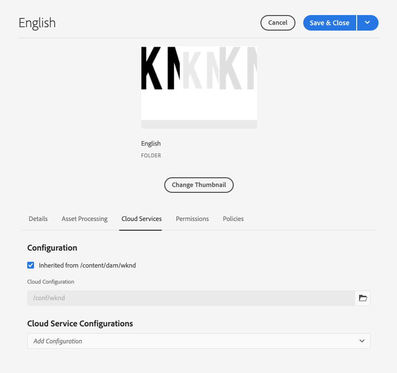

# 번역 커넥터 구성 {#configure-connector}

AEM을 번역 서비스에 연결하는 방법을 알아봅니다.

## 지금까지 그 이야기 {#story-so-far}

AEM 헤드리스 로컬라이제이션 여정의 이전 문서에서, [AEM 헤드리스 로컬라이제이션 시작](learn-about.md) 헤드리스 콘텐츠를 구성하는 방법과 AEM 로컬라이제이션 도구가 작동하는 방식을 배웁니다. 이제 다음을 수행해야 합니다.

* 로컬라이제이션에 대한 컨텐츠 구조의 중요성을 이해합니다.
* AEM에서 헤드리스 콘텐츠를 저장하는 방법을 이해합니다.
* AEM 현지화 도구에 익숙해지십시오.

이 문서는 이러한 기본 사항을 기반으로 하여 첫 번째 구성 단계를 수행하고 번역 서비스를 설정할 수 있습니다. 번역 서비스는 나중에 여정에서 사용하여 콘텐츠를 번역합니다.

## 목표 {#objective}

이 문서는 선택한 번역 서비스에 AEM 커넥터를 설정하는 방법을 이해하는 데 도움이 됩니다. 읽은 후에는 다음을 수행해야 합니다.

* AEM에서 번역 통합 프레임워크의 중요한 매개 변수를 이해합니다.
* 번역 서비스에 대한 자체 연결을 설정할 수 있습니다.

## 번역 통합 프레임워크 {#tif}

AEM 번역 통합 프레임워크는 타사 번역 서비스와 통합되어 AEM 컨텐츠 번역을 오케스트레이션합니다. 그것은 세 가지 기본적인 단계를 포함한다.

1. 번역 서비스 공급자에 연결합니다.
1. 번역 통합 프레임워크 구성을 만듭니다.
1. 구성과 컨텐츠를 연결합니다.

## 번역 서비스 공급자에 연결 {#connect-translation-provider}

첫 번째 단계는 사용할 번역 서비스를 선택하는 것입니다. AEM에서 사용할 수 있는 인간 및 기계 번역 서비스를 위한 다양한 선택 사항이 있습니다. 사용 가능한 옵션 선택에 대해서는 [추가 리소스](#additional-resources) 섹션을 참조하십시오.

대부분의 공급자는 설치할 번역기 패키지를 제공합니다. 이 여정을 위해 AEM에서 즉시 사용 가능한 평가판 라이센스를 제공하는 Microsoft Translator를 사용합니다. 이 공급자에 대한 자세한 내용은 [추가 리소스](#additional-resources) 섹션을 참조하십시오.

다른 공급자를 선택하는 경우 번역 서비스에서 제공한 지침에 따라 커넥터 패키지를 설치해야 합니다.

>[!NOTE]
>
>AEM에서 바로 사용 가능한 Microsoft Translator를 사용하면 추가 설정이 필요 없으며 추가 커넥터 구성 없이 그대로 작동합니다.
>
>테스트를 위해 Microsoft Translator 커넥터를 사용하도록 선택한 경우 다음 두 섹션의 단계를 수행할 필요가 없지만, 기본 커넥터를 연결해야 할 때 익숙해지도록 읽어 보십시오.
>
>Microsoft Translator 커넥터의 평가판 라이센스는 프로덕션 용도로 사용할 수 없으며 라이센스를 부여하려면 이 문서의 끝에 있는 [추가 리소스](#additional-resources) 섹션에 자세히 나와 있는 다음 단계를 따라야 해당 라이선스를 구성할 수 있습니다.

## 번역 통합 구성 만들기 {#create-config}

먼저 컨텐츠를 번역하는 방법을 지정하려면 번역 통합 프레임워크 구성을 만들어야 합니다. 구성에는 다음 정보가 포함됩니다.

* 사용할 번역 서비스 공급자
* 인간 또는 기계 번역을 수행할지 여부
* 태그와 같은 컨텐츠 조각과 연관된 다른 컨텐츠를 번역할지 여부

새 번역 구성을 만들려면 다음을 수행하십시오.

1. 전역 탐색 메뉴에서 **도구** -> **Cloud Services** -> **번역 Cloud Services**&#x200B;을 클릭하거나 탭합니다.
1. 컨텐츠 구조에서 구성을 만들 위치로 이동합니다. 이는 종종 특정 프로젝트를 기반으로 하거나 전역적일 수 있습니다.
   * 예를 들어, 이 경우 모든 컨텐츠에 전역적으로 적용하거나 WKND 프로젝트에 대해서만 구성을 적용할 수 있습니다.

   

1. 필드에 다음 정보를 제공한 다음 **만들기**&#x200B;를 클릭하거나 탭합니다.
   1. 드롭다운에서 **구성 유형**&#x200B;을 선택합니다. 목록에서 **번역 통합**&#x200B;을 선택합니다.
   1. 구성에 대해 **제목**&#x200B;을 입력합니다. **제목**&#x200B;은 페이지 속성 드롭다운 목록뿐만 아니라 **Cloud Services** 콘솔에서 구성을 식별합니다.
   1. 구성을 저장하는 저장소 노드에 사용할 **이름**&#x200B;을 입력합니다(선택 사항).

   

1. **만들기**&#x200B;를 탭하거나 클릭하면 구성 속성을 구성할 수 있는 **구성 편집** 창이 나타납니다.

1. 컨텐츠 조각은 AEM에 자산으로 저장됩니다. **자산** 탭을 탭하거나 클릭합니다.


1. 다음 정보를 제공합니다.

   1. **번역 방법**  -  **번역** 공급자에  **따라 기계 번역 또** 는 수동 변환을 선택합니다. 이 여정을 위해 기계 번역을 가정합니다.
   1. **번역 공급자**  - 목록에서 번역 서비스에 대해 설치한 커넥터를 선택합니다.
   1. **컨텐츠 카테고리**  - 번역을 더 잘 타깃팅하려면 가장 적절한 카테고리를 선택합니다(기계 번역에 대해서만).
   1. **컨텐츠 조각 자산 번역** - ???
   1. **자산 번역**  - 자산을 번역하려면 선택합니다.
   1. **메타데이터 번역**  - 자산 메타데이터를 번역하려면 선택합니다.
   1. **태그 번역**  - 자산과 연결된 태그를 번역하려면 이 확인란을 선택합니다.
   1. **번역 자동 실행**  - 번역 서비스로 번역을 자동으로 보내려면 이 속성을 선택합니다.

1. **저장 및 닫기**&#x200B;를 탭하거나 클릭합니다.

이제 번역 서비스에 대한 커넥터를 구성했습니다.

## 구성과 컨텐츠 연결 {#associate}

AEM은 유연하고 강력한 툴이며 여러 커넥터와 여러 구성을 통해 여러 동시 번역 서비스를 지원합니다. 이 설정은 이 여정의 범위를 벗어나지만 컨텐츠를 변환하는 데 사용해야 하는 커넥터와 구성을 지정해야 함을 의미합니다.

이렇게 하려면 컨텐츠의 언어 루트로 이동합니다. 이 예제에서는 다음을 수행합니다

```text
/content/dam/<your-project>/en
```

1. 전역 탐색으로 이동하고 **탐색** -> **자산** -> **파일**&#x200B;로 이동합니다.
1. Assets 콘솔에서 구성할 언어 루트를 선택하고 **속성**&#x200B;을 클릭하거나 탭합니다.
1. **Cloud Services** 탭을 탭하거나 클릭합니다.
1. **구성 추가** 드롭다운에서 **Cloud Service 구성**&#x200B;에서 커넥터를 선택합니다. 이전에 설명한 [으로 패키지를 설치한 경우 드롭다운에 표시되어야 합니다.](#connect-translation-provider)
1. **구성 추가** 드롭다운에서 **Cloud Service 구성** 아래에서 구성을 선택합니다.
1. **저장 및 닫기**&#x200B;를 탭하거나 클릭합니다.



## 다음은 무엇입니까? {#what-is-next}

이제 헤드리스 로컬라이제이션 여정의 이 부분을 완료했으므로 다음을 수행해야 합니다.

* AEM에서 번역 통합 프레임워크의 중요한 매개 변수를 이해합니다.
* 번역 서비스에 대한 자체 연결을 설정할 수 있습니다.

이 지식을 바탕으로 AEM 헤드리스 로컬라이제이션 여정을 계속 진행하려면 다음 문서 [번역 규칙 구성,](translation-rules.md)을 참조하여 번역할 컨텐츠를 정의하는 방법을 배웁니다.

## 추가 리소스 {#additional-resources}

[번역 규칙 구성](translation-rules.md) 문서를 검토하여 헤드리스 로컬라이제이션 여정의 다음 부분으로 이동하는 것이 좋습니다. 다음은 이 문서에서 언급된 일부 개념에 대해 자세히 설명하는 추가 선택적 리소스입니다. 하지만 헤드리스 여정을 계속 진행할 필요는 없습니다.

* [번역 통합 프레임워크 구성](/help/sites-cloud/administering/translation/integration-framework.md)  - 타사 번역 서비스와 통합하도록 번역 통합 프레임워크를 구성하는 방법을 알아봅니다.
* [Microsoft Translator에 연결](/help/sites-cloud/administering/translation/connect-ms-translator.md)  - AEM에서 테스트 목적으로 Microsoft Translation 계정을 제공합니다.
