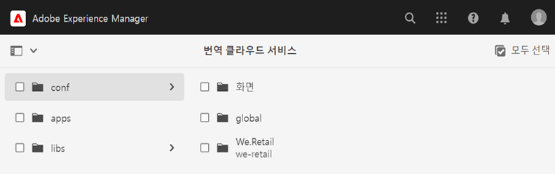
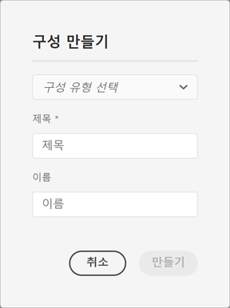
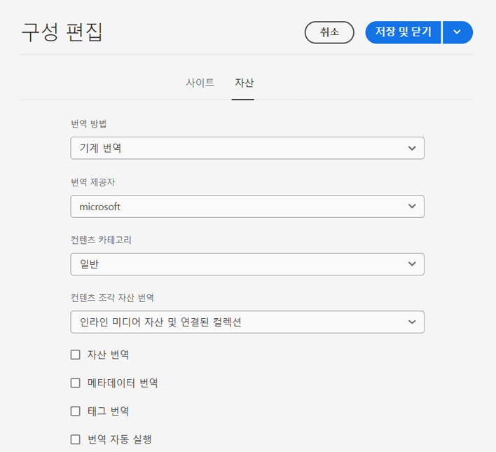
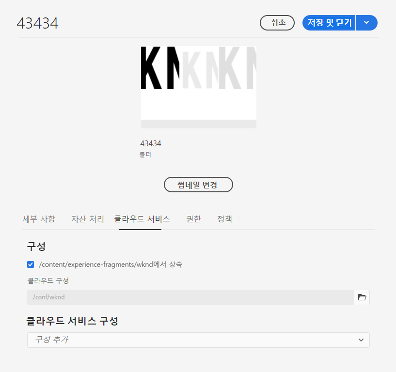

# 번역 커넥터 구성 {#configure-connector}

AEM을 번역 서비스에 연결하는 방법에 대해 알아봅니다.

## 지금까지의 스토리 {#story-so-far}

AEM Headless 번역 여정의 이전 문서인 [AEM Headless 번역 시작하기](learn-about.md)에서는 Headless 콘텐츠 구성 방법 및 AEM의 번역 도구 사용 방법에 대해 알아보았습니다. 여기에서 알게 된 내용은 다음과 같습니다.

* 번역에 있어 콘텐츠 구조의 중요성을 이해할 수 있습니다.
* AEM이 Headless 콘텐츠를 저장하는 방법을 이해할 수 있습니다.
* AEM의 번역 도구에 익숙해질 수 있습니다.

이 문서는 이러한 기본 사항을 기반으로 하므로 이를 통해 첫 번째 구성 단계를 수행하고 번역 서비스를 설정하여 이후 여정에서 콘텐츠 번역을 위해 사용할 수 있습니다.

## 목표 {#objective}

이 문서는 AEM 커넥터를 설정하여 선택한 번역 서비스에 연결하는 방법을 이해하는 데 도움이 됩니다. 문서를 읽고 나면

* AEM 번역 통합 프레임워크의 중요한 매개변수를 이해할 수 있습니다.
* 번역 서비스에 대해 나만의 연결을 설정할 수 있습니다.

## 번역 통합 프레임워크 {#tif}

AEM의 번역 통합 프레임워크(TIF)를 서드파티 번역 서비스와 통합하여 AEM 콘텐츠 번역을 조정합니다. 여기에는 세 가지 기본 단계가 포함됩니다.

1. 번역 서비스 공급업체에 연결합니다.
1. 번역 통합 프레임워크 구성을 만듭니다.
1. 구성을 콘텐츠와 연결합니다.

다음 섹션에서 각각의 단계에 대해 보다 자세히 살펴보겠습니다.

## 번역 서비스 공급업체에 연결 {#connect-translation-provider}

첫 번째 단계는 사용할 번역 서비스를 선택하는 것입니다. AEM에 사용할 수 있는 인간 번역 서비스 및 기계 번역 서비스에는 여러 가지 옵션이 있습니다. 대부분의 공급업체는 설치할 번역기 패키지를 제공합니다. 사용 가능한 옵션은 [추가 리소스](#additional-resources) 섹션을 참조하십시오.

>[!NOTE]
>
>일반적으로 사용할 번역 서비스를 선택하는 것은 번역 전문가이지만, 필요한 번역 커넥터 패키지를 설치하는 것은 관리자가 담당합니다.

이 여정에서는 AEM이 즉시 사용할 수 있는 체험판 라이선스와 함께 제공하는 Microsoft Translator를 사용합니다. 이 공급업체에 대한 자세한 내용은 [추가 리소스](#additional-resources) 섹션을 참조하십시오.

다른 공급업체를 선택하는 경우 관리자는 번역 서비스가 제공하는 지침에 따라 커넥터 패키지를 설치해야 합니다.

>[!NOTE]
>
>AEM의 기본 Microsoft Translator를 사용하면 추가 설정이 필요하지 않으며 추가적인 커넥터 구성 없이 그대로 작동합니다.
>
>테스트 목적으로 Microsoft Translator를 사용하는 경우 다음 두 섹션의 단계를 수행하지 않아도 됩니다. [번역 통합 구성 만들기](#create-config) 및 [구성과 콘텐츠 연결](#associate) 그러나 원하는 커넥터를 구성해야 하는 단계를 익숙하게 수행할 수 있도록 이들 단계를 읽어보는 것이 좋습니다.
>
>Microsoft Translator 커넥터의 체험판 라이선스는 프로덕션 목적으로 고안된 것이 아니며, 라이선스를 부여하려면 시스템 관리자가 이 문서 끝의 [추가 리소스](#additional-resources) 섹션에 자세히 설명된 단계에 따라 해당 라이선스를 구성해야 합니다.

## 번역 통합 구성 만들기 {#create-config}

원하는 번역 서비스에 대한 커넥터 패키지를 설치한 다음에는 해당 서비스에 대한 번역 통합 프레임워크 구성을 만들어야 합니다. 구성에는 다음 정보가 포함됩니다.

* 사용할 번역 서비스 공급업체
* 인간 번역이 수행되는지 또는 기계 번역이 수행되는지 여부
* 태그 등 콘텐츠 조각과 연결된 다른 콘텐츠 번역 여부

새 번역 구성을 만들려면:

1. 전역 탐색 메뉴에서 **도구** -> **클라우드 서비스** -> **번역 클라우드 서비스**&#x200B;를 클릭하거나 탭합니다.
1. 콘텐츠 구조에서 구성을 만들고자 하는 위치로 이동합니다. 보통 특정 프로젝트를 기반으로 하거나 전역일 수 있습니다.
   * 예를 들어 이 경우 모든 콘텐츠에 적용되도록 전역으로 구성을 만들거나 WKND 프로젝트에 대해서만 구성을 만들 수 있습니다.

   

1. 필드에 다음 정보를 입력한 다음 **만들기**&#x200B;를 클릭하거나 탭합니다.
   1. 드롭다운 메뉴에서 **구성 유형**&#x200B;을 선택합니다. 목록에서 **번역 통합**&#x200B;을 선택합니다.
   1. 구성의 **제목**&#x200B;을 입력합니다. **제목**&#x200B;을 통해 **클라우드 서비스** 콘솔 및 페이지 속성 드롭다운 목록에서 구성을 식별합니다.
   1. 필요한 경우 구성을 저장하는 저장소 노드에 사용할 **이름**&#x200B;을 입력합니다.

   

1. **만들기**&#x200B;를 탭하거나 클릭하면 구성 속성을 구성할 수 있는 **구성 편집** 창이 표시됩니다.

1. 콘텐츠 조각은 AEM에서 자산으로 저장됩니다. **자산** 탭을 탭하거나 클릭합니다.



1. 다음 정보를 입력하십시오.

   1. **번역 방식** - 번역 공급업체에 따라 **기계 번역** 또는 **인간 번역**&#x200B;을 선택합니다. 이 여정에서는 기계 번역을 사용한다고 가정합니다.
   1. **번역 공급업체** - 목록에서 번역 서비스에 대해 설치한 커넥터를 선택합니다.
   1. **콘텐츠 범주** - 번역 타겟팅에 가장 적합한 범주를 선택합니다(기계 번역만 해당).
   1. **콘텐츠 조각 자산 번역** - 이 속성을 선택하여 콘텐츠 조각과 연결된 자산을 번역합니다.
   1. **자산 번역** - 이 속성을 선택하여 자산을 번역합니다.
   1. **메타데이터 번역** - 이 속성을 선택하여 자산 메타데이터를 번역합니다.
   1. **태그 번역** - 이 속성을 선택하여 자산과 연결된 태그를 번역합니다.
   1. **번역 자동 실행** - 번역을 자동으로 번역 서비스에 전송하려면 이 속성을 선택합니다.
   1. **업데이트 전용 번역 사용 중지** - 이 옵션을 선택하면 번역 작업 업데이트로 최종 번역 이후 변경된 필드 외에 번역할 수 있는 모든 필드를 번역하도록 제출합니다. 번역 프로젝트 업데이트는 여정 후반부에서 자세히 설명합니다.
   1. **번역을 위해 콘텐츠 모델 필드 활성화** - 이 옵션을 선택하면 번역 구성이 **번역 가능한** 플래그를 기반으로 하는 콘텐츠 모델의 필드를 자동으로 인식합니다.

1. **저장 및 닫기**&#x200B;를 탭하거나 클릭합니다.

이제 번역 서비스에 커넥터를 구성했습니다.

## 구성과 콘텐츠 연결 {#associate}

AEM은 유연하고 강력한 도구이며 여러 커넥터 및 구성을 통해 다중 동시 번역 서비스를 지원합니다. 이러한 구성을 설정하는 작업은 이 여정에서 다루지 않습니다. 그러나 이러한 유연성은 이 구성을 콘텐츠와 연결하여 콘텐츠를 번역하는 데 사용할 커넥터 및 구성을 지정해야 함을 의미합니다.

이 작업을 수행하려면 콘텐츠의 언어 루트로 이동합니다. 이 예에서는 다음과 같습니다.

```text
/content/dam/<your-project>/en
```

1. 전역 탐색으로 이동한 다음 **탐색** -> **자산** -> **파일**&#x200B;로 이동합니다.
1. 자산 콘솔에서 언어 루트를 선택해 구성하고 **속성**&#x200B;을 클릭하거나 탭합니다.
1. **클라우드 서비스** 탭을 탭하거나 클릭합니다.
1. **구성 추가** 드롭다운의 **클라우드 서비스 구성**&#x200B;에서 커넥터를 선택합니다. 커넥터는 [이전에 설명한](#connect-translation-provider) 대로 패키지를 설치하면 드롭다운에 표시됩니다.
1. 또한 **구성 추가** 드롭다운의 **클라우드 서비스 구성**&#x200B;에서 구성도 선택합니다.
1. **저장 및 닫기**&#x200B;를 탭하거나 클릭합니다.



## 다음 단계 {#what-is-next}

Headless 번역 여정의 한 부분을 완료했으므로,

* AEM 번역 통합 프레임워크의 중요한 매개변수를 이해할 수 있습니다.
* 번역 서비스에 대해 나만의 연결을 설정할 수 있습니다.

이 지식을 기반으로 다음 문서인 [콘텐츠 번역](translation-rules.md)을 검토하여 AEM Headless 번역 여정을 계속하십시오. 여기에서는 지금까지의 구성을 사용하여 실제로 콘텐츠를 번역하는 방법에 대해 알아보게 됩니다.

## 추가 리소스 {#additional-resources}

다음 문서인 [번역 규칙 구성](translation-rules.md)을 검토하여 Headless 번역 여정의 다음 부분으로 넘어가는 것이 좋습니다. 다음은 이 문서에 나열된 몇 가지 개념을 자세히 알아보는 추가적인 옵션 리소스이며, 이들 리소스를 Headless 여정에서 계속 사용할 필요는 없습니다.

* [번역 통합 프레임워크 구성](/help/sites-cloud/administering/translation/integration-framework.md) - 선택한 번역 커넥터 목록을 검토하고 번역 통합 프레임워크를 서드파티 번역 서비스와 통합하도록 구성하는 방법에 대해 알아봅니다.
* [Microsoft Translator에 연결](/help/sites-cloud/administering/translation/connect-ms-translator.md) - AEM은 테스트용 체험판 Microsoft Translation 계정을 제공합니다.
