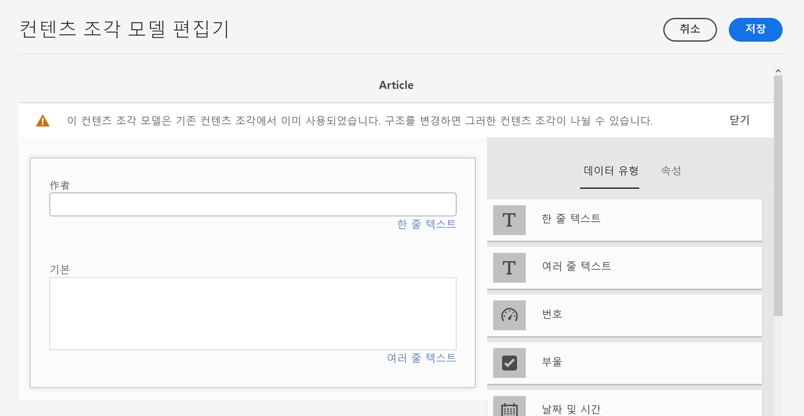

# AEM Headless 번역 시작하기 {#getting-started}

Headless 콘텐츠를 구성하는 방법 및 AEM의 번역 도구의 작동 방식에 대해 알아봅니다.

## 지금까지의 스토리 {#story-so-far}

AEM Headless 번역 여정의 이전 문서인 [Headless 콘텐츠 및 AEM에서의 번역 방법에 대해 알아보기](learn-about.md)에서 Headless CMS의 기본 이론에 대해 알아보았습니다. 여기에서 알게 된 내용은 다음과 같습니다.

* Headless 콘텐츠 게재에 대한 기본적인 개념을 이해할 수 있습니다.
* AEM이 Headless 및 번역을 지원하는 방법을 파악할 수 있습니다.

이 문서는 해당 기본 사항을 기본으로 하며, 이를 통해 AEM이 Headless 콘텐츠를 저장하고 관리하는 방법 및 AEM의 번역 도구를 사용하여 해당 콘텐츠를 번역하는 방법에 대해 살펴볼 수 있습니다.

## 목표 {#objective}

이 문서는 AEM에서 Headless 콘텐츠 번역을 시작하는 방법을 이해하는 데 도움이 됩니다. 문서를 읽고 나면

* 번역에 있어 콘텐츠 구조의 중요성을 이해할 수 있습니다.
* AEM이 Headless 콘텐츠를 저장하는 방법을 이해할 수 있습니다.
* AEM의 번역 도구에 익숙해질 수 있습니다.

## 요구 사항 및 사전 요구 사항 {#requirements-prerequisites}

AEM Headless 콘텐츠 번역을 시작하기 전에 알아 두어야 할 몇 가지 요구 사항이 있습니다.

### 지식 {#knowledge}

* CMS에서의 콘텐츠 번역 경험
* 대규모 CMS의 기본 기능 사용 경험
* AEM 기본 처리에 대한 작업 지식
* 사용 중인 번역 서비스에 대한 이해
* 번역 중인 콘텐츠에 대한 기본적인 이해

>[!TIP]
>
>AEM과 같은 대규모 CMS 사용에 익숙하지 않은 경우 계속 진행하기 전에 [기본 처리](/help/sites-cloud/authoring/basic-handling.md) 설명서를 검토하는 것이 좋습니다. 기본 처리 설명서는 여정의 일부가 아닙니다. 검토를 완료하면 이 페이지로 돌아오십시오.

### 도구 {#tools}

* 콘텐츠 번역 테스트를 위한 샌드박스 액세스
* 선호하는 번역 서비스에 연결하기 위한 자격 증명
* AEM에서 `project-administrators` 그룹의 멤버여야 함

## 핵심은 구조입니다 {#content-structure}

AEM의 콘텐츠는 Headless 페이지 또는 기존 웹 페이지와 상관없이 해당 구조에 의해 좌우됩니다. AEM이 제공하는 콘텐츠 구조에 대한 요구 사항은 많지 않지만, 프로젝트 계획의 일부로 콘텐츠 계층 구조를 신중하게 고려하면 번역을 훨씬 더 간단하게 만들 수 있습니다.

>[!TIP]
>
>Headless 프로젝트의 시작 부분부터 번역을 위한 계획을 수립하십시오. 프로젝트 관리자 및 콘텐츠 설계자와 조기부터 긴밀히 협력하십시오.
>
>번역할 콘텐츠와 하지 않을 콘텐츠를 정의하고 지역 또는 로컬 콘텐츠 제작자가 수정할 수 있는 번역된 콘텐츠를 정의하는 역할을 담당할 별도의 담당자로서 국제화 프로젝트 관리자가 필요할 수 있습니다.

## AEM이 Headless 콘텐츠를 저장하는 방법 {#headless-content-in-aem}

번역 전문가의 경우 AEM의 Headless 콘텐츠 관리 방법을 깊이 있게 이해하지 않아도 됩니다. 그러나 기본 개념과 용어를 숙지하게 되면 나중에 AEM의 번역 도구를 사용할 때 도움이 됩니다. 가장 중요한 것은 콘텐츠를 효과적으로 번역하기 위해 자신의 콘텐츠와 콘텐츠 구성 방식을 이해해야 한다는 것입니다.

### 콘텐츠 모델 {#content-models}

Headless 콘텐츠를 채널, 지역 및 언어에 일관되게 게재하려면 콘텐츠는 상당히 구조화되어야 합니다. AEM은 콘텐츠 모델을 사용하여 이 구조를 시행합니다. 콘텐츠 모델을 Headless 콘텐츠를 만드는 일종의 템플릿이나 패턴으로 생각해 보십시오. 모든 프로젝트에는 자체 요구 사항이 있으므로 모든 프로젝트는 자체 콘텐츠 조각 모델을 정의합니다. AEM에는 해당 모델에 대한 고정된 요구 사항이나 구조가 없습니다.

콘텐츠 설계자는 프로젝트 초기에 작업하여 이 구조를 정의합니다. 번역 전문가는 콘텐츠 설계자와 긴밀히 협력하여 콘텐츠를 이해하고 구성해야 합니다.

>[!NOTE]
>
>콘텐츠 모델을 정의하는 것이 콘텐츠 설계자가 해야 하는 일입니다. 번역 전문가는 다음 단계에 명시된 구조에 대해서만 파악해야 합니다.

콘텐츠 모델은 콘텐츠의 구조를 정의하므로 번역해야 하는 모델의 필드를 파악하고 있어야 합니다. 일반적으로 콘텐츠 설계자와 협력하여 이를 정의합니다. 콘텐츠 모델의 필드를 탐색하려면 아래 단계를 따르십시오.

1. **도구** > **일반** > **콘텐츠 조각 모델**&#x200B;로 이동합니다.
1. 콘텐츠 조각 모델은 일반적으로 폴더 구조에 저장됩니다. 프로젝트의 폴더를 선택합니다.
1. 모델이 제공됩니다. 모델을 선택하면 세부 정보를 확인할 수 있습니다.
   
1. **콘텐츠 조각 모델 편집기**&#x200B;가 열립니다.
   1. 왼쪽 열에는 모델의 필드가 포함됩니다. 이 열은 관심 항목입니다.
   1. 오른쪽 열에는 모델에 추가할 수 있는 필드가 포함됩니다. 이 열은 무시할 수 있습니다.
      
1. 모델의 필드 중 하나를 선택합니다. AEM을 통해 필드가 표시되고, 해당 필드의 세부 정보가 오른쪽 열에 표시됩니다.
   
1. 콘텐츠 설계자는 번역해야 하는 모든 콘텐츠 모델 필드에서 **번역 가능한** 필드를 활성화합니다.

>[!TIP]
>
>일반적으로 콘텐츠 설계자는 번역에 필요한 필드를 식별하는 업무를 담당합니다. 이전 단계를 제공하여 번역 전문가의 이해를 돕습니다.

### 콘텐츠 조각 {#content-fragments}

콘텐츠 모델을 사용하여 콘텐츠 작성자는 실제 Headless 콘텐츠를 만듭니다. 콘텐츠 작성자는 콘텐츠를 기반으로 할 모델을 선택한 다음 콘텐츠 조각을 만듭니다. 콘텐츠 조각은 모델의 인스턴스이고 Headless 방식으로 전달할 실제 콘텐츠를 나타냅니다.

콘텐츠 모델이 콘텐츠의 패턴인 경우 콘텐츠 조각은 해당 패턴을 기반으로 하는 실제 콘텐츠입니다. 콘텐츠 조각은 번역해야 하는 콘텐츠를 나타냅니다.

콘텐츠 조각은 디지털 자산 관리(DAM)의 일부로 AEM의 자산으로 관리됩니다. 이는 모두 경로 아래에 위치하므로 중요합니다`/content/dam`.

## 권장 콘텐츠 구조 {#recommended-structure}

이전에 권장한 것처럼, 콘텐츠 설계자와 협력하여 프로젝트에 적합한 콘텐츠 구조를 결정하십시오. 그러나 입증되고 단순하며, 직관적이고 효과적인 다음 구조도 참조하십시오.

`/content/dam` 아래에 프로젝트용 기본 폴더를 정의하십시오.

```text
/content/dam/<your-project>
```

콘텐츠가 작성되는 언어를 언어 루트라고 합니다. 이 예제에서 언어 루트는 영어이며 이는 이 경로 하에 있어야 합니다.

```text
/content/dam/<your-project>/en
```

현지화가 필요한 모든 프로젝트 콘텐츠는 언어 루트 아래에 배치해야 합니다.

```text
/content/dam/<your-project>/en/<your-project-content>
```

번역은 언어 루트와 함께 해당 언어의 ISO-2 언어 코드를 나타내는 폴더 이름을 가진 동일한 수준의 폴더로 생성해야 합니다. 예를 들어 독일어는 다음과 같은 경로를 가질 수 있습니다.

```text
/content/dam/<your-project>/de
```

>[!NOTE]
>
>일반적으로 콘텐츠 설계자는 이러한 언어 폴더 생성을 담당합니다. 이러한 폴더가 생성되지 않으면 AEM은 나중에 번역 작업을 만들 수 없습니다.

최종 구조는 다음과 같이 표시될 수 있습니다.

```text
/content
    |- dam
        |- your-project
            |- en
                |- some
                |- exciting
                |- headless
                |- content
            |- de
            |- fr
            |- it
            |- ...
        |- another-project
        |- ...
```

콘텐츠의 특정 경로는 나중에 번역을 구성하는 데 필요하므로 기록해 두어야 합니다.

>[!NOTE]
>
>일반적으로 콘텐츠 구조를 정의하는 것은 콘텐츠 설계자의 역할이지만 번역 전문가와 공동 작업이 가능합니다.
>
>완성도를 위해 여기에 자세히 기재되어 있습니다.

## AEM 번역 도구 {#translation-tools}

콘텐츠 조각과 콘텐츠 구조의 중요성에 대해 알아보았으므로, 이제는 콘텐츠 번역 방법을 살펴보겠습니다. AEM의 번역 도구는 매우 강력하지만 높은 수준에서 간단하게 이해할 수 있는 도구입니다.

* **번역 커넥터** - 커넥터는 AEM과 사용 중인 번역 서비스 간의 연결입니다.
* **번역 프로젝트** - 번역 프로젝트는 단일 번역 작업으로 처리해야 하는 콘텐츠를 수집하고 번역 진행 상황을 추적하는 동시에 커넥터와 결합하여 번역 서비스에 번역할 콘텐츠를 전송하고 번역된 콘텐츠를 다시 수신합니다.

일반적으로 커넥터는 인스턴스에 대해 한 번만 설정합니다. 그런 다음 번역 프로젝트를 사용하여 콘텐츠를 번역하고 해당 번역을 정기적으로 업데이트합니다.

## 다음 단계 {#what-is-next}

Headless 번역 여정의 한 부분을 완료했으므로,

* 번역에 있어 콘텐츠 구조의 중요성을 이해할 수 있습니다.
* AEM이 Headless 콘텐츠를 저장하는 방법을 이해할 수 있습니다.
* AEM의 번역 도구에 익숙해질 수 있습니다.

이 지식을 기반으로 다음 문서인 [번역 통합 구성](configure-connector.md)을 검토하여 AEM Headless 번역 여정을 계속하십시오. 여기에서는 AEM을 번역 서비스에 연결하는 방법에 대해 알아봅니다.

## 추가 리소스 {#additional-resources}

다음 문서인 [Headless 번역 커넥터 구성](configure-connector.md)을 검토하여 번역 여정의 다음 부분으로 넘어가는 것이 좋습니다. 다음은 이 문서에 나열된 몇 가지 개념을 자세히 알아보는 추가적인 옵션 리소스이며, 이들 리소스를 Headless 여정에서 계속 사용할 필요는 없습니다.

* [AEM 기본 처리](/help/sites-cloud/authoring/basic-handling.md) - 콘텐츠 찾기와 같은 필수 작업을 편안하게 탐색하고 수행할 수 있도록 AEM UI의 기본 사항에 대해 알아봅니다.
* [번역할 콘텐츠 식별](/help/sites-cloud/administering/translation/rules.md) - 번역 규칙이 번역이 필요한 콘텐츠를 식별하는 방법에 대해 알아봅니다.
* [번역 통합 프레임워크 구성](/help/sites-cloud/administering/translation/integration-framework.md) - 번역 통합 프레임워크를 서드파티 번역 서비스와 통합하도록 구성하는 방법에 대해 알아봅니다.
* [번역 프로젝트 관리](/help/sites-cloud/administering/translation/managing-projects.md) - AEM에서 기계 번역 및 인간 번역을 만들고 관리하는 방법에 대해 알아봅니다.
* [AEM as a Headless CMS 소개](/help/headless/introduction.md)
* [AEM의 Headless 튜토리얼](https://experienceleague.adobe.com/docs/experience-manager-learn/getting-started-with-aem-headless/overview.html)
