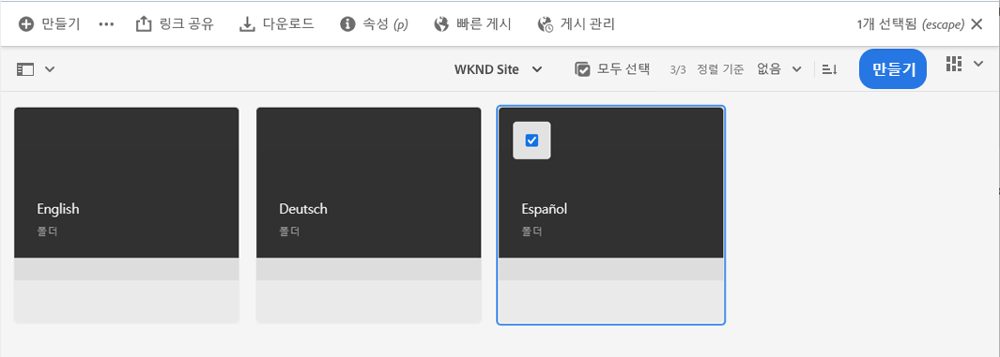
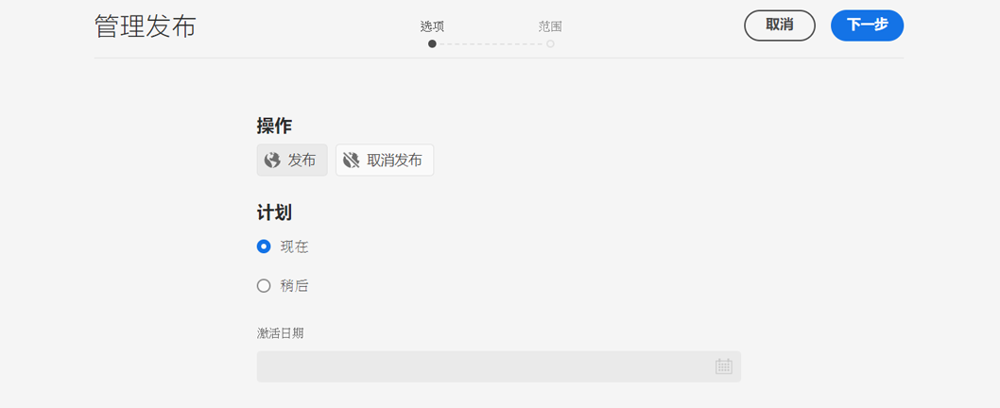
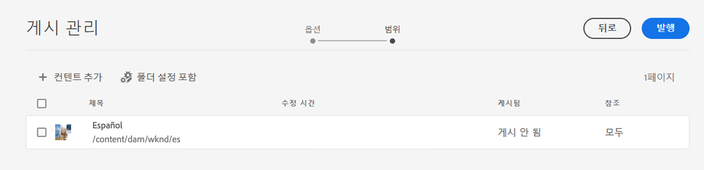
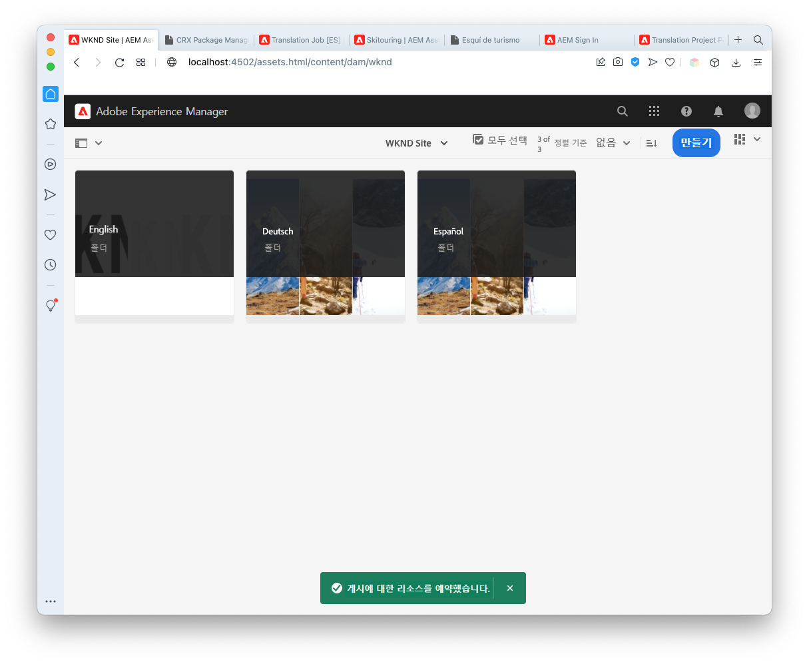
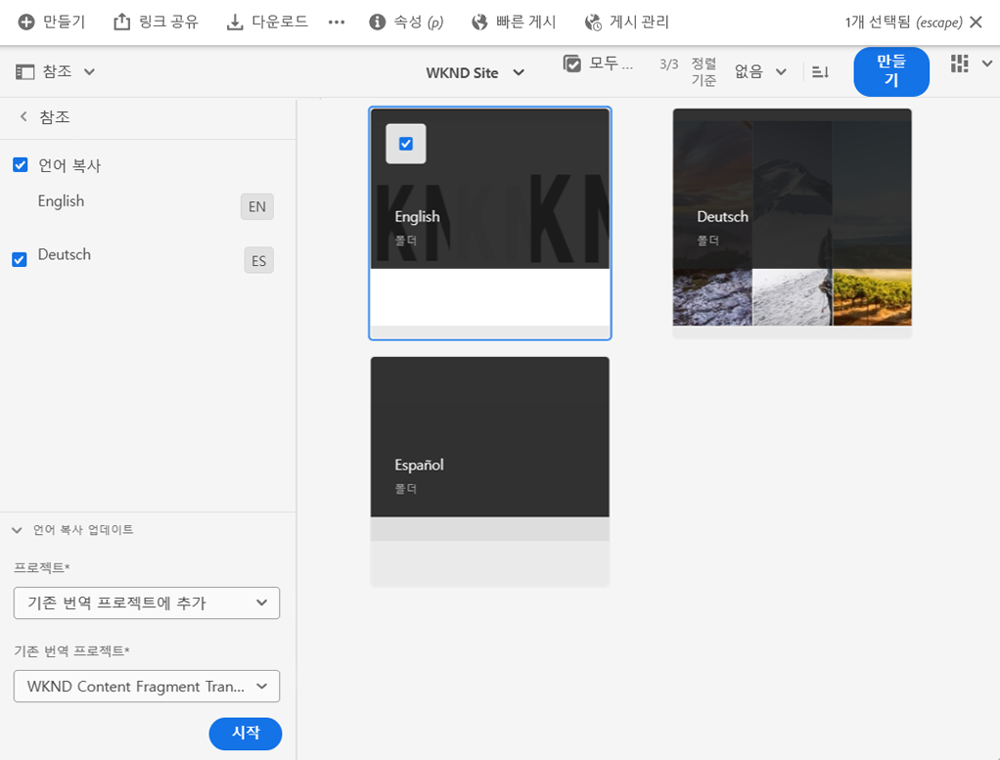
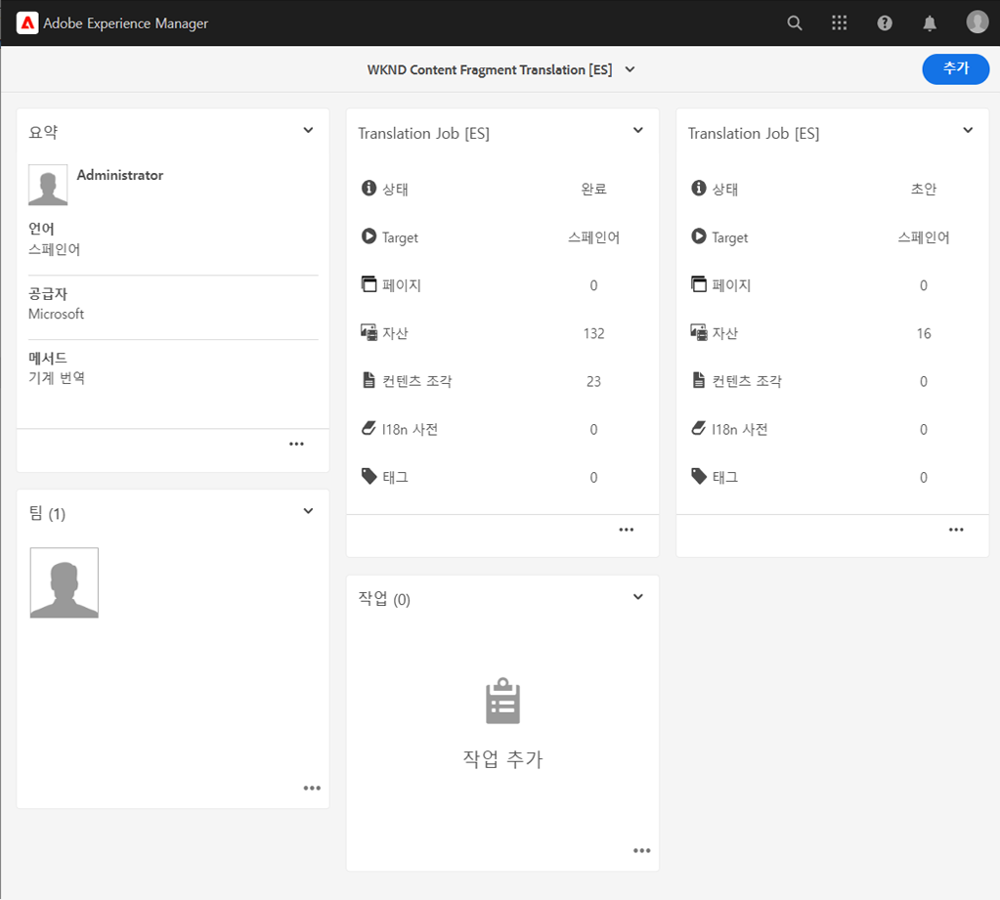
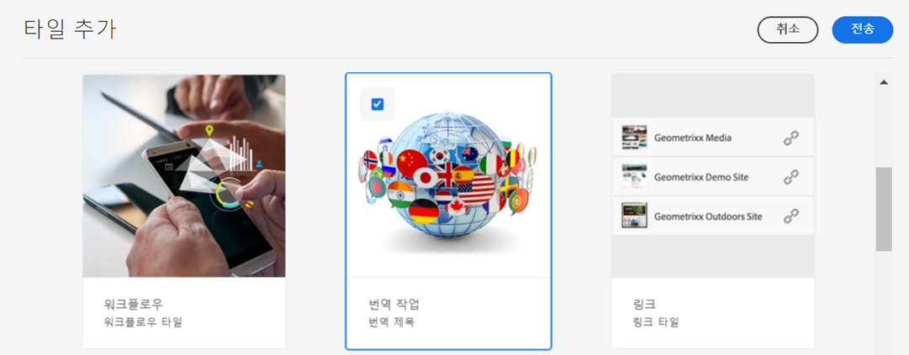
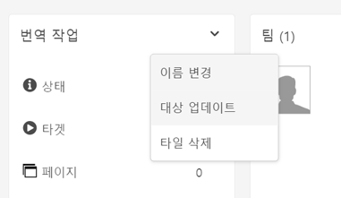
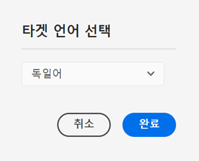

# 번역된 헤드리스 컨텐츠 게시 {#publish-content}

번역된 콘텐츠를 게시하고 번역을 콘텐츠 업데이트로 업데이트하는 방법을 알아봅니다.

## 지금까지 그 이야기 {#story-so-far}

AEM 헤드리스 번역 여정의 이전 문서에서, [컨텐츠 번역,](configure-connector.md) 헤드리스 콘텐츠를 번역하기 위해 AEM 번역 프로젝트를 사용하는 방법을 알아보았습니다. 이제 다음을 수행해야 합니다.

* 번역 프로젝트가 무엇인지 이해합니다.
* 새 번역 프로젝트를 만들 수 있습니다.
* 번역 프로젝트를 사용하여 헤드리스 콘텐츠를 번역합니다.

첫 번째 번역이 완료되었으므로 이 문서를 통해 해당 컨텐츠를 게시하는 다음 단계 및 언어 루트 변경 시 기본 컨텐츠로 번역을 업데이트하는 작업을 수행할 수 있습니다.

## 목표 {#objective}

이 문서는 AEM에서 헤드리스 콘텐츠를 게시하는 방법과 번역을 최신 상태로 유지하기 위해 연속 워크플로우를 만드는 방법을 이해하는 데 도움이 됩니다. 이 문서를 읽은 후에는 다음을 수행해야 합니다.

* AEM의 작성자 게시 모델을 이해합니다.
* 번역된 콘텐츠를 게시하는 방법을 알아봅니다.
* 번역된 컨텐츠에 대한 지속적인 업데이트 모델을 구현할 수 있습니다.

## AEM 작성자-게시 모델 {#author-publish}

컨텐츠를 게시하기 전에 AEM 작성자 게시 모델을 이해하는 것이 좋습니다. 간소화된 용어로 AEM은 시스템의 사용자를 두 그룹으로 나눕니다.

1. 컨텐츠 및 시스템을 만들고 관리하는 사람
1. 시스템에서 컨텐츠를 소비하는 사람

따라서 AEM은 두 개의 인스턴스로 물리적으로 분리됩니다.

1. 다음 **작성자** 인스턴스는 컨텐츠 작성자와 관리자가 컨텐츠를 만들고 관리하기 위해 작업하는 시스템입니다.
1. 다음 **게시** 인스턴스는 소비자에게 콘텐츠를 전달하는 시스템입니다.

작성자 인스턴스에 컨텐츠가 생성되면 해당 컨텐츠를 사용할 수 있도록 게시 인스턴스에 전송해야 합니다. 작성자에서 게시로 전송하는 프로세스를 라고 합니다 **발행**.

## 번역된 컨텐츠 게시 {#publishing}

번역된 콘텐츠의 상태에 만족하면 헤드리스 서비스에서 해당 콘텐츠를 사용할 수 있도록 게시해야 합니다. 이 작업은 일반적으로 번역 전문가의 책임이 아니지만 전체 워크플로우를 보여주기 위해 여기에 설명되어 있습니다.

>[!NOTE]
>
>일반적으로 번역이 완료되면 번역 전문가가 번역을 게시할 준비가 되었음을 컨텐츠 소유자에게 알려줍니다. 그런 다음 컨텐츠 소유자가 게시합니다.
>
>완벽하기 위해 다음 단계가 제공됩니다.

번역을 게시하는 가장 간단한 방법은 프로젝트 자산 폴더로 이동하는 것입니다.

```text
/content/dam/<your-project>/
```

이 경로 아래에 각 번역 언어에 대한 하위 폴더가 있으며 게시할 항목을 선택할 수 있습니다.

1. 이동 **탐색** -> **자산** -> **파일** 프로젝트 폴더를 엽니다.
1. 언어 루트 폴더 및 기타 모든 언어 폴더가 표시됩니다. 게시할 현지화된 언어 또는 언어를 선택합니다.
   
1. 탭 또는 클릭 **게시 관리**.
1. 에서 **게시 관리** 창 **게시** 에서 자동으로 선택됨 **작업** 그리고 **지금** 다음 위치에서 선택됨 **예약**. **다음**을 탭하거나 클릭합니다.
   
1. 다음 **게시 관리** 창에서 적절한 경로가 선택되어 있는지 확인합니다. 탭 또는 클릭 **게시**.
   
1. AEM에서는 화면 하단에 팝업 메시지가 있는 게시 작업을 확인합니다.
   

이제 번역된 헤드리스 콘텐츠가 게시되었습니다! 이제 헤드리스 서비스에서 액세스하고 사용할 수 있습니다.

>[!TIP]
>
>여러 번역을 한 번에 게시하기 위해 게시할 때 여러 항목(즉, 여러 언어 폴더)을 선택할 수 있습니다.

콘텐츠를 게시할 때 이 여정 범위를 벗어나는 게시 시간 예약과 같은 추가 옵션이 있습니다. 자세한 내용은 [추가 리소스](#additional-resources) 자세한 내용은 문서 끝 부분에 있는 섹션을 참조하십시오.

## 번역된 콘텐츠 업데이트 {#updating-translations}

번역은 거의 일회성이 되지 않는다. 일반적으로 컨텐츠 작성자는 초기 번역이 완료된 후에도 언어 루트에서 컨텐츠를 계속 추가하고 수정합니다. 즉, 번역된 콘텐츠도 업데이트해야 합니다.

특정 프로젝트 요구 사항은 업데이트를 수행하기 전에 번역을 업데이트해야 하는 빈도와 의사 결정 프로세스를 정의합니다. 번역을 업데이트하기로 결정하면 AEM의 프로세스는 매우 간단합니다. 초기 번역이 번역 프로젝트를 기반으로 했으므로 모든 업데이트도 포함되어 있습니다.

그러나 번역 프로젝트를 자동으로 만들거나 수동으로 만들도록 선택한 경우에는 이전과 마찬가지로 프로세스가 약간 다릅니다.

### 자동 생성된 번역 프로젝트 업데이트 {#updating-automatic-project}

1. 다음으로 이동 **탐색** -> **자산** -> **파일**. AEM의 헤드리스 컨텐츠는 컨텐츠 조각이라고 하는 자산으로 저장됩니다.
1. 프로젝트의 언어 루트를 선택합니다. 이 경우 `/content/dam/wknd/en`.
1. 레일 선택기를 탭하거나 클릭하고 을 표시합니다 **참조** 패널.
1. 을(를) 탭하거나 클릭합니다 **언어 복사**.
1. 을(를) 확인합니다. **언어 복사** 확인란을 선택합니다.
1. 섹션을 확장합니다. **언어 사본 업데이트** 참조 패널의 맨 아래에 있습니다.
1. 에서 **프로젝트** 드롭다운, 선택 **기존 번역 프로젝트에 추가**.
1. 에서 **기존 번역 프로젝트** 드롭다운에서 초기 번역에 대해 생성된 프로젝트를 선택합니다.
1. 탭 또는 클릭 **시작**.



컨텐츠가 기존 번역 프로젝트에 추가됩니다. 번역 프로젝트를 보려면

1. 다음으로 이동 **탐색** -> **프로젝트**.
1. 방금 업데이트한 프로젝트를 탭하거나 클릭합니다.
1. 업데이트한 언어 또는 언어 중 하나를 탭하거나 클릭합니다.

프로젝트에 새 작업 카드가 추가되었습니다. 이 예에서는 다른 스페인어 번역이 추가되었습니다.



새 카드에 나열된 통계(자산 및 컨텐츠 조각 수)가 다른 것을 볼 수 있습니다. 이것은 AEM이 마지막 번역 이후 변경된 사항을 인식하고 번역해야 하는 콘텐츠만 포함하기 때문입니다. 여기에는 업데이트된 컨텐츠의 재번역뿐만 아니라 새 컨텐츠의 최초 번역도 포함됩니다.

이 시점에서 [원본 작업을 수행한 것처럼 번역 작업을 시작하고 관리합니다.](translate-content.md#using-translation-project)

### 수동으로 만든 번역 프로젝트 업데이트 {#updating-manual-project}

번역을 업데이트하려면 업데이트된 콘텐츠를 번역하는 책임이 있는 기존 프로젝트에 새 작업을 추가할 수 있습니다.

1. 다음으로 이동 **탐색** -> **프로젝트**.
1. 업데이트해야 하는 프로젝트를 탭하거나 클릭합니다.
1. 을(를) 탭하거나 클릭합니다 **추가** 창 위쪽에 있는 단추입니다.
1. 에서 **타일 추가** 창, 탭 또는 클릭 **번역 작업** 그리고 **제출**.

   

1. 새 번역 작업의 카드에서 카드 상단에 있는 V자 모양 단추를 탭하거나 클릭하고 를 선택합니다 **Target 업데이트** 새 작업의 대상 언어를 정의하는 데 사용됩니다.

   

1. 에서 **Target 언어 선택** 대화 상자에서 드롭다운을 사용하여 언어를 선택하고 탭하거나 클릭합니다 **완료**.

   

1. 새 번역 작업의 대상 언어가 설정되면 작업 카드 하단에 있는 줄임표 단추를 탭하거나 클릭하여 작업 세부 정보를 확인합니다.
1. 작업을 처음 만들면 작업이 비어 있습니다. 을 탭하거나 클릭하여 작업에 컨텐츠를 추가합니다. **추가** 버튼 및 경로 브라우저 사용 [이전에 수행한 대로 번역 프로젝트를 원래 만들 수 있습니다.](translate-content.md##manually-creating)

>[!TIP]
>
>경로 브라우저의 강력한 필터는 업데이트된 콘텐츠만 찾는 데 다시 유용합니다.
>
>에서 경로 브라우저에 대해 자세히 알아볼 수 있습니다 [추가 리소스 섹션.](#additional-resources)

이 시점에서 [원본 작업을 수행한 것처럼 번역 작업을 시작하고 관리합니다.](translate-content.md#using-translation-project)

## 여정 종료? {#end-of-journey}

축하합니다! 헤드리스 번역 여정을 완료했습니다! 이제 다음을 수행해야 합니다.

* 헤드리스 콘텐츠 전달에 대한 개요를 살펴보십시오.
* AEM 헤드리스 기능에 대한 기본 이해 가 있습니다.
* AEM 번역 기능 및 헤드리스 콘텐츠와 어떻게 관련되는지를 이해합니다.
* 헤드리스 콘텐츠를 번역할 수 있습니다.

이제 AEM에서 헤드리스 콘텐츠를 번역할 준비가 되었습니다. 그러나 AEM은 강력한 도구이며 다양한 추가 옵션을 사용할 수 있습니다. 에서 사용할 수 있는 추가 리소스 중 일부를 확인하십시오 [추가 리소스 섹션](#additional-resources) 추가 정보를 확인하십시오.

## 추가 리소스 {#additional-resources}

* [번역 프로젝트 관리](/help/sites-cloud/administering/translation/managing-projects.md) - 번역 프로젝트에 대한 세부 사항과 인간 번역 워크플로우 및 다국어 프로젝트와 같은 추가 기능에 대해 알아봅니다.
* [작성 개념](/help/sites-cloud/authoring/getting-started/concepts.md) - AEM의 작성자 및 게시 모델에 대해 자세히 알아봅니다. 이 문서는 컨텐츠 조각이 아닌 페이지 작성에 중점을 두지만 이론은 여전히 적용됩니다.
* [페이지 게시](/help/sites-cloud/authoring/fundamentals/publishing-pages.md) - 콘텐츠를 게시할 때 사용할 수 있는 추가 기능에 대해 알아봅니다. 이 문서는 컨텐츠 조각이 아닌 페이지 작성에 중점을 두지만 이론은 여전히 적용됩니다.
* [작성 환경 및 도구](/help/sites-cloud/authoring/fundamentals/environment-tools.md##path-selection) - AEM에서는 강력한 경로 브라우저를 포함하여 컨텐츠를 구성하고 편집하기 위한 다양한 메커니즘을 제공합니다.
