# 컨텐츠 번역 {#translate-content}

번역 커넥터와 규칙을 사용하여 헤드리스 콘텐츠를 번역합니다.

## 지금까지 그 이야기 {#story-so-far}

AEM 헤드리스 번역 여정의 이전 문서에서, [번역 규칙 구성](translation-rules.md)AEM 번역 규칙을 사용하여 번역 콘텐츠를 식별하는 방법을 알아보았습니다. 이제 다음을 수행해야 합니다.

* 번역 규칙이 수행하는 작업을 이해합니다.
* 고유한 번역 규칙을 정의할 수 있습니다.

커넥터와 번역 규칙이 설정되었으므로 이 문서를 통해 헤드리스 콘텐츠를 번역하는 다음 단계를 안내합니다.

## 목표 {#objective}

이 문서는 커넥터 및 번역 규칙과 함께 AEM 번역 프로젝트를 사용하여 콘텐츠를 번역하는 방법을 이해하는 데 도움이 됩니다. 이 문서를 읽은 후에는 다음을 수행해야 합니다.

* 번역 프로젝트가 무엇인지 이해합니다.
* 새 번역 프로젝트를 만들 수 있습니다.
* 번역 프로젝트를 사용하여 헤드리스 콘텐츠를 번역합니다.

## 번역 프로젝트 만들기 {#creating-translation-project}

번역 프로젝트를 사용하면 헤드리스 AEM 콘텐츠의 번역을 관리할 수 있습니다. 번역 프로젝트는 번역 작업의 중앙 보기를 위해 한 위치에서 다른 언어로 번역될 콘텐츠를 수집합니다.

컨텐츠가 번역 프로젝트에 추가되면 번역 작업이 만들어집니다. 작업은 리소스에서 실행되는 인간 번역 및 기계 번역 워크플로우를 관리하는 데 사용하는 명령과 상태 정보를 제공합니다.

번역 프로젝트는 다음 두 가지 방법으로 만들 수 있습니다.

1. 컨텐츠의 언어 루트를 선택하고 컨텐츠 경로를 기반으로 번역 프로젝트를 AEM에서 자동으로 생성하도록 합니다.
1. 빈 프로젝트를 만들고 번역 프로젝트에 추가할 컨텐츠를 수동으로 선택합니다

둘 다 일반적으로 변환을 수행하는 성향에 따라서만 다른 유효한 접근 방식입니다.

* TPM(번역 프로젝트 관리자)을 사용하려면 번역 프로젝트에 콘텐츠를 수동으로 선택할 수 있는 유연성이 필요한 경우가 많습니다.
* 컨텐츠 소유자가 번역을 담당하는 경우 선택한 컨텐츠 경로를 기반으로 프로젝트를 AEM에서 자동으로 만들 수 있도록 하는 것이 종종 더 쉽습니다.

두 접근 방법은 다음 섹션에서 모두 조사됩니다.

### 컨텐츠 경로를 기반으로 번역 프로젝트 자동 만들기 {#automatically-creating}

번역을 담당하는 컨텐츠 소유자의 경우 AEM에서 번역 프로젝트를 자동으로 만들기가 더 쉽습니다. 컨텐츠 경로를 기반으로 번역 프로젝트를 AEM에서 자동으로 만들도록 하려면,

1. **탐색** -> **자산** -> **파일**&#x200B;로 이동합니다. AEM의 헤드리스 컨텐츠는 컨텐츠 조각이라고 하는 자산으로 저장됩니다.
1. 프로젝트의 언어 루트를 선택합니다. 이 경우 `/content/dam/wknd/en` 을 선택했습니다.
1. 레일 선택기를 탭하거나 클릭하고 **참조** 패널을 표시합니다.
1. **언어 사본**&#x200B;을 탭하거나 클릭합니다.
1. **언어 사본** 확인란을 선택합니다.
1. 참조 패널 하단에 있는 **언어 사본 업데이트** 섹션을 확장합니다.
1. **프로젝트** 드롭다운에서 **번역 프로젝트 만들기**&#x200B;를 선택합니다.
1. 번역 프로젝트에 적절한 제목을 입력합니다.
1. **시작**&#x200B;을 탭하거나 클릭합니다.

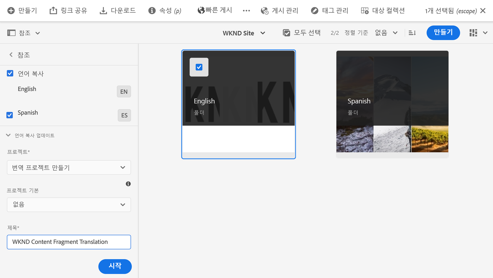

프로젝트가 만들어졌다는 메시지가 표시됩니다.

>[!NOTE]
>
>콘텐츠 구조에 대한 [정의의 일부로 번역 언어에 필요한 언어 구조가 이미 만들어졌다고 가정합니다.](getting-started.md#content-structure) 이 작업은 컨텐츠 설계자와 함께 수행해야 합니다.
>
>미리 언어 폴더를 만들지 않으면 이전 단계에 설명된 대로 언어 사본을 만들 수 없습니다.

### 컨텐츠를 선택하여 번역 프로젝트 수동으로 만들기 {#manually-creating}

번역 프로젝트 관리자의 경우, 번역 프로젝트에 포함할 특정 콘텐츠를 수동으로 선택해야 하는 경우가 많습니다. 이러한 수동 번역 프로젝트를 만들려면 빈 프로젝트를 만들어 놓은 다음 추가할 콘텐츠를 선택해야 합니다.

1. **탐색** -> **프로젝트**&#x200B;로 이동합니다.
1. **만들기** -> **폴더**&#x200B;를 탭하거나 클릭하여 프로젝트용 폴더를 만듭니다.
   * 이는 선택 사항이지만 번역 작업을 구성하는 데 유용합니다.
1. **프로젝트 만들기** 창에서 폴더에 대해 **제목**&#x200B;을 추가한 다음 **만들기**&#x200B;를 탭하거나 클릭합니다.

   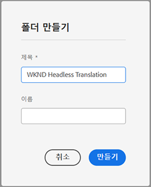

1. 폴더를 탭하거나 클릭하여 폴더를 엽니다.
1. 새 프로젝트 폴더에서 **만들기** -> **프로젝트**&#x200B;를 탭하거나 클릭합니다.
1. 프로젝트는 템플릿을 기반으로 합니다. **번역 프로젝트** 템플릿을 탭하거나 클릭하여 선택한 다음, **다음**&#x200B;을 탭하거나 클릭합니다.

   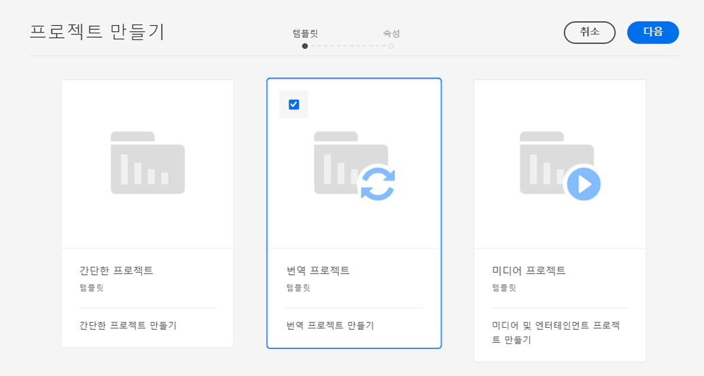

1. **기본** 탭에서 새 프로젝트의 이름을 입력합니다.

   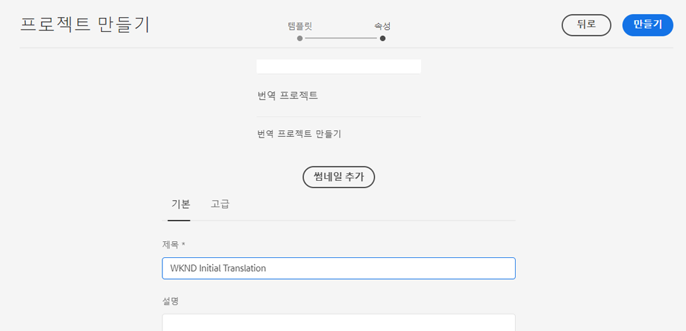

1. **고급** 탭에서 **Target 언어** 드롭다운을 사용하여 콘텐츠를 변환할 언어를 선택합니다. **만들기**&#x200B;를 탭하거나 클릭합니다.

   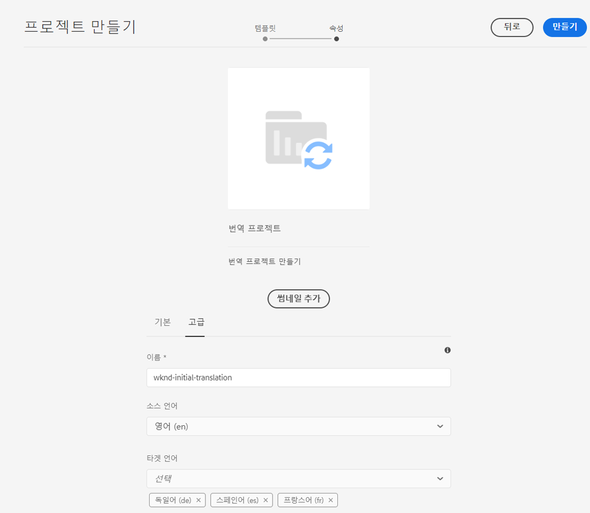

1. 확인 대화 상자에서 **열기**&#x200B;를 탭하거나 클릭합니다.

   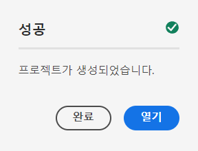

프로젝트가 만들어졌지만 변환할 콘텐츠가 없습니다. 다음 섹션에서는 프로젝트 구성 방법과 컨텐츠를 추가하는 방법에 대해 자세히 설명합니다.

## 번역 프로젝트 사용 {#using-translation-project}

번역 프로젝트는 번역 작업과 관련된 모든 컨텐츠와 작업을 한 곳에서 수집하여 번역을 간단하고 쉽게 관리할 수 있도록 설계되었습니다.

번역 프로젝트를 보려면

1. **탐색** -> **프로젝트**&#x200B;로 이동합니다.
1. 이전 섹션에서 만든 프로젝트를 탭하거나 클릭합니다.

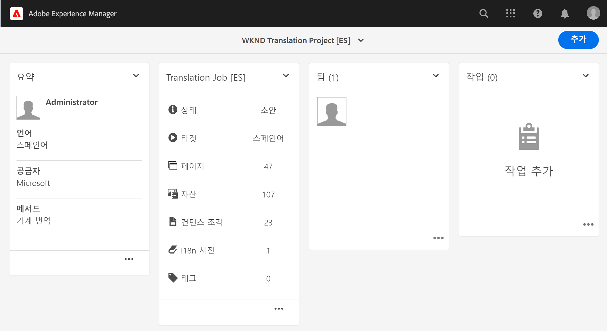

프로젝트는 여러 카드로 나누어집니다.

* **요약**  - 이 카드는 소유자, 언어 및 번역 공급자를 포함한 프로젝트의 기본 헤더 정보를 보여줍니다.
* **번역 작업**  - 이 카드나 이 카드에 표시되는 카드는 상태, 자산 수 등을 포함하여 실제 번역 작업에 대한 개요를 제공합니다. 일반적으로 ISO-2 언어 코드가 작업 이름에 첨부된 언어당 작업이 한 개 있습니다.
* **팀**  - 이 카드는 이 번역 프로젝트를 공동 작업하는 사용자를 보여줍니다. 이 여정은 이 항목을 다루지 않습니다.
* **작업**  - 항목 또는 워크플로우 항목 작업과 같은 컨텐츠 번역과 관련된 추가 작업입니다. 이 여정은 이 항목을 다루지 않습니다.

번역 프로젝트를 사용하는 방법은 번역 프로젝트를 만드는 방법에 따라 다릅니다. AEM에 의해 자동으로 또는 수동으로 중 하나를 선택합니다.

### 자동 생성된 번역 프로젝트 사용 {#using-automatic-project}

번역 프로젝트를 자동으로 만들 때 AEM은 이전에 정의한 번역 규칙을 기반으로 선택한 경로에서 헤드리스 콘텐츠를 평가합니다. 이 평가를 기반으로 번역이 필요한 컨텐츠를 새 번역 프로젝트로 추출합니다.

이 프로젝트에 포함된 헤드리스 컨텐츠의 세부 사항을 보려면 다음을 수행하십시오.

1. **번역 작업** 카드 하단에 있는 생략 부호 단추를 탭하거나 클릭합니다.
1. **번역 작업** 창에는 작업의 모든 항목이 나열됩니다.
   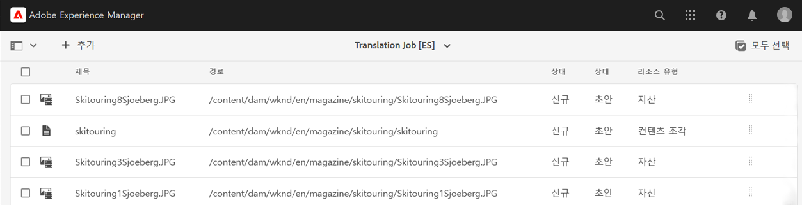
1. 라인을 탭하거나 클릭하여 해당 라인의 세부 사항을 확인합니다. 한 줄이 번역할 여러 콘텐츠 항목을 나타낼 수 있음을 염두에 둡니다.
1. 라인 항목에 대한 선택 확인란을 탭하거나 클릭하여 작업에서 삭제하거나 컨텐츠 조각 또는 자산 콘솔에서 보는 옵션과 같은 추가 옵션을 볼 수 있습니다.

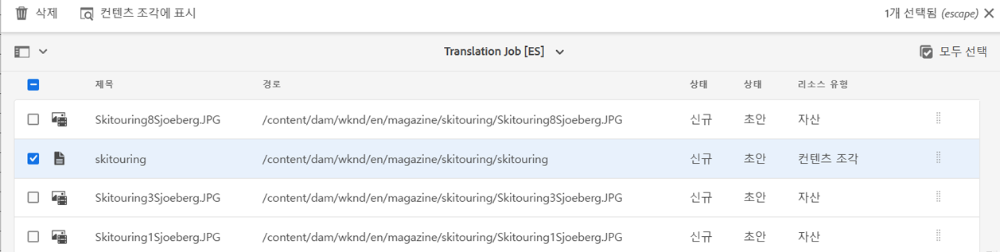

일반적으로 번역 작업의 컨텐츠는 **번역 작업** 창의 **상태** 열에 표시된 대로 **초안** 상태에서 시작됩니다.

번역 작업을 시작하려면 번역 프로젝트 개요로 돌아가서 **번역 작업** 카드 상단에 있는 V자 모양 단추를 탭하거나 클릭하고 **시작**&#x200B;을 선택하십시오.

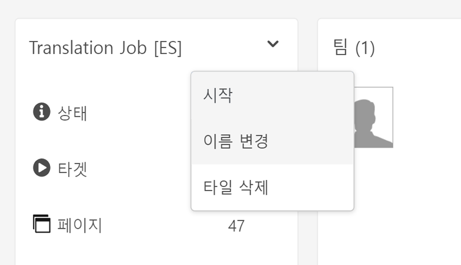

이제 AEM은 번역 구성 및 커넥터와 통신하여 컨텐츠를 번역 서비스로 보냅니다. **번역 작업** 창으로 돌아와 항목의 **상태** 열을 보고 번역의 진행 상황을 볼 수 있습니다.

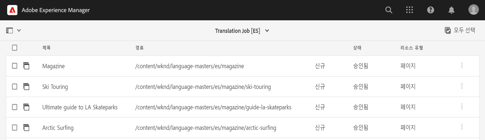

기계 번역은 **Approved** 상태로 자동으로 반환됩니다. 인간 번역은 더 많은 상호 작용을 허용하지만 이 여정의 범위를 벗어납니다.

### 수동으로 만든 번역 프로젝트 사용 {#using-manual-project}

번역 프로젝트를 수동으로 만들면 AEM에서 필요한 작업을 만들지만 포함할 콘텐츠를 자동으로 선택하지 않습니다. 이를 통해 번역 프로젝트 관리자는 번역할 컨텐츠를 유연하게 선택하고 선택할 수 있습니다.

번역 작업에 컨텐츠를 추가하려면

1. **번역 작업** 카드 중 하나의 하단에 있는 생략 부호 단추를 탭하거나 클릭합니다.
1. 작업에 컨텐츠가 없는지 확인합니다. 창 상단에 있는 **추가** 단추를 탭하거나 클릭한 다음, 드롭다운에서 **Assets/Pages** 를 클릭합니다.

   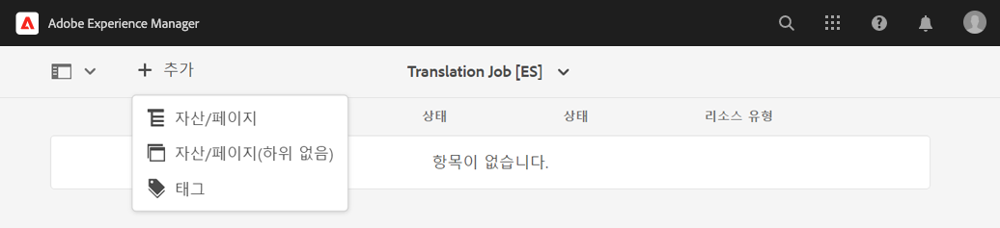

1. 경로 브라우저가 열려 추가할 내용을 특별히 선택할 수 있습니다. 콘텐츠를 찾아 탭하거나 클릭하여 선택합니다.

   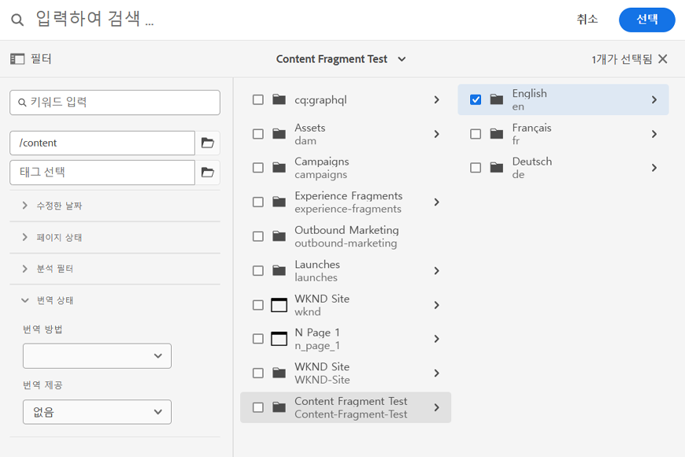

1. **선택**&#x200B;을 탭하거나 클릭하여 선택한 컨텐츠를 작업에 추가합니다.
1. **번역** 대화 상자에서 **언어 사본 만들기**&#x200B;를 지정하세요.

   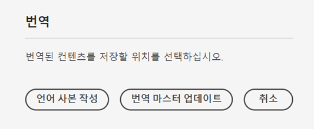

1. 이제 컨텐츠가 작업에 포함됩니다.

   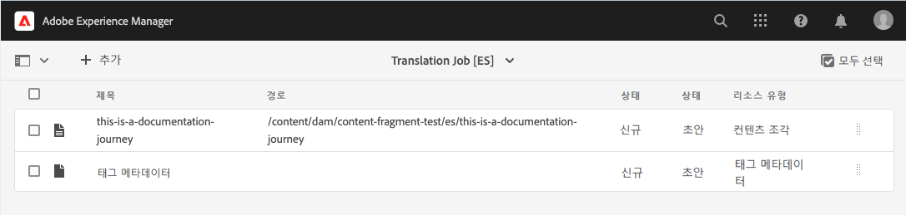

1. 라인 항목에 대한 선택 확인란을 탭하거나 클릭하여 작업에서 삭제하거나 컨텐츠 조각 또는 자산 콘솔에서 보는 옵션과 같은 추가 옵션을 볼 수 있습니다.


1. 작업에 필요한 모든 컨텐츠를 포함하려면 다음 단계를 반복합니다.

>[!TIP]
>
>경로 브라우저는 컨텐츠를 검색, 필터링 및 탐색할 수 있는 강력한 도구입니다. **컨텐츠 전용/필터** 단추를 탭하거나 클릭하여 사이드 패널을 전환하고 **수정된 날짜** 또는 **번역 상태**&#x200B;와 같은 고급 필터를 표시합니다.
>
>[추가 리소스 섹션에서 경로 브라우저에 대해 자세히 알아볼 수 있습니다.](#additional-resources)

이전 단계를 사용하여 프로젝트의 모든 언어(작업)에 필요한 컨텐츠를 추가할 수 있습니다. 모든 컨텐츠를 선택하면 번역을 시작할 수 있습니다.

일반적으로 번역 작업의 컨텐츠는 **번역 작업** 창의 **상태** 열에 표시된 대로 **초안** 상태에서 시작됩니다.

번역 작업을 시작하려면 번역 프로젝트 개요로 돌아가서 **번역 작업** 카드 상단에 있는 V자 모양 단추를 탭하거나 클릭하고 **시작**&#x200B;을 선택하십시오.


이제 AEM은 번역 구성 및 커넥터와 통신하여 컨텐츠를 번역 서비스로 보냅니다. **번역 작업** 창으로 돌아와 항목의 **상태** 열을 보고 번역의 진행 상황을 볼 수 있습니다.


기계 번역은 **Approved** 상태로 자동으로 반환됩니다. 인간 번역은 더 많은 상호 작용을 허용하지만 이 여정의 범위를 벗어납니다.

## 번역된 컨텐츠 검토 {#reviewing}

[이전에 보듯이, ](#using-translation-project) 기계 번역된 컨텐츠는 기계 번역을 사용하고 있으므로  **** 인간의 개입이 필요하지 않다고 가정했으므로 승인됨 상태로 AEM으로 다시 전송됩니다. 그러나 번역된 컨텐츠를 검토할 수는 있습니다.

완료된 번역 작업으로 이동한 다음 확인란을 탭하거나 클릭하여 라인 항목을 선택하면 됩니다. 도구 모음에 아이콘 **컨텐츠 조각에 표시**&#x200B;가 표시됩니다.

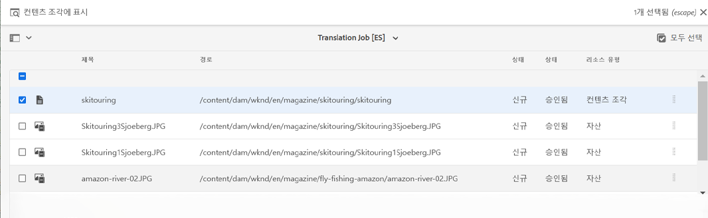

해당 아이콘을 탭하거나 클릭하여 번역된 컨텐츠 조각을 편집기 콘솔에서 열어 번역된 컨텐츠의 세부 사항을 확인합니다.

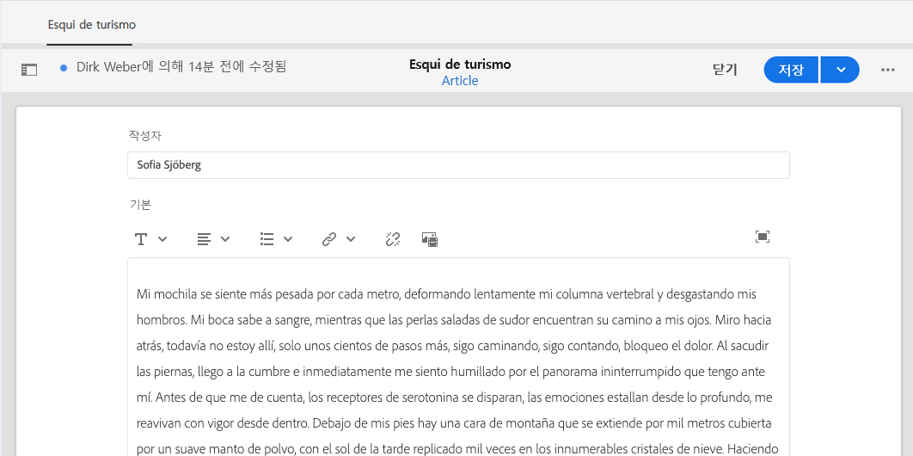

적절한 권한이 있는 경우 컨텐츠 조각을 필요에 따라 추가로 수정할 수 있지만 컨텐츠 조각을 편집하는 것은 이 여정의 범위를 벗어납니다. 이 항목에 대한 자세한 내용은 이 문서의 끝에 있는 [추가 리소스](#additional-resources) 섹션을 참조하십시오.

이 프로젝트의 목적은 번역과 관련된 모든 리소스를 한 곳에서 수집하여 쉽게 액세스하고 명확한 개요를 제공하는 것입니다. 하지만 번역된 항목의 세부 사항을 보면 볼 수 있듯이 번역 자체는 번역 언어의 자산 폴더로 다시 이동합니다. 이 예제에서 폴더는 다음과 같습니다.

```text
/content/dam/wknd/es
```

**탐색** -> **파일** -> **자산**&#x200B;을 통해 이 폴더로 이동하면 번역된 컨텐츠가 표시됩니다.

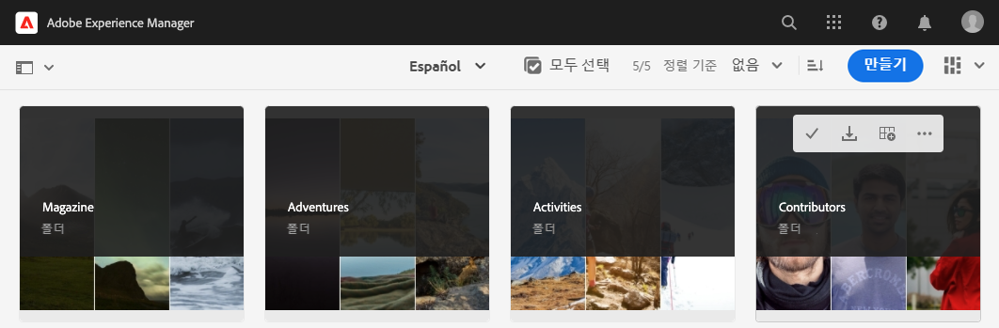

AEM 번역 프레임워크는 번역 커넥터로부터 번역을 받은 다음 언어 루트를 기반으로 컨텐츠 구조를 자동으로 만들고 커넥터에서 제공한 번역을 사용합니다.

이 컨텐츠는 게시되지 않으므로 헤드리스 서비스에서 사용할 수 없음을 이해하는 것이 중요합니다. 이 작성자 게시 구조에 대해 알아보고 번역 여정의 다음 단계에서 번역된 콘텐츠를 게시하는 방법을 알아봅니다.

## 수동 번역 {#human-translation}

번역 서비스에서 번역 서비스를 제공하는 경우, 검토 프로세스에서 더 많은 옵션을 제공합니다. 예를 들어, 번역은 상태가 **초안**&#x200B;인 프로젝트에 다시 도착하며 수동으로 검토 및 승인하거나 거부해야 합니다.

인간 번역은 이 로컬라이제이션 여정의 범위를 벗어납니다. 이 항목에 대한 자세한 내용은 이 문서의 끝에 있는 [추가 리소스](#additional-resources) 섹션을 참조하십시오. 하지만 추가 승인 옵션 외에도 인간 번역 워크플로우는 이 여정에 설명된 기계 번역과 동일합니다.

## 다음은 무엇입니까? {#what-is-next}

헤드리스 번역 여정의 이 부분을 완료했으므로 다음을 수행해야 합니다.

* 번역 프로젝트가 무엇인지 이해합니다.
* 새 번역 프로젝트를 만들 수 있습니다.
* 번역 프로젝트를 사용하여 헤드리스 콘텐츠를 번역합니다.

이 지식을 바탕으로 빌드하고 AEM 헤드리스 번역 여정을 계속 진행하려면 번역된 컨텐츠를 게시하는 방법](publish-content.md) 문서를 참조하여 번역된 내용을 게시하는 방법과 해당 번역을 언어 루트 컨텐츠가 변경될 때 업데이트하는 방법을 배웁니다.[

## 추가 리소스 {#additional-resources}

[번역된 컨텐츠 게시 문서를 검토하여 헤드리스 번역 여정의 다음 부분으로 이동하는 것이 좋지만,](publish-content.md) 다음은 이 문서에서 언급된 일부 개념에 대해 자세히 설명하는 추가 선택적 리소스입니다. 하지만 헤드리스 여정을 계속 진행할 필요는 없습니다.

* [번역 프로젝트 관리](/help/sites-cloud/administering/translation/managing-projects.md)  - 번역 프로젝트에 대한 세부 사항과 수동 번역 워크플로우 및 다국어 프로젝트와 같은 추가 기능을 알아봅니다.
* [작성 환경 및 도구](/help/sites-cloud/authoring/fundamentals/environment-tools.md##path-selection)  - AEM은 강력한 경로 브라우저를 포함하여 컨텐츠를 구성하고 편집하기 위한 다양한 메커니즘을 제공합니다.
