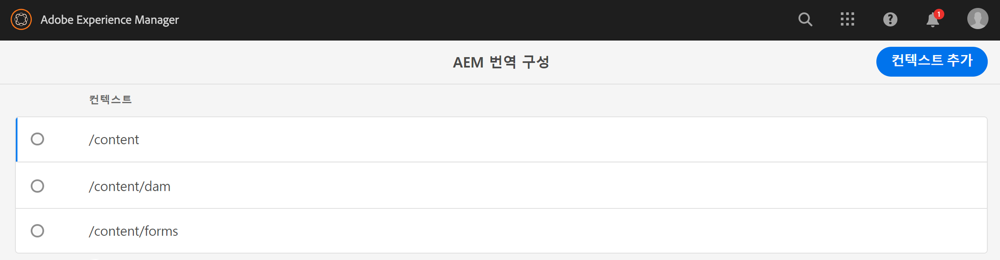
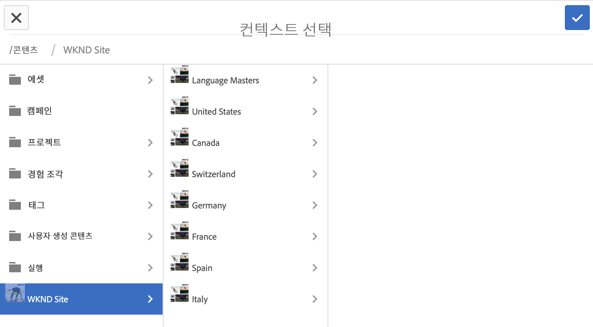
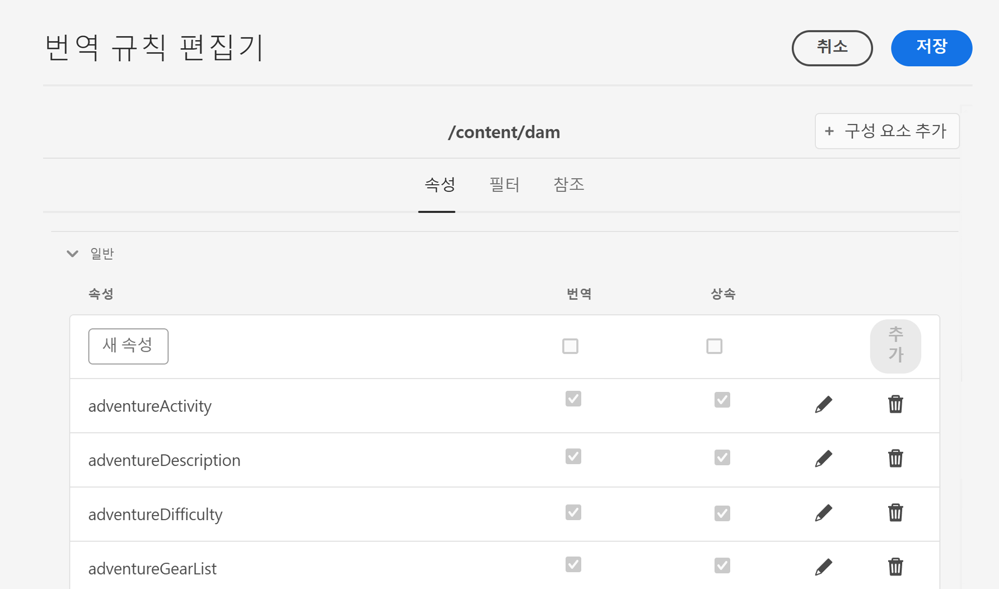
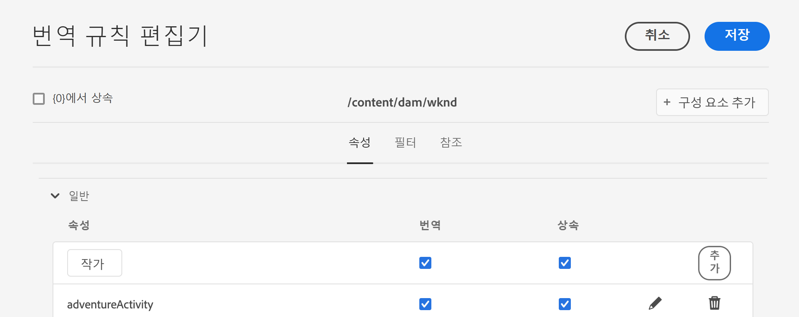

# 번역 규칙 구성 {#configure-translation-rules}

번역 규칙을 정의하여 번역할 콘텐츠를 식별하는 방법에 대해 알아봅니다.

## 지금까지의 이야기 {#story-so-far}

AEM 헤드리스 번역 여정의 이전 문서에서, [번역 커넥터 구성](configure-connector.md) 번역 커넥터를 설치 및 구성하는 방법을 배웠으며 이제 다음을 수행해야 합니다.

* AEM 번역 통합 프레임워크의 중요한 매개변수를 이해할 수 있습니다.
* 번역 서비스에 대해 나만의 연결을 설정할 수 있습니다.

이제 커넥터를 설정했으므로 이 문서는 번역할 콘텐츠를 식별하는 다음 단계를 소개합니다.

>[!CAUTION]
>
>설명서 여정의 이 단계는 **번역 가능** 컨텐츠 조각에 플래그 지정
>
>* 다음 **번역 가능** 플래그는 자동으로 번역 규칙을 만들며, 작업을 수행할 필요가 없습니다.
>* 다음 **번역 가능** 플래그는 번역 통합 프레임워크 구성이 로 설정된 경우에만 사용됩니다 **[번역을 위해 컨텐츠 모델 필드를 활성화합니다.](/help/sites-cloud/administering/translation/integration-framework.md)**
>* TIF 구성에서 이 옵션을 활성화하면 수동으로 생성한 번역 규칙이 대체됩니다.|

## 목표 {#objective}

이 문서는 AEM의 번역 규칙을 사용하여 번역 콘텐츠를 식별하는 방법을 이해하는 데 도움이 됩니다. 이 문서를 읽고 나면

* 번역 규칙의 역할에 대해 이해할 수 있습니다.
* 나만의 번역 규칙을 정의할 수 있습니다.

## 번역 규칙 {#translation-rules}

헤드리스 컨텐츠를 나타내는 컨텐츠 조각은 구조화된 필드로 구성된 많은 정보를 포함할 수 있습니다. 프로젝트 요구 사항에 따라 컨텐츠 조각 내의 모든 필드를 번역해야 하는 것은 아닐 수 있습니다.

번역 규칙은 번역 프로젝트에 포함되어 있거나 번역 프로젝트에서 제외된 콘텐츠를 식별합니다. 콘텐츠가 번역되면 AEM은 이러한 규칙에 따라 콘텐츠를 추출하거나 수집합니다. 이러한 방식으로 번역해야 하는 콘텐츠만 번역 서비스로 전송할 수 있습니다.

번역 규칙에는 다음과 같은 정보가 포함됩니다.

* 규칙이 적용되는 콘텐츠의 경로
   * 규칙은 콘텐츠의 하위 항목에도 적용됩니다.
* 번역할 콘텐츠가 포함된 속성의 이름
   * 속성은 특정 리소스 타입 또는 모든 리소스 타입에 한정될 수 있습니다.

컨텐츠 조각의 구조를 정의하는 컨텐츠 조각 모델은 고유한 프로젝트이므로 AEM에서 변환할 컨텐츠 모델의 요소를 알 수 있도록 번역 규칙을 설정하는 것이 중요합니다.

>[!TIP]
>
>일반적으로 컨텐츠 설계자는 번역 전문가에게 다음을 제공합니다 **속성 이름**&#x200B;번역에 필요한 모든 필드 중 하나입니다. 이러한 이름은 번역 규칙을 구성하는 데 필요합니다. 번역 전문가로서 [다음을 찾을 수 있습니다. **속성 이름**&#x200B;네 자신을](getting-started.md#content-modlels) 이전에 이 여정에서 설명한 대로,

## 번역 규칙 생성 {#creating-rules}

복잡한 번역 요구 사항을 지원하도록 여러 규칙을 만들 수 있습니다. 예를 들어, 작업 중인 한 프로젝트에서는 모델의 모든 필드를 번역해야 하지만, 다른 유일한 설명 필드는 제목을 번역하지 않은 상태로 두어야 합니다.

번역 규칙은 이러한 시나리오를 처리할 수 있도록 설계되었습니다. 그러나 이 예제에서는 간단한 단일 구성에 초점을 맞추어 규칙을 만드는 방법에 대해 설명합니다.

**번역 구성** 콘솔을 사용하여 번역 규칙을 구성할 수 있습니다. 다음 방법으로 액세스할 수 있습니다.

1. **도구** -> **일반**&#x200B;으로 이동합니다.
1. **번역 구성**&#x200B;을 탭하거나 클릭합니다.

에서 **번역 구성** UI에는 번역 규칙에 사용할 수 있는 다양한 옵션이 있습니다. 여기서는 기본 헤드리스 로컬라이제이션 구성에 필요한 가장 필요하고 일반적인 단계를 강조 표시합니다.

1. 탭 또는 클릭 **컨텍스트 추가**: 경로를 추가할 수 있습니다. 규칙의 영향을 받는 콘텐츠 경로입니다.
   
1. 경로 브라우저를 사용하여 필요한 경로를 선택하고 **확인** 저장할 단추입니다. 헤드리스 컨텐츠가 있는 컨텐츠 조각은 일반적으로 아래에 있습니다 `/content/dam/<your-project>`.
   
1. AEM에서 구성을 저장합니다.
1. 방금 만든 컨텍스트를 선택한 다음 탭하거나 클릭해야 합니다 **편집**. 이렇게 하면 **번역 규칙 편집기** 를 클릭하여 속성을 구성합니다.
   
1. 기본적으로 모든 구성은 상위 경로에서 상속됩니다(이 경우) `/content/dam`. 옵션을 선택 취소합니다 **상속 대상`/content/dam`** 를 추가하여 구성에 필드를 추가합니다.
1. 선택 취소되면 **일반** 목록의 섹션에서 사용자가 소유한 컨텐츠 조각 모델의 속성 이름을 추가합니다. [이전에 번역 필드로 식별되었습니다.](getting-started.md#content-models)
   1. **새 속성** 필드에 속성 이름을 입력합니다.
   1. **번역** 및 **상속** 옵션은 자동으로 선택되어 있습니다.
   1. **추가**&#x200B;를 탭하거나 클릭합니다.
   1. 번역해야 하는 모든 필드에 대해 이들 단계를 반복하십시오.
   1. **저장**을 탭하거나 클릭합니다.
      

이제 번역 규칙을 구성했습니다.

## 고급 사용 {#advanced-usage}

여러 가지 추가 속성을 번역 규칙의 일부로 구성할 수 있습니다. 또한 XML로 직접 규칙을 지정할 수 있으므로 보다 구체적이고 유연하게 규칙을 지정할 수 있습니다.

이러한 기능은 일반적으로 헤드리스 컨텐츠를 현지화하는 데 필요하지 않지만, [추가 리소스](#additional-resources) 관심 있는 경우 섹션을 참조하십시오.

## 다음 단계 {#what-is-next}

헤드리스 번역 여정의 이 부분을 완료했으므로 다음을 수행해야 합니다.

* 번역 규칙의 역할에 대해 이해할 수 있습니다.
* 나만의 번역 규칙을 정의할 수 있습니다.

이 지식을 바탕으로 작성하며 다음 번에 문서를 검토하여 AEM 헤드리스 번역 여정을 계속 진행합니다 [컨텐츠 번역](translate-content.md) 여기서 커넥터 및 규칙이 헤드리스 컨텐츠를 변환하는 방법을 알아봅니다.

## 추가 리소스 {#additional-resources}

문서를 검토하여 헤드리스 번역 여정의 다음 부분으로 이동하는 것이 좋습니다 [컨텐츠 번역,](translate-content.md) 다음은 이 문서에서 언급된 일부 개념을 자세히 설명하는 몇 가지 추가 선택적 리소스입니다. 하지만 헤드리스 여정을 계속 진행할 필요는 없습니다.

* [번역할 콘텐츠 식별](/help/sites-cloud/administering/translation/rules.md) - 번역 규칙이 번역이 필요한 콘텐츠를 식별하는 방법에 대해 알아봅니다.
