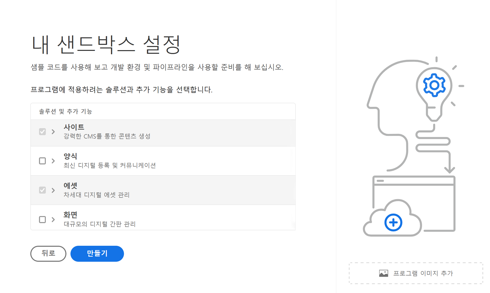

# 프로그램 제작 {#create-program}

이 [온보딩 여정](overview.md) 부분에서는 Cloud Manager를 사용하여 첫 번째 프로그램을 만드는 방법을 배웁니다.

## 목표 {#objective}

이 온보딩 여정의 이전 문서인 [Cloud Manager 액세스](cloud-manager.md)를 검토한 후 Cloud Manager에 대한 적절한 액세스 권한이 있는지 확인했습니다. 이제 첫 번째 프로그램을 만들 수 있습니다.

이 문서를 읽고 나면 다음과 같은 작업을 수행할 수 있습니다.

* 프로그램에 대해 이해할 수 있습니다.
* 프로덕션 프로그램과 샌드박스 프로그램의 차이점을 알게 됩니다.
* 자신만의 프로그램을 만들 수 있습니다.

## 프로그램이란? {#programs}

프로그램은 Cloud Manager에서 가장 높은 수준의 조직입니다. Adobe 라이선스에 따라 프로그램을 통해 솔루션을 구성하고 특정 팀원에게 해당 프로그램에 대한 액세스 권한을 부여할 수 있습니다.

Cloud Manager 프로그램은 일련의 Cloud Manager 환경을 나타냅니다. 이러한 프로그램은 일반적으로 사용 허가된 SLA(서비스 수준 계약)에 해당하는 논리적인 비즈니스 이니셔티브 세트를 지원합니다. 예를 들어 한 프로그램은 조직의 글로벌 공개 웹 사이트를 지원하는 AEM 리소스를 나타내고 다른 프로그램은 내부 중앙 DAM을 나타낼 수 있습니다.

여행 관련 미디어를 주로 다루는 테넌트인 이론적 WKND Travel and Adventure Enterprises의 예를 들자면, WKND Magazine 부서를 위한 Sites 프로그램과 WKND Media 부서를 위한 Assets 프로그램이라는 두 가지 프로그램이 있을 수 있습니다. 서로 다른 팀원이 각자의 분업 요구 사항에 따라 서로 다른 프로그램에 액세스할 수 있습니다.

프로그램에는 두 가지 유형이 있습니다.

* **프로덕션 프로그램**&#x200B;은 사이트에 대한 라이브 트래픽을 활성화하기 위해 만들어집니다. 이것이 “실제” 환경입니다.
* **샌드박스 프로그램**&#x200B;은 일반적으로 교육, 데모 실행, 활성화, POC 또는 문서화 목적으로 만들어집니다.

각각 용도가 다르기 때문에 환경마다 옵션이 다릅니다. 그러나 만드는 과정은 비슷합니다. 이 온보딩 여정을 위해 샌드박스 환경을 만듭니다.

>[!TIP]
>
>프로덕션 프로그램을 제작해야 하는 경우 [추가 리소스](#additional-resources) 섹션의 링크에서 프로그램에 대한 자세한 내용을 참조하십시오.

## 샌드박스 프로그램 만들기 {#create-sandbox}

다음 단계에 따라 샌드박스 프로그램을 만듭니다.

1. [my.cloudmanager.adobe.com](https://my.cloudmanager.adobe.com/)에서 Cloud Manager에 로그인한 다음 적절한 조직을 선택합니다.

1. Cloud Manager의 랜딩 페이지에서 화면 오른쪽 상단의 **프로그램 추가**&#x200B;를 클릭합니다.

   

1. 프로그램 만들기 마법사에서 **샌드박스 설정** 프로그램 이름을 입력하고 탭하거나 클릭합니다. **계속**.

   

1. 다음에서 **샌드박스 설정** 대화 상자에서 샌드박스 프로그램에서 활성화할 솔루션을 선택할 수 있습니다. 다음 **사이트** 및 **에셋** 솔루션은 항상 샌드박스 프로그램에 포함되며 자동으로 선택됩니다. 이 정도면 온보딩 예제로 충분합니다. **만들기**&#x200B;를 클릭합니다.

   

설정 프로세스가 진행됨에 따라 상태 표시기가 있는 새로운 샌드박스 프로그램 카드가 랜딩 페이지에 표시됩니다.

프로그램이 완성되면 **개발자** 제품 프로필에 할당된 조직의 멤버가 Cloud Manager에 로그인하여 Cloud Manager git 저장소를 관리할 수 있습니다.

## 다음 단계 {#whats-next}

이제 첫 번째 프로그램이 만들어졌으므로 이를 위한 환경을 만들 수 있습니다. 다음은 [환경 만들기](create-environments.md) 문서를 검토하여 온보딩 여정을 계속해야 합니다.

## 추가 리소스 {#additional-resources}

다음은 온보딩 여정의 콘텐츠를 넘어서고자 하는 경우 선택할 수 있는 추가 리소스입니다.

* [프로그램 및 프로그램 유형](/help/implementing/cloud-manager/getting-access-to-aem-in-cloud/program-types.md) - Cloud Manager의 계층 구조와 다양한 유형의 프로그램이 해당 구조에 어떻게 적합하고 어떻게 다른지 알아봅니다.
* [샌드박스 프로그램 만들기](/help/implementing/cloud-manager/getting-access-to-aem-in-cloud/creating-sandbox-programs.md) - Cloud Manager를 사용하여 교육, 데모, POC 또는 기타 비프로덕션 목적을 위한 자체 샌드박스 프로그램을 만드는 방법을 알아봅니다.
* [프로덕션 프로그램 만들기](/help/implementing/cloud-manager/getting-access-to-aem-in-cloud/creating-production-programs.md) - Cloud Manager를 사용하여 라이브 트래픽을 호스팅하는 자체 프로덕션 프로그램을 만드는 방법을 알아봅니다.
* [Adobe Cloud Manager 사용 - 프로그램](https://experienceleague.adobe.com/docs/experience-manager-learn/cloud-service/cloud-manager/programs.html) - Cloud Manager 프로그램은 논리적 비즈니스 이니셔티브를 지원하는 일련의 AEM 환경을 나타내며, 일반적으로 구매한 SLA(Service Level Agreement)에 해당합니다.
* [AEM as a Cloud Service 팀 및 제품 프로필](/help/onboarding/aem-cs-team-product-profiles.md) - AEM as a Cloud Service 팀 및 제품 프로필로 라이선스가 부여된 Adobe 솔루션에 대한 액세스 권한을 부여하고 제한하는 방법에 대해 알아봅니다.
