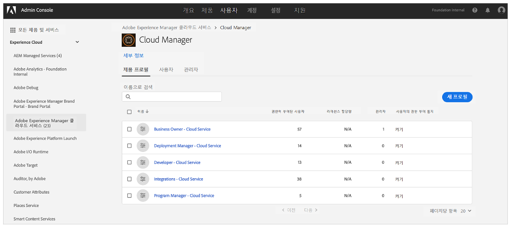

# 알림 프로필 {#notification-profiles}

중요한 이메일 알림 수신을 관리하기 위해 Admin Console에서 사용자 프로필을 만드는 방법에 대해 알아봅니다.

## 개요 {#overview}

때때로 Adobe는 AEM as a Cloud Service 환경과 관련하여 사용자에게 연락을 취합니다. 제품 내 알림 외에도 Adobe는 때때로 알림을 위해 이메일을 사용합니다. 이러한 이메일 알림에는 두 가지 유형이 있습니다.

* **문제 알림** - 이러한 알림은 문제 중에 또는 Adobe가 AEM as a Cloud Service 환경의 잠재적 가용성 문제를 식별한 경우 전송됩니다.
* **사전 알림** - 이러한 알림은 Adobe 지원 팀원이 AEM as a Cloud Service 환경에 도움이 될 수 있는 잠재적인 최적화 또는 권장 사항에 대한 지침을 제공하고자 할 때 전송됩니다.

사용자는 [사용자 지정 그룹 권한](/help/implementing/cloud-manager/custom-permissions.md)에 따라 특정 프로그램에 대한 알림을 받을 수도 있습니다.

또한 사전 알림에 그룹을 할당하는 기능이 지원되며 사용자와 그룹을 제품 프로필에 직접 할당할 수 있습니다.

* 문제 및 사전 알림 그룹의 사용자는 기본적으로 모든 프로그램에 대한 알림을 수신하게 됩니다.
* 그러나 사용자가 모든 알림을 수신하지 않고자 하는 경우 사용자 지정 읽기 권한을 사용하여 수신하려는 프로그램 알림을 지정할 수 있습니다.

올바른 사용자가 이러한 알림을 수신하도록 하려면 이 문서에 설명된 대로 사용자 프로필을 구성하고 할당해야 합니다.

## 사전 요구 사항 {#prerequisites}

사용자 프로필은 Admin Console에서 생성되고 유지되므로 알림 프로필을 만들기 전에 다음 작업을 수행해야 합니다.

* 멤버십을 추가하고 프로필을 작성할 수 있는 권한을 보유합니다.
* 유효한 Adobe Admin Console 프로필이 있습니다.

## 새 Cloud Manager 제품 프로필 만들기 {#create-profiles}

알림 수신을 올바르게 설정하려면 두 개의 사용자 프로필을 만듭니다. 이 단계는 한 번만 수행됩니다.

1. Admin Console([`https://adminconsole.adobe.com`)에 로그인합니다.](https://adminconsole.adobe.com)

1. 올바른 조직에 속해 있는지 확인합니다.

1. **개요** 페이지의 **제품 및 서비스** 카드에서 **Adobe Experience Manager as a Cloud Service**&#x200B;를 선택합니다.

   

1. 모든 인스턴스 목록에서 **Cloud Manager** 인스턴스로 이동합니다.

   

1. 구성된 모든 Cloud Manager 제품 프로필 목록이 표시됩니다.

   

1. **새 프로필**&#x200B;을 클릭하고 다음 세부 정보를 제공합니다.

   * **제품 프로필 이름**: `Incident Notification - Cloud Service`
   * **표시 이름**: `Incident Notification - Cloud Service`
   * **설명**: 문제 중에 또는 Adobe가 AEM as a Cloud Service 환경에서 잠재적인 가용성 문제를 식별한 경우 알림을 받을 사용자를 위한 Cloud Manager 프로필
      * 특정 프로그램에 대한 사용자 정의 읽기 권한이 있는 사용자는 사용자 정의 권한을 사용하도록 선택한 경우 해당 프로그램에 대해서만 알림을 수신하게 됩니다.

1. **저장**&#x200B;을 클릭합니다.

1. **새 프로필**&#x200B;을 한 번 더 클릭하고 다음 세부 정보를 제공합니다.

   * **제품 프로필 이름**: `Proactive Notification - Cloud Service`
   * **표시 이름**: `Proactive Notification - Cloud Service`
   * **설명** - Adobe 지원 팀원이 AEM as a Cloud Service 환경 구성과 관련해 잠재적인 최적화 또는 권장 사항에 대한 지침을 제공하고자 할 때 알림을 받을 사용자를 위한 Cloud Manager 프로필
      * 특정 프로그램에 대한 사용자 정의 읽기 권한이 있는 사용자는 사용자 정의 권한을 사용하도록 선택한 경우 해당 프로그램에 대해서만 알림을 수신하게 됩니다.

1. **저장**&#x200B;을 클릭합니다.

두 개의 새 알림 프로필이 생성됩니다.

>[!NOTE]
>
>Cloud Manager **제품 프로필 이름**&#x200B;이 제공된 것과 정확히 동일해야 합니다. 오류를 방지하기 위해 제공된 제품 프로필 이름을 복사하여 붙여넣습니다. 변동이나 오타가 있으면 알림이 원하는 대로 전송되지 않습니다.
>
>오류가 있거나 프로필이 정의되지 않은 경우 Adobe는 기본적으로 **Cloud Manager 개발자** 또는 **개발 관리자** 프로필에 할당된 기존 사용자에게 알립니다.

## 알림 프로필에 사용자 할당 {#add-users}

이제 프로필이 생성되었으므로 적절한 사용자를 할당해야 합니다. 새 사용자를 만들거나 기존 사용자를 업데이트하여 이 작업을 수행할 수 있습니다.

### 프로필에 신규 사용자 추가 {#new-user}

Federated ID가 아직 설정되지 않은 사용자를 추가하려면 다음 단계를 따르십시오.

1. 문제 또는 사전 알림을 수신해야 하는 사용자 또는 그룹을 식별합니다.

1. 아직 로그인하지 않은 경우 [`https://adminconsole.adobe.com`](https://adminconsole.adobe.com)에서 Admin Console에 로그인합니다.

1. 적절한 조직을 선택했는지 확인합니다.

1. **개요** 페이지의 **제품 및 서비스** 카드에서 **Adobe Experience Manager as a Cloud Service**&#x200B;를 선택합니다.

   

1. 팀원의 Federated ID가 아직 설정되지 않은 경우 상단 탐색에서 **사용자** 탭을 선택한 다음 **사용자 추가**&#x200B;를 선택합니다. 그렇지 않은 경우 [프로필에 기존 사용자 추가](#existing-users) 섹션으로 건너뜁니다.

   

1. **팀에 사용자 추가** 대화 상자에서 추가하려는 사용자의 이메일 ID를 입력하고 **ID 유형**&#x200B;으로 `Adobe ID`를 선택합니다.

1. **제품 선택** 제목 아래의 더하기 버튼을 클릭하여 제품 선택을 시작합니다.

1. **Adobe Experience Manager as a Cloud Service**&#x200B;를 선택하고 새 프로필 중 하나 또는 모두를 사용자에게 할당합니다.

   * **문제 알림 - Cloud Service**
   * **사전 알림 - Cloud Service**

1. **저장**&#x200B;을 클릭하면 추가한 사용자에게 시작 이메일이 전송됩니다.

이제 초대된 사용자가 알림을 받게 됩니다. 특정 프로그램에 대한 사용자 정의 읽기 권한이 있는 사용자는 사용자 정의 권한을 사용하도록 선택한 경우 해당 프로그램에 대해서만 알림을 수신하게 됩니다.

알림을 받으려는 팀의 사용자에 대해 이 단계를 반복합니다.

### 프로필에 기존 사용자 추가 {#existing-user}

Federated ID가 이미 존재하는 사용자를 추가하려면 다음 단계를 따르십시오.

1. 문제 또는 사전 알림을 수신해야 하는 사용자 또는 그룹을 식별합니다.

1. 아직 로그인하지 않은 경우 [`https://adminconsole.adobe.com`](https://adminconsole.adobe.com)에서 Admin Console에 로그인합니다.

1. 적절한 조직을 선택했는지 확인합니다.

1. **개요** 페이지의 **제품 및 서비스** 카드에서 **Adobe Experience Manager as a Cloud Service**&#x200B;를 선택합니다.

1. 상단 탐색에서 **사용자** 탭을 선택합니다.

1. 알림 프로필에 추가하려는 팀원의 Federated ID가 이미 있는 경우 목록에서 해당 사용자를 찾아 클릭합니다. 그렇지 않은 경우 [프로필에 신규 사용자 추가](#add-user) 섹션으로 건너뜁니다.

1. 사용자 세부 정보 창의 **제품** 섹션에서 줄임표 버튼을 클릭한 다음 **편집**&#x200B;을 선택합니다.

1. **제품 편집** 창에서 **제품 선택** 제목 아래의 연필 버튼을 클릭하여 제품 선택을 시작합니다.

1. **Adobe Experience Manager as a Cloud Service**&#x200B;를 선택하고 새 프로필 중 하나 또는 모두를 사용자에게 할당합니다.

   * **문제 알림 - Cloud Service**
   * **사전 알림 - Cloud Service**

1. **저장**&#x200B;을 클릭하면 추가한 사용자에게 시작 이메일이 전송됩니다.

이제 초대된 사용자가 알림을 받게 됩니다. 특정 프로그램에 대한 사용자 정의 읽기 권한이 있는 사용자는 사용자 정의 권한을 사용하도록 선택한 경우 해당 프로그램에 대해서만 알림을 수신하게 됩니다.

알림을 받으려는 팀의 사용자에 대해 이 단계를 반복합니다.

## 추가 리소스 {#additional-resources}

온보딩 여정의 콘텐츠를 능가하려는 경우 다음은 추가적인 옵션 리소스입니다.

* [액션 센터](/help/operations/actions-center.md) - 액션 센터를 활용하여 인시던트 및 기타 중요한 정보에 대해 편리하게 조치를 취할 수 있습니다.
