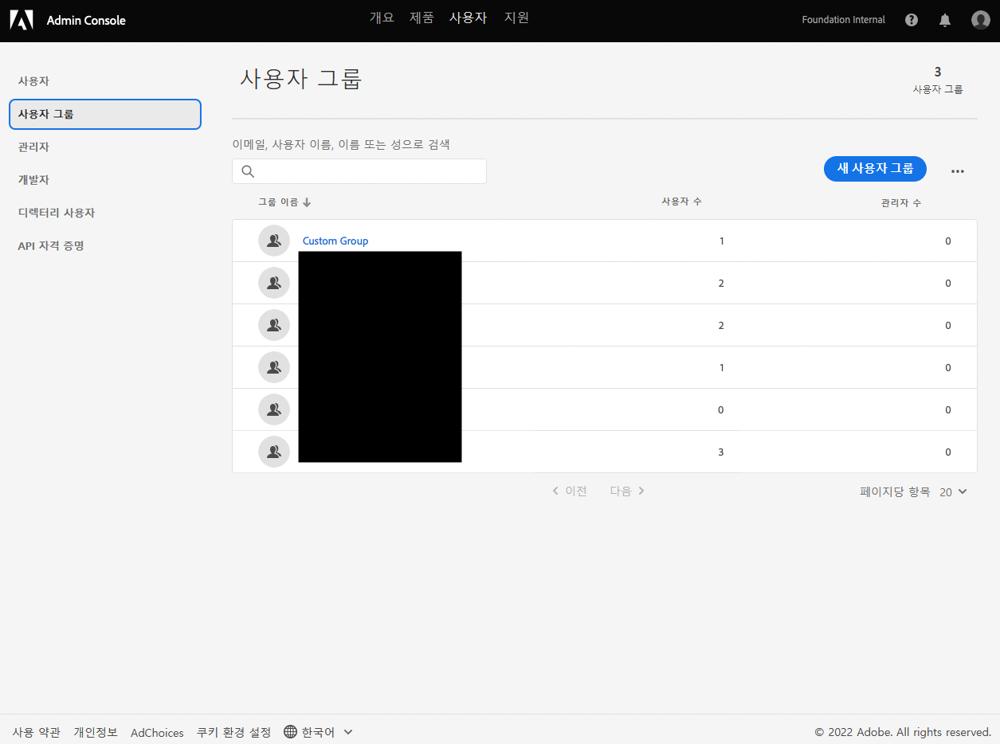
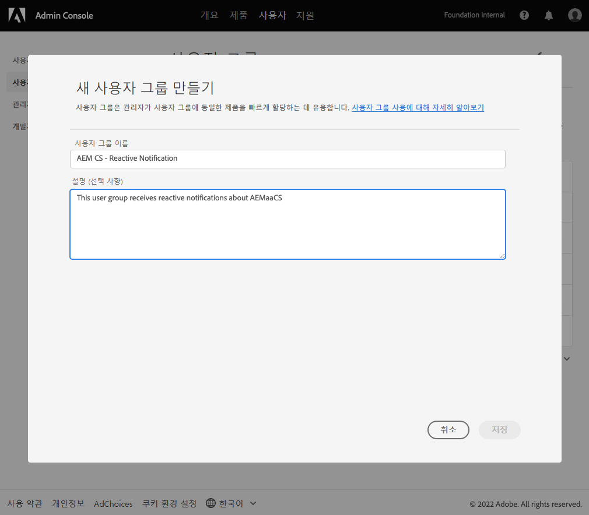
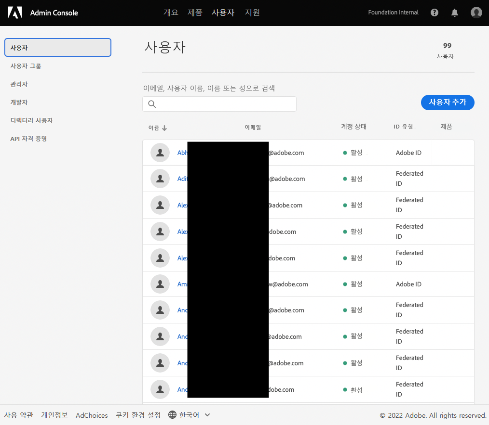
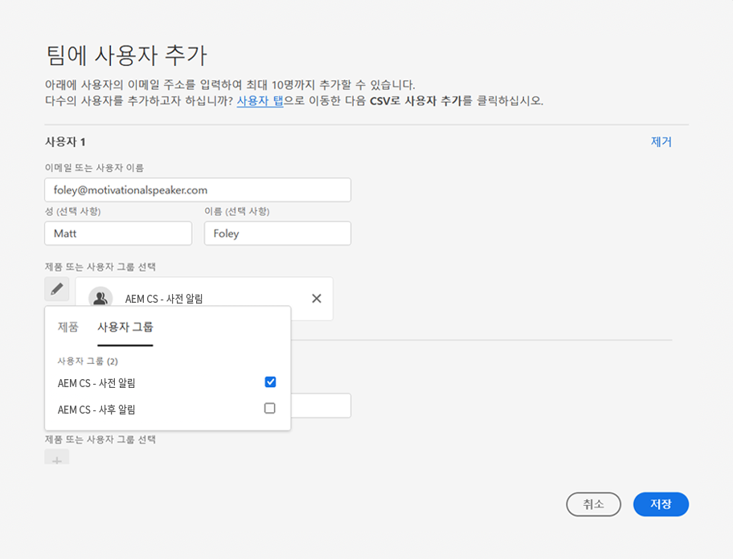
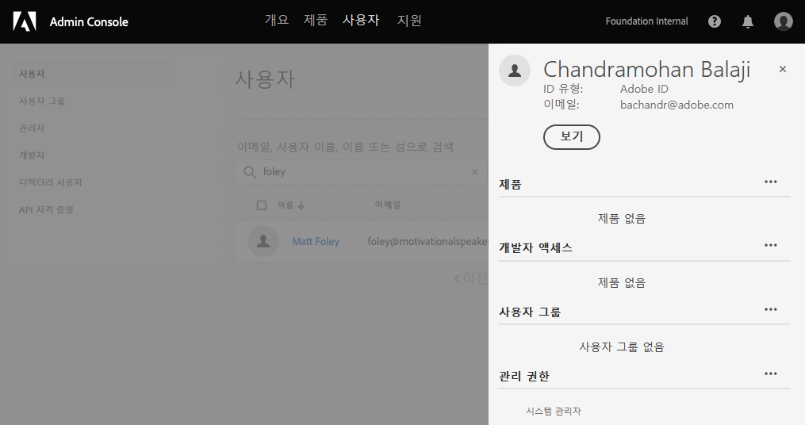

# 알림에 대한 사용자 그룹 {#user-groups}

Admin Console에서 사용자 그룹을 만들어 중요한 이메일 알림 수신 기능을 관리하는 방법을 알아봅니다.

## 개요 {#overview}

때때로 Adobe은 AEM as a Cloud Service 환경에 대해 문의해야 합니다. Adobe은 제품 내 알림 외에도 가끔 이러한 알림에 이메일을 사용합니다. 이러한 알림에는 두 가지 유형이 있습니다.

* **반응형 알림** - 이러한 알림은 사고 중 또는 Adobe이 AEM as a Cloud Service 환경에서 발생할 수 있는 가용성 문제를 확인한 경우 전송됩니다.
* **사전 알림** - 이러한 알림은 Adobe 지원 팀 구성원이 AEM as a Cloud Service 환경에 도움이 될 수 있는 잠재적인 최적화 또는 권장 사항에 대한 지침을 제공하려는 경우 전송됩니다.

올바른 사용자가 이러한 알림을 받으려면 사용자 그룹을 구성해야 합니다.

## 사전 요구 사항 {#prerequisites}

사용자 그룹은 Admin Console에서 생성 및 유지 관리되므로 알림에 대한 사용자 그룹을 생성하기 전에 다음을 수행해야 합니다.

* 그룹 멤버십을 추가 및 편집할 수 있는 권한이 있습니다.
* 유효한 Adobe Admin Console 프로필이 있습니다.

## 알림용 사용자 그룹 만들기 {#create-groups}

알림 수신을 제대로 설정하려면 두 개의 사용자 그룹을 만들어야 합니다. 이러한 단계는 한 번만 수행해야 합니다.

1. Admin Console에 로그인합니다. [`https://adminconsole.adobe.com`.](https://adminconsole.adobe.com)

1. 을(를) 클릭합니다. **사용자** 탭한 다음 **사용자 그룹** 옵션을 선택합니다.

   

1. 을(를) 클릭합니다. **새 사용자 그룹** 버튼을 클릭하고 **사용자 그룹 이름** 지정된 대로 및 선택 사항입니다 **설명**.

   * 그룹 이름은 다음과 일치해야 합니다. 어떤 식으로든 그룹 이름을 조정하거나 수정하지 마십시오.
      * `AEM CS - Reactive Notification`
      * `AEM CS - Proactive Notification`

   

1. **저장**&#x200B;을 클릭합니다.

1. 두 번째 그룹에 대해 단계를 반복합니다.

그룹이 정의되지 않은 경우 Adobe은 Cloud Manager를 사용하는 기존 사용자에게 알립니다 **개발자** 또는 **배포** 프로필 .

## 그룹에 사용자 추가 {#add-users}

그룹이 생성되었으므로 적절한 사용자를 할당해야 합니다. 새 사용자를 만들거나 기존 사용자를 업데이트하여 이 작업을 수행할 수 있습니다.

### 그룹에 새 사용자 추가 {#new-user}

1. Admin Console에 로그인합니다. [`https://adminconsole.adobe.com`](https://adminconsole.adobe.com) 아직 로그인하지 않은 경우

1. 을(를) 클릭합니다. **사용자** 탭한 다음 **사용자** 옵션을 선택합니다.

   

1. 을(를) 클릭합니다. **사용자 추가** 버튼을 클릭하고 사용자의 이메일 주소를 입력합니다. 원할 경우 이름과 성을 제공할 수도 있습니다.

   * 사용자가 이미 존재하는 경우 Admin Console은 이메일 주소와 일치하고 필드를 미리 채웁니다.

1. 사용자 이름 필드 아래의 더하기 기호를 클릭한 다음 **사용자 그룹** 탭에서 사용자의 그룹을 선택합니다.

   

1. 클릭 **저장** 새 사용자를 저장하려면 을 클릭합니다.

통지 그룹을 지정해야 하는 각 사용자에 대해 이러한 단계를 반복합니다.

### 그룹에 기존 사용자 추가 {#existing-user}

1. Admin Console에 로그인합니다. [`https://adminconsole.adobe.com`](https://adminconsole.adobe.com) 아직 로그인하지 않은 경우

1. 을(를) 클릭합니다. **사용자** 탭한 다음 **사용자** 옵션을 선택합니다.

   

1. 알림 그룹에 추가할 사용자 행을 클릭합니다. 사용자 세부 사항을 보여주는 패널이 열립니다.

1. 오른쪽에 있는 줄임표 아이콘을 클릭합니다 **사용자 그룹** 섹션을 참조하십시오.