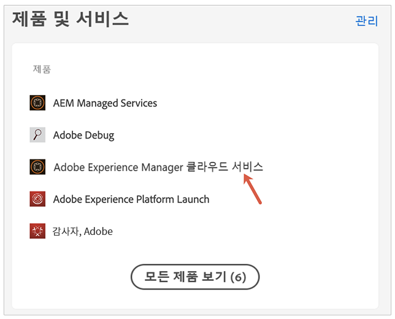
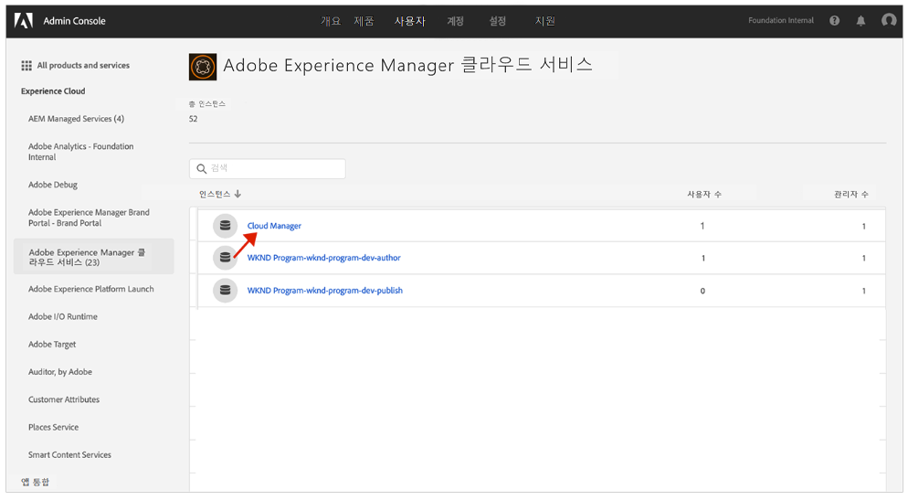
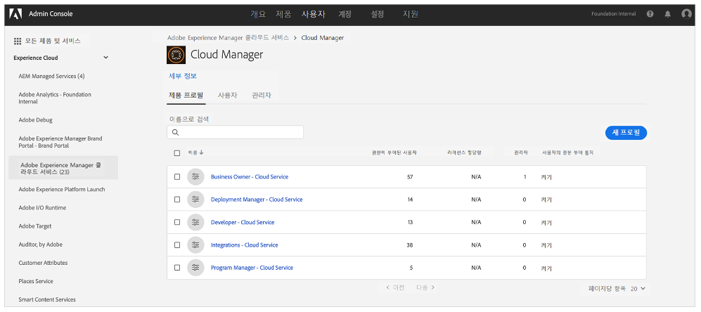
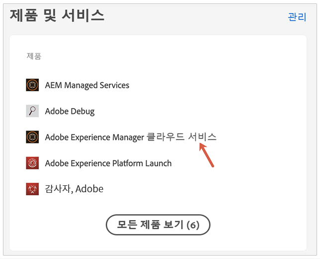
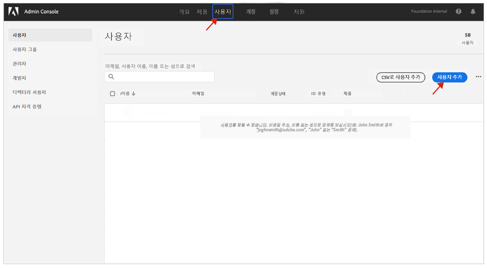

# 알림에 대한 사용자 그룹 {#user-groups}

Admin Console에서 사용자 그룹을 만들어 중요한 이메일 알림 수신 기능을 관리하는 방법을 알아봅니다.

## 개요 {#overview}

수시로 Adobe은 AEM as a Cloud Service 환경에 대해 사용자에게 문의해야 합니다. Adobe은 제품 내 알림 외에도 가끔 알림에 이메일을 사용합니다. 다음과 같은 두 가지 유형의 전자 메일 알림이 있습니다.

* **인시던트 알림** - 이러한 알림은 사고 중 또는 Adobe이 AEM as a Cloud Service 환경에서 발생할 수 있는 가용성 문제를 확인한 경우 전송됩니다.
* **사전 알림** - 이러한 알림은 Adobe 지원 팀 구성원이 AEM as a Cloud Service 환경에 도움이 될 수 있는 잠재적인 최적화 또는 권장 사항에 대한 지침을 제공하려는 경우 전송됩니다.

올바른 사용자가 이러한 알림을 수신하려면 이 문서에 설명된 사용자 그룹을 구성하고 지정해야 합니다.

## 사전 요구 사항 {#prerequisites}

사용자 그룹은 Admin Console에서 생성 및 유지 관리되므로 알림에 대한 사용자 그룹을 생성하기 전에 다음을 수행해야 합니다.

* 그룹 멤버십을 추가 및 편집할 수 있는 권한이 있습니다.
* 유효한 Adobe Admin Console 프로필이 있습니다.

## 새 Cloud Manager 제품 프로필 만들기 {#create-groups}

알림 수신을 제대로 설정하려면 두 개의 사용자 그룹을 만들어야 합니다. 이러한 단계는 한 번만 수행해야 합니다.

1. Admin Console에 로그인합니다. [`https://adminconsole.adobe.com`.](https://adminconsole.adobe.com)

1. 에서 **개요** 페이지를 선택하고 **Adobe Experience Manager as a Cloud Service** 에서 **제품 및 서비스** 카드.

   

1. 로 이동합니다 **Cloud Manager** 모든 인스턴스 목록에서 인스턴스를 생성합니다.

   

1. 구성된 모든 Cloud Manager 제품 프로필 목록이 표시됩니다.

   

1. 클릭 **새 프로필** 다음 세부 사항을 제공합니다.

   * **제품 프로필 이름**: `Incident Notification - Cloud Service`
   * **디스플레이 이름**: `Incident Notification - Cloud Service`
   * **설명**: 인시던트 중에 알림을 받을 사용자 또는 Adobe이 AEM as a Cloud Service 환경에서 잠재적인 가용성 문제를 확인한 사용자의 Cloud Manager 프로필

1. **저장**&#x200B;을 클릭합니다.

1. 클릭 **새 프로필** 를 한 번 더 확인하고 다음 세부 정보를 제공합니다.

   * **제품 프로필 이름**: `Proactive Notification - Cloud Service`
   * **디스플레이 이름**: `Proactive Notification - Cloud Service`
   * **설명**: Adobe 지원 팀 구성원이 AEM as a Cloud Service 환경 구성을 위해 잠재적인 최적화 또는 권장 사항에 대한 지침을 제공하려고 할 때 알림을 받을 사용자를 위한 Cloud Manager 프로필

1. **저장**&#x200B;을 클릭합니다.

두 개의 새 알림 그룹이 만들어집니다.

>[!NOTE]
>
>Cloud Manager가 **제품 프로필 이름** 은 제공된 것과 정확히 같습니다. 오류를 방지하려면 제공된 제품 프로필 이름을 복사하여 붙여 넣으십시오. 임의 편차나 오타가 원하는 대로 알림이 전송되지 않습니다.
>
>오류가 발생하거나 프로필이 정의되지 않은 경우, Adobe은 기본적으로 **Cloud Manager 개발자** 또는 **배포 관리자** 프로필 .

## 새 알림 제품 프로필에 사용자 할당 {#add-users}

그룹이 생성되었으므로 적절한 사용자를 할당해야 합니다. 새 사용자를 만들거나 기존 사용자를 업데이트하여 이 작업을 수행할 수 있습니다.

### 그룹에 새 사용자 추가 {#new-user}

다음 단계에 따라 페더레이션 ID가 아직 설정되지 않은 사용자를 추가합니다.

1. 인시던트 또는 사전 알림을 받아야 하는 사용자를 식별합니다.

1. Admin Console에 로그인합니다. [`https://adminconsole.adobe.com`](https://adminconsole.adobe.com) 아직 로그인하지 않은 경우

1. 에서 **개요** 페이지를 선택하고 **Adobe Experience Manager as a Cloud Service** 에서 **제품 및 서비스** 카드.

   

1. 팀 구성원의 페더레이션 ID를 아직 설정하지 않은 경우 **사용자** 위쪽 탐색에서 tab 키를 누른 다음 을 선택합니다 **사용자 추가**. 그렇지 않으면 섹션으로 건너뜁니다 [그룹에 기존 사용자 추가.](#existing-users)

   

1. 에서 **팀에 사용자 추가** 대화 상자에서 추가할 사용자의 이메일 ID를 입력하고 선택합니다 `Adobe ID` 대상 **ID 유형**.

1. 아래의 더하기 단추를 클릭합니다. **제품 선택** 제품 선택을 시작하는 제목.

1. 선택 **Adobe Experience Manager as a Cloud Service** 새 그룹 중 하나 또는 둘 다 사용자에게 할당합니다.

   * **인시던트 알림 - Cloud Service**
   * **사전 알림 - Cloud Service**

1. 클릭 **저장** 추가한 사용자에게 환영 이메일이 전송됩니다.

이제 초대된 사용자가 알림을 받게 됩니다. 팀의 사용자에게 알림을 받을 수 있도록 이 단계를 반복합니다.

### 그룹에 기존 사용자 추가 {#existing-user}

페더레이션 ID가 이미 있는 사용자를 추가하려면 다음 단계를 따르십시오.

1. 인시던트 또는 사전 알림을 받아야 하는 사용자를 식별합니다.

1. Admin Console에 로그인합니다. [`https://adminconsole.adobe.com`](https://adminconsole.adobe.com) 아직 로그인하지 않은 경우

1. 에서 **개요** 페이지를 선택하고 **Adobe Experience Manager as a Cloud Service** 에서 **제품 및 서비스** 카드.

1. 을(를) 선택합니다 **사용자** 위쪽 탐색에서 Tab 키를 누릅니다.

1. 알림 그룹에 추가하려는 팀 구성원에 대해 이미 페더레이션 ID가 존재하는 경우 목록에서 해당 사용자를 찾아 클릭합니다. 그렇지 않으면 섹션으로 건너뜁니다 [그룹에 새 사용자 추가.](#add-user)

1. 에서 **제품** 사용자 세부 사항 창의 섹션에서 줄임표 단추를 클릭한 다음 을 선택합니다 **편집**.

1. 에서 **제품 편집** 창의 아래에 있는 연필 단추를 클릭합니다 **제품 선택** 제품 선택을 시작하는 제목.

1. 선택 **Adobe Experience Manager as a Cloud Service** 새 그룹 중 하나 또는 둘 다 사용자에게 할당합니다.

   * **인시던트 알림 - Cloud Service**
   * **사전 알림 - Cloud Service**

1. 클릭 **저장** 추가한 사용자에게 환영 이메일이 전송됩니다.

이제 초대된 사용자가 알림을 받게 됩니다. 팀의 사용자에게 알림을 받을 수 있도록 이 단계를 반복합니다.
