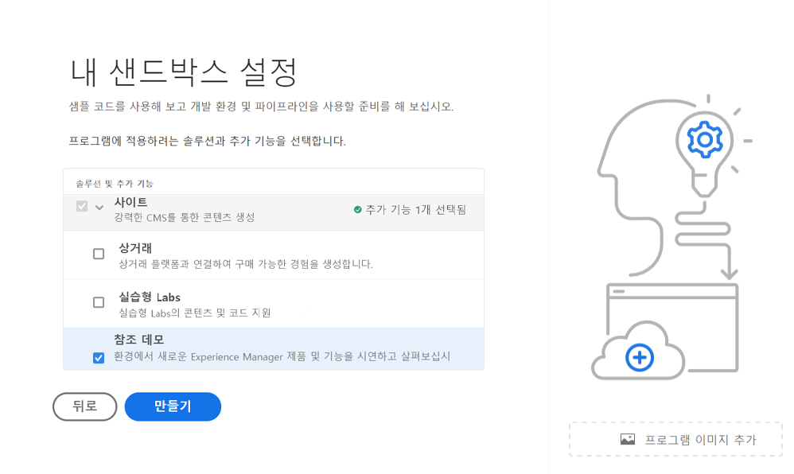
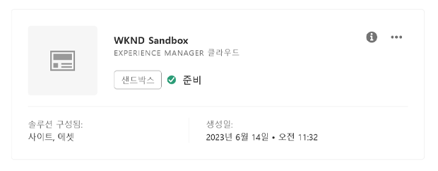
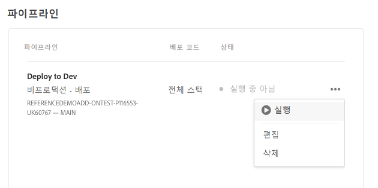
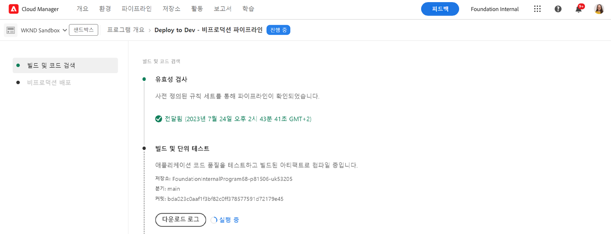

# 프로그램 제작 {#creating-a-program}

새 프로그램 및 파이프라인을 설정하여 추가 기능을 배포하는 방법에 대해 알아봅니다.

## 지금까지의 스토리 {#story-so-far}

AEM 참조 데모 추가 기능 여정의 이전 문서인 [참조 데모 추가 기능 설치 이해](installation.md)에서는 서로 다른 부분이 함께 작동하며 참조 데모 추가 기능의 설치 프로세스를 이루는 방법에 대해 알아보았습니다. 이제

* Cloud Manager의 기본 사항에 대해 이해할 수 있습니다.
* 파이프라인이 AEM에 콘텐츠와 구성을 전달하는 방법을 이해할 수 있습니다.
* 몇 번의 클릭만으로 템플릿을 통해 데모 콘텐츠로 미리 채워진 새 사이트를 제작하는 방법을 파악할 수 있습니다.

이 문서는 이러한 기본 사항을 기반으로 하며, 이를 통해 테스트용 프로그램을 제작하기 위한 첫 번째 구성 단계를 수행하고 파이프라인을 사용하여 추가 기능 콘텐츠를 배포할 수 있습니다.

## 목표 {#objective}

이 문서는 새 프로그램 및 파이프라인을 설정하여 추가 기능을 배포하는 방법을 이해하는 데 도움이 됩니다. 문서를 읽고 나면

* Cloud Manager를 사용하여 새 프로그램을 제작하는 방법을 이해할 수 있습니다.
* 새 프로그램에 대한 참조 데모 추가 기능을 활성화하는 방법을 이해할 수 있습니다.
* 파이프라인을 실행하여 추가 기능 콘텐츠를 배포할 수 있습니다.

## 프로그램 제작 {#create-program}

Cloud Manager에 로그인한 후 테스트 및 데모용으로 새 샌드박스 프로그램을 제작할 수 있습니다.

>[!NOTE]
>
>프로그램을 제작하려면 사용자는 귀사의 Cloud Manager에서 **사업주** 역할의 멤버여야 합니다.

1. [my.cloudmanager.adobe.com](https://my.cloudmanager.adobe.com/)에서 Adobe Cloud Manager에 로그인합니다.

1. 로그인하고 나면 먼저 화면 오른쪽 상단에서 올바른 조직에 속해 있는지 확인하십시오. 멤버인 조직이 하나인 경우 이 단계는 필요하지 않습니다.

   

1. 창 오른쪽 상단에서 **프로그램 추가**&#x200B;를 탭하거나 클릭합니다.

1. 다음에서 **프로그램을 만들어 보겠습니다.** 대화 상자:

   1. **프로그램 이름**&#x200B;을 입력하여 내 프로그램을 설명합니다.
   1. **샌드박스 설정**&#x200B;을 클릭하여 **프로그램 목표**&#x200B;를 설정합니다.
   1. **계속**&#x200B;을 탭하거나 클릭합니다.

   

1. 다음에서 **샌드박스 설정** 대화 상자 **솔루션 및 추가 기능** 테이블을 열고 **사이트** 탭하거나 클릭하여 목록에 입력한 다음 확인 **참조 데모**.

   * AEM Screens에 대한 데모도 제작하려면 목록에서 **Screens** 옵션도 선택하십시오. **업데이트**&#x200B;를 탭하거나 클릭합니다.

   

1. 탭 또는 클릭 **만들기** 그리고 Cloud Manager는 샌드박스 프로그램 설정을 시작합니다. 프로그램 개요 화면으로 이동되고 프로세스가 시작되었음을 나타내는 간단한 배너 알림이 표시됩니다. 새 프로그램의 개요 페이지에 카드가 추가되었습니다. 설정 프로세스가 완료되는 데 몇 분 정도 소요됩니다.

1. 설정이 완료되면 개요 페이지의 환경에 대한 카드에 상태가 로 표시됩니다. **준비**. 카드를 탭하거나 클릭하여 환경을 엽니다.

   

1. 환경이 준비되었으며 이제 추가 기능을 옵션으로 사용할 수 있지만, 데모 콘텐츠를 AEM에 배포해야 사용할 수 있습니다. 이렇게 하려면 의 개발 파이프라인으로 배포 옆에 있는 줄임표 버튼을 탭하거나 클릭합니다. **파이프라인** 카드 및 선택 **실행**.

   

1. 파이프라인이 배포를 시작하며 배포 진행 상황의 세보 정부가 표시되는 페이지로 이동하게 됩니다. 프로그램 제작 도중 이 화면을 빠져나온 다음 필요한 경우 나중에 다시 돌아올 수 있습니다.

   

파이프라인이 완료되는 데 몇 분이 걸릴 수 있습니다. 완료되면 추가 기능과 해당 데모 콘텐츠를 AEM 작성 환경에서 사용할 수 있습니다.

## 다음 단계 {#what-is-next}

AEM 참조 데모 추가 기능 여정의 한 부분을 완료했으므로,

* Cloud Manager를 사용하여 새 프로그램을 제작하는 방법을 이해할 수 있습니다.
* 새 프로그램에 대한 참조 데모 추가 기능을 활성화하는 방법을 이해할 수 있습니다.
* 파이프라인을 실행하여 추가 기능 콘텐츠를 배포할 수 있습니다.

이 지식을 기반으로 다음 문서 [데모 사이트 만들기](create-site.md)를 검토하여 AEM 참조 데모 추가 기능 여정을 계속하십시오. 여기에서는 파이프라인에 의해 배포된 사전 구성 템플릿 라이브러리를 기반으로 AEM에서 데모 사이트를 제작하는 방법에 대해 알아보게 됩니다.

## 추가 리소스 {#additional-resources}

* [Cloud Manager 설명서](https://experienceleague.adobe.com/docs/experience-manager-cloud-service/onboarding/onboarding-concepts/cloud-manager-introduction.html) - Cloud Manager의 기능에 대해 자세히 알아보려면 바로 심화 기술 문서를 참조할 수 있습니다.
