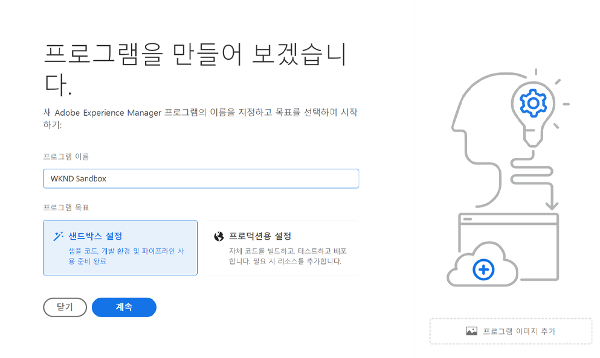
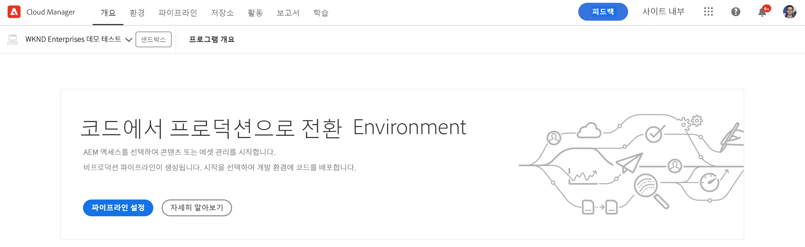

# 프로그램 만들기 {#creating-a-program}

추가 기능을 배포하기 위해 새 프로그램 및 파이프라인을 설정하는 방법을 알아봅니다.

## 지금까지 그 이야기 {#story-so-far}

AEM 빠른 사이트 만들기 여정의 이전 문서에서, [참조 데모 추가 기능 설치 이해,](installation.md) 레퍼런스 데모 추가 기능 작동 과정을 통해 다양한 조각을 함께 작동하는 방식을 알 수 있습니다. 이제 다음을 수행해야 합니다.

* Cloud Manager에 대한 기본 이해를 얻으십시오.
* 파이프라인이 컨텐츠 및 구성을 AEM에 전달하는 방법을 이해합니다.
* 몇 번의 클릭만으로 데모 컨텐츠가 미리 채워진 새 사이트를 템플릿을 통해 만들 수 있는 방법을 살펴볼 수 있습니다.

이 문서는 이러한 기본 사항을 기반으로 하며 첫 번째 구성 단계를 수행하여 테스트 목적으로 프로그램을 만들고 파이프라인을 사용하여 추가 기능 컨텐츠를 배포합니다.

## 목표 {#objective}

이 문서는 추가 기능을 배포할 새 프로그램 및 파이프라인을 설정하는 방법을 이해하는 데 도움이 됩니다. 읽은 후에는 다음을 수행해야 합니다.

* Cloud Manager를 사용하여 새 프로그램을 만드는 방법을 이해합니다.
* 새 프로그램에 대한 참조 데모 추가 기능을 활성화하는 방법을 알아봅니다.
* 파이프라인을 실행하여 추가 기능 컨텐츠를 배포할 수 있습니다.

## 프로그램 만들기 {#create-program}

Cloud Manager에 로그인한 후 테스트 및 데모 목적으로 새 샌드박스 프로그램을 만들 수 있습니다.

>[!NOTE]
>
>사용자는 **비즈니스 소유자** 프로그램을 만들기 위해 조직의 Cloud Manager에서 역할.

1. Cloud Manager에 로그인 위치: [my.cloudmanager.adobe.com](https://my.cloudmanager.adobe.com/).

1. 로그인한 후 화면의 오른쪽 상단 모서리에서 해당 조직을 확인하여 올바른 조직에 있는지 확인하십시오. 한 조직의 구성원만 있는 경우 이 단계는 필요하지 않습니다.

   

1. 탭 또는 클릭 **프로그램 추가** 창 오른쪽 위에 있습니다.

1. 에서 **프로그램을 만들겠습니다** 대화 상자 **Adobe Experience Manager** 다음 위치에서 선택됨 **제품** 그런 다음 탭하거나 클릭합니다. **계속**.

   

1. 다음 대화 상자에서 다음을 수행합니다.

   * 다음을 제공합니다. **프로그램 이름** 프로그램을 설명하는 데 사용합니다.
   * 탭 또는 클릭 **샌드박스 설정** 에 대해 **프로그램 목표**

   그런 다음 를 탭하거나 클릭합니다 **만들기**.

   

1. 프로그램 생성 프로세스를 관찰할 수 있는 프로그램 개요 화면으로 이동합니다. Cloud Manager는 남은 시간을 예상합니다. 프로그램이 만들어지면 이 화면에서 탐색하고 필요한 경우 나중에 반환할 수 있습니다.

   

1. 완료되면 Cloud Manager는 자동으로 생성된 환경 및 파이프라인을 비롯한 개요를 제공합니다.

   

1. 페이지 왼쪽 상단에 있는 프로그램 이름을 클릭하고 드롭다운에서 을 선택하여 프로그램 세부 사항을 편집합니다 **프로그램 편집**.

   

1. 에서 **프로그램 편집** 대화 상자에서 **솔루션 및 추가 기능** 탭.

   

1. 설정 **솔루션 및 추가 기능** 탭에서 을 확장합니다. **Sites** 목록의 항목을 입력하고 다음을 확인합니다 **참조 데모**. 탭 또는 클릭 **업데이트**.

   

1. 이제 추가 기능이 옵션으로 활성화되었지만 해당 컨텐츠를 AEM에 배포하여 사용할 수 있어야 합니다. 프로그램 개요 페이지로 돌아가서 를 탭하거나 클릭합니다 **시작** 파이프라인을 시작하여 추가 기능 컨텐츠를 AEM에 배포합니다.

   

1. 파이프라인이 시작되면 배포 진행 상황을 설명하는 페이지로 이동합니다. 프로그램이 만들어지면 이 화면에서 탐색하고 필요한 경우 나중에 반환할 수 있습니다.

   

파이프라인이 완료되면 추가 기능 및 데모 컨텐츠를 AEM 작성 환경에서 사용할 수 있습니다.

## 다음은 무엇입니까? {#what-is-next}

AEM 참조 데모 추가 기능 여정의 이 부분을 완료했으므로 다음을 수행해야 합니다.

* Cloud Manager를 사용하여 새 프로그램을 만드는 방법을 이해합니다.
* 새 프로그램에 대한 참조 데모 추가 기능을 활성화하는 방법을 알아봅니다.
* 파이프라인을 실행하여 추가 기능 컨텐츠를 배포할 수 있습니다.

이 지식을 바탕으로 빌드하고 다음 문서를 검토하여 AEM 참조 데모 추가 기능 여정을 계속 진행합니다 [데모 사이트 만들기,](create-site.md) 여기서 파이프라인에 의해 배포된 사전 구성된 템플릿 라이브러리를 기반으로 AEM에서 데모 사이트를 만드는 방법을 배웁니다.

## 추가 리소스 {#additional-resources}

* [Cloud Manager 설명서](https://experienceleague.adobe.com/docs/experience-manager-cloud-service/onboarding/onboarding-concepts/cloud-manager-introduction.html) - Cloud Manager의 기능에 대한 자세한 내용은 세부 기술 문서를 직접 참조하십시오.
