# 데모 사이트 만들기 {#creating-a-site}

사전 구성된 템플릿 라이브러리를 기반으로 AEM에서 데모 사이트를 제작합니다.

## 지금까지의 스토리 {#story-so-far}

AEM 참조 데모 추가 기능 여정의 이전 문서인 [프로그램 만들기](create-program.md)에서 테스트 목적으로 프로그램을 만드는 첫 번째 구성 단계를 수행하고 파이프라인을 사용하여 추가 기능 콘텐츠를 배포할 수 있습니다. 이제

* Cloud Manager를 사용하여 프로그램을 제작하는 방법을 이해할 수 있습니다.
* 새 프로그램에 대한 참조 데모 추가 기능을 활성화하는 방법을 이해할 수 있습니다.
* 파이프라인을 실행하여 추가 기능 콘텐츠를 배포할 수 있습니다.

이 문서에서는 참조 데모 추가 기능의 템플릿을 기반으로 AEM에서 사이트 또는 AEM Screens 프로젝트를 만드는 프로세스의 다음 단계에 대해 설명합니다.

## 목표 {#objective}

이 문서는 참조 데모 추가 기능의 템플릿을 기반으로 사이트를 만드는 방법을 이해하는 데 유용한 정보를 제공합니다. 문서를 읽고 나면

* AEM 작성 환경 액세스 방법을 이해할 수 있습니다.
* 템플릿을 기반으로 사이트를 만드는 방법을 이해할 수 있습니다.
* 사이트 구조 탐색 및 페이지 편집에 대한 기본 사항을 이해할 수 있습니다.

## 데모 사이트 또는 Screens 프로젝트 생성 {#create-site}

파이프라인에서 참조 데모 추가 기능을 배포하고 나면 AEM 작성 환경에 액세스하여 추가 기능 콘텐츠를 기반으로 데모 사이트를 만들 수 있습니다.

1. Cloud Manager의 프로그램 개요 페이지에서 AEM 작성 환경에 대한 링크를 선택합니다.

   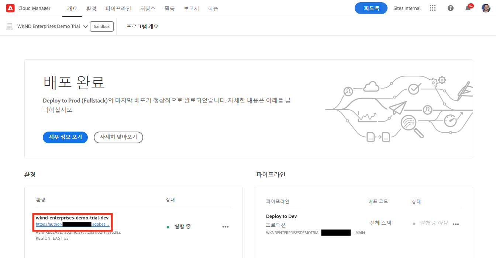

1. AEM의 기본 메뉴에서 **사이트**&#x200B;를 선택합니다.

   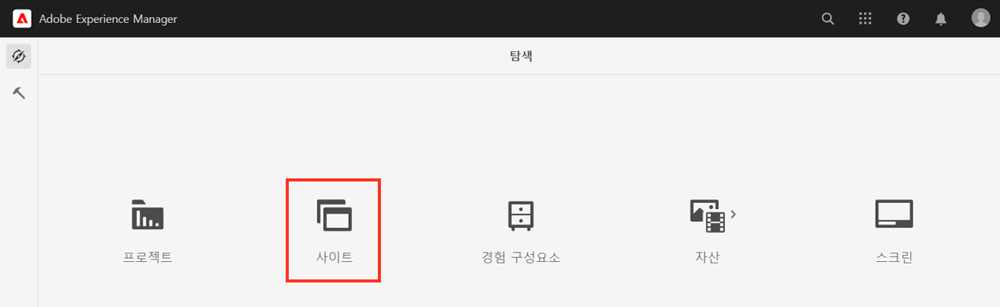

1. Sites 콘솔에서 **만들기**&#x200B;를 선택한 다음 드롭다운에서 **템플릿으로 사이트 생성**&#x200B;을 선택합니다.

   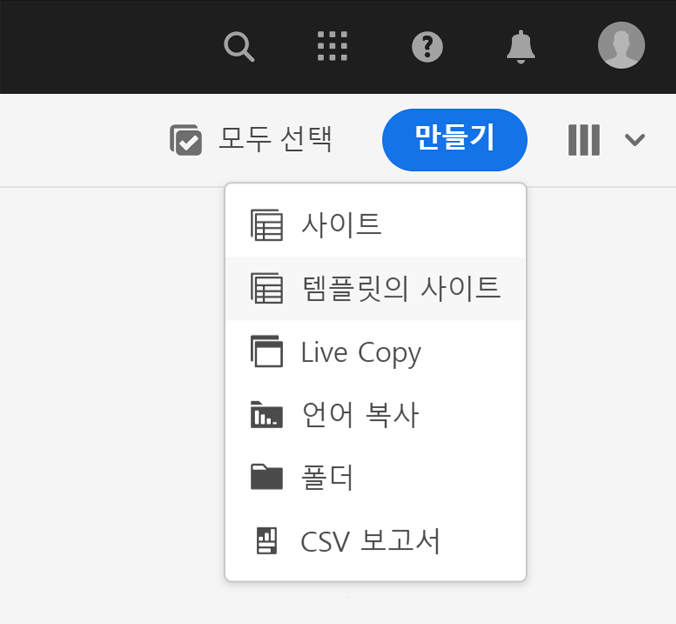

1. 사이트 생성 마법사가 실행됩니다. 왼쪽 열에서 파이프라인에서 작성 인스턴스에 배포한 데모 템플릿을 볼 수 있습니다. 이를 선택하여 선택하고 오른쪽 열에 세부 정보를 표시합니다. AEM Screens를 테스트하거나 데모하려면 **We.Cafe 사이트 템플릿**&#x200B;을 선택하십시오. **다음**&#x200B;을 선택합니다.

   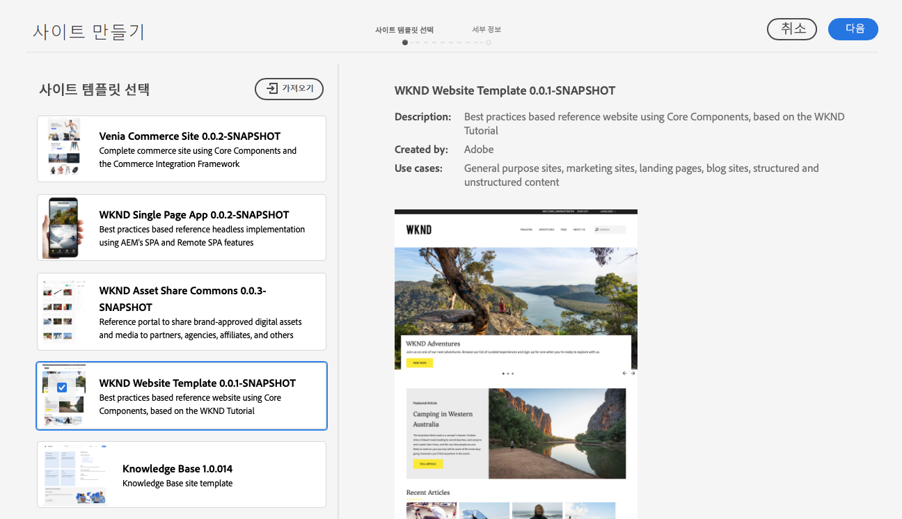

1. 다음 화면에서 사이트 또는 Screens 프로젝트의 제목을 입력하십시오. 사이트 이름을 입력하거나 생략할 수 있으며, 생략할 경우 자동으로 제목에서 생성됩니다. **만들기**&#x200B;를 선택합니다.

   * 브라우저의 제목 표시줄에 사이트 제목이 표시됩니다.
   * 사이트 이름은 URL의 일부가 됩니다.
   * 사이트 이름은 AEM의 페이지 이름 지정 규칙을 준수해야 하며 자세한 내용은 [추가 리소스](#additional-resources) 섹션에서 확인할 수 있습니다.

   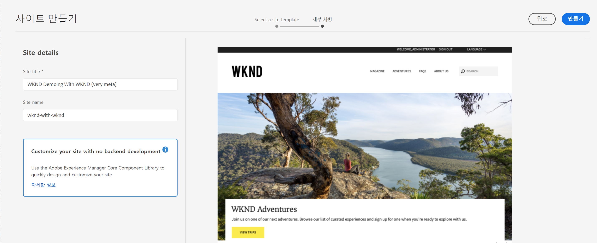

1. 대화 상자에서 사이트 생성을 확인합니다. **완료**&#x200B;를 선택합니다.

   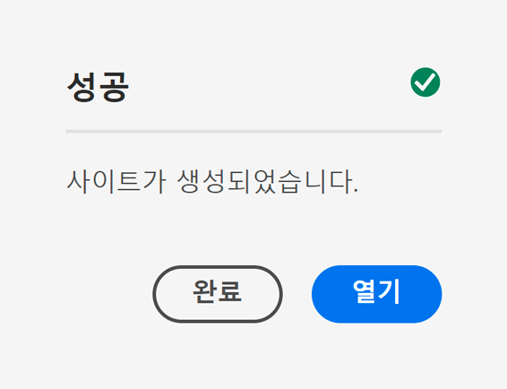

이제 나만의 데모 사이트가 생성됩니다!

## 데모 사이트 사용 {#use-site}

이제 데모 사이트가 생성되었으므로 AEM의 다른 사이트와 마찬가지로 탐색하고 사용할 수 있습니다.

1. 이제 사이트가 Sites 콘솔에 표시됩니다.

   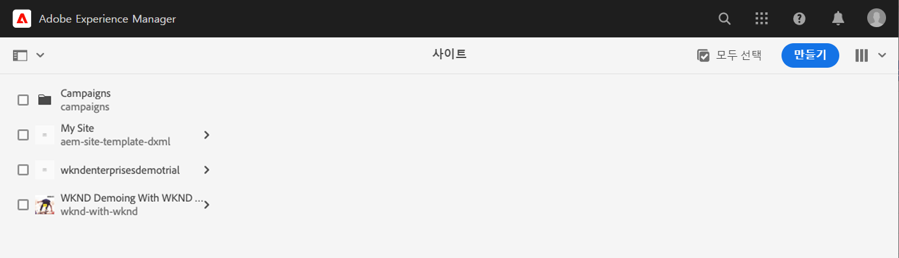

1. 화면 오른쪽 상단에서 콘솔 보기가 **열 보기**&#x200B;로 설정되어 있는지 확인합니다.

   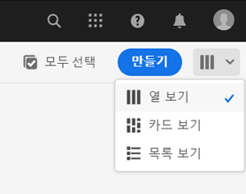

1. 사이트를 선택하여 구조와 콘텐츠를 살펴보십시오. 데모 사이트의 콘텐츠 트리를 탐색함에 따라 열 보기가 계속 확장됩니다.

   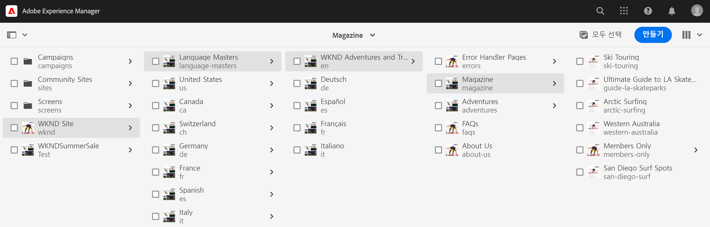

1. 페이지를 선택하여 선택한 다음 도구 모음에서 **편집**&#x200B;을 선택합니다.

   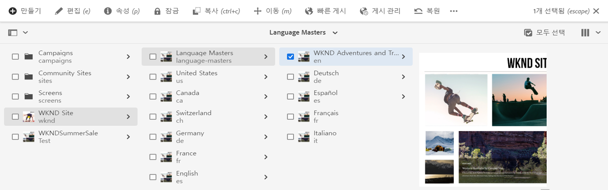

1. 구성 요소나 자산 추가 또는 편집과 같은 다른 AEM 콘텐츠 페이지와 마찬가지로 페이지를 편집하고 AEM의 기능을 테스트할 수 있습니다.

   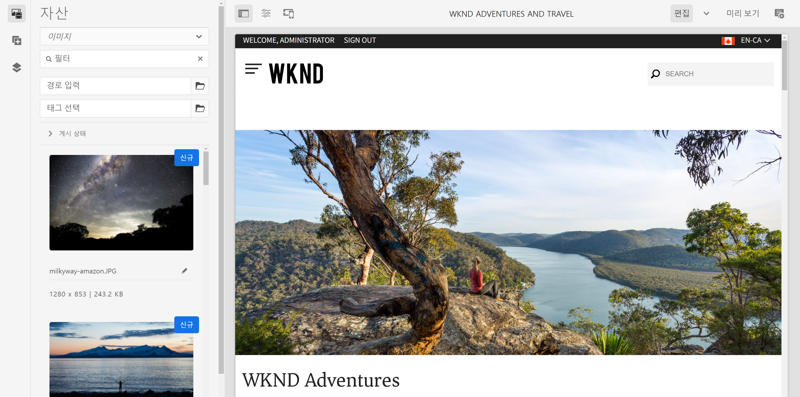

축하합니다! 이제 데모 사이트의 콘텐츠를 자세히 살펴보고 참조 데모 추가 기능의 모범 사례 콘텐츠를 통해 AEM이 제공하는 모든 기능을 확인할 수 있습니다.

더 많은 AEM 기능을 탐색하려면 다른 템플릿을 기반으로 추가 사이트를 만드십시오.

## 다음 단계 {#what-is-next}

AEM 참조 데모 추가 기능 여정의 한 부분을 완료했으므로,

* AEM 작성 환경 액세스 방법을 이해할 수 있습니다.
* 템플릿을 기반으로 사이트를 만드는 방법을 이해할 수 있습니다.
* 사이트 구조 탐색 및 페이지 편집에 대한 기본 사항을 이해할 수 있습니다.

이제 추가 콘텐츠를 사용하여 AEM의 기능을 테스트할 수 있습니다. 다음 두 가지 방법으로 여정을 계속할 수 있습니다.

* AEM Screens 콘텐츠를 정상적으로 데모하고 테스트하려면 이전에 설명한 대로 **We.Cafe 사이트 템플릿**&#x200B;을 기반으로 사이트를 배포했는지 확인하고 [데모 사이트에 대해 AEM Screens 활성화](screens.md)를 계속하십시오.
* 데모 사이트 콘텐츠만 사용하려는 경우 [데모 사이트 관리](manage.md)를 계속 진행하십시오. 여기에서는 데모 사이트 관리에 도움이 되는 도구 및 이를 제거하는 방법에 대해 알아봅니다.

## 추가 리소스 {#additional-resources}

* [Cloud Manager 설명서](https://experienceleague.adobe.com/docs/experience-manager-cloud-service/onboarding/onboarding-concepts/cloud-manager-introduction.html) - Cloud Manager의 기능에 대해 자세히 알아보려면 바로 심화 기술 문서를 참조할 수 있습니다.
* [사이트 생성](/help/sites-cloud/administering/site-creation/create-site.md) - AEM을 통해 사이트 템플릿을 사용하여 사이트를 만들고 이러한 사이트의 스타일 및 구조를 정의하는 방법에 대해 알아봅니다.
* [AEM의 페이지 이름 지정 규칙입니다](/help/sites-cloud/authoring/sites-console/organizing-pages.md#page-name-restrictions-and-best-practices). - 이 AEM 페이지 구성 규칙에 대해 이해하려면 이 페이지를 참조하십시오.
* [AEM 기본 처리](/help/sites-cloud/authoring/basic-handling.md) - AEM을 처음 접하여 탐색 및 콘솔 구성과 같은 기본 개념에 대해 이해하고자 하는 경우 이 문서를 살펴보십시오.
