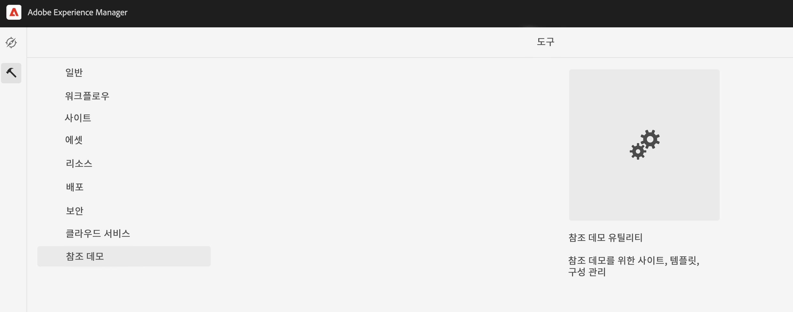
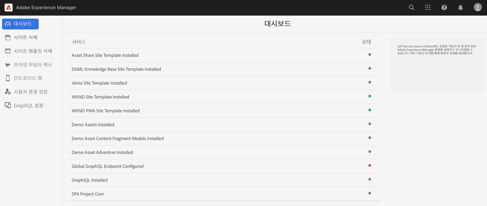
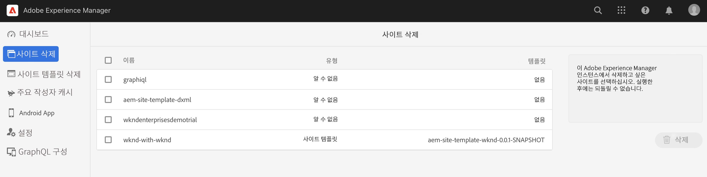
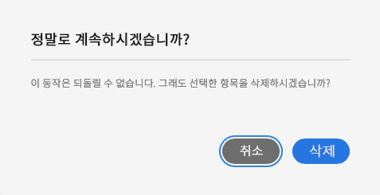
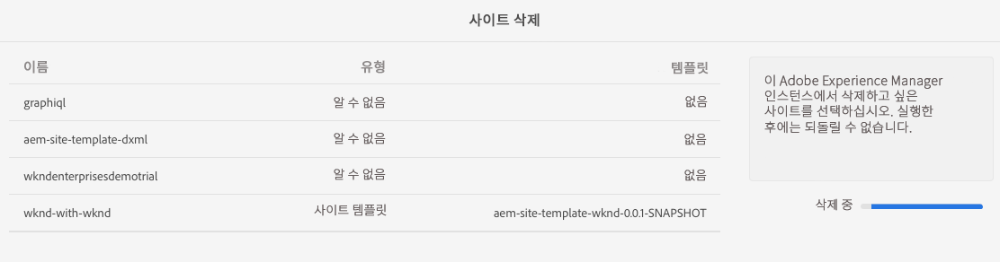

# 데모 사이트 관리 {#manage-demo-sites}

내 데모 사이트를 관리하는 데 도움이 되는 도구 및 이를 제거하는 방법에 대해 알아봅니다.

## 지금까지의 스토리 {#story-so-far}

AEM 참조 데모 추가 기능 여정의 이전 문서인 [사이트 생성](create-site.md)에서는 참조 데모 추가 기능의 템플릿을 기반으로 새 데모 사이트를 제작해 보았습니다. 이제

* AEM 작성 환경 액세스 방법을 이해할 수 있습니다.
* 템플릿을 기반으로 사이트를 만드는 방법을 이해할 수 있습니다.
* 사이트 구조 탐색 및 페이지 편집에 대한 기본 사항을 이해할 수 있습니다.

또한 [데모 사이트에 대해 AEM Screens를 활성화했다면](screens.md)

* AEM Screens 기본 사항을 이해할 수 있습니다.
* We.Cafe 데모 콘텐츠를 이해할 수 있습니다.
* We.Cafe에 대해 AEM Screens를 구성하는 방법을 파악할 수 있습니다.

이제 탐색할 나만의 데모 사이트가 있으므로, 이 문서에서는 내 데모 사이트를 관리하는 데 도움이 되는 도구 및 이를 제거하는 방법을 설명합니다.

## 목표 {#objective}

이 문서는 제작한 데모 사이트를 관리하는 방법을 이해하는 데 도움이 됩니다. 문서를 읽고 나면

* 셀프서비스 데모 유틸리티에 액세스하는 방법을 이해할 수 있습니다.
* 사용할 수 있는 유틸리티에 대해 알 수 있습니다.
* 기존 데모 사이트 또는 템플릿을 삭제하는 방법을 알 수 있습니다.

## 셀프서비스 데모 유틸리티 액세스 {#accessing-utilities}

이제 나만의 데모 사이트가 있으므로 이를 관리하는 방법에 대해 알아볼 수 있습니다. 파이프라인을 통해 데모 사이트에 콘텐츠를 제공하는 사이트 템플릿뿐만 아니라 이러한 사이트를 관리하는 유틸리티 세트도 배포되었습니다.

1. AEM 전역 탐색 바에서 **도구** -> **참조 데모** -> **참조 데모 유틸리티**&#x200B;를 선택합니다.

   

1. 참조 데모 유틸리티는 Adobe Experience Manager 환경을 설정하고 모니터링하는 데 도움이 되는 유용한 기능의 컬렉션입니다. 초기 보기는 **대시보드**&#x200B;이며, 이는 환경 및 해당 데모 기능의 상태를 확인하는 역할을 합니다.

   

셀프서비스 데모 유틸리티는 다양한 도구를 제공합니다.

* **사이트 삭제** - 이 Adobe Experience Manager 인스턴스에서 삭제하고자 하는 사이트를 선택합니다. 이는 파괴적인 작업으로서 한 번 시작되면 실행을 취소할 수 없습니다.
* **사이트 템플릿 삭제** - 이 Adobe Experience Manager 인스턴스에서 삭제하고자 하는 사이트 템플릿을 선택합니다. 사이트 템플릿을 삭제하기 전에 해당 템플릿을 참조하는 사이트도 모두 삭제하십시오. 이는 파괴적인 작업으로서 한 번 시작되면 실행을 취소할 수 없습니다.
* **프라임 작성자 캐시** - 이 옵션은 Adobe Experience Manager 인스턴스 내에서 여러 리소스를 가져와 가져오기 시간을 단축할 수 있습니다. 몇 초 정도 소요될 수 있습니다.
* **Android 앱** - 데모 Android 앱 설치 및 실행을 위한 도구입니다. **WKND 단일 페이지 앱**&#x200B;을 기반으로 하는 사이트를 제작하여 이 페이지를 채우십시오. Android 디바이스, 에뮬레이터 또는 Bluestacks에서 시작하십시오.
* **사용자 환경 설정** - 튜토리얼 팝업 대화 상자를 끕니다.
* **GraphQL 설정** - 빠르게 전역 GraphQL 엔드포인트를 설정합니다.

## 데모 사이트 및 템플릿 삭제 {#deleting}

AEM 기능 세트를 테스트한 다음에는 데모 사이트 또는 이를 기반으로 하는 템플릿이 더 이상 필요하지 않을 수 있습니다. 데모 사이트 및 사이트 템플릿을 삭제하는 방법은 간단합니다.

1. **참조 데모 유틸리티**&#x200B;에 액세스한 다음 **사이트 삭제**&#x200B;를 탭하거나 클릭합니다.

   

1. 사용할 수 있는 사이트가 목록에 표시됩니다. 삭제하고자 하는 사이트를 선택한 다음 **삭제**&#x200B;를 탭하거나 클릭합니다.

   >[!CAUTION]
   >
   >사이트 및 템플릿 삭제는 파괴적인 작업으로서 한 번 시작되면 실행을 취소할 수 없습니다.

1. 대화 상자에서 사이트 삭제를 확인합니다.

   

1. 선택한 사이트가 AEM에서 삭제되며 이전에 **삭제** 버튼이 있던 위치에 진행률이 표시됩니다.

   

이제 사이트가 삭제되었습니다.

**참조 데모 유틸리티**&#x200B;의 **사이트 템플릿 삭제**&#x200B;라는 제목에서 동일한 방식으로 템플릿을 삭제할 수 있습니다.

>[!CAUTION]
>
>사이트 템플릿을 삭제하기 전에 해당 템플릿을 참조하는 사이트도 모두 삭제하십시오.

## 여정의 끝 {#end-of-journey}

축하합니다! AEM 참조 데모 추가 기능 여정을 완료했습니다! 이제

* Cloud Manager의 기본 사항에 대해 이해하고 파이프라인이 AEM에 콘텐츠와 구성을 전달하는 방법을 이해할 수 있습니다.
* Cloud Manager를 사용하여 프로그램을 제작하는 방법을 이해할 수 있습니다.
* 새 프로그램에 대해 참조 데모 추가 기능을 활성화하고 파이프라인을 실행하여 추가 기능 콘텐츠를 배포하는 방법을 이해할 수 있습니다.
* AEM 작성 환경에 액세스하여 템플릿을 기반으로 사이트를 생성하는 방법을 이해할 수 있습니다.
* 셀프서비스 데모 유틸리티에 액세스하는 방법을 이해할 수 있습니다.
* 기존 데모 사이트 또는 템플릿을 삭제하는 방법을 이해할 수 있습니다.

이제 나만의 데모 사이트를 사용하여 AEM의 기능을 살펴볼 준비가 되었습니다. 그러나 AEM은 강력한 도구로서 다양한 추가 옵션을 제공합니다. 이 여정에서 확인한 기능들에 대한 자세한 내용은 [추가 리소스 섹션](#additional-resources)에서 사용할 수 있는 몇 가지 추가 리소스를 확인하십시오.

## 추가 리소스 {#additional-resources}

* [Cloud Manager 설명서](https://experienceleague.adobe.com/docs/experience-manager-cloud-service/onboarding/onboarding-concepts/cloud-manager-introduction.html) - Cloud Manager의 기능에 대해 자세히 알아보려면 바로 심화 기술 문서를 참조할 수 있습니다.
* [사이트 생성](/help/sites-cloud/administering/site-creation/create-site.md) - AEM을 통해 사이트 템플릿을 사용하여 사이트를 만들고 이러한 사이트의 스타일 및 구조를 정의하는 방법에 대해 알아봅니다.
* [AEM의 페이지 이름 지정 규칙입니다](/help/sites-cloud/authoring/fundamentals/organizing-pages.md#page-name-restrictions-and-best-practices). - 이 AEM 페이지 구성 규칙에 대해 이해하려면 이 페이지를 참조하십시오.
* [AEM 기본 처리](/help/sites-cloud/authoring/getting-started/basic-handling.md) - AEM을 처음 접하여 탐색 및 콘솔 구성과 같은 기본 개념에 대해 이해하고자 하는 경우 이 문서를 살펴보십시오.
* [AEM as a Cloud Service 기술 설명서](https://experienceleague.adobe.com/docs/experience-manager-cloud-service.html) - AEM에 대해 확실히 이해하고 있다면 바로 심화 기술 문서를 참조할 수 있습니다.
* [사이트 템플릿](/help/sites-cloud/administering/site-creation/site-templates.md) - 사이트 템플릿 구조 및 이를 사용하여 사이트를 만드는 방법에 대해 자세히 알아보려면 이 문서를 참조하십시오.
