# 데모 사이트에 대해 AEM Screens 활성화 {#enable-screens}

제작한 데모 사이트에서 전체 AEM Screens as a Cloud Service 환경을 활성화하기 위한 단계에 대해 알아봅니다.

>[!NOTE]
>
>AEM Screens 데모를 사용하려면 Cloud Manager 프로그램에 Screens 추가 기능을 추가해야 합니다. 학습 [여기](https://experienceleague.adobe.com/docs/experience-manager-cloud-service/content/screens-as-cloud-service/onboarding-screens-cloud/adding-screens-addon/add-on-new-program-screens-cloud.html) 추가하는 방법

## 지금까지의 이야기 {#story-so-far}

AEM 참조 데모 추가 기능 여정의 이전 문서인 [데모 사이트 만들기](create-site.md)에서는 참조 데모 추가 기능의 템플릿을 기반으로 새 데모 사이트를 제작해 보았습니다. 이제

* AEM 작성 환경 액세스 방법을 이해할 수 있습니다.
* 템플릿을 기반으로 사이트를 만드는 방법을 이해할 수 있습니다.
* 사이트 구조 탐색 및 페이지 편집에 대한 기본 사항을 이해할 수 있습니다.

탐색할 나만의 데모 사이트가 있으며 내 데모 사이트를 관리하는 데 도움이 되는 도구를 알아보았으므로, 이제 데모 사이트에 대해 전체 AEM Screens as a Cloud Service 경험을 활성화할 수 있습니다.

## 목표 {#objective}

AEM 참조 데모 추가 기능에는 커피숍 수직적 시장인 We.Cafe에 대한 AEM Screens 콘텐츠가 포함되어 있습니다. 이 문서는 AEM Screens 컨텍스트에서 We.Cafe 데모 설정을 실행하는 방법을 이해하는 데 도움이 됩니다. 문서를 읽고 나면

* AEM Screens 기본 사항을 이해할 수 있습니다.
* We.Cafe 데모 콘텐츠를 이해할 수 있습니다.
* We.Cafe에 대해 AEM Screens를 구성하는 방법을 파악할 수 있습니다.
   * We.Cafe용 Screens 프로젝트를 만드는 방법을 파악할 수 있습니다.
   * Google Sheets 및 API를 사용하여 시뮬레이션된 기상 서비스를 구성할 수 있습니다.
   * 내 “기상 서비스”를 기반으로 동적으로 변화하는 Screens 콘텐츠를 시뮬레이션할 수 있습니다.
   * Screens 플레이어를 설치하고 사용할 수 있습니다.

## Screens 이해 {#understand-screens}

AEM Screens as a Cloud Service는 마케터가 대규모 동적 디지털 경험을 만들고 관리할 수 있도록 하는 디지털 사이니지 솔루션입니다. AEM Screens as a Cloud Service를 사용하면 공공 장소에서 사용할 수 있도록 설계된 매력적인 동적 디지털 사이니지 경험을 만들 수 있습니다.

>[!TIP]
>
>AEM Screens as a Cloud Service에 대한 자세한 내용은 이 문서 끝에 있는 [추가 리소스](#additional-resources) 섹션을 참조하십시오.

AEM 참조 데모 추가 기능을 설치하면 데모 작성 환경에서 AEM Screens용 We.Cafe 콘텐츠를 자동으로 사용할 수 있게 됩니다. [데모 Screens 프로젝트 배포](#deploy-project)에 설명된 단계를 따라 콘텐츠를 게시하고 미디어 플레이어에 배포하여 전체 AEM Screens 경험을 활성화할 수 있습니다.

## 데모 콘텐츠 이해 {#demo-content}

We.Cafe 커피숍은 미국 내 세 개의 위치에 있는 세 개의 커피숍으로 구성되어 있습니다. 세 커피숍 모두 다음과 같은 세 가지 유사한 경험을 가지고 있습니다.

* 카운터 위에는 두 개 또는 세 개의 수직 패널로 구성된 메뉴판이 있습니다.
* 입구 디스플레이는 거리를 마주 보고 있으며 손님을 가게 안으로 맞이하는 하나의 수평 또는 수직 패널이 있습니다.
* 줄을 서서 대기하지 않아도 되는 하나의 수직 태블릿으로 구성된 간편한 직접 주문 키오스크 부스가 있습니다.

>[!NOTE]
>
>현재 데모 버전에서는 입구 디스플레이만 테스트할 수 있습니다. 다른 디스플레이는 이후 버전에서 테스트할 수 있습니다.
>
>키오스크는 현재 데모 버전에 포함되지 않습니다. 이후 버전에 포함될 예정입니다.

뉴욕 지점은 다음과 같은 특징을 가진 공간이 많지 않은 작은 상점에 있다고 가정해 보겠습니다.

* 메뉴판은 두 개의 수직 패널로만 구성되어 있습니다(샌프란시스코 및 산호세 지점의 메뉴판은 세 개의 수직 패널로 구성되어 있음).
* 입구 디스플레이는 수평적이 아니라 수직적으로 배치되어 있습니다.

>[!NOTE]
>
>[Screens as a Cloud Service 연결](#connect-screens) 섹션에서 Screens Cloud Service에 연결하고자 하는 경우 디스플레이 아래 폴더에 위치를 만드십시오. 디스플레이에 대한 자세한 내용은 이 문서 끝에 있는 [추가 리소스](#additional-resources) 섹션을 참조하십시오.

### 카페 레이아웃 {#care-layouts}

We.Cafe 지점의 레이아웃은 다음과 같습니다.

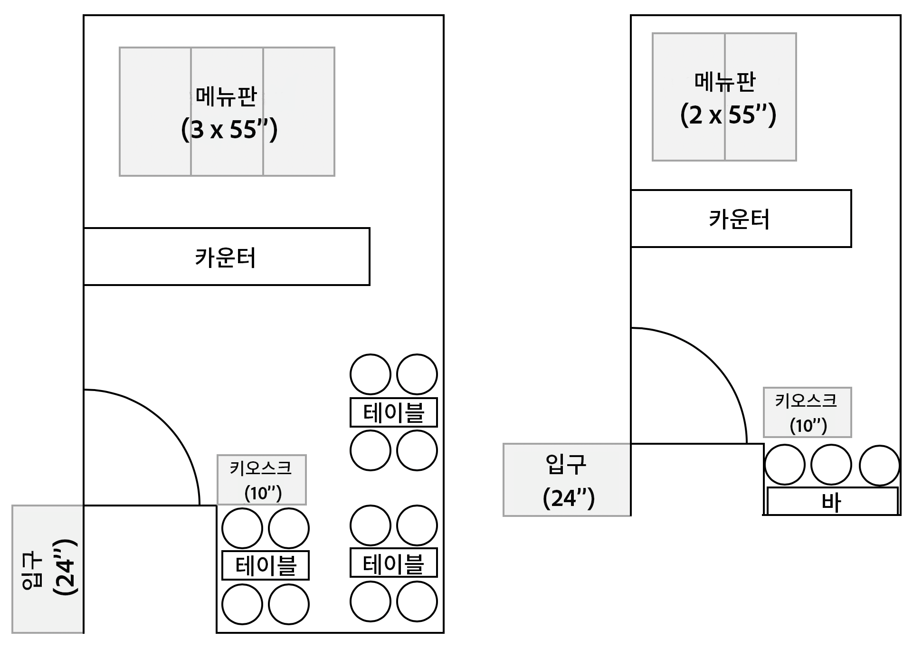

>[!NOTE]
>
>화면 측정값은 인치 단위입니다.

### 입구 {#entrance}

입구 디스플레이는 시간을 구분하여 표시되며, 첫 번째 이미지는 오전에서 오후로 변경됩니다. 또한 입구 디스플레이는 시퀀스의 각 패스에 대해 서로 다른 특별한 커피 재료를 광고하며, 이때 매 시간마다 다른 항목을 재생하기 위해 계량되고 임베드된 시퀀스를 사용합니다.

입구 채널의 마지막 이미지는 외부 온도에 따라 타겟팅되며(즉, 동적으로 변경됨), 이는 [시뮬레이션된 데이터 소스 만들기](#data-source) 섹션에 설명된 대로 시뮬레이션할 수 있습니다.

## 데모 Screens 프로젝트 배포 {#deploy-project}

[프로그램 제작](create-program.md) 단계에서 생성한 샌드박스의 데모 콘텐츠를 사용하려면 템플릿을 기반으로 사이트를 만들어야 합니다.

아직 We.Cafe 데모 사이트를 만들지 않았다면 [데모 사이트 만들기](create-site.md) 섹션에 기재된 것과 동일한 단계를 따르십시오. 템플릿을 선택할 때에는 **We.Cafe 웹 사이트 템플릿**&#x200B;을 선택하면 됩니다.

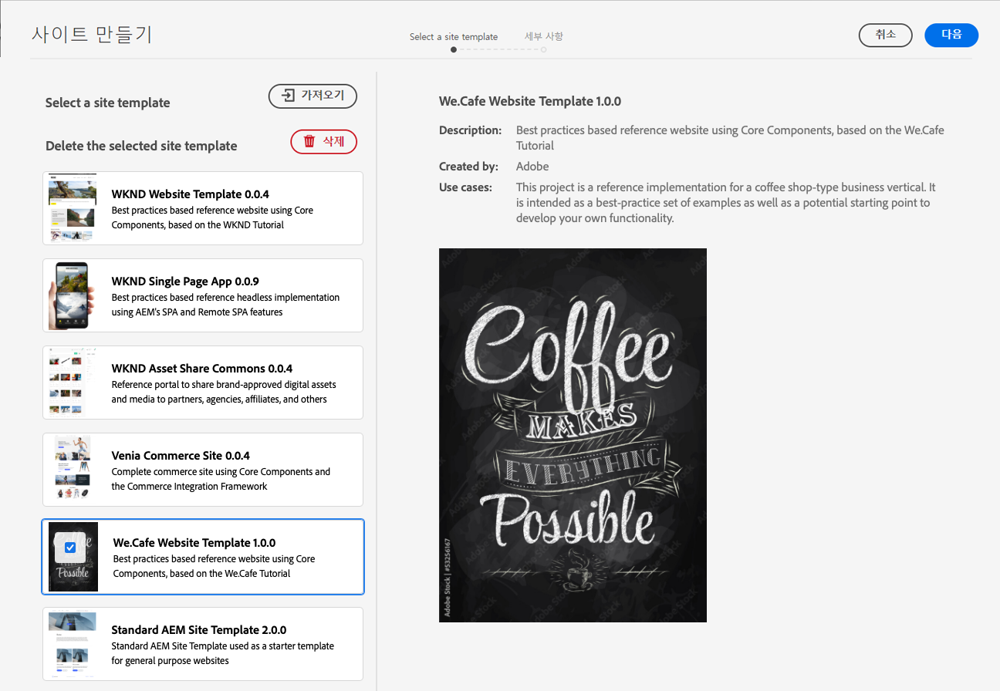

마법사가 완료되면 Sites에 배포된 콘텐츠를 찾을 수 있으며 다른 콘텐츠와 마찬가지로 검색하고 살펴볼 수 있습니다.

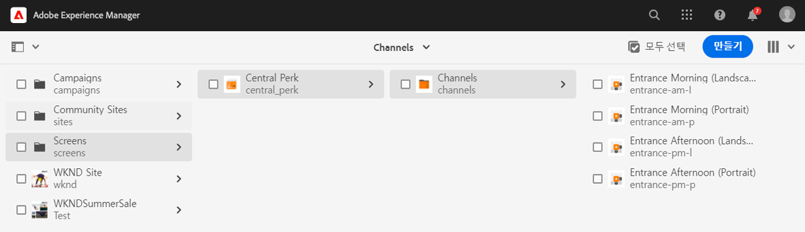

We.Cafe 데모 콘텐츠를 준비했으므로 AEM Screens를 테스트하는 방법을 선택할 수 있습니다.

* AEM Sites 콘솔 내에 있는 콘텐츠만 탐색하고자 하는 경우 [추가 리소스](#additional-resources) 섹션에서 더 많은 콘텐츠를 살펴보고 검색해 보십시오! 추가로 작업을 수행할 필요는 없습니다.
* AEM Screens의 모든 동적 기능을 경험하고자 하는 경우 다음 섹션인 [Screens 콘텐츠를 동적으로 변경](#dynamically-change)으로 계속 진행하십시오.

## Screens 콘텐츠를 동적으로 변경 {#dynamically-change}

AEM Sites와 마찬가지로 AEM Screens는 컨텍스트를 기반으로 콘텐츠를 동적으로 변경할 수 있습니다. We.Cafe 데모에는 현재 온도에 따라 다른 콘텐츠를 표시하도록 구성된 채널이 있습니다. 이를 시뮬레이션하려면 간단한 기상 서비스를 만들어야 합니다.

### 시뮬레이션된 데이터 소스 만들기 {#data-source}

데모 또는 테스트 도중 날씨를 변경하는 것은 매우 어려운 일이므로 온도 변화를 시뮬레이션해야 합니다. AEM의 ContextHub에서 호출하여 온도를 검색하는 Google Sheet 스프레드시트에 온도 값을 저장하여 기상 서비스를 시뮬레이션합니다.

#### Google API 키 만들기 {#create-api-key}

먼저 데이터 교환을 용이하게 하는 Google API 키를 만들어야 합니다.

1. Google 계정에 로그인합니다.
1. 이 링크(`https://console.cloud.google.com`)를 사용하여 클라우드 콘솔을 엽니다.
1. **Google Cloud Platform** 레이블 뒤에 있는 도구 모음의 왼쪽 상단에서 현재 프로젝트 이름을 클릭하여 새 프로젝트를 만듭니다.

   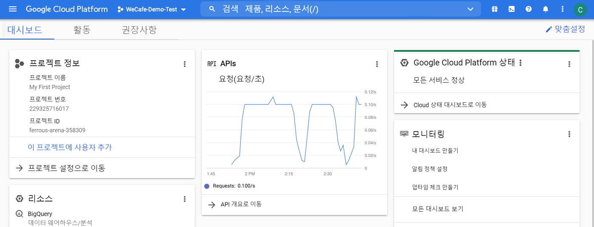

1. 프로젝트 선택기 대화 상자에서 **새 프로젝트**&#x200B;를 클릭합니다.

   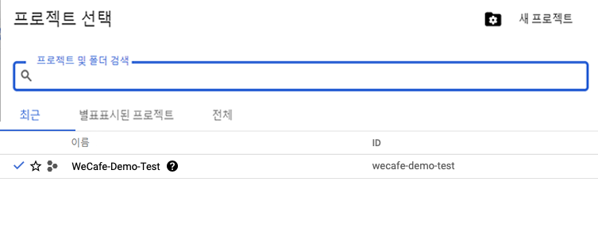

1. 프로젝트의 이름을 입력하고 **만들기**&#x200B;를 클릭합니다.

   

1. 새 프로젝트를 선택한 다음 클라우드 콘솔의 대시보드에서 햄버거 메뉴를 사용하여 **API 및 서비스**&#x200B;를 선택하십시오.

   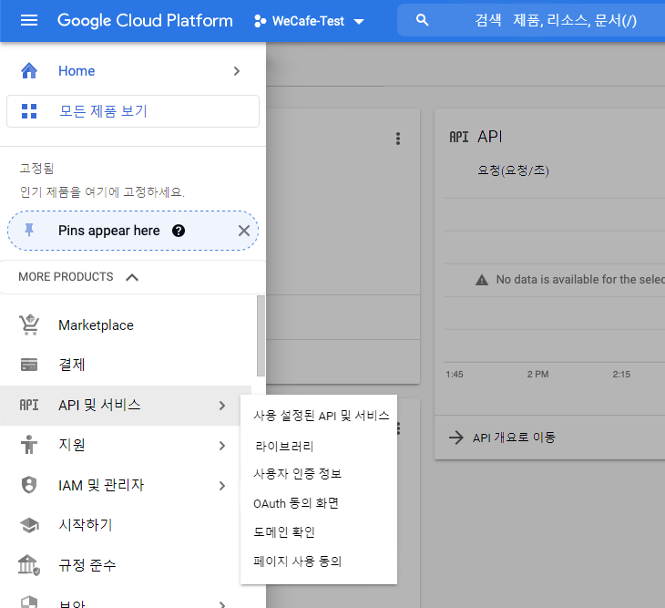

1. API 및 서비스 창의 왼쪽 패널에서 창 상단의 **자격 증명**&#x200B;을 클릭한 다음 **자격 증명 만들기** 및 **API 키**&#x200B;를 클릭합니다.

   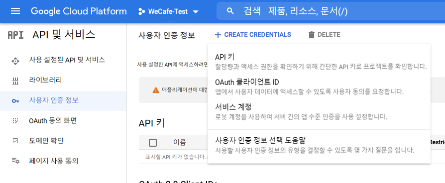

1. 대화 상자에서 새 API 키를 복사한 다음 나중에 사용할 수 있도록 저장합니다. **닫기**&#x200B;를 클릭하여 대화 상자를 닫습니다.

#### Google Sheets API 활성화 {#enable-sheets}

API 키를 사용하여 Google Sheets 데이터 교환을 허용하려면 Google Sheets API를 활성화해야 합니다.

1. `https://console.cloud.google.com`에서 프로젝트용 Google 클라우드 콘솔로 돌아간 다음 햄버거 메뉴를 사용하여 **[API 및 서비스] -> [라이브러리]**&#x200B;를 선택합니다.

   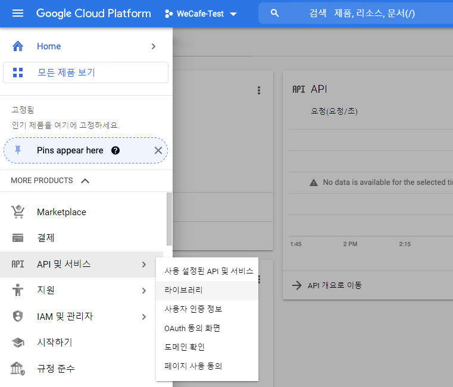

1. API 라이브러리 화면에서 스크롤하여 **Google Sheets API**&#x200B;를 찾습니다. 클릭합니다.

   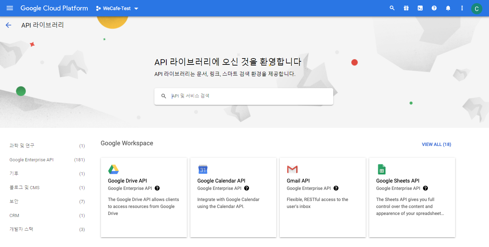

1. **Google Sheets API** 창에서 **활성화**&#x200B;를 클릭합니다.

   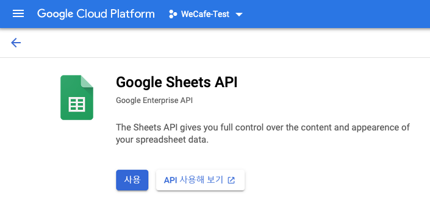

#### Google Sheets 스프레드시트 만들기 {#create-spreadsheet}

이제 Google Sheets 스프레드시트를 만들어 날씨 데이터를 저장할 수 있습니다.

1. `https://docs.google.com`으로 이동한 다음 새 Google Sheets 스프레드시트를 만듭니다.
1. 셀 A2에 `32`를 입력하여 온도를 정의합니다.
1. 창의 오른쪽 상단에 있는 **공유**&#x200B;를 클릭하여 문서를 공유하고 **링크 가져오기**&#x200B;에서 **변경**&#x200B;을 클릭합니다.

   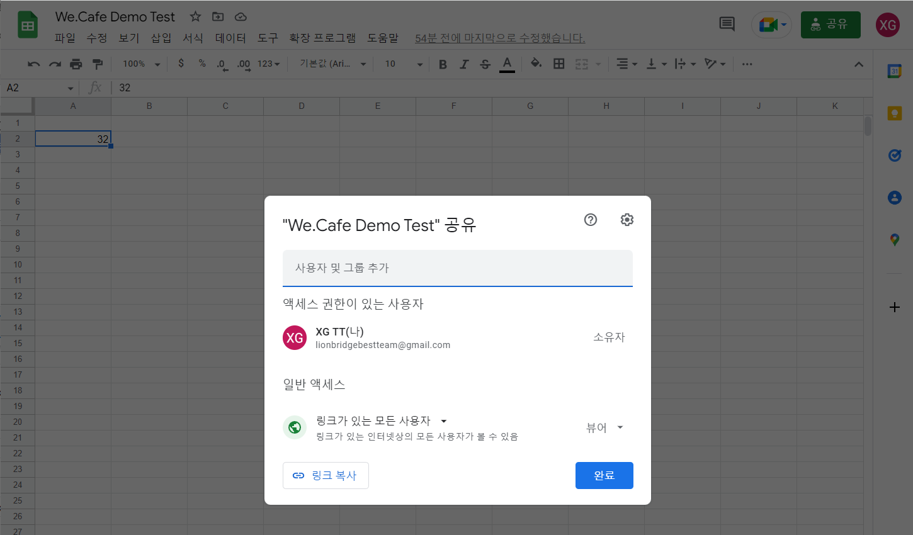

1. 다음 단계를 위해 링크를 복사합니다.

   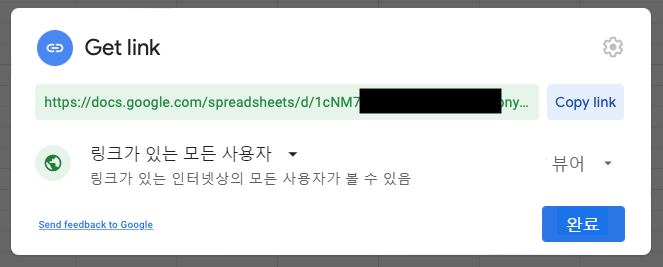

1. 시트 ID를 찾습니다.

   * 시트 ID는 복사한 시트 링크에서 `d/`와 `/edit` 사이에 포함된 임의의 문자열입니다.
   * 예:
      * URL이 `https://docs.google.com/spreadsheets/d/1cNM7j1B52HgMdsjf8frCQrXpnypIb8NkJ98YcxqaEP30/edit#gid=0`인 경우
      * 시트 ID는 `1cNM7j1B52HgMdsjf8frCQrXpnypIb8NkJ98YcxqaEP30`입니다.

1. 나중에 사용하려면 시트 ID를 복사하십시오.

#### 기상 서비스 테스트 {#test-weather-service}

이제 Google Sheets 스프레드시트로 데이터 소스를 만들고 API를 통해 액세스를 활성화했으므로 “기상 서비스”를 테스트하여 액세스할 수 있는지 테스트하십시오.

1. 웹 브라우저를 엽니다.

1. 다음 요청을 입력하여 이전에 저장한 시트 ID 및 API 키 값을 바꿉니다.

   ```
   https://sheets.googleapis.com/v4/spreadsheets/<yourSheetID>/values/Sheet1?key=<yourAPIKey>
   ```

1. 다음과 비슷한 JSON 데이터를 수신하면 올바르게 설정한 것입니다.

   ```json
   {
     "range": "Sheet1!A1:Z1000",
     "majorDimension": "ROWS",
     "values": [
       [],
       [
         "32"
       ]
     ]
   }
   ```

AEM Screens는 이렇게 동일한 서비스를 사용하여 시뮬레이션된 날씨 데이터에 액세스할 수 있습니다. 이는 다음 단계에서 구성하게 됩니다.

### ContextHub 구성 {#configure-contexthub}

AEM Screens는 컨텍스트를 기반으로 콘텐츠를 동적으로 변경할 수 있습니다. We.Cafe 데모에는 AEM의 ContextHub를 활용하여 현재 온도에 따라 다른 콘텐츠를 표시하도록 구성된 채널이 있습니다.

>[!TIP]
>
>ContextHub에 대한 자세한 내용은 이 문서 끝에 있는 [추가 리소스](#additional-resources) 섹션을 참조하십시오.

화면 콘텐츠가 표시되면 ContextHub는 기상 서비스를 호출하여 현재 온도를 찾아 표시할 콘텐츠를 결정합니다.

시트의 값은 데모 목적으로 변경될 수 있습니다. ContextHub는 이를 인식하고 콘텐츠는 업데이트된 온도에 따라 채널에서 조정됩니다.

1. AEMaaCS 작성자 인스턴스에서 **[전역 탐색] -> [도구] -> [사이트] -> [ContextHub]**&#x200B;로 이동합니다.
1. **We.Cafe 웹 사이트 템플릿**&#x200B;에서 Screens 프로젝트를 만들 때 해당 프로젝트에 입력한 것과 같은 이름의 구성 컨테이너를 선택합니다.
1. **[구성] -> [ContextHub 구성] -> [Google Sheets]**&#x200B;를 선택하고 오른쪽 상단에서 **[다음]**&#x200B;을 클릭합니다.
1. 구성에는 이미 사전 구성된 JSON 데이터가 있어야 합니다. 다음은 변경해야 하는 두 가지 값입니다.
   1. `[your Google Sheets id]`를 [이전에 저장한](#create-spreadsheet) 시트 ID로 대체합니다.
   1. `[your Google API Key]`를 [이전에 저장한](#create-api-key) API 키로 대체합니다.
1. **저장**&#x200B;을 클릭합니다.

이제 Google Sheet 스프레드시트에서 온도 값을 변경할 수 있으며 ContextHub는 “날씨 변화를 확인”할 때 Screens를 동적으로 업데이트합니다.

### 동적 데이터 테스트 {#test-dynamic}

이제 AEM Screens 및 ContextHub가 기상 서비스에 연결되었으므로 이를 테스트하여 Screens가 어떻게 콘텐츠를 동적으로 업데이트하는지 확인할 수 있습니다.

1. 샌드박스 작성자 인스턴스에 액세스합니다.
1. **[전역 탐색] -> [사이트]**&#x200B;를 통해 사이트 콘솔로 이동하고 **[Screens] -> &lt;프로젝트 이름> -> [채널] -> [Entrance Morning] (세로)**&#x200B;을 선택합니다.

   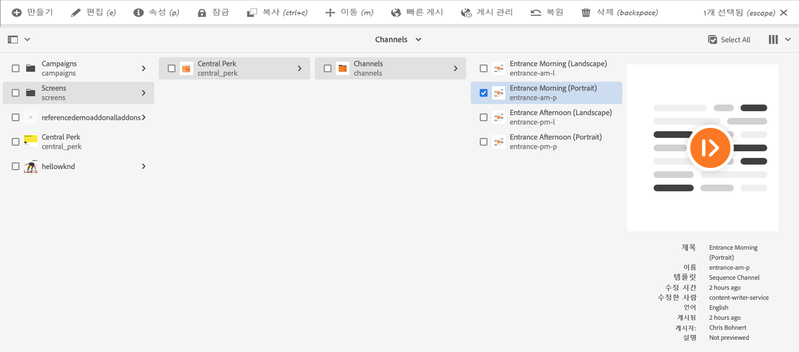

1. 도구 모음에서 [편집]을 클릭하거나 단축키 `e`를 입력하여 페이지를 편집합니다.

1. 편집기에서 콘텐츠를 볼 수 있습니다. 한 개의 이미지가 모서리에 타겟팅 아이콘과 함께 파란색으로 강조 표시됩니다.

   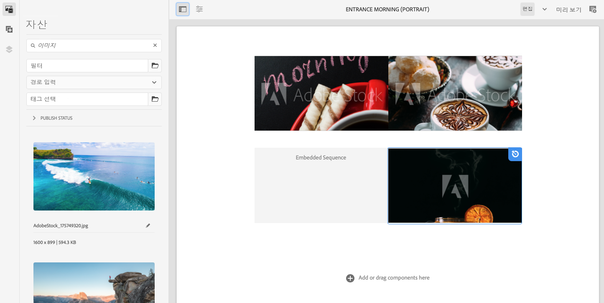

1. 스프레드시트에 입력한 온도를 32에서 70으로 변경한 다음 콘텐츠가 변경되는 것을 확인합니다.

   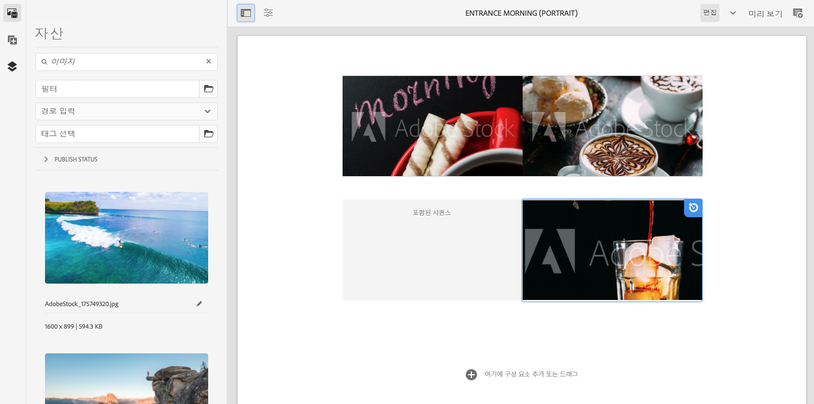

영하 32°F(0°C)에서 온화한 70°F(21°C)로 변화하는 온도에 따라 추천되는 이미지도 따뜻한 차 한 잔에서 시원한 아이스 커피로 변경됩니다.

>[!IMPORTANT]
>
>여기에서 설명된 Google Sheets 솔루션은 데모용으로만 사용하십시오. Adobe에서는 Google Sheets를 프로덕션 환경에 사용할 수 없습니다.

## Screens as a Cloud Service 연결 {#connect-screens}

디지털 사이니지 디바이스 또는 내 컴퓨터에서 실행되는 플레이어를 포함하여 실제 디지털 사이니지 환경도 설정하고자 하는 경우 다음 단계를 수행하십시오.

또는 AEMaaCS의 채널 편집기에서 데모를 미리 볼 수도 있습니다.

>[!TIP]
>
>채널 편집기에 대한 자세한 내용은 이 문서 끝에 있는 [추가 리소스](#additional-resources) 섹션을 참조하십시오.

### AEM Screens as a Cloud Service 구성 {#configure-screens}

먼저 Screens 데모 콘텐츠를 AEM Screens as a Cloud Service에 게시한 다음 서비스를 구성해야 합니다.

1. 데모 Screens 프로젝트의 콘텐츠를 게시하십시오.
1. Screens as a Cloud Service로 이동한 다음(`https://experience.adobe.com/screens`) 로그인합니다.
1. 화면 오른쪽 상단에서 올바른 조직에 속해 있는지 확인하십시오.

   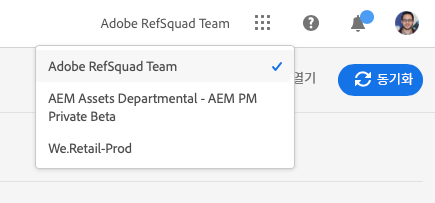

1. 왼쪽 상단에서 톱니바퀴 모양의 **설정 편집** 아이콘을 클릭합니다.

   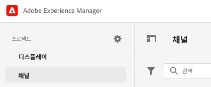

1. 데모 사이트를 만든 AEMaaCS 작성자 및 게시 인스턴스의 URL을 입력한 다음 **저장**&#x200B;을 클릭합니다.

   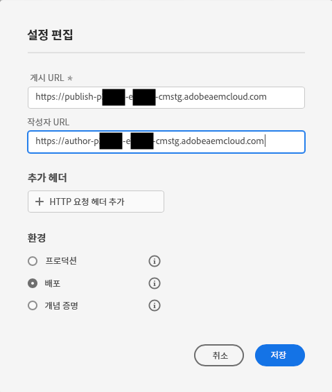

1. 데모 인스턴스에 연결되면 Screens는 채널 콘텐츠를 가져옵니다. 왼쪽 패널의 **채널**&#x200B;을 클릭하여 게시된 채널을 확인합니다. 정보가 채워지는 데 어느 정도의 시간이 소요될 수 있습니다. 화면 상단 오른쪽에 있는 파란색 **동기화** 버튼을 클릭하여 정보를 업데이트할 수 있습니다.

   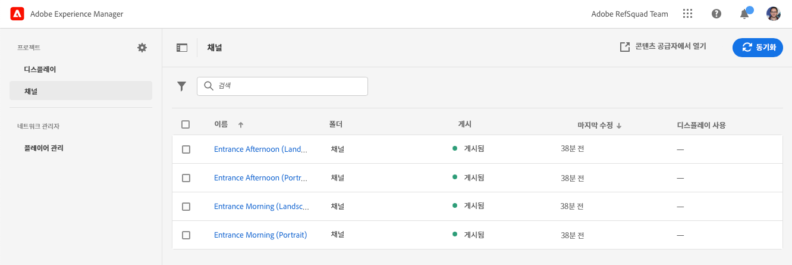

1. 왼쪽 패널에서 **디스플레이**&#x200B;를 클릭합니다. 아직 데모에 사용할 항목을 만들지 않았습니다. 각각에 대한 폴더를 만들어 We.Cafe의 위치를 시뮬레이션하겠습니다. 화면 오른쪽 상단에 있는 **만들기**&#x200B;를 클릭하고 **폴더**&#x200B;를 선택합니다.

   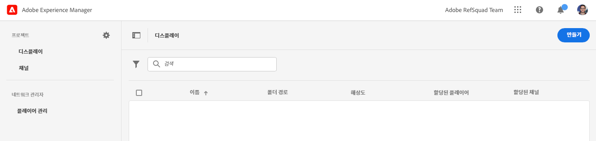

1. 대화 상자에서 **산호세**&#x200B;와 같이 폴더 이름을 입력한 다음 **만들기**&#x200B;를 클릭합니다.

1. 폴더를 클릭하여 연 다음 오른쪽 상단의 **만들기**&#x200B;를 클릭하고 **디스플레이**&#x200B;를 선택합니다.

1. 디스플레이 이름을 입력하고 **만들기**&#x200B;를 클릭합니다.

   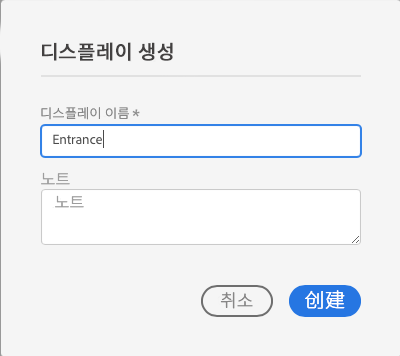

1. 디스플레이를 만든 후 디스플레이 이름을 클릭하여 디스플레이 세부 정보 화면을 엽니다. 디스플레이를 데모 사이트에서 동기화된 채널에 할당해야 합니다. 화면 오른쪽 상단의 **채널 할당**&#x200B;을 클릭합니다.

   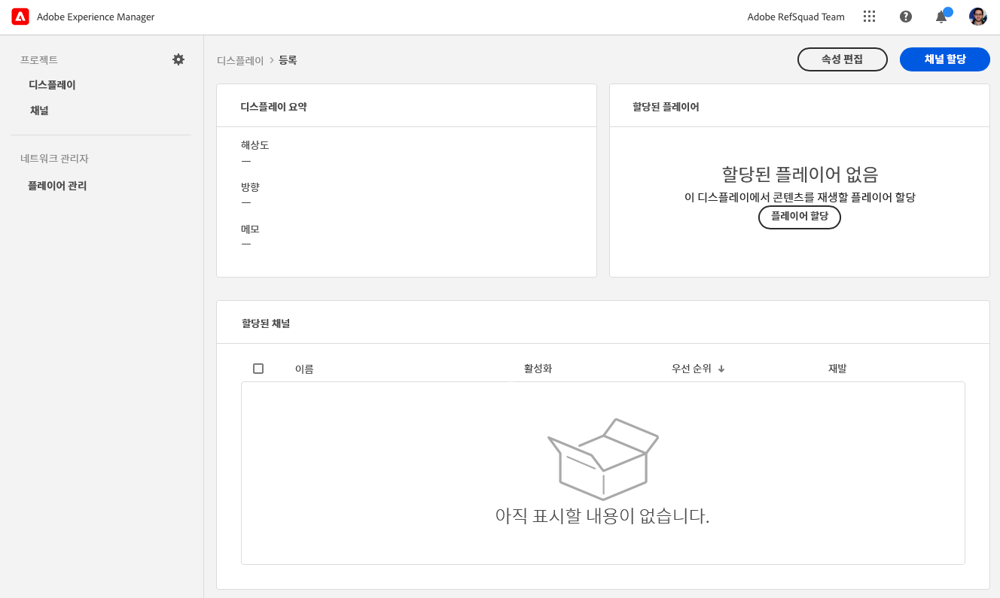

1. 대화 상자에서 채널을 선택한 다음 **할당**&#x200B;을 클릭합니다.

   

위치 및 디스플레이를 추가하려면 이 단계를 반복하면 됩니다. 완료되면 데모 사이트를 AEM Screens에 연결하고 필요한 구성을 완료한 것입니다.

AEMaaCS의 채널 편집기에서 데모를 미리 볼 수 있습니다.

### Screens 플레이어 사용 {#screens-player}

콘텐츠를 실제 화면에서 보려면 플레이어를 다운로드하여 로컬로 설정할 수 있습니다. 그러면 AEM Screens as a Cloud Service는 플레이어에 콘텐츠를 제공합니다.

#### 등록 코드 생성 {#registration-code}

먼저 플레이어를 AEM Screens as a Cloud Service에 안전하게 연결하기 위한 등록 코드를 만들어야 합니다.

1. Screens as a Cloud Service로 이동한 다음(`https://experience.adobe.com/screens`) 로그인합니다.
1. 화면 오른쪽 상단에서 올바른 조직에 속해 있는지 확인하십시오.

   

1. 왼쪽 패널에서 **[플레이어 관리] -> [등록 코드]**&#x200B;를 클릭한 다음 화면 오른쪽 상단의 **[코드 만들기]**&#x200B;를 클릭합니다.

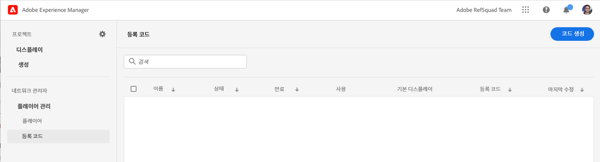

1. 코드 이름을 입력하고 **만들기**&#x200B;를 클릭합니다.

   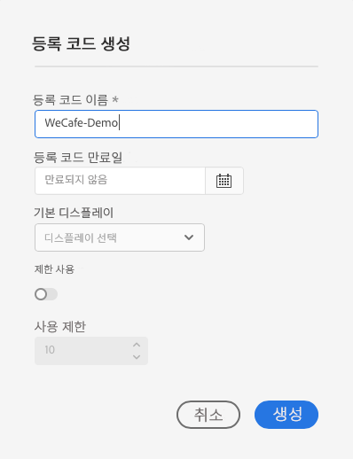

1. 코드가 생성되면 목록에 표시됩니다. 코드를 클릭하여 복사합니다.

   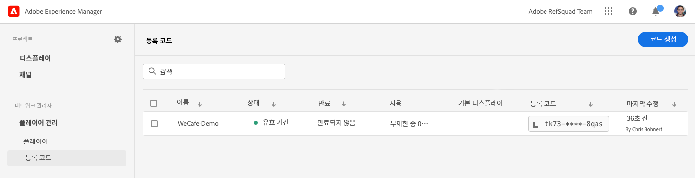

#### 플레이어 설치 및 구성 {#install-player}

1. `https://download.macromedia.com/screens/`에서 플랫폼에 대한 플레이어를 다운로드한 다음 설치합니다.
1. 플레이어를 실행하고 **구성** 탭으로 전환한 다음 맨 아래로 스크롤하여 **공장 초기화** 및 **클라우드 모드로 변경**&#x200B;을 클릭하고 확인합니다.

   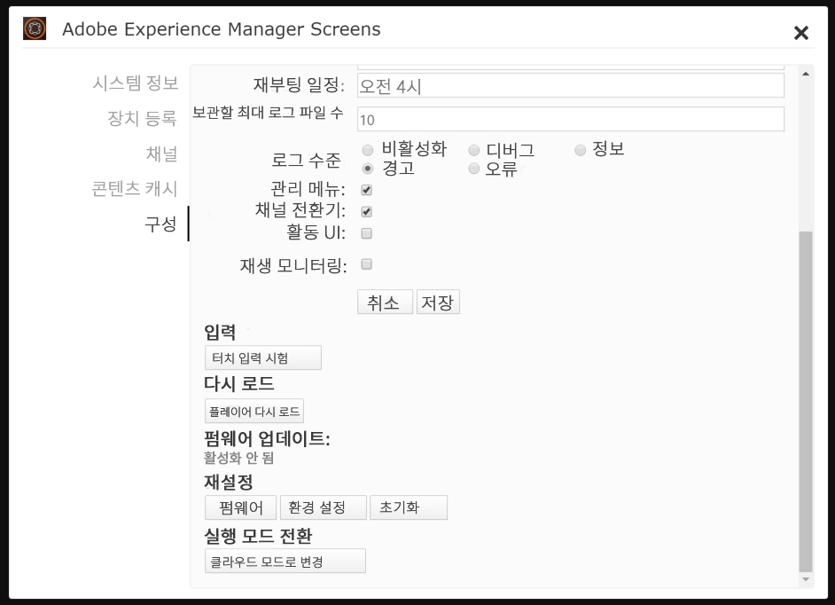

1. 플레이어가 자동으로 **플레이어 등록** 탭으로 변경됩니다. 이전에 생성한 코드를 입력하고 **등록**&#x200B;을 클릭합니다.

   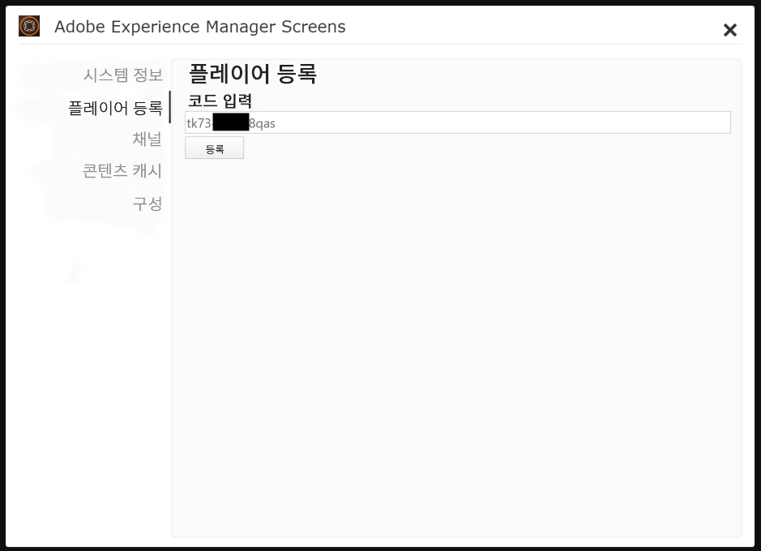

1. **시스템 정보** 탭으로 전환하여 플레이어가 등록되었음을 확인합니다.

   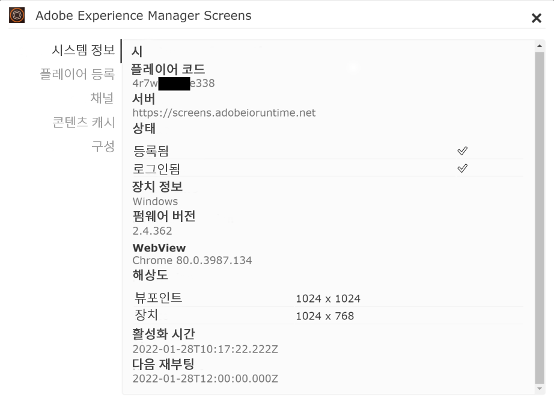

#### 디스플레이에 플레이어 할당 {#assign-player}

1. Screens as a Cloud Service로 이동한 다음(`https://experience.adobe.com/screens`) 로그인합니다.
1. 화면 오른쪽 상단에서 올바른 조직에 속해 있는지 확인하십시오.

   

1. 왼쪽 패널에서 **[플레이어 관리] -> [플레이어]**&#x200B;를 클릭하면 이전에 설치 및 등록한 플레이어가 표시됩니다.

   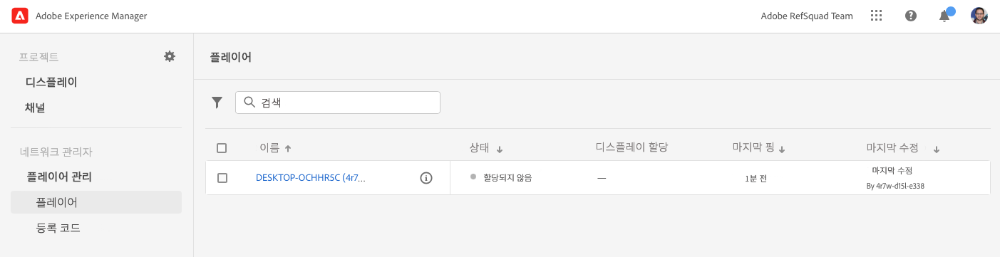

1. 플레이어 이름을 클릭하여 세부 정보를 연 다음 화면 오른쪽 상단에서 **디스플레이에 할당**&#x200B;을 클릭합니다.

   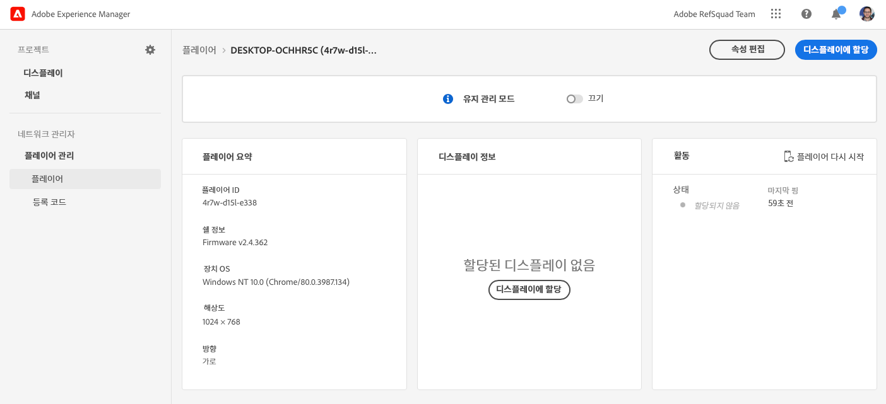

1. 대화 상자에서 이전에 생성한 디스플레이를 선택한 다음 **선택**&#x200B;을 클릭합니다.

   

#### 재생 {#playback}

플레이어에 디스플레이를 할당하면 AEM Screens as a Cloud Service는 해당 콘텐츠를 볼 수 있는 플레이어에 제공합니다.


## 다음 단계 {#what-is-next}

AEM 참조 데모 추가 기능 여정의 한 부분을 완료했으므로,

* AEM Screens 기본 사항을 이해할 수 있습니다.
* We.Cafe 데모 콘텐츠를 이해할 수 있습니다.
* We.Cafe에 대해 AEM Screens를 구성하는 방법을 파악할 수 있습니다.

이제 나만의 데모 사이트를 사용하여 AEM Screens의 기능을 살펴볼 준비가 되었습니다. 여정의 다음 섹션인 [데모 사이트 관리](manage.md)로 이동하여 계속하십시오. 여기에서는 데모 사이트 관리에 도움이 되는 도구 및 이를 제거하는 방법에 대해 알아보게 됩니다.

또한 [추가 리소스 섹션](#additional-resources)에서 사용할 수 있는 몇 가지 추가 리소스를 확인하여 이 여정에서 확인한 기능들에 대한 자세한 내용을 알아볼 수 있습니다.

## 추가 리소스 {#additional-resources}

* [ContextHub 설명서](/help/sites-cloud/authoring/personalization/contexthub.md) - ContextHub를 사용하여 기상 조건을 넘어 사용자 컨텍스트를 기반으로 콘텐츠를 개인화하는 방법에 대해 알아봅니다.
* [API 키 사용 - Google 설명서](https://developers.google.com/maps/documentation/javascript/get-api-key) - Google의 API 키 사용에 대한 세부 정보가 포함된 편리한 참조입니다.
* [디스플레이](/help/screens-cloud/creating-content/creating-displays-screens-cloud.md) - AEM Screens의 디스플레이와 이를 사용하여 수행할 수 있는 작업에 대해 자세히 알아봅니다.
* [플레이어 다운로드](/help/screens-cloud/managing-players-registration/installing-screens-cloud-player.md) - Screens 플레이어 액세스 방법 및 설치 방법에 대해 알아봅니다.
* [플레이어 등록](/help/screens-cloud/managing-players-registration/registering-players-screens-cloud.md) - AEM Screens 프로젝트와 함께 플레이어를 설정하고 등록하는 방법에 대해 알아봅니다.
* [디스플레이에 플레이어 할당](/help/screens-cloud/managing-players-registration/assigning-player-display.md) - 콘텐츠를 표시하도록 플레이어를 구성합니다.
