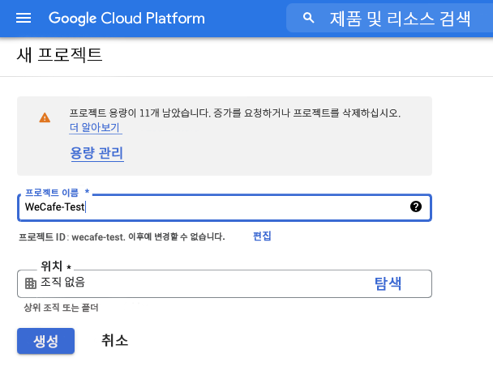
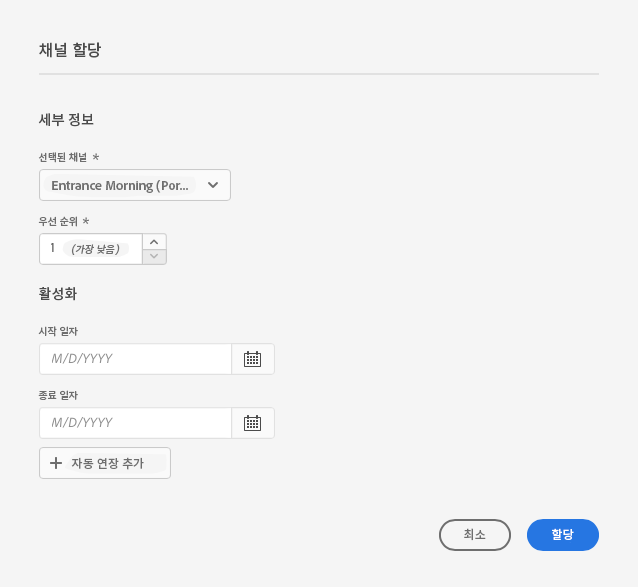

# 데모 사이트용 AEM Screens 활성화 {#enable-screens}

데모 사이트에서 전체 AEM Screens as a Cloud Service 경험을 활성화하는 단계를 알아봅니다.

## 지금까지 그 이야기 {#story-so-far}

AEM 참조 데모 추가 기능 여정의 이전 문서에서 [데모 사이트 만들기,](create-site.md) 참조 데모 추가 기능의 템플릿을 기반으로 새 데모 사이트를 만들었습니다. 이제 다음을 수행해야 합니다.

* AEM 작성 환경에 액세스하는 방법을 이해합니다.
* 템플릿을 기반으로 사이트를 만드는 방법을 알아봅니다.
* 사이트 구조를 탐색하고 페이지를 편집하는 기본 사항을 이해합니다.

데모 사이트를 관리하는 데 도움이 되는 도구를 탐색하고 이해할 수 있는 자체 데모 사이트가 있으므로 이제 데모 사이트에 대해 전체 AEM Screens as a Cloud Service 경험을 활성화할 수 있습니다.

## 목표 {#objective}

AEM Reference Demos 추가 기능에는 커피숍업의 수직 부문인 We.Cafe용 AEM Screens 컨텐츠가 포함되어 있습니다. 이 문서는 AEM Screens 컨텍스트에서 We.Cafe 데모 설정을 실행하는 방법을 이해하는 데 도움이 됩니다. 읽은 후에는 다음을 수행해야 합니다.

* AEM Screens의 기본 사항을 알고 있습니다.
* We.Cafe 데모 콘텐츠를 이해합니다.
* We.Cafe용 AEM Screens 구성 방법을 알아봅니다.
   * We.Cafe용 스크린 프로젝트를 만드는 방법을 알아봅니다.
   * Google Sheet 및 API를 사용하여 모의 기상서비스를 구성할 수 있습니다.
   * &quot;날씨 서비스&quot;를 기반으로 동적으로 변화하는 스크린 컨텐츠를 시뮬레이션할 수 있습니다.
   * 스크린 플레이어를 설치하고 사용합니다.

## 화면 이해 {#understand-screens}

AEM Screens as a Cloud Service 은 마케터가 규모에 맞게 다이내믹한 디지털 경험을 생성하고 관리할 수 있는 디지털 서명 솔루션입니다. AEM Screens as a Cloud Service을 사용하면 공용 공간에서 사용할 수 있는 매력적인 동적 디지털 간판 경험을 만들 수 있습니다.

>[!TIP]
>
>AEM Screens as a Cloud Service에 대한 자세한 내용은 [추가 리소스](#additional-resources) 섹션을 참조하십시오.

AEM 참조 데모 추가 기능을 설치하면 데모 작성 환경에서 AEM Screens용 We.Cafe 콘텐츠를 자동으로 사용할 수 있습니다. 에 설명된 절차 [데모 스크린 프로젝트 배포](#deploy-project) 해당 컨텐츠를 게시하고 미디어 플레이어에 배포하여 전체 AEM Screens 환경을 활성화할 수 있습니다.

## 데모 콘텐츠 이해 {#demo-content}

We.Cafe 커피샵은 미국 내 3개 지역에 3개의 가게로 구성되어 있습니다. 세 곳 모두 비슷한 세 가지 경험을 갖고 있다.

* 2개 또는 3개의 세로 패널이 있는 카운터 위의 메뉴 보드
* 고객을 상점으로 초대하는 가로 또는 세로 패널이 있는 거리를 향하는 입구 디스플레이
* 한 개의 세로 태블릿으로 큐를 건너뛸 수 있는 간단한 자체 주문 방식의 키오스크 부스

>[!NOTE]
>
>현재 버전의 데모 에서는 시작 표시만 테스트할 수 있습니다. 다른 디스플레이는 향후 버전에서 제공될 예정입니다.
>
>키오스크는 현재 버전의 데모 버전에 포함되지 않습니다. 향후 버전에 포함될 예정입니다.

뉴욕 위치는 공간이 없는 작은 가게에 있는 것으로 추정된다.

* 메뉴 보드에는 San Francisco와 San Jose용 3개가 아닌 2개의 세로 패널만 있습니다
* 입구 디스플레이는 수평이 아닌 수직이 되도록 위치한다

>[!NOTE]
>
>에서 스크린 Cloud Service에 연결하기로 결정한 경우 [Connect Screens as a Cloud Service](#connect-screens) 섹션에서 표시 아래의 폴더로 위치를 만드십시오. 자세한 내용은 [추가 리소스](#additional-resources) 표시에 대한 자세한 내용은 이 문서의 끝 부분에 있는 섹션을 참조하십시오.

### 카페 레이아웃 {#care-layouts}

We.Cafe 위치에는 다음 레이아웃이 있습니다.


>[!NOTE]
>
>화면의 크기는 인치이다.

### 입구 {#entrance}

입구는 다반사이고, 첫 이미지는 아침부터 오후까지 바뀔 것입니다. 시퀀스의 각 전달에서는 또한 다른 특별 커피 준비를 광고하고, 매번 다른 항목을 재생하기 위해 데이터 통신 포함 시퀀스를 사용합니다.

또한, 상기 입구의 마지막 영상들은 상기 가상에서 설명한 대로 시뮬레이션할 수 있는 외부 온도에 기초하여 표적(즉, 동적으로 변경된)된다 [시뮬레이션된 데이터 소스 만들기](#data-source) 섹션을 참조하십시오.

## 데모 스크린 프로젝트 배포 {#deploy-project}

에서 만든 샌드박스에서 데모 콘텐츠를 사용하려면 [프로그램 만들기](create-program.md) 단계에서는 템플릿을 기반으로 사이트를 만들어야 합니다.

We.Cafe 데모 사이트를 아직 만들지 않은 경우 와 동일한 단계를 따르기만 하면 됩니다 [데모 사이트 만들기](create-site.md) 섹션을 참조하십시오. 템플릿을 선택할 때 **We.Cafe 웹 사이트 템플릿**.


마법사가 완료되면 사이트 아래에 배포된 콘텐츠를 찾아 다른 콘텐츠처럼 탐색하고 탐색할 수 있습니다.


이제 We.Cafe 데모 컨텐츠가 있으므로 AEM Screens을 테스트하는 방법을 선택할 수 있습니다.

* AEM Sites 콘솔 내에서만 컨텐츠를 탐색하려는 경우 다음을 통해 더 탐색하고 더 많이 검색하면 됩니다 [추가 리소스](#additional-resources) 섹션 더 이상의 작업이 필요하지 않습니다.
* AEM Screens의 전체 동적 기능을 경험하려면 다음 섹션으로 이동하십시오. [동적으로 화면 내용을 변경합니다.](#dynamically-change)

## 동적으로 화면 내용 변경 {#dynamically-change}

AEM Sites과 마찬가지로 AEM Screens도 컨텍스트에 따라 콘텐츠를 동적으로 변경할 수 있습니다. We.Cafe 데모에는 현재 온도에 따라 다른 콘텐츠를 표시하도록 구성된 채널이 있습니다. 이를 시뮬레이션하려면, 우리는 우리의 간단한 날씨 서비스를 만들 필요가 있을 것입니다.

### 시뮬레이션된 데이터 소스 만들기 {#data-source}

데모 또는 테스트 중에 날씨를 변경하기가 매우 어렵기 때문에 온도 변화를 시뮬레이션해야 합니다. AEM ContextHub에서 온도 검색을 위해 호출할 Google 시트 스프레드시트에 온도 값을 저장하여 날씨 서비스를 시뮬레이션합니다.

#### Google API 키 만들기 {#create-api-key}

먼저 데이터 교환을 용이하게 하기 위해 Google API 키를 만들어야 합니다.

1. Google 계정에 로그인합니다.
1. 이 링크를 사용하여 클라우드 콘솔 열기 `https://console.cloud.google.com`.
1. 다음 도구 모음 왼쪽 상단에 있는 현재 프로젝트 이름을 클릭하여 새 프로젝트를 만듭니다 **Google Cloud Platform** 레이블.

   

1. 프로젝트 선택기 대화 상자에서 **새 프로젝트**.

   

1. 프로젝트에 이름을 지정하고 을(를) 클릭합니다 **만들기**.

   

1. 새 프로젝트가 선택되어 있는지 확인하고 클라우드 콘솔의 대시보드에서 햄버거 메뉴를 사용하여 을 선택합니다 **API 및 서비스**.

   

1. API 및 서비스 창의 왼쪽 패널에서 를 클릭합니다 **자격 증명** 창 상단에서 을(를) 클릭한 다음 **자격 증명 만들기** 및 **API 키**.

   

1. 대화 상자에서 새 API 키를 복사하여 나중에 사용할 수 있도록 저장합니다. 클릭 **닫기** 을 클릭하여 대화 상자를 닫습니다.

#### Google 시트 API 활성화 {#enable-sheets}

API 키를 사용하여 Google 시트 데이터를 교환하려면 Google 시트 API를 활성화해야 합니다.

1. 의 Google Cloud 콘솔로 돌아갑니다. `https://console.cloud.google.com` 프로젝트에 대해 햄버거 메뉴를 사용하여 **API 및 서비스 -> 라이브러리**.

   

1. API 라이브러리 화면에서 스크롤하여 다음에 대한 검색을 찾습니다. **Google 시트 API**. 클릭합니다.

   

1. 에서 **Google 시트 API** 창 클릭 **활성화**.

   

#### Google 시트 스프레드시트 만들기 {#create-spreadsheet}

이제 날씨 데이터를 저장할 Google 시트 스프레드시트를 만들 수 있습니다.

1. 이동 `https://docs.google.com` 새 Google 시트 스프레드시트를 만듭니다.
1. 을 입력하여 온도를 정의합니다. `32` 입니다.
1. 을 클릭하여 문서를 공유합니다 **공유** 창문의 오른쪽 상단에서 **링크 가져오기** click **변경**.

   

1. 다음 단계에 대한 링크를 복사합니다.

   

1. 시트 ID를 찾습니다.

   * 시트 ID는 이후에 복사한 시트 링크에 있는 임의의 문자열입니다 `d/` 및 이전 `/edit`.
   * 예:
      * URL이 `https://docs.google.com/spreadsheets/d/1cNM7j1B52HgMdsjf8frCQrXpnypIb8NkJ98YcxqaEP30/edit#gid=0`
      * 시트 ID는 `1cNM7j1B52HgMdsjf8frCQrXpnypIb8NkJ98YcxqaEP30`.

1. 나중에 사용할 수 있도록 시트 ID를 복사합니다.

#### 날씨 서비스 테스트 {#test-weather-service}

이제 데이터 소스를 Google Sheet 스프레드시트로 만들고 API를 통해 액세스를 허용했으므로 테스트하여 &quot;날씨 서비스&quot;에 액세스할 수 있는지 확인합니다.

1. 웹 브라우저를 엽니다.

1. 이전에 저장한 시트 ID와 API 키 값을 대체하는 다음 요청을 입력합니다.

   ```
   https://sheets.googleapis.com/v4/spreadsheets/<yourSheetID>/values/Sheet1?key=<yourAPIKey>
   ```

1. 다음과 유사한 JSON 데이터를 받는 경우 제대로 설정합니다.

   ```json
   {
     "range": "Sheet1!A1:Z1000",
     "majorDimension": "ROWS",
     "values": [
       [],
       [
         "32"
       ]
     ]
   }
   ```

AEM Screens에서는 동일한 서비스를 사용하여 모의 날씨 데이터에 액세스할 수 있습니다. 다음 단계에서 구성됩니다.

### ContextHub 구성 {#configure-contexthub}

AEM Screens은 컨텍스트에 따라 컨텐츠를 동적으로 변경할 수 있습니다. We.Cafe 데모에는 AEM ContextHub를 활용하여 현재 온도에 따라 다른 콘텐츠를 표시하도록 구성된 채널이 있습니다.

>[!TIP]
>
>ContextHub에 대한 전체 세부 사항은 [추가 리소스](#additional-resources) 섹션을 참조하십시오.

화면 콘텐츠가 표시되면 ContextHub에서 날씨 서비스를 호출하여 현재 온도를 찾아 표시할 콘텐츠를 결정합니다.

데모 목적으로 시트의 값을 변경할 수 있습니다. ContextHub는 이 값을 인식하며, 업데이트된 온도에 따라 채널에서 컨텐츠가 조정됩니다.

1. AEMaaCS 작성자 인스턴스에서 **전역 탐색 -> 도구 -> 사이트 -> ContextHub**.
1. 에서 스크린 프로젝트를 만들 때 프로젝트를 부여한 이름과 동일한 이름을 가진 구성 컨테이너를 선택합니다 **We.Cafe 웹 사이트 템플릿**.
1. 선택 **구성 -> ContextHub 구성 -> Google 시트** 을 클릭한 다음 **다음** 오른쪽 상단에 있습니다.
1. 구성에 이미 사전 구성된 JSON 데이터가 있어야 합니다. 변경해야 하는 두 가지 값이 있습니다.
   1. 바꾸기 `[your Google Sheets id]` 시트 ID 사용 [이전에 저장했습니다.](#create-spreadsheet)
   1. 바꾸기 `[your Google API Key]` API 키 사용 [이전에 저장했습니다.](#create-api-key)
1. **저장**&#x200B;을 클릭합니다.

이제 Google 시트 스프레드시트에서 온도 값을 변경할 수 있습니다. ContextHub는 &quot;날씨 변화를 봅니다&quot;며 Screens를 동적으로 업데이트합니다.

### 동적 데이터 테스트 {#test-dynamic}

이제 AEM Screens 및 ContextHub가 날씨 서비스에 연결되므로 화면에서 콘텐츠를 동적으로 업데이트하는 방법을 테스트할 수 있습니다.

1. 샌드박스 작성자 인스턴스에 액세스합니다.
1. 를 통해 사이트 콘솔로 이동합니다 **전역 탐색 -> 사이트** 다음 페이지를 선택합니다. **화면 -> &lt;project-name> -> 채널 -> 입구날(세로)**.

   

1. 도구 모음에서 편집 을 클릭하거나 바로 가기 키를 입력합니다 `e` 를 눌러 페이지를 편집합니다.

1. 편집기에서 컨텐츠가 표시됩니다. 한 이미지가 파란색으로 강조 표시되고 모서리에 타겟팅 아이콘이 표시됩니다.

   

1. 스프레드시트에서 입력한 온도를 32에서 70으로 변경하고 콘텐츠 변경을 확인합니다.

   

냉동된 32°F(0°C)에서 편안한 70°F(21°C)로 온도 변화에 따라, 특징적인 이미지는 따뜻한 차 컵에서 시원한 아이스 커피로 바뀌었다.

>[!IMPORTANT]
>
>데모용으로 설명된 Google Sheet 솔루션만 사용합니다. Adobe은 프로덕션 환경에 Google 시트 사용을 지원하지 않습니다.

## Connect Screens as a Cloud Service {#connect-screens}

디지털 간판 장치나 컴퓨터에서 실행되는 플레이어를 포함한 실제 디지털 간판 환경을 설정하려면 다음 단계를 따르십시오.

또는 AEMaaCS의 채널 편집기에서 데모를 간단히 미리 볼 수 있습니다.

>[!TIP]
>
>채널 편집기에 대한 자세한 내용은 [추가 리소스](#additional-resources) 섹션을 참조하십시오.

### AEM Screens as a Cloud Service 구성 {#configure-screens}

먼저 Screens 데모 콘텐츠를 AEM Screens as a Cloud Service에 게시하고 서비스를 구성해야 합니다.

1. 데모 화면 프로젝트의 콘텐츠를 게시합니다.
1. 에서 as a Cloud Service 화면으로 이동합니다. `https://experience.adobe.com/screens` 로그인하고
1. 화면 오른쪽 상단에서 올바른 조직에 있는지 확인합니다.

   

1. 왼쪽 상단에서 **설정 편집** 톱니바퀴 모양의 아이콘

   

1. 데모 사이트를 생성한 AEMaaCS 작성자 및 게시 인스턴스의 URL을 제공하고 **저장**.

   

1. 데모 인스턴스에 연결되면 스크린 이 채널 콘텐츠를 가져옵니다. 클릭 **채널** 왼쪽 패널에서 게시된 채널을 확인합니다. 정보를 채우려면 시간이 걸릴 수 있습니다. 파란색을 클릭할 수 있습니다 **동기화** 화면 오른쪽 상단의 단추를 클릭하여 정보를 업데이트합니다.

   

1. 클릭 **표시** 왼쪽 패널에 표시됩니다. 아직 데모를 만들지 않았습니다. 각 폴더에 대해 폴더를 만들어 We.Cafe 위치를 시뮬레이션합니다. 클릭 **만들기** 화면 오른쪽 상단에서 을(를) 선택하고 을(를) 선택합니다. **폴더**.

   

1. 대화 상자에서 다음과 같은 폴더 이름을 제공합니다. **San Jose** 을(를) 클릭합니다. **만들기**.

1. 폴더를 클릭하여 열고 을 클릭합니다 **만들기** 오른쪽 상단에서 을(를) 선택하고 을(를) 선택합니다. **표시**.

1. 표시 이름을 입력하고 를 클릭합니다. **만들기**.

   

1. 디스플레이를 만든 후 디스플레이 이름을 클릭하여 디스플레이 세부 사항 화면을 엽니다. 데모 사이트에서 동기화된 채널을 디스플레이에 지정해야 합니다. 클릭 **채널 할당** 화면 오른쪽 상단에 있습니다.

   

1. 대화 상자에서 채널을 선택하고 을(를) 클릭합니다. **지정**.

   

추가 위치 및 표시에 대해 이러한 단계를 반복할 수 있습니다. 완료되었으면 데모 사이트를 AEM Screens과 연결했고 필요한 구성을 완료했습니다.

AEMaaCS의 채널 편집기에서 데모를 간단히 미리 볼 수 있습니다.

### Screens 플레이어 사용 {#screens-player}

컨텐츠를 실제 화면으로 보려면 플레이어를 다운로드하여 로컬에서 설정할 수 있습니다. 그러면 AEM Screens as a Cloud Service이 컨텐츠를 플레이어에 전달합니다

#### 등록 코드 생성 {#registration-code}

먼저 플레이어를 AEM Screens as a Cloud Service에 안전하게 연결하려면 등록 코드를 만들어야 합니다.

1. 에서 as a Cloud Service 화면으로 이동합니다. `https://experience.adobe.com/screens` 로그인하고
1. 화면 오른쪽 상단에서 올바른 조직에 있는지 확인합니다.

   

1. 왼쪽 패널에서 **플레이어 관리 -> 등록 코드** 을 클릭한 다음 **코드 만들기** 화면 오른쪽 상단에 있습니다.


1. 코드 이름을 입력하고 **만들기**.

   

1. 코드가 만들어지면 목록에 표시됩니다. 를 클릭하여 코드를 복사합니다.

   

#### 플레이어 설치 및 구성 {#install-player}

1. 플랫폼용 플레이어를 `https://download.macromedia.com/screens/` 설치하고
1. 플레이어를 실행하고 로 전환합니다. **구성** 탭하고 맨 아래로 스크롤하여 두 항목을 모두 클릭하고 확인합니다. **팩토리로 재설정** 그리고 **클라우드 모드로 변경**.

   

1. 플레이어가 자동으로 **플레이어 등록** 탭. 이전에 생성한 코드를 입력하고 **등록**.

   

1. 로 전환 **시스템 정보** 탭을 클릭하여 플레이어가 등록되었는지 확인합니다.

   

#### 디스플레이에 플레이어 할당 {#assign-player}

1. 에서 as a Cloud Service 화면으로 이동합니다. `https://experience.adobe.com/screens` 로그인하고
1. 화면 오른쪽 상단에서 올바른 조직에 있는지 확인합니다.

   

1. 왼쪽 패널에서 **플레이어 관리 -> 플레이어** 그리고 이전에 설치 및 등록한 플레이어가 표시됩니다.

   

1. 플레이어 이름을 클릭하여 세부 사항을 연 다음 를 클릭합니다 **표시할 할당** 화면 오른쪽 상단에 있습니다.

   

1. 대화 상자에서 이전에 만든 표시를 선택한 다음 를 클릭합니다. **선택**.

   

#### 재생! {#playback}

플레이어에 디스플레이를 할당하면 AEM Screens은 해당 컨텐츠를 플레이어가 볼 수 있는 위치에 as a Cloud Service으로 전달합니다.


## 다음은 무엇입니까? {#what-is-next}

AEM 참조 데모 추가 기능 여정의 이 부분을 완료했으므로 다음을 수행해야 합니다.

* AEM Screens의 기본 사항을 알고 있습니다.
* We.Cafe 데모 콘텐츠를 이해합니다.
* We.Cafe용 AEM Screens 구성 방법을 알아봅니다.

이제 고유한 데모 사이트를 사용하여 AEM Screens의 기능을 탐색할 수 있습니다. 여정의 다음 섹션으로 계속하십시오. [데모 사이트 관리,](manage.md) 데모 사이트를 관리하는 데 도움이 되는 도구 및 데모 사이트를 제거하는 방법에 대해 알아봅니다.

에서 사용할 수 있는 추가 리소스 중 일부를 확인할 수도 있습니다. [추가 리소스 섹션](#additional-resources) 추가 정보를 확인하십시오.

## 추가 리소스 {#additional-resources}

* [ContextHub 설명서](/help/sites-cloud/authoring/personalization/contexthub.md) - ContextHub를 사용하여 날씨 조건을 벗어나는 사용자 컨텍스트에 따라 컨텐츠를 개인화하는 방법을 알아봅니다.
* [API 키 사용 - Google 설명서](https://developers.google.com/maps/documentation/javascript/get-api-key) - Google의 API 키 사용에 대한 자세한 내용을 위한 편리한 참조입니다.
* [표시](/help/screens-cloud/creating-content/creating-displays-screens-cloud.md) - AEM Screens에서 디스플레이가 무엇이고 디스플레이가 수행할 수 있는 작업에 대해 자세히 알아봅니다.
* [다운로드 플레이어](/help/screens-cloud/managing-players-registration/installing-screens-cloud-player.md) - Screens 플레이어에 액세스하는 방법 및 설치 방법을 알아봅니다.
* [플레이어 등록](/help/screens-cloud/managing-players-registration/registering-players-screens-cloud.md) - AEM Screens 프로젝트에 플레이어를 설정하고 등록하는 방법을 알아봅니다.
* [디스플레이에 플레이어 할당](/help/screens-cloud/managing-players-registration/assigning-player-display.md) - 콘텐츠를 표시하도록 플레이어를 구성합니다.
