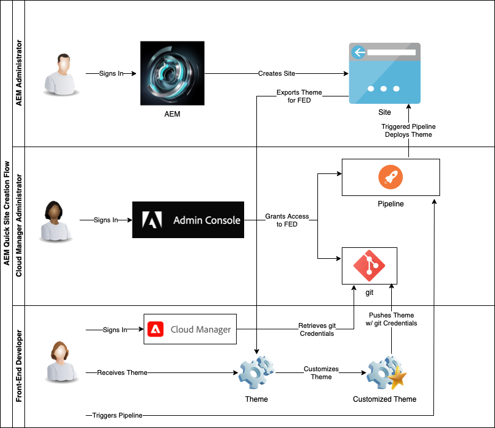

# Cloud Manager 및 빠른 사이트 생성 워크플로 이해 {#understand-cloud-manager}

Cloud Manager와 이것이 새로운 빠른 사이트 생성 프로세스를 결합하는 방법에 대해 알아봅니다.

>[!TIP]
>
>역할이 오직 프론트엔드 개발자에만 해당하는 경우 이 여정의 [git 저장소 액세스 정보 가져오기](retrieve-access.md) 문서로 건너뛸 수 있습니다.
>
>프론트엔드 개발 및 관리자 작업을 모두 수행하는 AEM 관리자 또는 Cloud Manager 관리자이거나 프론트엔드 개발을 위한 AEM의 전체적인 프로세스를 이해하고자 하는 경우, 현재 문서를 계속해서 읽어보고 이 여정을 진행하십시오.

## 목표 {#objective}

이 문서는 AEM 빠른 사이트 생성 도구의 작동 방법을 이해하는 데 도움이 되며 전체적인 흐름에 대한 개요를 제공합니다. 문서를 읽고 나면

* AEM Sites 및 Cloud Manager를 함께 사용하여 프론트엔드 개발을 용이하게 하는 방법을 이해할 수 있습니다.
* AEM 지식이 필요하지 않도록 프론트엔드 맞춤화 단계를 AEM에서 완전히 분리하는 방법을 파악할 수 있습니다.

이 문서는 구성을 시작하는 여정의 다음 단계로 이동하기 전에 이러한 빠른 사이트 생성 솔루션에 대한 기본 사항을 이해하는 데 중점을 둡니다.

이 여정을 단계별로 진행하는 것이 좋지만, AEM Sites 및 Cloud Manager가 함께 작동하는 방법을 알고 있으며 구성을 바로 시작하고자 하는 경우 [여정의 다음 단계로 건너뛸 수 있습니다](create-site.md).

## 담당 역할 {#responsible-role}

이 부분의 여정은 AEM 관리자 및 Cloud Manager 관리자 모두에게 적용됩니다.

## 요구 사항 및 사전 요구 사항 {#requirements-prerequisites}

빠른 사이트 생성 도구를 사용하여 사이트를 만들고 맞춤화하기 전에 알아 두어야 할 몇 가지 요구 사항이 있습니다.

이 여정은 프론트엔드 개발자, 관리자 및 이 두 역할의 조합을 위해 고안되었으므로, 여기에는 두 역할 모두에 대한 요구 사항이 나열되어 있습니다.

프론트엔드 개발자의 경우 AEM 액세스나 지식이 필요하지 않습니다.

### 지식 {#knowledge}

| 지식 | 역할 |
|---|---|
| 프론트엔드 개발 표준 도구 및 프로세스 이해 | 프론트엔드 개발자 |
| AEM의 사이트 생성 및 관리 방법에 대한 기본 지식 | AEM 관리자 |
| Cloud Manager 기본 지식 | Cloud Manager 관리자 |

프론트엔드 개발자의 경우 AEM 지식이 필요하지 않습니다.

### 도구 {#tools}

| 도구 | 역할 |
|---|---|
| 기본 프론트엔드 개발 환경 | 프론트엔드 개발자 |
| npm | 프론트엔드 개발자 |
| Webpack | 프론트엔드 개발자 |
| Cloud Manager 액세스 | Cloud Manager 관리자 |
| Cloud Manager에서 **사업주** 역할의 멤버여야 함 | Cloud Manager 관리자 |
| Cloud Manager에서 시스템 관리자여야 함 | Cloud Manager 관리자 |
| Admin Console 액세스 | Cloud Manager 관리자 |
| Cloud Manager에서 **배포 관리자** 역할의 멤버여야 함 | Cloud Manager 관리자 |
| Cloud Manager에서 **배포 관리자** 역할의 멤버여야 함 | 프론트엔드 개발자 |

프론트엔드 개발자의 경우 AEM 사용이 필요하지 않습니다.

>[!TIP]
>
>Cloud Manager 역할 및 역할 관리에 익숙하지 않은 경우, [추가 리소스](#additional-resources) 섹션의 역할 기반 권한 문서를 참조하십시오.

## Cloud Manager {#cloud-manager}

Cloud Manager는 AEM as a Cloud Service의 필수 구성 요소이며 플랫폼의 단일 진입점 역할을 합니다.

기업 개발 설정으로 고객을 지원하기 위해 AEM as a Cloud Service은 Cloud Manager와 특별히 빌드된 CI/CD 파이프라인을 완전히 통합합니다. 빠른 사이트 생성 도구는 이러한 기능을 확장하여 전용 프론트엔드 개발 파이프라인을 지원합니다.

이 여정에서는 Cloud Manager를 완전히 이해하지 않아도 됩니다. 높은 수준에서 Cloud Manager는 몇 가지 단계의 구조로 구성됩니다.

* **테넌트** - 모든 고객은 테넌트를 사용하여 프로비저닝됩니다.
* **프로그램** - 각 테넌트에는 고객의 라이선스가 부여된 솔루션을 반영하는 하나 이상의 프로그램이 있습니다.
* **환경** - 각 프로그램에는 라이브 콘텐츠 프로덕션 환경, 스테이징 환경 및 개발 목적의 환경 등 여러 환경이 있습니다.
* **저장소** - 환경에는 애플리케이션 및 프론트엔드 코드가 유지되는 git 저장소가 있습니다.
* **도구 및 워크플로** - 파이프라인은 저장소에서 환경으로의 코드 배포를 관리합니다.

이러한 계층 구조를 컨텍스트화하는 데 도움이 되는 예시가 있습니다.

* WKND Travel 및 Adventure Enterprises는 여행 관련 미디어에 중점을 두는 **테넌트**&#x200B;일 수 있습니다.
* WKND Travel 및 Adventure Enterprises 테넌트에는 WKND Magazine용 Sites 프로그램 및 WKND Media용 Assets 프로그램, 이러한 두 개의 **프로그램**&#x200B;이 있을 수 있습니다.
* WKND Magazine 및 WKND Media 프로그램은 모두 개발, 스테이지 및 프로덕션 **환경**&#x200B;을 가질 수 있습니다.

## 빠른 사이트 생성 프론트엔드 개발 흐름 {#flow}

Cloud Manager에 대한 경험이 광범위하지 않더라도 전반적인 흐름은 간단하고 직관적입니다.

1. AEM 관리자는 AEM 환경에 로그인하고 사이트 템플릿을 사용하여 새 사이트를 만듭니다.
1. Cloud Manager 관리자는 Cloud Manager에서 프론트엔드 파이프라인을 제작합니다. 파이프라인은 git 저장소에서 AEM 환경으로의 코드 배포를 조정합니다.
1. AEM 관리자는 프로그램의 AEM 인스턴스에서 사이트 테마를 내보낸 다음 프론트엔드 개발자에게 제공합니다.
1. Cloud Manager 관리자는 프론트엔드 개발자에게 맞춤화를 커밋할 수 있는 AEM git 저장소에 대한 액세스 권한을 부여합니다.
1. 프론트엔드 개발자는 액세스 자격 증명을 가져와 git 및 파이프라인에 액세스합니다.
1. 프론트엔드 개발자는 테마를 맞춤화하고 프록시를 사용하는 사이트의 실제 콘텐츠를 사용하여 맞춤화한 테마를 테스트한 다음 변경 내용을 git 저장소에 커밋합니다.
1. 프론트엔드 개발자는 파이프라인을 실행하여 테마 맞춤화를 프로그램의 프로덕션 환경에 배포합니다.

빠른 사이트 생성 도구를 사용할 때의 주요 장점은 순수 프론트엔드 개발자만 실제 맞춤화를 담당한다는 것입니다. 프론트엔드 개발자는 AEM과 상호 작용하지 않거나 AEM에 대한 지식이 필요하지 않습니다.

## 다음 단계 {#what-is-next}

AEM 빠른 사이트 생성 여정의 한 부분을 완료했으므로,

* AEM Sites 및 Cloud Manager를 함께 사용하여 프론트엔드 개발을 용이하게 하는 방법을 이해할 수 있습니다.
* AEM 지식이 필요하지 않도록 프론트엔드 맞춤화 단계를 AEM에서 완전히 분리하는 방법을 파악할 수 있습니다.

이 지식을 기반으로 다음 문서인 [템플릿으로 사이트 생성](create-site.md)을 검토하여 AEM 빠른 사이트 생성 여정을 계속하십시오. 여기에서는 템플릿을 사용하여 간편하게 새 AEM 사이트를 만드는 방법에 대해 알아보게 됩니다.

## 추가 리소스 {#additional-resources}

다음 문서인 [템플릿으로 사이트 생성](create-site.md)을 검토하여 빠른 사이트 생성 여정의 다음 부분으로 넘어가는 것이 좋습니다. 다음은 이 문서에 나열된 몇 가지 개념을 자세히 알아보는 추가적인 옵션 리소스이며, 이들 리소스를 여정에서 계속 사용할 필요는 없습니다.

* [Cloud Manager 설명서](https://experienceleague.adobe.com/docs/experience-manager-cloud-service/onboarding/onboarding-concepts/cloud-manager-introduction.html) - Cloud Manager의 기능에 대해 자세히 알아보려면 바로 심화 기술 문서를 참조할 수 있습니다.
* [역할 기반 권한](https://experienceleague.adobe.com/docs/experience-manager-cloud-manager/using/requirements/role-based-permissions.html) - Cloud Manager에는 적절한 권한이 있는 미리 구성된 역할이 있습니다. 이러한 역할 및 이를 관리하는 방법에 대한 자세한 내용은 이 문서를 참조하십시오.
* [npm](https://www.npmjs.com) - 사이트를 간편하게 빌드하기 위해 사용하는 AEM 테마는 npm을 기반으로 합니다.
* [Webpack](https://webpack.js.org) - 사이트를 간편하게 빌드하기 위해 사용하는 AEM 테마는 Webpack을 사용합니다.
