# 템플릿으로 사이트 생성 {#create-site-from-template}

사이트 템플릿을 사용하여 간편하게 새 AEM 사이트를 만드는 방법에 대해 알아봅니다.

## 지금까지의 이야기 {#story-so-far}

AEM 빠른 사이트 생성 여정의 이전 문서인 [Cloud Manager 이해 및 빠른 사이트 생성 워크플로](cloud-manager.md)에서는 Cloud Manager와 이것이 새로운 빠른 사이트 생성 프로세스를 결합하는 방법에 대해 알아보았습니다. 여기에서 알게 된 내용은 다음과 같습니다.

* AEM Sites 및 Cloud Manager를 함께 사용하여 프론트엔드 개발을 용이하게 하는 방법을 이해할 수 있습니다.
* AEM 지식이 필요하지 않도록 프론트엔드 맞춤화 단계를 AEM에서 완전히 분리하는 방법을 파악할 수 있습니다.

이 문서는 이러한 기본 사항을 기반으로 하므로 이를 통해 첫 번째 구성 단계를 수행하고 템플릿으로 새 사이트를 만들어 나중에 프론트엔드 도구를 사용하여 맞춤화할 수 있습니다.

## 목표 {#objective}

이 문서는 사이트 템플릿을 사용하여 간편하게 새 AEM 사이트를 만드는 방법을 이해하는 데 도움이 됩니다. 문서를 읽고 나면

* AEM 사이트 템플릿을 얻는 방법을 이해할 수 있습니다.
* 템플릿을 사용하여 새 사이트를 만드는 방법을 이해할 수 있습니다.
* 새 사이트에서 템플릿을 다운로드하여 프론트엔드 개발자에게 제공하는 방법을 파악할 수 있습니다.

## 담당 역할 {#responsible-role}

이 부분의 여정은 AEM 관리자에게 적용됩니다.

## 사이트 템플릿 {#site-templates}

사이트 템플릿은 기본 사이트 콘텐츠를 편리하며 재사용 가능한 패키지로 결합하는 방법입니다. 일반적으로 사이트 템플릿에는 새 사이트를 빠르게 시작할 수 있도록 기본 사이트 콘텐츠 및 구조와 사이트 스타일 지정 정보가 포함됩니다. 실제 구조는 다음과 같습니다.

* `files`: UI 키트, XD 파일 및 기타 파일이 포함된 폴더
* `previews`: 사이트 템플릿의 스크린샷이 포함된 폴더
* `site`: 이 템플릿으로 생성된 각 사이트에 대해 복사된 콘텐츠의 콘텐츠 패키지(예: 페이지 템플릿, 페이지 등)
* `theme`: 사이트의 외관을 수정하기 위한 템플릿 테마의 소스(예: CSS, JavaScript 등)

템플릿은 재사용이 가능하여 콘텐츠 작성자가 간편하게 사이트를 만들 수 있도록 하는 강력한 도구입니다. 또한 AEM 설치에서 여러 템플릿을 사용할 수 있으므로 다양한 비즈니스 요구 사항을 유연하게 충족할 수 있습니다.

>[!NOTE]
>
>사이트 템플릿을 페이지 템플릿과 혼동하면 안 됩니다. 여기에서 설명하는 사이트 템플릿은 사이트의 전반적인 구조를 정의하는 역할을 합니다. 페이지 템플릿은 개별 페이지의 구조 및 초기 콘텐츠를 정의합니다.

## 사이트 템플릿 얻기 {#obtaining-template}

[GitHub 저장소에서 AEM 표준 사이트 템플릿의 최신 릴리스를 다운로드](https://github.com/adobe/aem-site-template-standard/releases)하여 가장 간단하게 시작할 수 있습니다.

다운로드하고 나면 다른 패키지와 마찬가지로 이를 AEM 환경에 업로드할 수 있습니다. 패키지를 사용하여 작업하는 방법에 대해 자세히 알아보려면 [추가 리소스 섹션](#additional-resources)을 참조하십시오.

>[!TIP]
>
>추가적인 맞춤화가 필요하지 않도록 프로젝트의 요구 사항에 맞게 AEM 표준 사이트 템플릿을 맞춤화할 수 있습니다. 그러나 이 주제는 이 여정에서 다루지 않습니다. 자세한 내용은 표준 사이트 템플릿의 GitHub 설명서 를 참조하십시오.

>[!TIP]
>
>소스에서 템플릿을 프로젝트 워크플로의 일부로 제작할 수도 있습니다. 그러나 이 주제는 이 여정에서 다루지 않습니다. 자세한 내용은 표준 사이트 템플릿의 GitHub 설명서 를 참조하십시오.

## 사이트 템플릿 설치 {#installing-template}

템플릿을 사용하여 매우 간단하게 새 사이트를 만들 수 있습니다.

1. AEM 작성 환경에 로그인한 다음 사이트 콘솔로 이동합니다.

   * `https://<your-author-environment>.adobeaemcloud.com/sites.html/content`

1. 화면 오른쪽 상단의 **만들기**&#x200B;를 탭하거나 클릭한 다음 드롭다운 메뉴에서 **템플릿으로 사이트 생성**&#x200B;을 선택합니다.

   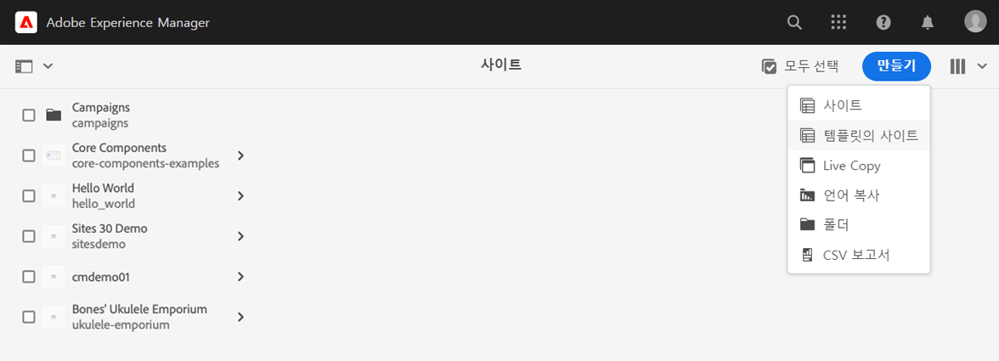

1. 사이트 생성 마법사에서 왼쪽 열 상단에 있는 **가져오기**&#x200B;를 탭하거나 클릭합니다.

   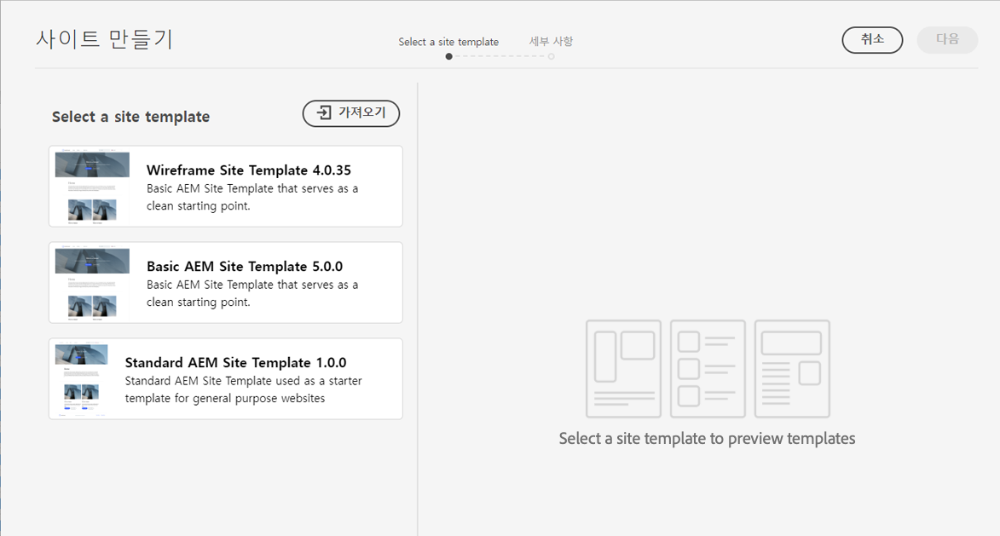

1. 파일 브라우저에서 [이전에 다운로드한](#obtaining-template) 템플릿을 찾은 다음 **업로드**&#x200B;를 탭하거나 클릭합니다.

1. 업로드되면 사용할 수 있는 템플릿 목록에 표시됩니다. 해당 템플릿을 탭하거나 클릭하여 선택한 다음(오른쪽 열에 템플릿에 대한 정보도 표시됨) **다음**&#x200B;을 선택합니다.

   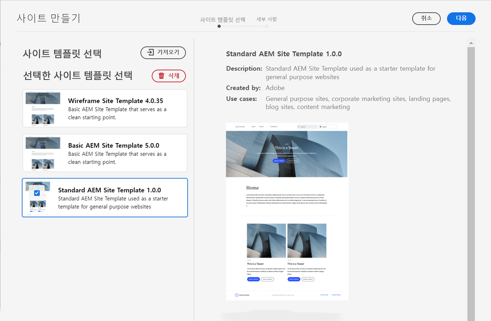

1. 사이트의 제목을 입력합니다. 사이트 이름을 입력하거나 생략할 수 있으며, 생략할 경우 자동으로 제목에서 생성됩니다.

   * 브라우저의 제목 표시줄에 사이트 제목이 표시됩니다.
   * 사이트 이름은 URL의 일부가 됩니다.

1. **만들기**&#x200B;를 탭하거나 클릭하면 사이트 템플릿으로부터 새 사이트가 생성됩니다.

   

1. 표시되는 확인 대화 상자에서 **완료**&#x200B;를 탭하거나 클릭합니다.

   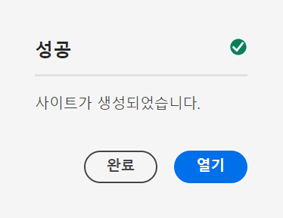

1. 사이트 콘솔에 새 사이트가 표시되며, 해당 사이트를 탐색하여 템플릿에서 정의한 기본 구조를 살펴볼 수 있습니다.

   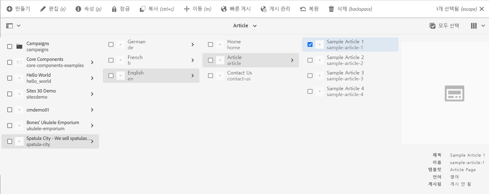

이제 콘텐츠 작성자는 작성을 시작할 수 있습니다.

## 추가적인 맞춤화가 필요합니까? {#customization-required}

사이트 템플릿은 매우 강력하고 유연한 도구로, 프로젝트에 대해 원하는 수의 사이트 템플릿을 만들어 손쉽게 사이트 변형을 만들 수 있습니다. 사용 중인 사이트 템플릿에서 수행한 맞춤화의 수준에 따라, 추가적인 프론트엔드 맞춤화가 필요하지 않을 수도 있습니다.

* 사이트에 추가적인 맞춤화가 필요하지 않다면 축하합니다! 귀하의 여정은 여기서 끝납니다.
* 추가 프론트엔드 맞춤화가 여전히 필요하거나, 향후 맞춤화가 필요한 경우 전체 프로세스를 이해하고자 하는 경우 계속 읽으십시오.

## 예제 페이지 {#example-page}

추가적인 프론트엔드 맞춤화가 필요한 경우, 프론트엔드 개발자가 귀하의 콘텐츠 세부 정보를 숙지하고 있지 않을 수도 있음을 염두에 두어야 합니다. 따라서 개발자에게 테마를 맞춤화할 때 참조의 기반으로 사용할 수 있는 일반적인 콘텐츠로의 경로를 제공하는 것이 좋습니다. 대표적인 예로 사이트의 마스터 언어에 대한 홈 페이지를 들 수 있습니다.

1. 사이트 브라우저에서 사이트 마스터 언어의 홈 페이지로 이동하고 페이지를 탭하거나 클릭하여 선택한 다음 메뉴 바에서 **편집**&#x200B;을 탭하거나 클릭합니다.

   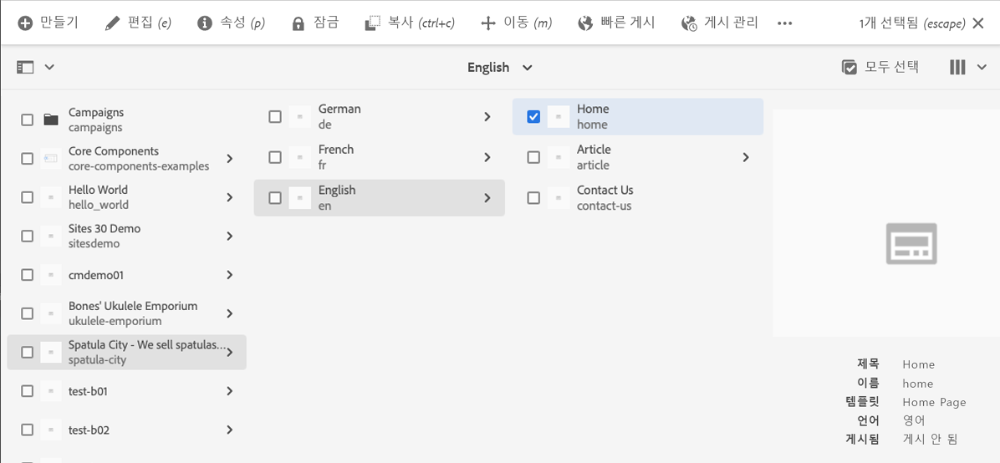

1. 편집기에서 도구 모음의 **페이지 정보** 버튼을 선택한 다음 **게시됨으로 보기**&#x200B;를 선택합니다.

   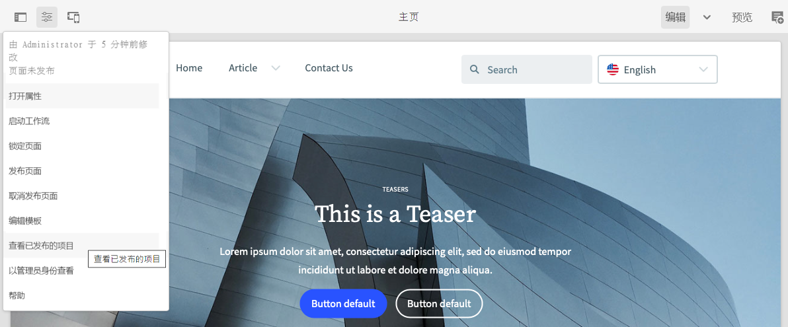

1. 화면에 표시되는 탭에서 주소창에 있는 콘텐츠 경로를 복사합니다. 예: `/content/<your-site>/en/home.html?wcmmode=disabled`

   

1. 나중에 프론트엔드 개발자에게 제공하기 위해 경로를 저장합니다.

## 테마 다운로드 {#download-theme}

이제 사이트를 만들었으므로 템플릿으로 생성한 사이트 테마를 다운로드하고 프론트엔드 개발자에게 제공하여 맞춤화할 수 있습니다.

1. 사이트 콘솔에서 **사이트** 레일을 표시합니다.

   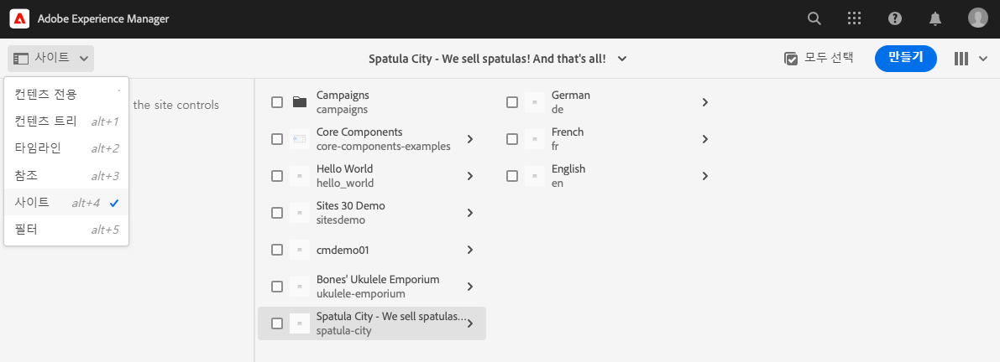

1. 새 사이트의 루트를 탭하거나 클릭한 다음 사이트 레일에서 **테마 소스 다운로드**&#x200B;를 탭하거나 클릭합니다.

   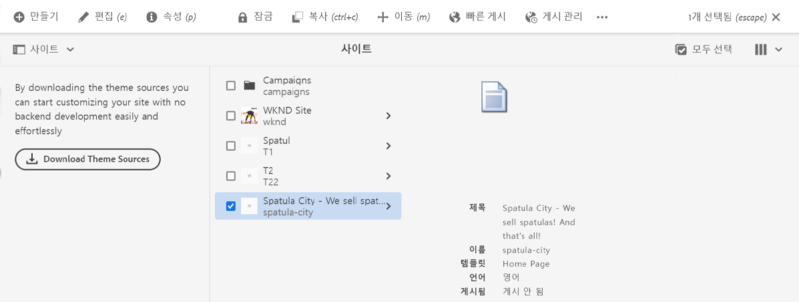

이제 다운로드 파일에 테마 소스 파일의 사본이 있습니다.

## 프록시 사용자 설정 {#proxy-user}

프론트엔드 개발자가 사이트의 실제 AEM 콘텐츠를 사용하여 맞춤화를 미리 보도록 하려면 프록시 사용자를 설정해야 합니다.

1. AEM의 메인 탐색에서 **도구** -> **보안** -> **사용자**&#x200B;로 이동합니다.
1. 사용자 관리 콘솔에서 **만들기**&#x200B;를 탭하거나 클릭합니다.

   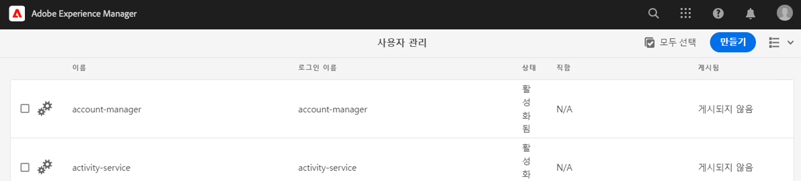
1. **새 사용자 만들기** 창에서 최소한 다음과 같은 항목을 입력해야 합니다.
   * **ID** - 프론트엔드 개발자에게 제공해야 하므로 이 값을 적어 두십시오.
   * **암호** - 프론트엔드 개발자에게 제공해야 하므로 이 값을 안전하게 저장해 두십시오.

   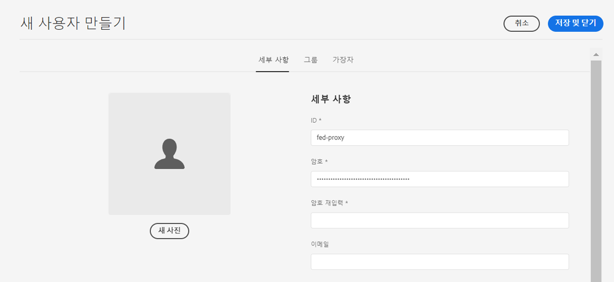

1. **그룹** 탭에서 프록시 사용자를 `contributors` 그룹에 추가합니다.
   * `contributors`라는 용어를 입력하면 그룹을 쉽게 선택할 수 있도록 AEM의 자동 완성 기능이 트리거됩니다.

   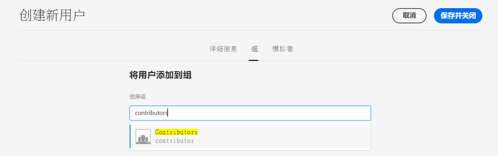

1. **저장 및 닫기**&#x200B;를 탭하거나 클릭합니다.

이제 구성이 완료되었습니다. 이제 콘텐츠 작성자는 여정의 다음 단계에서의 프론트엔드 맞춤화를 시작하는 사이트 준비 단계로 이동하여 콘텐츠를 만들 수 있습니다.

## 다음 단계 {#what-is-next}

AEM 빠른 사이트 생성 여정의 한 부분을 완료했으므로,

* AEM 사이트 템플릿을 얻는 방법을 이해할 수 있습니다.
* 템플릿을 사용하여 새 사이트를 만드는 방법을 이해할 수 있습니다.
* 새 사이트에서 템플릿을 다운로드하여 프론트엔드 개발자에게 제공하는 방법을 파악할 수 있습니다.

이 지식을 기반으로 다음 문서인 [파이프라인 설정](pipeline-setup.md)을 검토하여 AEM 빠른 사이트 생성 여정을 계속하십시오. 여기에서는 사이트 테마의 맞춤화를 관리할 수 있는 프론트엔드 파이프라인을 만들게 됩니다.

## 추가 리소스 {#additional-resources}

다음 문서인 [파이프라인 설정](pipeline-setup.md)을 검토하여 빠른 사이트 생성 여정의 다음 부분으로 넘어가는 것이 좋습니다. 다음은 이 문서에 나열된 몇 가지 개념을 자세히 알아보는 추가적인 옵션 리소스이며, 이들 리소스를 여정에서 계속 사용할 필요는 없습니다.

* [AEM 표준 사이트 템플릿](https://github.com/adobe/aem-site-template-standard) - AEM 표준 사이트 템플릿의 GitHub 저장소입니다.
* [페이지 생성 및 관리](/help/sites-cloud/authoring/fundamentals/organizing-pages.md) - 템플릿으로 AEM 사이트를 만든 다음 추가로 맞춤화하고자 하는 경우 여기에서 AEM 사이트의 페이지를 관리하는 방법에 대한 내용을 살펴볼 수 있습니다.
* [패키지를 사용하여 작업하는 방법](/help/implementing/developing/tools/package-manager.md) - 패키지를 사용하여 저장소 콘텐츠를 가져오고 내보낼 수 있습니다. 이 문서에서는 AEM 6.5의 패키지를 사용하여 작업하는 방법에 대해 설명합니다(AEMaaCS에도 적용됨).
* [사이트 관리 설명서](/help/sites-cloud/administering/site-creation/create-site.md) - 빠른 사이트 생성 도구의 기능에 대한 자세한 내용은 사이트 생성에 대한 기술 문서를 확인하십시오.
* [AEM Sites 페이지에 양식 만들기 또는 추가](/help/forms/create-or-add-an-adaptive-form-to-aem-sites-page.md) - 양식을 웹 사이트에 통합하고 디지털 경험을 최적화하여 효과를 극대화하기 위한 단계별 기술과 모범 사례에 대해 알아봅니다.
