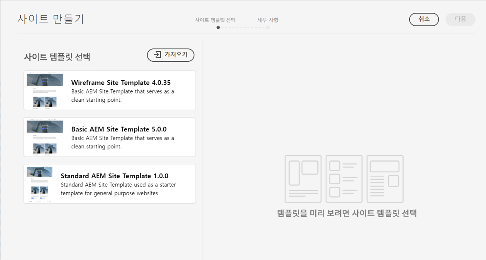
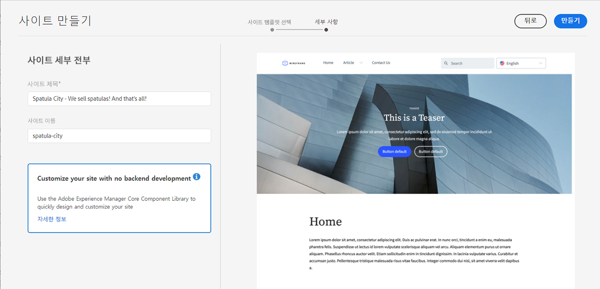

# 템플릿에서 사이트 만들기 {#create-site-from-template}

사이트 템플릿을 사용하여 새 AEM 사이트를 빠르게 만드는 방법을 알아봅니다.

>[!CAUTION]
>
>빠른 사이트 만들기 도구는 현재 기술 미리 보기입니다. 테스트 및 평가 목적으로 사용할 수 있으며, Adobe 지원에 동의하지 않는 프로덕션 용도에는 사용할 수 없습니다.

## 지금까지 그 이야기 {#story-so-far}

AEM 빠른 사이트 만들기 여정의 이전 문서에서, [Cloud Manager 및 빠른 사이트 생성 워크플로우를 이해합니다.](cloud-manager.md) Cloud Manager와 새로운 빠른 사이트 생성 프로세스를 결합하는 방법에 대해 학습했으므로 다음을 수행해야 합니다.

* 프런트 엔드 개발을 지원하기 위해 AEM Sites과 Cloud Manager가 함께 작동하는 방식을 이해합니다
* 프런트엔드 사용자 지정 단계가 AEM에서 완전히 분리되고 AEM 지식이 필요하지 않은 방법을 참조하십시오.

이 문서는 이러한 기본 사항을 기반으로 하여 첫 번째 구성 단계를 수행하고 나중에 프런트 엔드 도구를 사용하여 사용자 지정할 수 있는 템플릿에서 새 사이트를 만들 수 있습니다.

## 목표 {#objective}

이 문서는 사이트 템플릿을 사용하여 새 AEM 사이트를 빠르게 만드는 방법을 이해하는 데 도움이 됩니다. 읽은 후에는 다음을 수행해야 합니다.

* AEM 사이트 템플릿을 가져오는 방법을 이해합니다.
* 템플릿을 사용하여 새 사이트를 만드는 방법을 알아봅니다.
* 프런트엔드 개발자에게 제공하기 위해 새 사이트에서 템플릿을 다운로드하는 방법을 참조하십시오.

## 책임 역할 {#responsible-role}

이 여정 부분은 AEM 관리자에게 적용됩니다.

## 사이트 템플릿 {#site-templates}

사이트 템플릿은 기본 사이트 컨텐츠를 간편하고 재사용 가능한 패키지로 결합하는 방법입니다. 사이트 템플릿에는 일반적으로 기본 사이트 콘텐츠 및 구조와 사이트 스타일 정보가 포함되어 있어 새로운 사이트를 빠르게 시작할 수 있습니다. 실제 구조는 다음과 같습니다.

* `files`: UI 키트, XD 파일 및 기타 파일이 있는 폴더
* `previews`: 사이트 템플릿의 스크린샷이 있는 폴더
* `site`: 페이지 템플릿, 페이지 등과 같이 이 템플릿에서 만든 각 사이트에 대해 복사되는 컨텐츠의 컨텐츠 패키지
* `theme`: CSS, JavaScript 등을 포함하여 사이트가 표시되는 방식을 수정하는 템플릿 테마의 소스입니다.

템플릿은 재사용 가능하므로 컨텐츠 작성자가 사이트를 빠르게 만들 수 있습니다. 또한 AEM 설치에서 여러 템플릿을 사용할 수 있으므로 다양한 비즈니스 요구 사항을 충족할 수 있습니다.

>[!NOTE]
>
>사이트 템플릿을 페이지 템플릿과 혼동하지 않도록 합니다. 여기에 설명된 사이트 템플릿은 사이트의 전체 구조를 정의합니다. 페이지 템플릿은 개별 페이지의 구조 및 초기 컨텐츠를 정의합니다.

## 사이트 템플릿 가져오기 {#obtaining-template}

시작하는 가장 간단한 방법은 다음과 같습니다 [gitHub 저장소에서 AEM Standard Site Template 최신 릴리스를 다운로드합니다.](https://github.com/adobe/aem-site-template-standard/releases)

다운로드한 후에는 다른 패키지와 마찬가지로 AEM 환경에 업로드할 수 있습니다. 자세한 내용은 [추가 리소스 섹션](#additional-resources) 이 항목에 대한 자세한 내용이 필요한 경우 패키지 작업 방법에 대한 자세한 내용을 참조하십시오.

>[!TIP]
>
>AEM Standard Site 템플릿을 프로젝트의 요구 사항에 맞게 사용자 지정할 수 있으며 추가 사용자 지정이 필요하지 않을 수 있습니다. 그러나 이 항목은 이 여정의 범위를 벗어납니다. 자세한 내용은 표준 사이트 템플릿의 GitHub 설명서를 참조하십시오.

>[!TIP]
>
>프로젝트 워크플로우의 일부로 소스에서 템플릿을 작성할 수도 있습니다. 그러나 이 항목은 이 여정의 범위를 벗어납니다. 자세한 내용은 표준 사이트 템플릿의 GitHub 설명서를 참조하십시오.

## 사이트 템플릿 설치 {#installing-template}

템플릿을 사용하여 새 사이트를 만드는 것은 매우 쉽습니다.

1. AEM 작성 환경에 로그인하고 사이트 콘솔로 이동합니다

   * `https://<your-author-environment>.adobeaemcloud.com/sites.html/content`

1. 탭 또는 클릭 **만들기** 화면의 오른쪽 상단에서 을(를) 선택하고 드롭다운 메뉴에서 을(를) 선택합니다 **템플릿의 사이트**.

   

1. 사이트 만들기 마법사에서 을 탭하거나 클릭합니다 **가져오기** 를 클릭합니다.

   

1. 파일 브라우저에서 템플릿을 찾습니다 [이전에 다운로드했습니다.](#obtaining-template) 탭하거나 클릭합니다. **업로드**.

1. 업로드되면 사용 가능한 템플릿 목록에 표시됩니다. 탭하거나 클릭하여 선택한 다음(오른쪽 열의 템플릿에 대한 정보도 표시) 탭하거나 클릭합니다 **다음**.

   

1. 사이트의 제목을 입력합니다. 사이트 이름을 제공할 수 있거나, 생략하면 제목에서 생성됩니다.

   * 사이트 제목은 브라우저 제목 표시줄에 나타납니다.
   * 사이트 이름이 URL의 일부가 됩니다.

1. 탭 또는 클릭 **만들기** 새 사이트는 사이트 템플릿에서 만들어집니다.

   

1. 확인 대화 상자가 표시되면 을 탭하거나 클릭합니다 **완료**.

   

1. 사이트 콘솔에서는 새 사이트가 표시되며 템플릿으로 정의된 기본 구조를 탐색하여 탐색할 수 있습니다.

   

이제 컨텐츠 작성자가 작성을 시작할 수 있습니다.

## 추가 사용자 지정이 필요합니까? {#customization-required}

사이트 템플릿은 매우 강력하고 유연하며 프로젝트에 사용할 수 있는 숫자를 만들어 쉽게 만들 수 있습니다. 사용하는 사이트 템플릿에서 이미 수행한 사용자 지정 수준에 따라, 추가 프런트 엔드 사용자 지정이 필요하지 않을 수 있습니다.

* 사이트에 추가 사용자 지정이 필요하지 않은 경우 축하합니다! 여정은 여기에서 끝납니다!
* 여전히 추가 프런트 엔드 사용자 지정이 필요하거나 향후 사용자 지정이 필요한 경우에 전체 프로세스를 이해하려면 계속 읽으십시오.

## 예제 페이지 {#example-page}

추가 프런트 엔드 사용자 지정이 필요한 경우 프런트 엔드 개발자는 컨텐츠의 세부 사항을 잘 알지 못할 수 있습니다. 따라서 테마를 사용자 지정할 때 참조 기반으로 사용할 수 있는 일반적인 컨텐츠에 대한 경로를 개발자에게 제공하는 것이 좋습니다. 일반적인 예제는 사이트의 마스터 언어용 홈 페이지입니다.

1. 사이트 브라우저에서 사이트의 마스터 언어의 홈 페이지로 이동한 다음 페이지를 탭하거나 클릭하여 선택하고 탭하거나 클릭합니다 **편집** 메뉴 모음에서 를 클릭합니다.

   

1. 편집기에서 **페이지 정보** 단추를 누른 다음 **게시됨으로 보기**.

   

1. 열리는 탭에서 주소 표시줄의 컨텐츠 경로를 복사합니다. 그런 것 같아요 `/content/<your-site>/en/home.html?wcmmode=disabled`.

   

1. 나중에 프런트 엔드 개발자에게 제공할 경로를 저장합니다.

## 테마 다운로드 {#download-theme}

사이트가 만들어졌으므로 이제 템플릿으로 생성된 사이트의 테마를 다운로드하여 사용자 지정을 위해 프런트 엔드 개발자에게 제공할 수 있습니다.

1. 사이트 콘솔에서 를 표시합니다. **사이트** 레일.

   

1. 새 사이트의 루트를 탭하거나 클릭한 다음, 탭하거나 클릭합니다 **테마 소스 다운로드** ( 사이트 레일에 있습니다.)

   

이제 다운로드 파일에 테마 소스 파일의 복사본이 있습니다.

## 프록시 사용자 설정 {#proxy-user}

프런트 엔드 개발자가 사이트의 실제 AEM 콘텐츠를 사용하여 사용자 지정을 미리 보려면 프록시 사용자를 설정해야 합니다.

1. 기본 탐색의 AEM에서 로 이동합니다. **도구** -> **보안** -> **사용자**.
1. 사용자 관리 콘솔에서 을(를) 탭하거나 클릭합니다 **만들기**.

   
1. 에서 **새 사용자 만들기** 최소 제공 기간:
   * **ID** - 프런트 엔드 개발자에게 제공해야 하므로 이 값을 주목하십시오.
   * **암호** - 이 값을 프런트 엔드 개발자에게 제공해야 하므로 암호 보관소에 안전하게 저장합니다.

   

1. 설정 **그룹** 탭에서 프록시 사용자를 `contributors` 그룹에 속해 있어야 합니다.
   * 용어 입력 `contributors` 그룹을 쉽게 선택할 수 있도록 AEM 자동 완성 기능을 트리거합니다.

   

1. 탭 또는 클릭 **저장 및 닫기**.

이제 구성을 완료했습니다. 이제 컨텐츠 작성자가 여정의 다음 단계에서 프런트 엔드 사용자 지정을 위해 사이트 준비 시 컨텐츠를 만들 수 있습니다.

## 다음은 무엇입니까? {#what-is-next}

이제 AEM 빠른 사이트 만들기 여정의 이 부분을 완료했으므로 다음을 수행해야 합니다.

* AEM 사이트 템플릿을 가져오는 방법을 이해합니다.
* 템플릿을 사용하여 새 사이트를 만드는 방법을 알아봅니다.
* 프런트엔드 개발자에게 제공하기 위해 새 사이트에서 템플릿을 다운로드하는 방법을 참조하십시오.

이 지식을 바탕으로 작성하고 다음 문서를 검토하여 AEM 빠른 사이트 만들기 여정을 계속 진행합니다 [파이프라인을 설정합니다.](pipeline-setup.md) 여기서 의 프런트 엔드 파이프라인을 만들어 사이트 테마의 사용자 지정을 관리합니다.

## 추가 리소스 {#additional-resources}

문서를 검토하여 빠른 사이트 만들기 여정의 다음 부분으로 이동하는 것이 좋습니다 [파이프라인을 설정합니다.](pipeline-setup.md) 다음은 이 문서에서 언급된 일부 개념을 자세히 설명하는 몇 가지 추가 선택적 리소스입니다. 여정을 계속 진행할 필요는 없습니다.

* [AEM Standard 사이트 템플릿](https://github.com/adobe/aem-site-template-standard) - AEM Standard Site 템플릿의 GitHub 리포지토리입니다.
* [페이지 생성 및 구성](/help/sites-cloud/authoring/fundamentals/organizing-pages.md) - 이 안내서에서는 템플릿에서 페이지를 만든 후 추가로 사용자 지정하려는 경우 AEM Site의 페이지를 관리하는 방법을 자세히 설명합니다.
* [패키지 작업 방법](/help/implementing/developing/tools/package-manager.md) - 패키지를 사용하면 저장소 컨텐츠를 가져오고 내보낼 수 있습니다. 이 문서에서는 AEMaaCS에도 적용되는 AEM 6.5에서 패키지를 사용하는 방법을 설명합니다.
* [사이트 관리 설명서](/help/sites-cloud/administering/site-creation/create-site.md) - 빠른 사이트 만들기 도구의 기능에 대한 자세한 내용은 사이트 작성 시 기술 문서를 참조하십시오.
