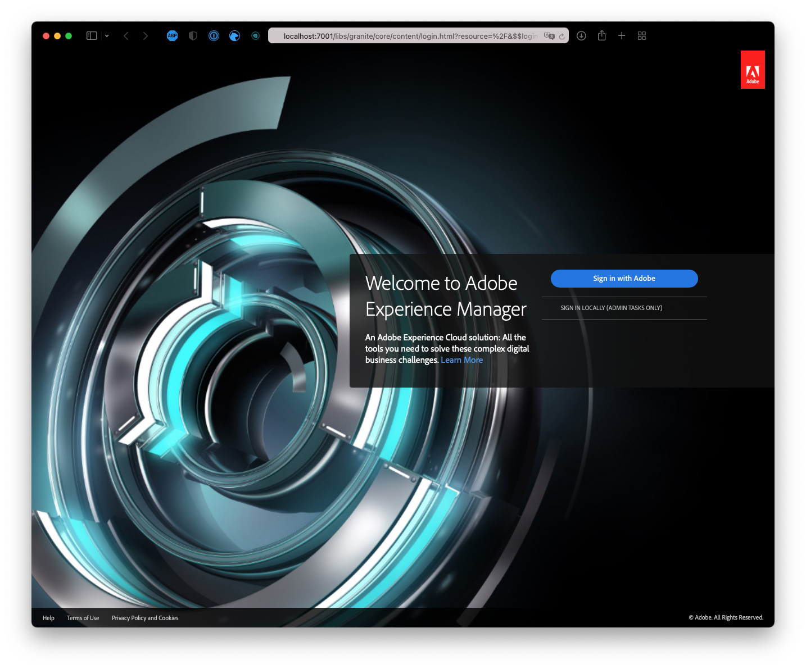

# 사이트 테마 맞춤화 {#customize-the-site-theme}

라이브 AEM 콘텐츠를 사용하여 사이트 테마를 빌드하고, 맞춤화하고, 테스트하는 방법에 대해 알아봅니다.

## 지금까지의 스토리 {#story-so-far}

AEM 빠른 사이트 생성 여정의 이전 문서인 [git 저장소 액세스 정보 가져오기](retrieve-access.md)에서는 프론트엔드 개발자가 Cloud Manager를 사용하여 git 저장소 정보에 액세스하는 방법에 대해 알아보았습니다. 여기에서 알게 된 내용은 다음과 같습니다.

* Cloud Manager에 대한 대략적인 내용을 이해할 수 있습니다.
* 맞춤화를 커밋할 수 있도록 AEM git에 액세스할 수 있는 자격 증명을 가져올 수 있습니다.

이 부분의 여정에서는 다음 단계를 수행하여 사이트 테마를 자세히 살펴보고 이를 맞춤화한 다음 가져온 액세스 자격 증명을 사용하여 이러한 맞춤화를 커밋하는 방법에 대해 설명합니다.

## 목표 {#objective}

이 문서에서는 라이브 AEM 콘텐츠를 사용하여 AEM 사이트 테마를 빌드하고, 맞춤화하고, 테스트하는 방법에 대해 설명합니다. 문서를 읽고 나면

* 사이트 테마의 기본 구조 및 이를 편집하는 방법을 이해할 수 있습니다.
* 로컬 프록시를 통해 실제 AEM 콘텐츠를 사용하여 테마 맞춤화를 테스트하는 방법을 이해할 수 있습니다.
* 변경 내용을 AEM git 저장소에 커밋하는 방법을 이해할 수 있습니다.

## 담당 역할 {#responsible-role}

이 부분의 여정은 프론트엔드 개발자에게 적용됩니다.

## 테마 구조 이해 {#understand-theme}

AEM 관리자가 제공한 테마를 편집하고자 하는 위치로 추출하여 원하는 편집기에서 엽니다.


테마는 일반적인 프론트엔드 프로젝트입니다. 구조의 가장 중요한 부분은 다음과 같습니다.

* `src/main.ts`: JS 및 CSS 테마의 주요 진입점
* `src/site`: 전체 사이트에 적용되는 JS 및 CSS 파일
* `src/components`: AEM 구성 요소와 관련된 JS 및 CSS 파일
* `src/resources`: 아이콘, 로고 및 글꼴과 같은 정적 파일

>[!TIP]
>
>표준 AEM 사이트 테마에 대한 자세한 내용은 이 문서의 끝에 있는 [추가 리소스](#additional-resources) 섹션의 GitHub 링크를 참조하십시오.

테마 프로젝트의 구조에 익숙해졌다면 로컬 프록시를 시작하여 실제 AEM 콘텐츠를 기반으로 테마 맞춤화를 실시간으로 확인할 수 있습니다.

## 로컬 프록시 시작 {#starting-proxy}

1. 명령줄에서 로컬 컴퓨터의 테마 루트로 이동합니다.
1. `npm install`을 실행하면 npm이 종속성을 가져오고 프로젝트를 설치합니다.

   

1. `npm run live`를 실행하면 프록시 서버가 시작됩니다.

   

1. 프록시 서버가 시작되면 `http://localhost:7001/`로의 브라우저가 자동으로 열립니다. **로컬에서 로그인(관리 작업만 해당)**&#x200B;을 선택하여 AEM 관리자가 제공한 프록시 사용자 자격 증명을 사용하여 로그인합니다.

   

   >[!TIP]
   >
   >이러한 자격 증명이 없는 경우 이 여정의 [템플릿으로 사이트 만들기 문서 중 프록시 사용자 설정 섹션](/help/journey-sites/quick-site/create-site.md#proxy-user)을 참조하여 관리자에게 문의하십시오.

1. 로그인한 후 브라우저에서 AEM 관리자가 제공한 샘플 콘텐츠로의 경로를 표시하도록 URL을 변경합니다.

   * 예를 들어 제공된 경로가 `/content/<your-site>/en/home.html?wcmmode=disabled`인 경우
   * URL을 `http://localhost:7001/content/<your-site>/en/home.html?wcmmode=disabled`로 변경하면 됩니다.

   

사이트를 탐색하여 콘텐츠를 살펴볼 수 있습니다. 라이브 AEM 인스턴스에서 실시간으로 사이트를 가져와 실제 콘텐츠에 대해 테마를 맞춤화할 수 있습니다.

## 테마 맞춤화 {#customize-theme}

이제 테마 맞춤화를 시작할 수 있습니다. 다음은 프록시를 통해 실시간으로 변경 내용을 확인할 수 있는 방법을 설명하는 간단한 예입니다.

1. 편집기에서 `<your-theme-sources>/src/site/_variables.scss` 파일을 엽니다.

   

1. 변수 `$color-background`를 편집한 다음 흰색 이외의 값으로 설정합니다. 이 예에서는 `orange`가 사용되었습니다.

   

1. 파일을 저장하면 프록시 서버는 `[Browsersync] File event [change]` 라인을 통해 변경 내용을 인식합니다.

   

1. 프록시 서버의 브라우저로 다시 전환하면 변경 내용이 즉시 표시됩니다.

   

AEM 관리자가 제공한 요구 사항을 기반으로 테마를 계속 맞춤화할 수 있습니다.

## 변경 내용 커밋 {#committing-changes}

맞춤화가 완료되면 이를 AEM git 저장소에 커밋할 수 있습니다. 먼저 로컬 컴퓨터에 저장소를 복제해야 합니다.

1. 명령줄에서 저장소를 복제하고자 하는 위치로 이동합니다.
1. [이전에 Cloud Manager에서 가져온 명령을 실행합니다.](retrieve-access.md) 이는 `git clone https://git.cloudmanager.adobe.com/<my-org>/<my-program>/`과 유사해야 합니다. [이 여정의 이전 부분에서 가져온](retrieve-access.md) git 사용자 이름 및 암호를 사용합니다.

   

1. `mv <site-theme-sources> <cloned-repo>`와 유사한 명령을 사용하여 편집한 테마 프로젝트를 복제된 저장소로 이동합니다.
1. 복제된 저장소의 디렉터리에서 다음 명령을 사용하여 이동한 테마 파일을 커밋합니다.

   ```text
   git add .
   git commit -m "Adding theme sources"
   git push
   ```

1. AEM git 저장소에 맞춤화가 푸시됩니다.

   

이제 맞춤화는 AEM git 저장소에 안전하게 저장되었습니다.

## 다음 단계 {#what-is-next}

AEM 빠른 사이트 생성 여정의 한 부분을 완료했으므로,

* 사이트 테마의 기본 구조 및 이를 편집하는 방법을 이해할 수 있습니다.
* 로컬 프록시를 통해 실제 AEM 콘텐츠를 사용하여 테마 맞춤화를 테스트하는 방법을 이해할 수 있습니다.
* 변경 내용을 AEM git 저장소에 커밋하는 방법을 이해할 수 있습니다.

이 지식을 기반으로 다음 문서인 [맞춤화된 테마 배포](deploy-theme.md)를 검토하여 AEM 빠른 사이트 생성 여정을 계속하십시오. 여기에서는 프론트엔드 파이프라인을 사용하여 테마를 배포하는 방법에 대해 알아봅니다.

## 추가 리소스 {#additional-resources}

다음 문서인 [맞춤화된 테마 배포](deploy-theme.md)를 검토하여 빠른 사이트 생성 여정의 다음 부분으로 넘어가는 것이 좋습니다. 다음은 이 문서에 나열된 몇 가지 개념을 자세히 알아보는 추가적인 옵션 리소스이며, 이들 리소스를 여정에서 계속 사용할 필요는 없습니다.

* [AEM 사이트 테마](https://github.com/adobe/aem-site-template-standard-theme-e2e) - AEM 사이트 테마의 GitHub 저장소입니다.
* [npm](https://www.npmjs.com) - 사이트를 간편하게 빌드하기 위해 사용하는 AEM 테마는 npm을 기반으로 합니다.
* [Webpack](https://webpack.js.org) - 사이트를 간편하게 빌드하기 위해 사용하는 AEM 테마는 Webpack을 사용합니다.
