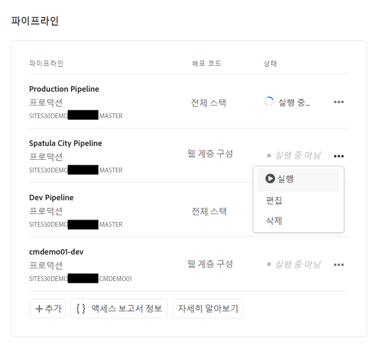

# 맞춤화된 테마 배포 {#deploy-your-customized-theme}

파이프라인을 사용하여 사이트 테마를 배포하는 방법에 대해 알아봅니다.

## 지금까지의 이야기 {#story-so-far}

AEM 빠른 사이트 생성 여정의 이전 문서인 [사이트 테마 맞춤화](customize-theme.md)에서는 라이브 AEM 콘텐츠를 사용하여 테마를 구축하고, 맞춤화하고, 테스트하는 방법에 대해 알아보았습니다. 여기에서 알게 된 내용은 다음과 같습니다.

* 사이트 테마의 기본 구조 및 이를 편집하는 방법을 이해할 수 있습니다.
* 로컬 프록시를 통해 실제 AEM 콘텐츠를 사용하여 테마 맞춤화를 테스트하는 방법을 이해할 수 있습니다.
* 변경 내용을 AEM git 저장소에 커밋하는 방법을 이해할 수 있습니다.

이제 마지막 단계를 수행하고 파이프라인을 사용하여 이를 배포할 수 있습니다.

## 목표 {#objective}

이 문서에서는 파이프라인을 사용하여 테마를 배포하는 방법을 설명합니다. 문서를 읽고 나면

* 파이프라인 배포를 트리거하는 방법을 이해할 수 있습니다.
* 배포 상태를 확인하는 방법을 파악할 수 있습니다.

## 담당 역할 {#responsible-role}

이 부분의 여정은 프론트엔드 개발자에게 적용됩니다.

## 파이프라인 시작 {#start-pipeline}

테마 맞춤화 변경 내용을 AEM git 저장소에 커밋한 후에는 [관리자가 제작한 파이프라인](pipeline-setup.md)을 실행하여 변경 내용을 배포할 수 있습니다.

1. [git 액세스 정보를 가져왔을 때처럼](retrieve-access.md) Cloud Manager에 로그인한 다음 프로그램에 액세스합니다. **개요** 탭에 **파이프라인**&#x200B;용 카드가 표시됩니다.

   

1. 시작하려는 파이프라인 옆에 있는 생략 부호를 탭하거나 클릭합니다. 드롭다운 메뉴에서 **실행**&#x200B;을 선택합니다.

   

1. **파이프라인 실행** 확인 대화 상자에서 **예**&#x200B;를 탭하거나 클릭합니다.

   

1. 파이프라인 목록에서 상태 열은 파이프라인이 현재 실행 중임을 나타냅니다.

   

## 파이프라인 상태 확인 {#pipeline-status}

언제든지 파이프라인 상태를 확인하여 진행 상황의 세부 정보를 볼 수 있습니다.

1. 파이프라인 옆에 있는 생략 부호를 탭하거나 클릭합니다.

   

1. 파이프라인 세부 정보 창에 파이프라인 진행 상황의 분류가 표시됩니다.

   

>[!TIP]
>
>실패한 단계가 있을 경우 디버깅을 위해 파이프라인 세부 정보 창에서 파이프라인의 원하는 단계에 대해 **로그 다운로드**&#x200B;를 탭하거나 클릭할 수 있습니다. 파이프라인 디버깅은 이 여정에서 다루지 않습니다. 이 페이지의 [추가 리소스](#additional-resources) 섹션에 있는 Cloud Manager의 기술 문서를 참조하십시오.

## 배포된 맞춤화 확인 {#view-customizations}

파이프라인이 완료되면 관리자에게 변경 내용을 확인하라고 알릴 수 있습니다. 그런 다음 관리자는 다음 작업을 수행합니다.

1. AEM 작성 환경을 엽니다.
1. [관리자가 이전에 생성한 사이트](create-site.md)로 이동합니다.
1. 콘텐츠 페이지 중 하나를 편집합니다.
1. 변경 내용을 적용합니다.

## 여정의 끝 {#end-of-journey}

축하합니다! AEM 빠른 사이트 생성 여정을 완료하셨습니다! 이제

* Cloud Manager 및 프론트엔드 파이프라인이 함께 작동하여 프론트엔드 맞춤화를 관리하고 배포하는 방법을 이해할 수 있습니다.
* 템플릿을 기반으로 AEM 사이트를 만들고 사이트 테마를 다운로드하는 방법을 이해할 수 있습니다.
* AEM git 저장소에 액세스할 수 있도록 프론트엔드 개발자를 온보딩하는 방법을 이해할 수 있습니다.
* 프록시화된 AEM 콘텐츠를 사용하여 테마를 맞춤화 및 테스트하고 이러한 변경 내용을 AEM git에 커밋하는 방법을 이해할 수 있습니다.
* 파이프라인을 사용하여 프론트엔드 맞춤화를 배포하는 방법을 이해할 수 있습니다.

이제 나만의 AEM 사이트 테마를 맞춤화할 준비가 되었습니다. 그러나 여러 프론트엔드 파이프라인을 사용하여 다양한 작업 스트림을 만들기 전에 [프론트엔드 파이프라인을 사용한 사이트 개발 문서를 검토하십시오.](/help/implementing/developing/introduction/developing-with-front-end-pipelines.md) 이는 다음을 통해 프론트엔드 개발을 최대한 활용하는 데 도움이 됩니다.

* 단일 소스 유지
* 문제 분리 유지

AEM은 강력한 도구로서 다양한 추가 옵션을 제공합니다. 이 여정에서 확인한 기능들에 대한 자세한 내용은 [추가 리소스 섹션](#additional-resources)에서 사용할 수 있는 몇 가지 추가 리소스를 확인하십시오.

## 추가 리소스 {#additional-resources}

다음은 이 문서에서 언급한 몇 가지 개념에 대해 자세히 설명하는 몇 가지 추가 리소스입니다.

* [사이트 레일을 사용하여 사이트 테마 관리](/help/sites-cloud/administering/site-creation/site-rail.md) - 테마 소스 다운로드 및 테마 버전 관리를 포함하여 사이트 테마를 손쉽게 맞춤화하고 관리하는 데 도움이 되는 사이트 레일의 강력한 기능을 살펴보십시오.
* [AEM as a Cloud Service 기술 설명서](https://experienceleague.adobe.com/docs/experience-manager-cloud-service.html) - AEM에 대해 확실히 이해하고 있다면 바로 심화 기술 문서를 참조할 수 있습니다.
* [Cloud Manager 설명서](https://experienceleague.adobe.com/docs/experience-manager-cloud-service/onboarding/onboarding-concepts/cloud-manager-introduction.html) - Cloud Manager의 기능에 대해 자세히 알아보려면 바로 심화 기술 문서를 참조할 수 있습니다.
* [역할 기반 권한](https://experienceleague.adobe.com/docs/experience-manager-cloud-manager/using/requirements/role-based-permissions.html) - Cloud Manager에는 적절한 권한이 있는 미리 구성된 역할이 있습니다. 이러한 역할 및 이를 관리하는 방법에 대한 자세한 내용은 이 문서를 참조하십시오.
* [Cloud Manager 저장소](/help/implementing/cloud-manager/managing-code/cloud-manager-repositories.md) - AEMaaCS 프로젝트에 대한 Git 저장소를 설정하고 관리하는 방법에 대한 추가 정보가 필요한 경우 이 문서를 참조하십시오.
* [CI/CD 파이프라인 구성 - 클라우드 서비스](/help/implementing/cloud-manager/configuring-pipelines/introduction-ci-cd-pipelines.md) - 이 문서에서 파이프라인(전체 스택 및 프론트엔드) 설정에 대한 자세한 내용을 알아보십시오.
* [AEM 표준 사이트 템플릿](https://github.com/adobe/aem-site-template-standard) - AEM 표준 사이트 템플릿의 GitHub 저장소입니다.
* [AEM 사이트 테마](https://github.com/adobe/aem-site-template-standard-theme-e2e) - AEM 사이트 테마의 GitHub 저장소입니다.
* [npm](https://www.npmjs.com) - 사이트를 간편하게 빌드하기 위해 사용하는 AEM 테마는 npm을 기반으로 합니다.
* [Webpack](https://webpack.js.org) - 사이트를 간편하게 구축하기 위해 사용하는 AEM 테마는 Webpack을 사용합니다.
* [페이지 생성 및 관리](/help/sites-cloud/authoring/fundamentals/organizing-pages.md) - 템플릿으로 AEM 사이트를 만든 다음 추가로 맞춤화하고자 하는 경우 여기에서 AEM 사이트의 페이지를 관리하는 방법에 대한 내용을 살펴볼 수 있습니다.
* [패키지를 사용하여 작업하는 방법](/help/implementing/developing/tools/package-manager.md) - 패키지를 사용하여 저장소 콘텐츠를 가져오고 내보낼 수 있습니다. 이 문서에서는 AEM 6.5의 패키지를 사용하여 작업하는 방법에 대해 설명합니다(AEMaaCS에도 적용됨).
* [온보딩 여정](/help/journey-onboarding/overview.md) - 이 가이드는 팀이 구성되어 AEM as a Cloud Service에 액세스할 수 있도록 하는 출발점이 됩니다.
* [Adobe Experience Manager Cloud Manager 설명서](https://experienceleague.adobe.com/docs/experience-manager-cloud-manager/using/introduction-to-cloud-manager.html) - Cloud Manager의 기능에 대한 자세한 내용은 Cloud Manager 설명서를 살펴보십시오.
* [사이트 관리 설명서](/help/sites-cloud/administering/site-creation/create-site.md) - 빠른 사이트 생성 도구의 기능에 대한 자세한 내용은 사이트 생성에 대한 기술 문서를 확인하십시오.
* [프론트엔드 파이프라인으로 Sites 개발](/help/implementing/developing/introduction/developing-with-front-end-pipelines.md) - 이 문서에서는 프론트엔드 파이프라인을 사용하여 프론트엔드 개발 프로세스의 잠재력을 최대한 활용할 수 있도록 몇 가지 고려해야 할 사항에 대해 설명합니다.
