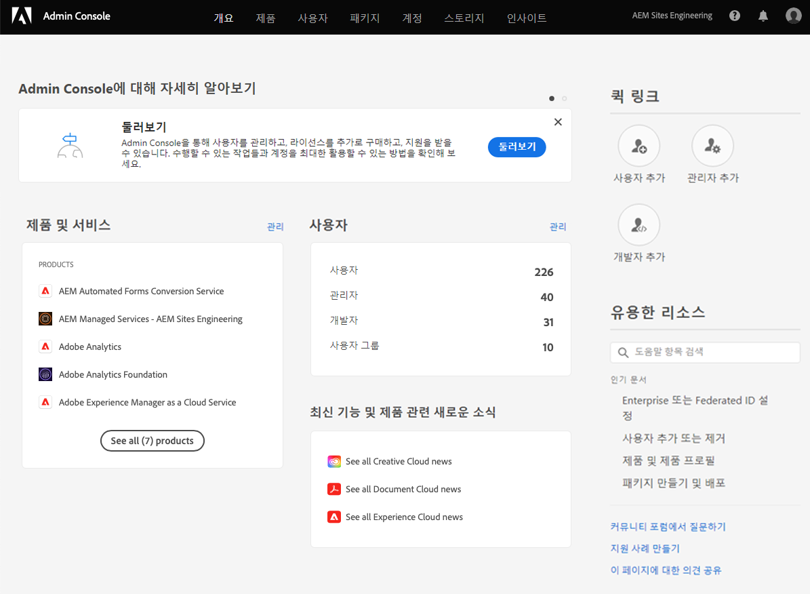
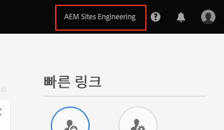
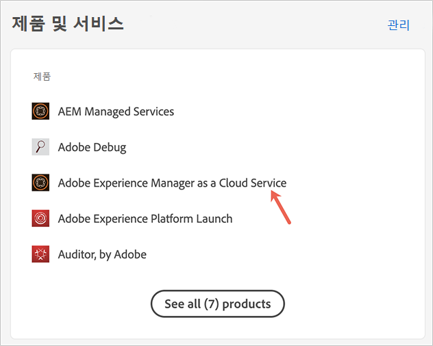
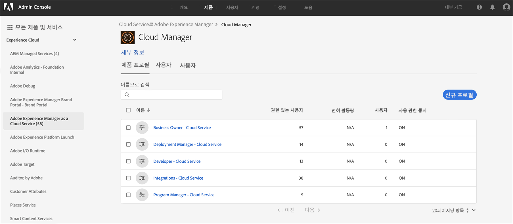
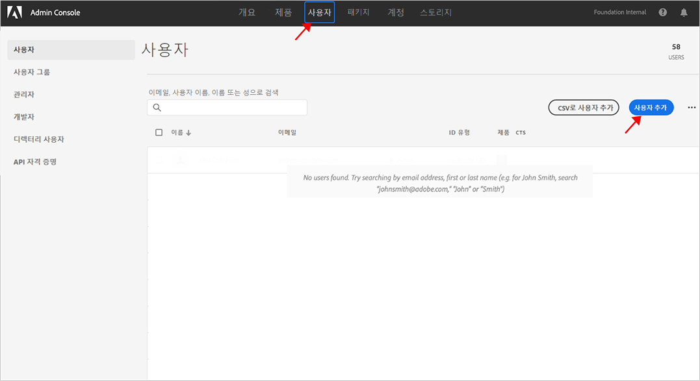
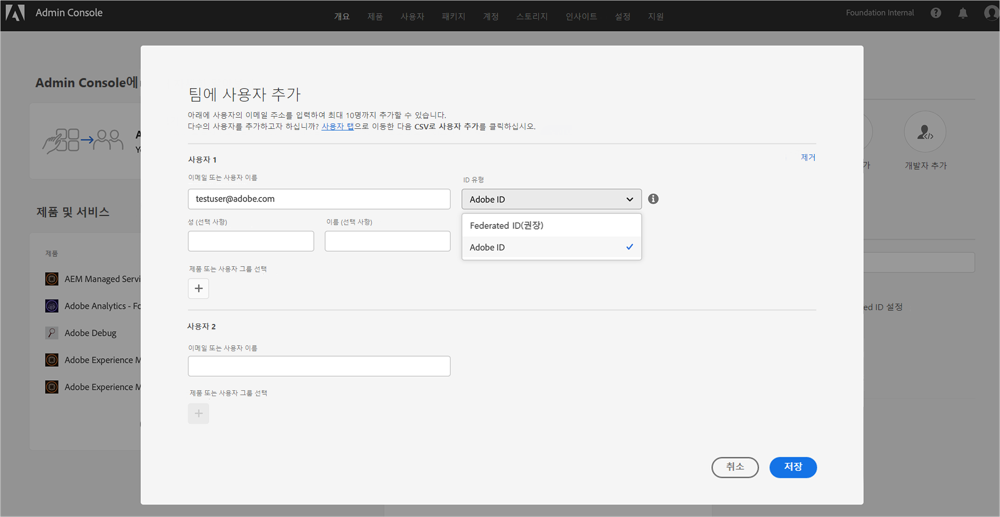
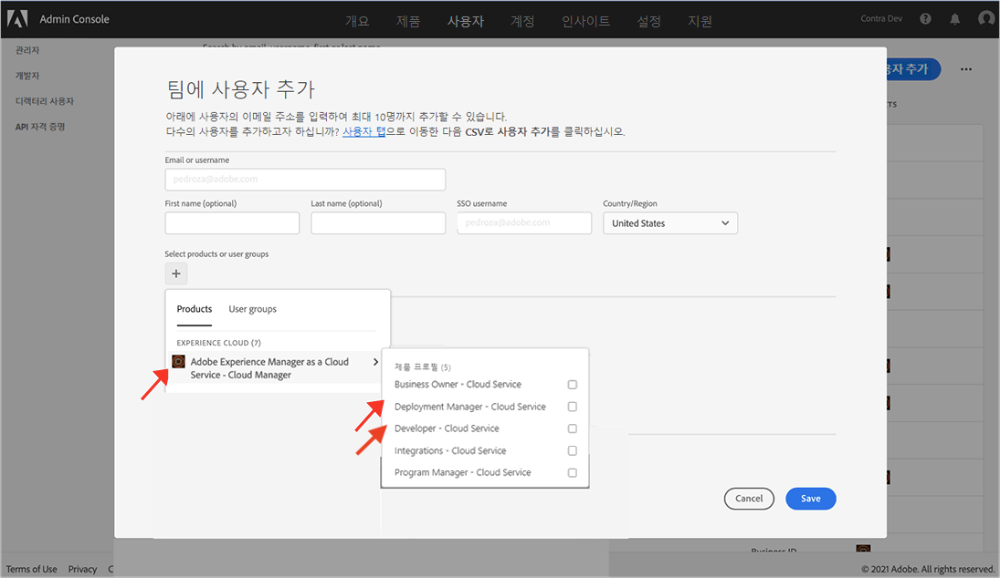

# 프론트엔드 개발자에게 액세스 권한 부여 {#grant-fed-access}

AEM 사이트 git 저장소 및 파이프라인에 액세스할 수 있도록 프론트엔드 개발자를 Cloud Manager에 온보드합니다.

## 지금까지의 스토리 {#story-so-far}

AEM 빠른 사이트 생성 여정의 이전 문서인 [파이프 라인 설정](pipeline-setup.md)에서는 프론트엔드 파이프라인을 제작하여 사이트 테마 맞춤화를 관리하는 방법에 대해 알아보았습니다. 여기에서 알게 된 내용은 다음과 같습니다.

* 프론트엔드 파이프라인에 대해 이해할 수 있습니다.
* Cloud Manager에서 프론트엔드 파이프라인을 설정하는 방법을 이해할 수 있습니다.

이제 온보딩 프로세스를 통해 프론트엔드 개발자에게 Cloud Manager에 대한 액세스 권한을 부여하여 프론트엔드 개발자가 AEM git 저장소 및 제작한 파이프라인에 액세스할 수 있도록 해야 합니다.

## 목표 {#objective}

Cloud Manager에 대한 액세스 권한을 부여하고 사용자에게 사용자 역할을 할당하는 프로세스를 온보딩이라고 합니다. 이 문서는 프론트엔드 개발자 온보딩에 있어 가장 중요한 단계에 대한 개요를 제공하며, 이 문서를 읽고 나면 알게 되는 내용은 다음과 같습니다.

* 프론트엔드 개발자를 사용자로 추가하는 방법
* 프론트엔드 개발자에게 필요한 역할을 부여하는 방법

>[!TIP]
>
>이 프로세스에 대한 추가 내용이 필요한 경우 팀을 AEM as a Cloud service에 온보딩하는 데 필요한 전체 설명서 여정을 살펴볼 수 있습니다(이 문서의 [추가 리소스 섹션](#additional-resources)에 연결됨)

## 담당 역할 {#responsible-role}

이 부분의 여정은 Cloud Manager 관리자에게 적용됩니다.

## 요구 사항 {#requirements}

* Cloud Manager에서 **사업주** 역할의 멤버여야 합니다.
* Cloud Manager에서 **시스템 관리자**&#x200B;여야 합니다.
* Admin Console에 대한 액세스 권한이 필요합니다.

## 프론트엔드 개발자를 사용자로 추가 {#add-fed-user}

먼저 Admin Console을 사용하여 프론트엔드 개발자를 사용자로 추가해야 합니다.

1. [https://adminconsole.adobe.com/](https://adminconsole.adobe.com/)에서 Admin Console에 로그인합니다.

1. 로그인하고 나면 다음 이미지와 유사한 개요 페이지가 표시됩니다.

   

1. 화면 오른쪽 상단에서 조직 이름을 확인하여 올바른 조직에 속해 있는지 확인하십시오.

   

1. **제품 및 서비스** 카드에서 **Adobe Experience Manager as a Cloud Service**&#x200B;를 선택합니다.

   

1. 사전 구성된 Cloud Manager 제품 프로필 목록이 표시됩니다. 이들 프로필이 표시되지 않는 경우 조직에서 올바른 권한을 보유하고 있지 않을 수 있으므로 Cloud Manager 관리자에게 문의하십시오.

   

1. 프론트엔드 개발자에게 올바른 프로필을 할당하려면 **사용자** 탭을 선택한 다음 **사용자 추가** 버튼을 선택합니다.

   

1. **팀에 사용자 추가** 대화 상자에서 추가하려는 사용자의 이메일 ID를 입력합니다. 팀원의 Federated ID가 아직 설정되지 않은 경우 Adobe ID를 ID 유형으로 선택하십시오.

   

1. **제품** 선택에서 플러스 기호를 선택한 다음 **Adobe Experience Manager as a Cloud Service**&#x200B;를 선택하고 사용자에게 **배포 관리자** 및 **개발자** 제품 프로필을 할당합니다.

   

1. **저장**&#x200B;을 선택하면 사용자로 추가한 프론트엔드 개발자에게 시작 이메일이 전송됩니다.

초대된 프론트엔드 개발자는 시작 이메일의 링크를 클릭하고 Adobe ID를 사용하여 로그인함으로써 Cloud Manager에 액세스할 수 있습니다.

## 프론트엔드 개발자에게 양도 {#handover}

프론트엔드 개발자에게 전송되는 Cloud Manager로의 이메일 초대를 통해, 이제 사용자 및 AEM 관리자는 프론트엔드 개발자에게 나머지 필수 정보를 제공하여 맞춤화를 시작할 수 있습니다.

* [일반적인 콘텐츠 경로](#example-page)
* [다운로드한](#download-theme) 테마 소스
* [프록시 사용자 자격 증명](#proxy-user)
* 프로그램 이름 또는 [Cloud Manager에서 복사한](pipeline-setup.md#login) 프로그램 URL
* 프론트엔드 디자인 요구 사항

## 다음 단계 {#what-is-next}

AEM 빠른 사이트 생성 여정의 한 부분을 완료했으므로 이제 다음과 같은 사항을 이해할 수 있습니다.

* 프론트엔드 개발자를 사용자로 추가하는 방법
* 프론트엔드 개발자에게 필요한 역할을 부여하는 방법

이 지식을 기반으로 다음 문서인 [git 저장소 액세스 정보 가져오기](retrieve-access.md)를 검토하여 AEM 빠른 사이트 생성 여정을 계속하십시오. 여기에서는 프론트엔드 개발자의 관점으로 전환하여 프론트엔드 개발자가 Cloud Manager를 사용하여 git 저장소 정보에 액세스하는 방법을 살펴보게 됩니다.

## 추가 리소스 {#additional-resources}

다음 문서인 [프론트엔드 개발자 자격 증명 가져오기](retrieve-access.md)를 검토하여 빠른 사이트 생성 여정의 다음 부분으로 넘어가는 것이 좋습니다. 다음은 이 문서에 나열된 몇 가지 개념을 자세히 알아보는 추가적인 옵션 리소스이며, 이들 리소스를 여정에서 계속 사용할 필요는 없습니다.

* [온보딩 여정](/help/journey-onboarding/overview.md) - 이 안내서는 팀이 구성되어 AEM as a Cloud Service에 액세스할 수 있도록 하는 출발점이 됩니다.
