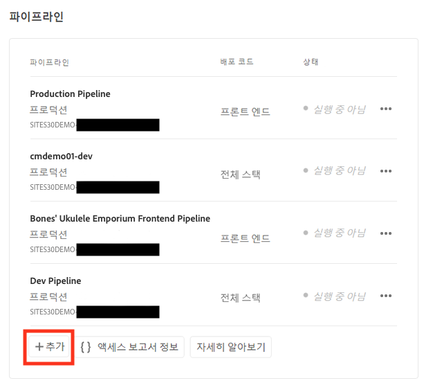
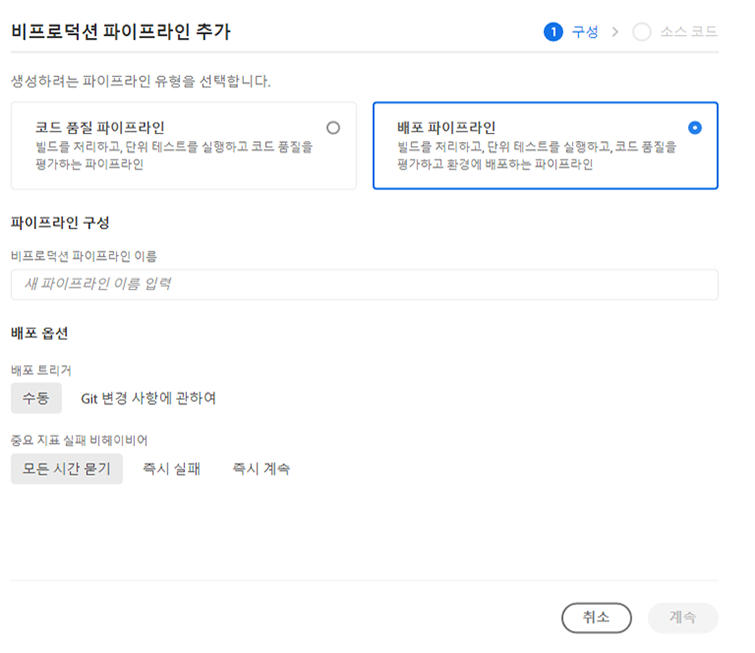

# 파이프라인 설정 {#set-up-your-pipeline}

프론트엔드 파이프라인을 만들어 사이트 테마의 맞춤화를 관리할 수 있습니다.

## 지금까지의 이야기 {#story-so-far}

AEM 빠른 사이트 생성 여정의 이전 문서인 [템플릿으로 사이트 생성](create-site.md)에서는 사이트 템플릿을 사용하여 나중에 프론트엔드 도구를 사용하여 맞춤화할 수 있는 AEM 사이트를 간단하게 만드는 방법에 대해 알아보았습니다. 여기에서 알게 된 내용은 다음과 같습니다.

* AEM 사이트 템플릿을 얻는 방법을 이해할 수 있습니다.
* 템플릿을 사용하여 새 사이트를 만드는 방법을 이해할 수 있습니다.
* 새 사이트에서 템플릿을 다운로드하여 프론트엔드 개발자에게 제공하는 방법을 파악할 수 있습니다.

이 문서는 이러한 기본 사항을 기본으로 하며, 이를 통해 프론트엔드 개발자가 나중에 여정에서 사용하여 프론트엔드 맞춤화를 배포할 프론트엔드 파이프라인을 설정할 수 있습니다.

## 목표 {#objective}

이 문서는 프론트엔드 파이프라인 및 이를 만들어 맞춤화된 사이트 테마의 배포를 관리하는 방법을 이해하는 데 도움이 됩니다. 문서를 읽고 나면

* 프론트엔드 파이프라인에 대해 이해할 수 있습니다.
* Cloud Manager에서 프론트엔드 파이프라인을 설정하는 방법을 이해할 수 있습니다.

## 담당 역할 {#responsible-role}

이 부분의 여정은 Cloud Manager 관리자에게 적용됩니다.

## 요구 사항 {#requirements}

* Cloud Manager에 대한 액세스 권한이 필요합니다.
* Cloud Manager에서 **배포 관리자** 역할의 멤버여야 합니다.
* Cloud Manager에 AEM 환경에 대한 Git 저장소가 설치되어 있어야 합니다.
   * 이는 일반적으로 모든 진행 중인 프로젝트에 해당되는 사항입니다. 그러나 그렇지 않은 경우 [추가 리소스](#additional-resources) 섹션에 있는 Cloud Manager 저장소 설명서를 참조하십시오.

## 프론트엔드 파이프라인 개요 {#front-end-pipeline}

프론트엔드 개발에는 JavaScript, CSS 및 AEM 사이트의 스타일을 정의하는 정적 리소스가 포함됩니다. 프론트엔드 개발자는 이러한 맞춤화를 적용하기 위해 자신의 로컬 환경에서 작업하게 됩니다. 준비가 끝나면 변경 내용은 AEM Git 저장소에 커밋됩니다. 하지만 이러한 변경 내용은 소스 코드에만 커밋됩니다. 아직 라이브 상태가 아닙니다.

프론트엔드 파이프라인은 이렇게 커밋된 맞춤화를 가져와서 AEM 환경(일반적으로 프로덕션 또는 비프로덕션 환경)에 배포합니다.

이러한 방식으로 프론트엔드 개발자는 고유한 배포 파이프라인이 있는 AEM의 전체 스택 백엔드 개발과 병행하여 작동할 수 있습니다.

>[!NOTE]
>
>프론트엔드 파이프라인은 JavaScript, CSS 및 AEM 사이트의 스타일 지정을 위한 정적 리소스만 배포합니다. 페이지 또는 에셋과 같은 사이트 콘텐츠는 파이프라인에서 배포되지 않습니다.

## Cloud Manager 액세스 {#login}

1. [my.cloudmanager.adobe.com](https://my.cloudmanager.adobe.com/)에서 Adobe Cloud Manager에 로그인합니다.

1. Cloud Manager에 사용할 수 있는 다양한 프로그램이 나열됩니다. 관리하고자 하는 프로그램을 탭하거나 클릭합니다. AEM as a Cloud Service으로 시작하는 경우 사용할 수 있는 프로그램이 하나밖에 없을 수 있습니다.

   

이제 프로그램의 개요를 볼 수 있습니다. 귀하의 페이지는 이 예제와 다르지만 비슷합니다.

액세스한 프로그램의 이름을 참고하거나 URL을 복사합니다. 나중에 프론트엔드 개발자에게 이를 제공해야 합니다.

## 프론트엔드 파이프라인 제작 {#create-front-end-pipeline}

Cloud Manager에 액세스했으므로 프론트엔드 개발을 위한 파이프라인을 제작할 수 있습니다.

1. Cloud Manager 페이지의 **파이프라인** 섹션에서 **추가** 버튼을 탭하거나 클릭합니다.

   

1. **추가** 버튼 아래에 나타나는 팝업 메뉴에서 이 여정의 목적인 **비프로덕션 파이프라인 추가**&#x200B;를 선택합니다.

1. 화면에 표시되는 **비프로덕션 파이프라인 추가** 대화 상자의 **구성** 탭에서:
   * **파이프라인 배포**&#x200B;를 선택합니다.
   * **비프로덕션 파이프라인 이름** 필드에 파이프라인의 이름을 입력합니다.

   

1. **계속**&#x200B;을 탭하거나 클릭합니다.

1. **소스 코드** 탭에서:
   * 배포할 코드 유형으로 **프론트엔드 코드**&#x200B;를 선택합니다.
   * **적합한 배포 환경**&#x200B;에서 올바른 환경이 선택되어 있는지 확인하십시오.
   * 올바른 **저장소**&#x200B;를 선택합니다.
   * 파이프라인을 연결할 **Git 분기**&#x200B;를 정의합니다.
   * 프론트엔드 개발이 선택한 저장소의 특정 경로에 위치한 경우 **코드 위치**&#x200B;를 정의합니다. 기본값은 저장소의 루트이지만, 프론트엔드 개발 및 백엔드는 서로 다른 경로에 있는 경우가 많습니다.

   

1. **저장**&#x200B;을 탭하거나 클릭합니다.

새 파이프라인이 생성되며 Cloud Manager 창의 **파이프라인** 섹션에 표시됩니다. 파이프라인 이름 뒤에 있는 생략 부호를 탭하거나 클릭하면 필요에 따라 세부 정보를 편집하거나 볼 수 있는 옵션이 표시됩니다.

>[!TIP]
>
>AEMaaCS의 파이프라인에 익숙하고 프론트엔드 파이프라인에 대한 자세한 정보를 포함하여 다양한 파이프라인 유형 간의 차이점에 대해 자세히 알아보고자 하는 경우, 아래 [추가 리소스](#additional-resources) 섹션에 있는 [CI/CD 파이프라인 구성 - 클라우드 서비스]를 참조하십시오.

## 다음 단계 {#what-is-next}

AEM 빠른 사이트 생성 여정의 한 부분을 완료했으므로,

* 프론트엔드 파이프라인에 대해 이해할 수 있습니다.
* Cloud Manager에서 프론트엔드 파이프라인을 설정하는 방법을 이해할 수 있습니다.

이 지식을 기반으로 다음 문서인 [프론트엔드 개발자에게 액세스 권한 부여](grant-access.md)를 검토하여 AEM 빠른 사이트 생성 여정을 계속하십시오. 여기에서는 프론트엔드 개발자를 AEM 사이트 git 저장소 및 파이프라인에 액세스할 수 있도록 Cloud Manager에 온보딩하게 됩니다.

## 추가 리소스 {#additional-resources}

다음 문서인 [사이트 테마 맞춤화](customize-theme.md)를 검토하여 빠른 사이트 생성 여정의 다음 부분으로 넘어가는 것이 좋습니다. 다음은 이 문서에 나열된 몇 가지 개념을 자세히 알아보는 추가적인 옵션 리소스이며, 이들 리소스를 여정에서 계속 사용할 필요는 없습니다.

* [Cloud Manager 설명서](https://experienceleague.adobe.com/docs/experience-manager-cloud-service/onboarding/onboarding-concepts/cloud-manager-introduction.html) - Cloud Manager의 기능에 대해 자세히 알아보려면 바로 심화 기술 문서를 참조할 수 있습니다.
* [Cloud Manager 저장소](/help/implementing/cloud-manager/managing-code/cloud-manager-repositories.md) - AEMaaCS 프로젝트에 대한 Git 저장소를 설정하고 관리하는 방법에 대한 추가 정보가 필요한 경우 이 문서를 참조하십시오.
* [CI/CD 파이프라인 구성 - 클라우드 서비스](/help/implementing/cloud-manager/configuring-pipelines/introduction-ci-cd-pipelines.md) - 이 문서에서 파이프라인(전체 스택 및 프론트엔드) 설정에 대한 자세한 내용을 알아보십시오.
