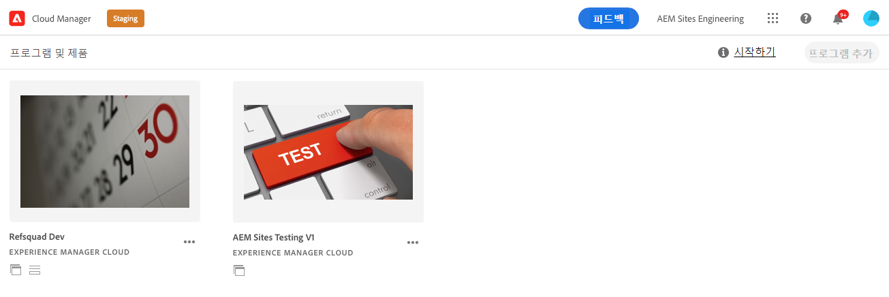

# Git 저장소 액세스 정보 가져오기 {#retrieve-access}

프론트엔드 개발자가 Cloud Manager를 사용하여 git 저장소 정보에 액세스하는 방법에 대해 알아봅니다.

## 지금까지의 스토리 {#story-so-far}

사이트 테마의 맞춤화만 담당하는 프론트엔드 개발자는 AEM의 설정 방법에 대한 지식이 필요하지 않으므로 이 문서의 [목표](#objective) 섹션으로 건너뛸 수 있습니다.

프론트엔드 개발자와 더불어 Cloud Manager나 AEM 관리자 역할도 수행하는 사용자는 AEM 빠른 사이트 생성 여정의 이전 문서인 [프론트엔드 개발자에게 액세스 권한 부여](grant-access.md)에서 프론트엔드 개발자가 git 저장소에 액세스할 수 있도록 온보딩하는 방법에 대해 알아보았습니다. 여기에서 알게 된 내용은 다음과 같습니다.

* 프론트엔드 개발자를 사용자로 추가하는 방법
* 프론트엔드 개발자에게 필요한 역할을 부여하는 방법

이 문서에서는 다음 단계로 이동하여 프론트엔드 개발자가 Cloud Manager 액세스를 사용하여 AEM git 저장소에 액세스할 수 있는 자격 증명을 가져오는 방법에 대해 알아봅니다.

이제 템플릿을 기반으로 사이트가 생성되고 파이프라인이 설정되었으며 프론트엔드 개발자가 온보딩되어 필요한 모든 정보를 보유하고 있으므로, 이 문서는 관리자에서 프론트엔드 개발자 역할로 관점을 전환합니다.

## 목표 {#objective}

이 문서에서는 프론트엔드 개발자가 Cloud Manager에 액세스하고 AEM git 저장소에 대한 액세스 자격 증명을 가져오는 방법에 대해 설명합니다. 문서를 읽고 나면 다음과 같은 사항을 이해할 수 있습니다.

* Cloud Manager에 대한 대략적인 내용을 이해할 수 있습니다.
* 맞춤화를 커밋할 수 있도록 AEM git에 액세스할 수 있는 자격 증명을 가져올 수 있습니다.

## 담당 역할 {#responsible-role}

이 부분의 여정은 프론트엔드 개발자에게 적용됩니다.

## 요구 사항 {#requirements}

빠른 사이트 생성 도구를 사용하면 프론트엔드 개발자가 AEM에 대한 지식 또는 AEM 설정 방법에 대한 지식 없이도 독립적으로 작업할 수 있습니다. 그러나 Cloud Manager 관리자는 프론트엔드 개발자를 프로젝트 팀에 온보드해야 하며 AEM 관리자는 사용자에게 몇 가지 필요한 정보를 제공해야 합니다. 계속하기에 앞서 다음과 같은 정보가 있는지 확인하십시오.

* AEM 관리자의 경우:
   * 맞춤화할 테마 소스 파일
   * 참조의 기반으로 사용할 예제 페이지로의 경로
   * 라이브 AEM 콘텐츠에 대해 맞춤화를 테스트하기 위한 프록시 사용자 자격 증명
   * 프론트엔드 디자인 요구 사항
* Cloud Manager 관리자의 경우:
   * 액세스를 알리는 Cloud Manager의 시작 이메일
   * Cloud Manager 내 프로그램 이름 또는 프로그램 URL

이들 중 누락된 항목이 있는 경우, AEM 관리자 또는 Cloud Manager 관리자에게 문의하십시오.

프론트엔드 개발자는 프론트엔드 개발 워크플로뿐만 아니라 다음과 같은 일반적인 도구에 대한 광범위한 경험을 보유한다고 간주됩니다.

* git
* npm
* Webpack
* 기본 편집기

## Cloud Manager 이해 {#understanding-cloud-manager}

Cloud Manager를 통해 조직은 클라우드에서 AEM을 자체 관리할 수 있습니다. 여기에는 IT팀 및 구현 파트너가 성능 또는 보안을 손상하지 않고 맞춤화 또는 업데이트를 신속하게 게재할 수 있는 CI/CD(지속적 통합 및 지속적 게재) 프레임워크가 포함되어 있습니다.

프론트엔드 개발자의 경우 다음과 같은 이점이 제공됩니다.

* AEM git 저장소 정보에 액세스하여 프론트엔드 맞춤화를 커밋할 수 있습니다.
* 배포 파이프라인을 시작하여 맞춤화를 배포할 수 있습니다.

Cloud Manager 관리자는 귀하를 Cloud Manager 사용자로 온보딩하게 됩니다. 다음과 비슷한 시작 이메일을 수신해야 합니다.

이 이메일을 수신하지 못한 경우, Cloud Manager 관리자에게 문의하십시오.

## Cloud Manager 액세스 {#access-cloud-manager}

1. [my.cloudmanager.adobe.com](https://my.cloudmanager.adobe.com/)에서 Adobe Experience Cloud에 로그인하거나 시작 이메일에 제공된 링크를 클릭합니다.

1. Cloud Manager에 사용할 수 있는 다양한 프로그램이 나열됩니다. Cloud Manager 관리자가 제공한 대로 액세스해야 하는 프로그램을 선택합니다. AEMaaCS용 프론트엔드 프로젝트를 처음 만드는 경우 사용할 수 있는 프로그램이 하나밖에 없을 수 있습니다.

   

이제 프로그램의 개요를 볼 수 있습니다. 귀하의 페이지는 이 예제와 다르지만 비슷합니다.

## 저장소 액세스 정보 가져오기 {#repo-access}

1. Cloud Manager 페이지의 **파이프라인** 섹션에서 **저장소 정보 액세스** 버튼을 선택합니다.

   

1. **저장소 정보** 대화 상자가 열립니다.

   

1. 암호를 직접 생성하려면 **암호 생성** 버튼을 선택합니다.

1. 생성된 암호를 보안 암호 관리자에 저장합니다. 이 암호는 다시 표시되지 않습니다.

1. **사용자 이름** 및 **Git 명령줄** 필드도 복사합니다. 이 정보는 나중에 저장소에 액세스하는 데 사용됩니다.

1. **닫기**&#x200B;를 선택합니다.

## 다음 단계 {#what-is-next}

AEM 빠른 사이트 생성 여정의 한 부분을 완료했으므로,

* Cloud Manager에 대한 대략적인 내용을 이해할 수 있습니다.
* 맞춤화를 커밋할 수 있도록 AEM git에 액세스할 수 있는 자격 증명을 가져올 수 있습니다.

이 지식을 기반으로 다음 문서인 [사이트 테마 맞춤화](customize-theme.md)를 검토하여 AEM 빠른 사이트 생성 여정을 계속하십시오. 여기에서는 라이브 AEM 콘텐츠를 사용하여 사이트 테마를 구축하고, 맞춤화하고, 테스트하는 방법에 대해 알아봅니다.

## 추가 리소스 {#additional-resources}

다음 문서인 [사이트 테마 맞춤화](customize-theme.md)를 검토하여 빠른 사이트 생성 여정의 다음 부분으로 넘어가는 것이 좋습니다. 다음은 이 문서에 나열된 몇 가지 개념을 자세히 알아보는 추가적인 옵션 리소스이며, 이들 리소스를 여정에서 계속 사용할 필요는 없습니다.

* [Adobe Experience Manager Cloud Manager 설명서](https://experienceleague.adobe.com/docs/experience-manager-cloud-manager/using/introduction-to-cloud-manager.html) - Cloud Manager의 기능에 대한 자세한 내용은 Cloud Manager 설명서를 살펴보십시오.
