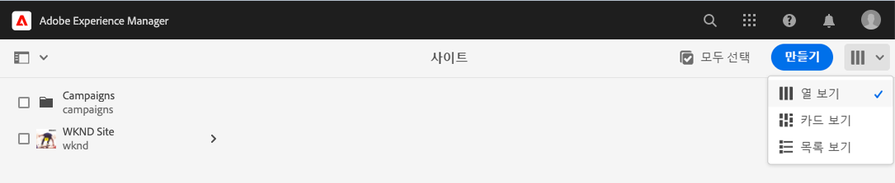

# AEM Sites 번역 시작하기 {#getting-started}

AEM Sites 콘텐츠를 구성하는 방법 및 AEM의 번역 도구의 작동 방식에 대해 알아봅니다.

## 지금까지의 이야기 {#story-so-far}

AEM Sites 번역 여정의 이전 문서인 [AEM Sites 콘텐츠 및 AEM에서의 AEM Sites 콘텐츠 번역 방법에 대해 알아보기](learn-about.md)에서는 AEM Sites의 기본 이론에 대해 알아보았습니다. 여기에서 알게 된 내용은 다음과 같습니다.

* AEM Sites 콘텐츠 생성에 대한 기본적인 개념을 이해할 수 있습니다.
* AEM이 번역을 지원하는 방법을 파악할 수 있습니다.

이 문서는 이러한 기본 사항을 기본으로 하며, 이를 통해 AEM이 콘텐츠를 저장하고 관리하는 방법 및 AEM의 번역 도구를 사용하여 이러한 콘텐츠를 번역하는 방법에 대해 살펴볼 수 있습니다.

## 목표 {#objective}

이 문서는 AEM에서 사이트 콘텐츠 번역을 시작하는 방법을 이해하는 데 도움이 됩니다. 문서를 읽고 나면

* 번역에 있어 콘텐츠 구조의 중요성을 이해할 수 있습니다.
* AEM이 콘텐츠를 저장하는 방법을 이해할 수 있습니다.
* AEM의 번역 도구에 익숙해질 수 있습니다.

## 요구 사항 및 사전 요구 사항 {#requirements-prerequisites}

AEM 콘텐츠 번역을 시작하기 전에 알아 두어야 할 몇 가지 요구 사항이 있습니다.

### 지식 {#knowledge}

* CMS에서의 콘텐츠 번역 경험
* 대규모 CMS의 기본 기능 사용 경험
* AEM 기본 처리에 대한 작업 지식
* 사용 중인 번역 서비스에 대한 이해
* 번역 중인 콘텐츠에 대한 기본적인 이해

>[!TIP]
>
>AEM과 같은 대규모 CMS 사용에 익숙하지 않은 경우 계속 진행하기 전에 [기본 처리](/help/sites-cloud/authoring/getting-started/basic-handling.md) 설명서를 검토하는 것이 좋습니다. 기본 처리 설명서는 이 여정의 일부가 아니므로, 검토를 완료하면 이 페이지로 돌아오십시오.

### 도구 {#tools}

* 콘텐츠 번역 테스트를 위한 샌드박스 액세스
* 선호하는 번역 서비스에 연결하기 위한 자격 증명
* AEM에서 `project-administrators` 그룹의 멤버여야 함

## AEM이 콘텐츠를 저장하는 방법 {#content-in-aem}

번역 전문가의 경우 AEM의 콘텐츠 관리 방법을 깊이 있게 이해하지 않아도 됩니다. 그러나 기본 개념과 용어를 숙지하면 나중에 AEM 번역 도구를 사용할 때 도움이 됩니다. 가장 중요한 것은 자신의 콘텐츠와 콘텐츠를 효과적으로 번역하기 위해 콘텐츠를 구성하는 방식을 이해해야 한다는 것입니다.

### 사이트 콘솔 {#sites-console}

사이트 콘솔은 콘텐츠 구조에 대한 개요를 제공하여 새 페이지를 만들고, 페이지를 이동 및 복사하고, 콘텐츠를 게시함으로써 콘텐츠를 쉽게 탐색하고 관리할 수 있도록 합니다.

사이트 콘솔에 액세스하려면 다음 작업을 수행하십시오.

1. 전역 탐색 메뉴에서 **탐색** -> **사이트**&#x200B;를 클릭하거나 탭합니다.
1. 사이트 콘솔이 콘텐츠의 최상위 수준으로 열립니다.
1. 창 오른쪽 상단의 보기 선택기를 사용하여 **열 보기**&#x200B;를 선택하십시오.

   

1. 열의 항목을 탭하거나 클릭하면 오른쪽 열의 계층 구조에 해당 항목 아래의 콘텐츠가 표시됩니다.

   

1. 열에 있는 항목의 확인란을 탭하거나 클릭하면 해당 항목이 선택되고 오른쪽 열에 선택한 항목의 세부 정보가 표시되며, 위의 도구 모음에서 선택한 항목에 대해 사용할 수 있는 여러 작업이 표시됩니다.

   

1. 왼쪽 상단의 레일 선택기를 탭하거나 클릭하여 콘텐츠의 트리 개요를 볼 수 있는 **콘텐츠 트리** 보기를 표시할 수도 있습니다.

   

이들 간단한 도구를 사용하여 콘텐츠 구조를 직관적으로 탐색할 수 있습니다.

>[!NOTE]
>
>콘텐츠 설계자는 일반적으로 콘텐츠 구조를 정의하는 반면 콘텐츠 작성자는 해당 구조 내에 콘텐츠를 작성합니다.
>
>번역 전문가는 이러한 구조를 탐색하는 방법을 이해하고 콘텐츠의 위치를 파악하는 것이 중요합니다.

### 페이지 편집기 {#page-editor}

사이트 콘솔을 사용하여 콘텐츠를 탐색하고 해당 콘텐츠 구조의 개요를 살펴볼 수 있습니다. 개별 페이지의 세부 정보를 보려면 사이트 편집기를 사용해야 합니다.

페이지를 편집하려면 다음 작업을 수행하십시오.

1. 사이트 콘솔을 사용하여 페이지를 찾아 선택합니다. 개별 페이지의 확인란을 탭하거나 클릭하여 선택해야 합니다.

   

1. 도구 모음에서 **편집** 옵션을 탭합니다.
1. 사이트 편집기가 열리고 편집을 위해 선택한 페이지가 새 브라우저 탭에 로드됩니다.
1. 콘텐츠 위로 마우스를 가져다 대거나 콘텐츠를 탭하면 개별 구성 요소에 대한 선택기가 표시됩니다. 구성 요소는 페이지를 구성하는 드래그 앤 드롭 기본 구성 요소입니다.

   

언제든지 브라우저의 해당 탭으로 다시 전환하여 사이트 콘솔로 돌아갈 수 있습니다. 사이트 편집기를 사용하여 콘텐츠 작성자 및 고객에게 표시될 페이지 콘텐츠를 빠르게 볼 수 있습니다.

>[!NOTE]
>
>콘텐츠 작성자는 사이트 편집기를 사용하여 사이트 콘텐츠를 만듭니다.
>
>번역 전문가는 사이트 편집기를 사용하여 해당 콘텐츠의 세부 정보를 확인하는 것이 중요합니다.

## 핵심은 구조입니다 {#content-structure}

AEM의 콘텐츠는 구조에 따라 좌우됩니다. AEM이 제공하는 콘텐츠 구조에 대한 요구 사항은 많지 않지만, 프로젝트 계획의 일부로 콘텐츠 계층 구조를 신중하게 고려하면 번역을 훨씬 더 간단하게 만들 수 있습니다.

>[!TIP]
>
>AEM 프로젝트의 시작 부분부터 번역을 위한 계획을 수립하십시오. 프로젝트 관리자 및 콘텐츠 설계자와 조기부터 긴밀히 협력하십시오.
>
>번역할 콘텐츠와 하지 않을 콘텐츠를 정의하고 지역 또는 로컬 콘텐츠 제작자가 수정할 수 있는 번역된 콘텐츠를 정의하는 역할을 담당할 별도의 담당자로서 국제화 프로젝트 관리자가 필요할 수 있습니다.

## 권장 콘텐츠 구조 {#recommended-structure}

이전에 권장한 것처럼, 콘텐츠 설계자와 협력하여 프로젝트에 적합한 콘텐츠 구조를 결정하십시오. 그러나 입증되고 단순하며, 직관적이고 효과적인 다음 구조도 참조하십시오.

`/content` 아래에 프로젝트용 기본 폴더를 정의하십시오.

```text
/content/<your-project>
```

콘텐츠가 작성되는 언어를 언어 루트라고 합니다. 이 예제에서 언어 루트는 영어이며 이는 이 경로 하에 있어야 합니다.

```text
/content/<your-project>/en
```

현지화가 필요한 모든 프로젝트 콘텐츠는 언어 루트 아래에 배치해야 합니다.

```text
/content/<your-project>/en/<your-project-content>
```

번역은 언어 루트와 함께 해당 언어의 ISO-2 언어 코드를 나타내는 폴더 이름을 가진 동일한 수준의 폴더로 생성해야 합니다. 예를 들어 독일어는 다음과 같은 경로를 가질 수 있습니다.

```text
/content/<your-project>/de
```

>[!NOTE]
>
>일반적으로 콘텐츠 설계자는 이러한 언어 폴더 생성을 담당합니다. 이러한 폴더가 생성되지 않으면 AEM은 나중에 번역 작업을 만들 수 없습니다.

최종 구조는 다음과 같이 표시될 수 있습니다.

```text
/content
    |- your-project
        |- en
            |- some
            |- exciting
            |- sites
            |- content
        |- de
        |- fr
        |- it
        |- ...
    |- another-project
    |- ...
```

콘텐츠의 특정 경로는 나중에 번역을 구성하는 데 필요하므로 기록해 두어야 합니다.

>[!NOTE]
>
>일반적으로 콘텐츠 구조를 정의하는 것은 콘텐츠 설계자의 역할이며, 이러한 작업은 종종 번역 전문가와 협력하여 수행되기도 합니다.
>
>완성도를 위해 여기에 자세히 기재되어 있습니다.

## AEM 번역 도구 {#translation-tools}

사이트 콘솔 및 편집기와 콘텐츠 구조의 중요성에 대해 알아보았으므로, 이제는 콘텐츠 번역 방법을 살펴보겠습니다. AEM의 번역 도구는 매우 강력하지만 높은 수준에서 간단하게 이해할 수 있는 도구입니다.

* **번역 커넥터** - 커넥터는 AEM과 사용 중인 번역 서비스 간의 연결입니다.
* **번역 규칙** - 규칙은 특정 경로에 있는 번역이 필요한 콘텐츠를 정의합니다.
* **번역 프로젝트** - 번역 프로젝트는 단일 번역 작업으로 처리해야 하는 콘텐츠를 수집하고 번역 진행 상황을 추적하는 동시에 커넥터와 결합하여 번역 서비스에 번역할 콘텐츠를 전송하고 번역된 콘텐츠를 다시 수신합니다.

일반적으로 커넥터는 프로젝트당 인스턴스 및 규칙에 대해 한 번만 설정합니다. 그런 다음 번역 프로젝트를 사용하여 콘텐츠를 번역하고 해당 번역을 정기적으로 업데이트합니다.

## 다음 단계 {#what-is-next}

AEM Sites 번역 여정의 한 부분을 완료했으므로,

* 번역에 있어 콘텐츠 구조의 중요성을 이해할 수 있습니다.
* AEM이 콘텐츠를 저장하는 방법을 이해할 수 있습니다.
* AEM의 번역 도구에 익숙해질 수 있습니다.

이 지식을 기반으로 다음 문서인 [번역 커넥터 구성](configure-connector.md)을 검토하여 AEM Sites 번역 여정을 계속하십시오. 여기에서는 AEM을 번역 서비스에 연결하는 방법에 대해 알아보게 됩니다.

## 추가 리소스 {#additional-resources}

다음 문서인 [번역 커넥터 구성](configure-connector.md)을 검토하여 번역 여정의 다음 부분으로 넘어가는 것이 좋습니다. 다음은 이 문서에 나열된 몇 가지 개념을 자세히 알아보는 추가적인 옵션 리소스이며, 이들 리소스를 여정에서 계속 사용할 필요는 없습니다.

* [AEM 기본 처리](/help/sites-cloud/authoring/getting-started/basic-handling.md) - 콘텐츠 찾기와 같은 필수 작업을 편안하게 탐색하고 수행할 수 있도록 AEM UI의 기본 사항에 대해 알아봅니다.
* [번역할 콘텐츠 식별](/help/sites-cloud/administering/translation/rules.md) - 번역 규칙이 번역이 필요한 콘텐츠를 식별하는 방법에 대해 알아봅니다.
* [번역 통합 프레임워크 구성](/help/sites-cloud/administering/translation/integration-framework.md) - 번역 통합 프레임워크를 서드파티 번역 서비스와 통합하도록 구성하는 방법에 대해 알아봅니다.
* [번역 프로젝트 관리](/help/sites-cloud/administering/translation/managing-projects.md) - AEM에서 기계 번역 및 사람 번역을 만들고 관리하는 방법에 대해 알아봅니다.
