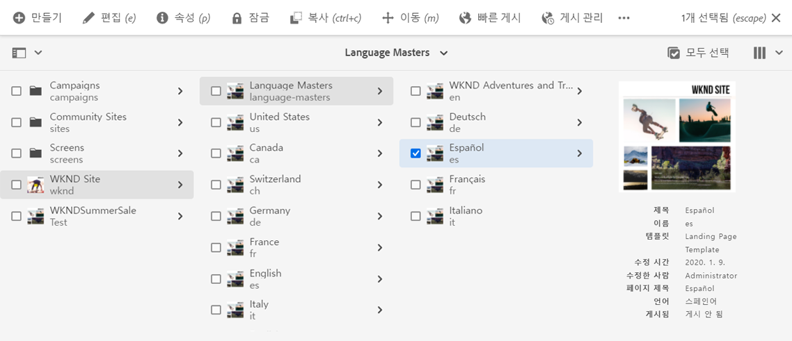
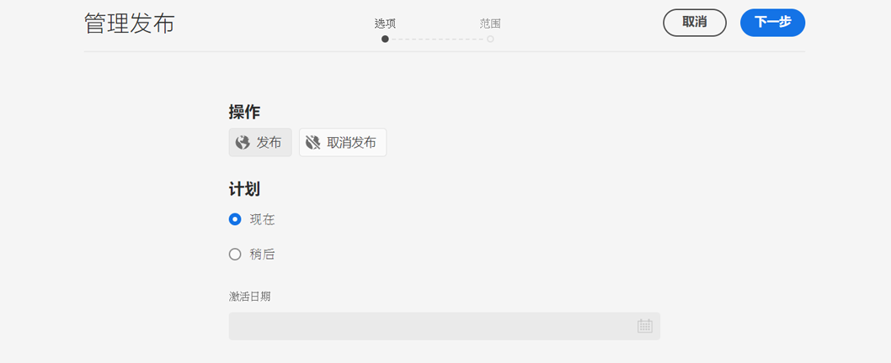
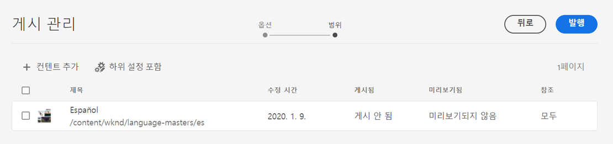
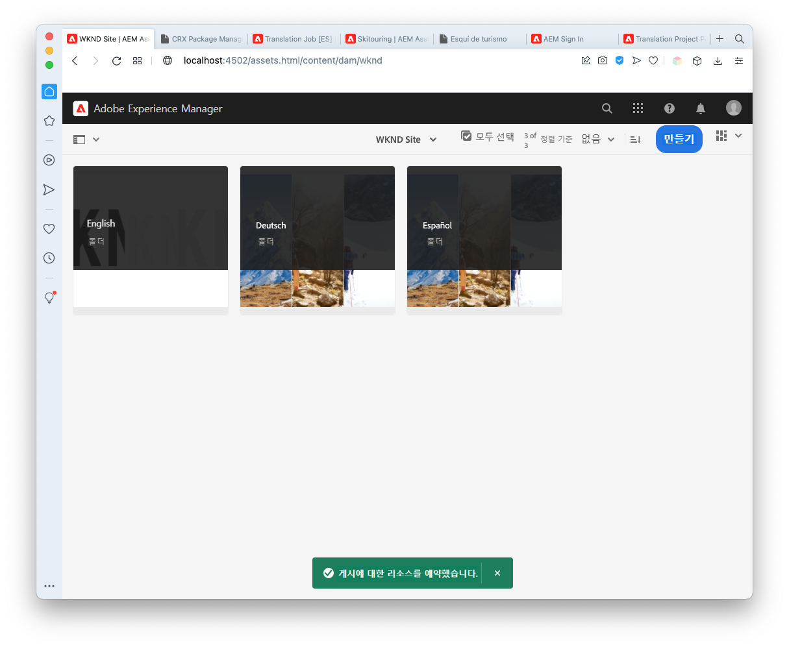
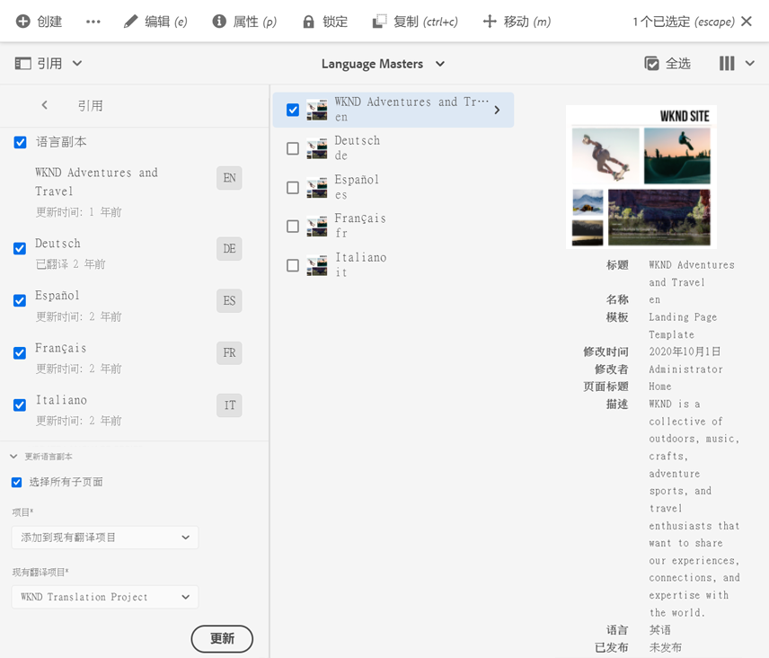
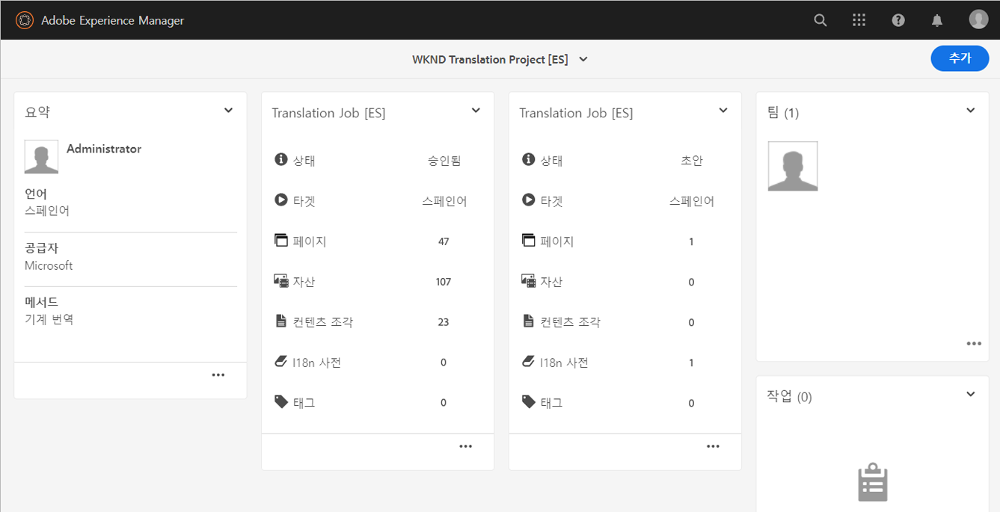
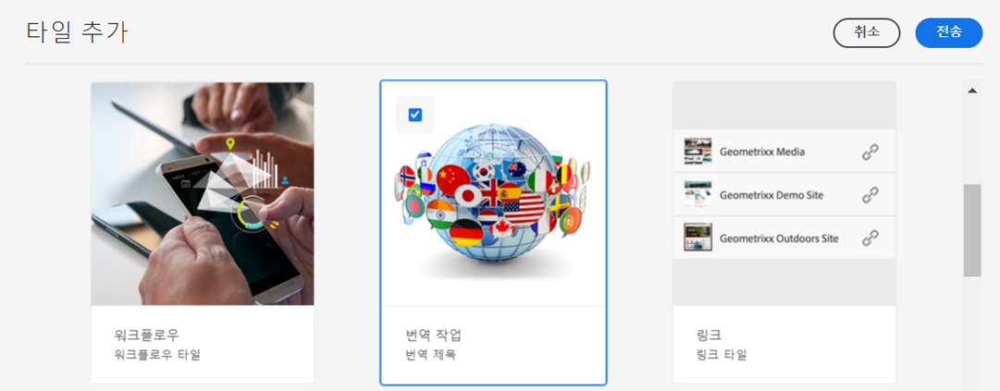
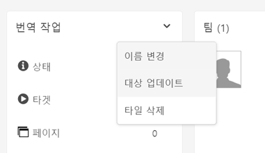
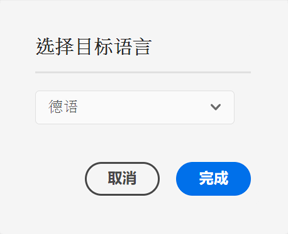

# 번역된 콘텐츠 게시 {#publish-content}

번역된 콘텐츠를 게시하고 콘텐츠가 업데이트될 때 번역을 업데이트하는 방법에 대해 알아봅니다.

## 지금까지의 스토리 {#story-so-far}

AEM Sites 번역 여정의 이전 문서인 [콘텐츠 번역](configure-connector.md)에서는 AEM 번역 프로젝트를 사용하여 콘텐츠를 번역하는 방법에 대해 알아보았습니다. 이제

* 번역 프로젝트에 대해 이해할 수 있습니다.
* 새 번역 프로젝트를 만들 수 있습니다.
* 번역 프로젝트를 사용하여 콘텐츠를 번역할 수 있습니다.

이제 초기 번역을 완료했으므로, 이 문서는 해당 콘텐츠를 게시하는 다음 단계 및 언어 루트의 기본 콘텐츠가 변경될 때 번역을 업데이트하기 위해 수행해야 하는 작업을 소개합니다.

## 목표 {#objective}

이 문서는 AEM에 콘텐츠를 게시하는 방법 및 지속적인 워크플로를 만들어 번역을 최신 상태로 유지하는 방법을 이해하는 데 도움이 됩니다. 이 문서를 읽고 나면

* AEM의 작성자-게시 모델에 대해 이해할 수 있습니다.
* 번역된 콘텐츠를 게시하는 방법을 파악할 수 있습니다.
* 번역된 콘텐츠에 대한 지속적인 업데이트 모델을 구현할 수 있습니다.

## AEM의 작성자-게시 모델 {#author-publish}

콘텐츠를 게시하기 전에 AEM의 작성자-게시 모델에 대해 이해하는 것이 좋습니다. 간단히 정리하면 AEM은 시스템 사용자를 2개의 그룹으로 나눕니다.

1. 콘텐츠 및 시스템을 만들고 관리하는 사용자
1. 시스템에서 콘텐츠를 사용하는 사용자

따라서 실제로 AEM은 2개의 인스턴스로 구분됩니다.

1. **작성자** 인스턴스는 콘텐츠 작성자 및 관리자가 콘텐츠를 만들고 관리하는 시스템입니다.
1. **게시** 인스턴스는 해당 콘텐츠를 소비자에게 제공하는 시스템입니다.

작성자 인스턴스에 생성된 콘텐츠는 게시 인스턴스에 이전되어야 사용할 수 있게 됩니다. 작성자 인스턴스에서 게시 인스턴스로의 이전 프로세스를 **게시**&#x200B;라고 합니다.

## 번역된 콘텐츠 게시 {#publishing}

번역된 콘텐츠 상태가 만족스럽다면 이를 게시하여 액세스하고 사용할 수 있도록 해야 합니다. 이 작업은 일반적으로 번역 전문가가 담당하지 않지만, 완전한 워크플로를 설명하기 위해 여기에 기재되어 있습니다.

>[!NOTE]
>
>일반적으로 번역이 완료되면 번역 전문가는 콘텐츠 소유자에게 번역을 게시할 준비가 되었음을 알립니다. 그런 다음 콘텐츠 소유자는 해당 번역을 게시합니다.
>
>다음은 완성도를 위해 제공되는 단계입니다.

번역을 게시하는 가장 쉬운 방법은 프로젝트 폴더로 이동하는 것입니다.

```text
/content/<your-project>/
```

이 경로에서 각 번역 언어에 대한 하위 폴더를 찾아 그 중 게시할 하위 폴더를 선택할 수 있습니다.

1. **탐색** > **사이트** > **파일**&#x200B;로 이동한 다음 프로젝트 폴더를 엽니다.
1. 여기에서 언어 루트 폴더 및 모든 기타 언어 폴더를 볼 수 있습니다. 게시하고자 하는 현지화된 언어를 선택합니다.
   
1. **게시 관리**&#x200B;를 선택합니다.
1. **게시 관리** 창에서 **작업**&#x200B;에서는 **게시**&#x200B;가 자동으로 선택되어 있고 **예약**&#x200B;에서는 **지금**&#x200B;이 선택되어 있는지 확인하십시오. **다음**을 선택합니다.
   
1. 다음 **게시 관리** 창에서는 올바른 경로가 선택되었는지 확인합니다. **게시**를 선택합니다.
   
1. AEM은 화면 하단의 팝업 메시지를 사용하여 게시 작업을 확인합니다.
   

번역된 콘텐츠가 이제 게시되었습니다! 이제 액세스하고 사용할 수 있습니다.

>[!TIP]
>
>게시할 때 여러 항목(예: 여러 언어 폴더)를 선택하여 여러 번역을 한 번에 게시할 수 있습니다.

콘텐츠를 게시할 때에는 게시 시간 예약과 같이 이 여정에서 다루지 않는 추가 옵션을 사용할 수 있습니다. 자세한 내용은 이 문서 끝에 있는 [추가 리소스](#additional-resources) 섹션을 참조하십시오.

## 번역된 콘텐츠 업데이트 {#updating-translations}

번역을 일회성으로 수행하는 경우는 거의 없습니다. 일반적으로 콘텐츠 작성자는 초기 번역을 완료한 다음에도 언어 루트에서 콘텐츠를 계속 추가하고 수정합니다. 즉, 번역된 콘텐츠도 업데이트해야 합니다.

특정 프로젝트 요구 사항에는 번역 업데이트 주기 및 업데이트를 수행하기 전에 따라야 할 의사 결정 프로세스가 정의되어 있습니다. 번역을 업데이트하기로 했다면 AEM에서의 프로세스는 매우 간단합니다. 초기 번역과 동일하게 업데이트도 번역 프로젝트를 기반으로 합니다.

그러나 이전과 마찬가지로 번역 프로젝트를 자동으로 만든 경우와 수동으로 만든 경우의 프로세스는 약간 다릅니다.

### 자동으로 생성된 번역 프로젝트 업데이트 {#updating-automatic-project}

1. **탐색** > **자산** > **파일**&#x200B;로 이동합니다. AEM의 콘텐츠는 `/content`에 저장되어 있습니다.
1. 프로젝트의 언어 루트를 선택합니다. 이 경우에는 `/content/wknd/en`을 선택했습니다.
1. 레일 선택기를 선택하고 **참조** 패널을 표시합니다.
1. **언어 사본**&#x200B;을 선택합니다.
1. **언어 사본** 확인란을 선택합니다.
1. 참조 패널 하단의 **언어 사본 업데이트** 섹션을 확장합니다.
1. **프로젝트** 드롭다운 목록에서 **기존 번역 프로젝트에 추가**&#x200B;를 선택합니다.
1. **기존 번역 프로젝트** 드롭다운 목록에서 초기 번역에 대해 생성된 프로젝트를 선택합니다.
1. **업데이트**&#x200B;를 선택합니다.



기존 번역 프로젝트에 콘텐츠가 추가됩니다. 번역 프로젝트를 보려면 다음 작업을 수행하십시오.

1. **탐색** > **프로젝트**&#x200B;로 이동합니다.
1. 방금 업데이트한 프로젝트를 선택합니다.
1. 업데이트한 언어를 선택합니다.

프로젝트에 새 작업 카드가 추가된 것을 볼 수 있습니다. 이 예에서는 다른 스페인어 번역이 추가되었습니다.



새 카드에 나열된 통계에 차이가 있을 수 있습니다. AEM은 마지막 번역 이후 번경된 내용을 인식하고 번역이 필요한 콘텐츠만 포함하기 때문입니다. 여기에는 새 콘텐츠의 최초 번역 및 업데이트된 콘텐츠의 재번역이 포함됩니다.

이 시점에서부터 [원본과 마찬가지로 번역 작업을 시작하고 관리할 수 있습니다.](translate-content.md#using-translation-project)

### 수동으로 생성된 번역 프로젝트 업데이트 {#updating-manual-project}

번역을 업데이트하려면 업데이트된 콘텐츠 번역을 담당하는 기존 프로젝트에 새 작업을 추가할 수 있습니다.

1. **탐색** > **프로젝트**&#x200B;로 이동합니다.
1. 업데이트해야 하는 프로젝트를 선택합니다.
1. 창 상단에서 **추가** 버튼을 선택합니다.
1. **타일 추가** 창에서 **번역 작업**&#x200B;을 선택한 다음 **제출**&#x200B;을 선택합니다.

   

1. 새 번역 작업 카드에서 카드 상단의 V자 버튼을 선택한 다음 **타깃 업데이트**&#x200B;를 선택하여 새 작업의 타깃 언어를 정의합니다.

   

1. **타깃 언어 선택** 대화 상자에서 드롭다운을 사용하여 언어를 선택한 다음 **완료**&#x200B;를 선택합니다.

   

1. 새 번역 작업의 타깃 언어를 설정한 후 작업 카드 하단에 있는 생략 부호 버튼을 선택하여 해당 작업의 세부 정보를 확인합니다.
1. 처음 생성 시 작업은 비어 있습니다. [처음 번역 프로젝트를 생성](translate-content.md##manually-creating)할 때와 마찬가지로 **추가** 버튼을 탭하거나 클릭한 다음 경로 브라우저를 사용하여 작업에 콘텐츠를 추가합니다.

>[!TIP]
>
>경로 브라우저의 강력한 필터를 사용하여 업데이트된 콘텐츠만 찾을 수 있습니다.
>
>[추가 리소스 섹션](#additional-resources)에서 경로 브라우저에 대해 자세히 알아볼 수 있습니다.

이 시점에서부터 [원본과 마찬가지로 번역 작업을 시작하고 관리할 수 있습니다.](translate-content.md#using-translation-project)

## 여정의 끝 {#end-of-journey}

축하합니다! AEM Sites 번역 여정을 완료하셨습니다! 이제

* 이제 AEM의 콘텐츠 관리 기능에 대한 기본 사항을 이해할 수 있습니다.
* AEM의 번역 기능 및 이들과 사이트 콘텐츠의 관련성에 대해 이해할 수 있습니다.
* 콘텐츠 번역을 시작할 수 있습니다.

이제 AEM에서 나만의 콘텐츠를 번역할 준비가 완료되었습니다. 그러나 AEM은 강력한 도구로서 다양한 추가 옵션을 제공합니다. 이 여정에서 확인한 기능들에 대한 자세한 내용은 [추가 리소스 섹션](#additional-resources)에서 사용할 수 있는 몇 가지 추가 리소스를 확인하십시오.

## 추가 리소스 {#additional-resources}

* [번역 프로젝트 관리](/help/sites-cloud/administering/translation/managing-projects.md) - 인간 번역 워크플로 및 다국어 프로젝트와 같은 번역 프로젝트 및 추가 기능의 세부 정보에 대해 알아봅니다.
* [작성 개념](/help/sites-cloud/authoring/author-publish.md) - AEM의 작성자 및 게시 모델에 대해 자세히 알아봅니다. 이 문서는 콘텐츠 조각이 아닌 페이지 작성에 중점을 두고 있지만, 이론은 여전히 적용됩니다.
* [페이지 게시](/help/sites-cloud/authoring/sites-console/publishing-pages.md) - 콘텐츠를 게시할 때 사용할 수 있는 추가 기능에 대해 알아봅니다. 이 문서는 콘텐츠 조각이 아닌 페이지 작성에 중점을 두고 있지만, 이론은 여전히 적용됩니다.
* [작성 환경 및 도구](/help/sites-cloud/authoring/path-selection.md#path-selection) - AEM은 강력한 경로 브라우저를 포함하여 콘텐츠 구성 및 편집을 위한 다양한 메커니즘을 제공합니다.
