# 콘텐츠 번역 {#translate-content}

번역 커넥터 및 규칙을 사용하여 콘텐츠를 번역합니다.

## 지금까지의 이야기 {#story-so-far}

AEM Sites 번역 여정의 이전 문서인 [번역 규칙 구성](translation-rules.md)에서는 AEM의 번역 규칙을 사용하여 번역 콘텐츠를 식별하는 방법에 대해 알아보았습니다. 이제

* 번역 규칙의 역할에 대해 이해할 수 있습니다.
* 나만의 번역 규칙을 정의할 수 있습니다.

이제 커넥터 및 번역 규칙을 설정했으므로 이 문서는 AEM Sites 콘텐츠 번역의 다음 단계를 소개합니다.

## 목표 {#objective}

이 문서는 커넥터 및 번역 규칙과 함께 AEM의 번역 프로젝트를 사용하여 콘텐츠를 번역하는 방법을 이해하는 데 도움이 됩니다. 이 문서를 읽고 나면

* 번역 프로젝트에 대해 이해할 수 있습니다.
* 새 번역 프로젝트를 만들 수 있습니다.
* 번역 프로젝트를 사용하여 AEM Sites 콘텐츠를 번역할 수 있습니다.

## 번역 프로젝트 만들기 {#creating-translation-project}

번역 프로젝트를 통해 AEM 콘텐츠의 번역을 관리할 수 있습니다. 번역 프로젝트는 번역 작업을 중앙에서 볼 수 있도록 번역할 콘텐츠를 한 곳에 수집합니다.

콘텐츠가 번역 프로젝트에 추가되면 이에 대한 번역 작업이 생성됩니다. 작업은 리소스에서 실행되는 사람 번역 및 기계 번역 워크플로 관리에 사용하는 명령 및 상태 정보를 제공합니다.

두 가지 방법으로 번역 프로젝트를 만들 수 있습니다.

1. 콘텐츠의 언어 루트를 선택하여 AEM이 콘텐츠 경로를 기반으로 번역 프로젝트를 자동으로 생성하도록 합니다.
1. 빈 프로젝트를 만들어 번역 프로젝트에 추가할 콘텐츠를 수동으로 선택합니다.

두 방법 모두 유용한 접근 방식이며 일반적으로 번역을 수행하는 담당자에 따라 달라집니다.

* 번역 프로젝트 관리자(TPM)는 번역 프로젝트에 대한 콘텐츠를 수동으로 선택할 수 있는 유연성이 필요한 경우가 많습니다.
* 또한 콘텐츠 소유자가 번역을 담당하는 경우에도 AEM이 선택한 콘텐츠 경로를 기반으로 프로젝트를 자동으로 생성하도록 하는 것이 더 간편한 방법입니다.

두 접근 방식은 다음 섹션에서 살펴볼 수 있습니다.

### 콘텐츠 경로를 기반으로 자동으로 번역 프로젝트 만들기 {#automatically-creating}

콘텐츠 소유자가 번역을 담당하는 경우에도 AEM이 번역 프로젝트를 자동으로 생성하도록 하는 것이 더 간편한 방법입니다. AEM이 콘텐츠 경로를 기반으로 번역 프로젝트를 자동으로 생성하도록 하려면 다음 작업을 수행합니다.

1. **탐색** -> **사이트**&#x200B;로 이동한 다음 프로젝트를 탭하거나 클릭합니다.
1. 프로젝트의 언어 루트를 찾습니다. 예를 들어 언어 루트가 영어인 경우 `/content/<your-project>/en`을 선택합니다.
   * 처음 번역하기 전에 다른 언어 폴더는 빈 자리표시자입니다. 이는 일반적으로 콘텐츠 설계자에 의해 생성됩니다.
1. 프로젝트의 언어 루트를 찾습니다.
1. 레일 선택기를 탭하거나 클릭하고 **참조** 패널을 표시합니다.
1. **언어 사본**&#x200B;을 탭하거나 클릭합니다.
1. **언어 사본** 확인란을 선택합니다.
1. 참조 패널 하단의 **언어 사본 업데이트** 섹션을 확장합니다.
1. **프로젝트** 드롭다운에서 **번역 프로젝트 만들기**&#x200B;를 선택합니다.
1. 번역 프로젝트에 적절한 제목을 입력합니다.
1. **업데이트**&#x200B;를 탭하거나 클릭합니다.

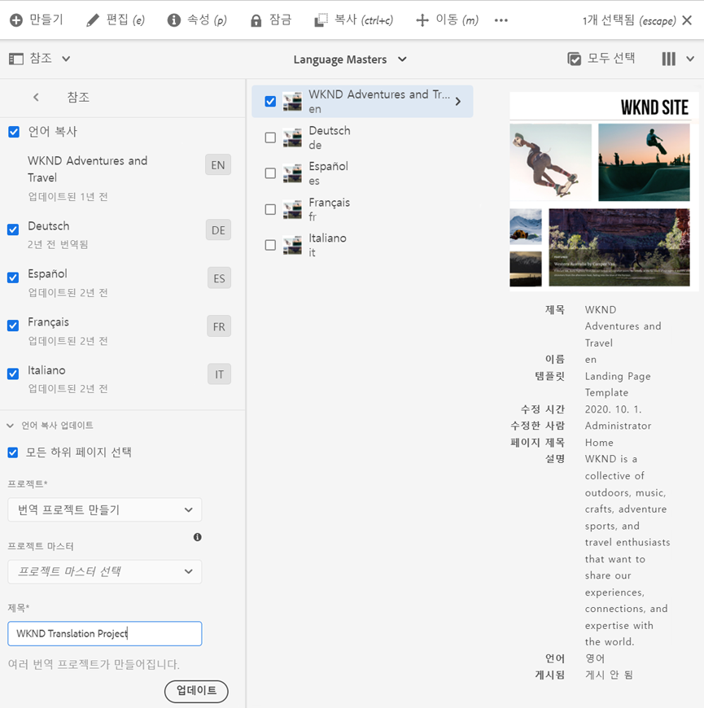

프로젝트가 생성되었다는 메시지가 표시됩니다.

>[!NOTE]
>
>번역 언어에 필요한 언어 구조는 콘텐츠 구조의 [정의의 일부로 이미 생성되었다고 간주됩니다.](getting-started.md#content-structure) 이 작업은 콘텐츠 설계자와 공동 작업을 통해 수행해야 합니다.
>
>언어 폴더를 미리 만들지 않으면 이전 단계에 설명된 대로 언어 사본을 만들 수 없습니다.

### 콘텐츠를 선택하여 수동으로 번역 프로젝트 만들기 {#manually-creating}

번역 프로젝트 관리자의 경우 번역 프로젝트에 포함할 특정 콘텐츠를 수동으로 선택해야 하는 경우가 많습니다. 이러한 수동 번역 프로젝트를 만들려면 빈 프로젝트를 만들어 번역 프로젝트에 추가할 콘텐츠를 수동으로 선택해야 합니다.

1. **탐색** -> **프로젝트**&#x200B;로 이동합니다.
1. **만들기** -> **폴더**&#x200B;를 탭하거나 클릭하여 프로젝트 폴더를 생성합니다.
   * 이 작업은 선택 사항이지만 번역 작업을 구성하는 데 도움이 됩니다.
1. **프로젝트 만들기** 창에서 폴더의 **제목**&#x200B;을 추가한 다음 **만들기**&#x200B;를 탭하거나 클릭합니다.

   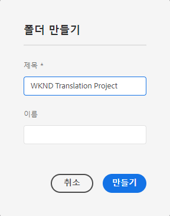

1. 폴더를 탭하거나 클릭하여 폴더를 엽니다.
1. 새 프로젝트 폴더에서 **만들기** -> **프로젝트**&#x200B;를 탭하거나 클릭합니다.
1. 프로젝트는 템플릿을 기반으로 합니다. **번역 프로젝트** 템플릿을 탭하거나 클릭하여 선택하고 **다음**&#x200B;을 탭하거나 클릭합니다.

   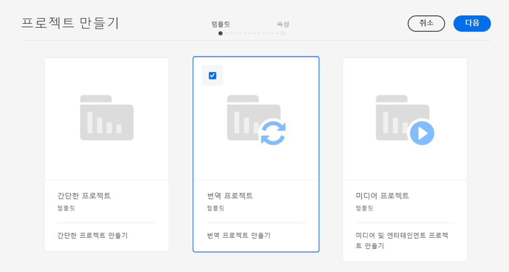

1. **기본** 탭에서 새 프로젝트의 이름을 입력합니다.

   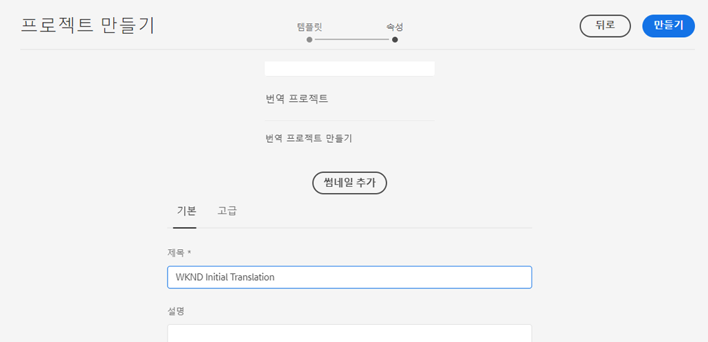

1. **고급** 탭에서 **타겟 언어** 드롭다운을 사용하여 콘텐츠를 번역할 언어를 선택합니다. **만들기**&#x200B;를 탭하거나 클릭합니다.

   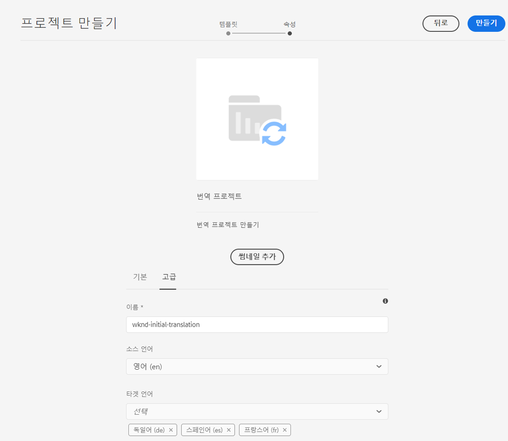

1. 확인 대화 상자에서 **열기**&#x200B;를 탭하거나 클릭합니다.

   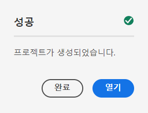

프로젝트가 생성되었지만 여기에는 번역할 콘텐츠가 포함되어 있지 않습니다. 다음 섹션에서는 프로젝트 구성 방법 및 콘텐츠 추가 방법에 대해 자세히 설명합니다.

## 번역 프로젝트 사용 {#using-translation-project}

번역 프로젝트는 번역 작업과 관련된 모든 콘텐츠와 작업을 한 곳에 모아 쉽고 간편하게 번역할 수 있도록 설계되었습니다.

번역 프로젝트를 보려면 다음 작업을 수행하십시오.

1. **탐색** -> **프로젝트**&#x200B;로 이동합니다.
1. 이전 섹션에서 만든 프로젝트를 탭하거나 클릭합니다. 이전 섹션은 상황에 따라 [콘텐츠 경로를 기반으로 자동으로 번역 프로젝트 만들기](#automatically-creating) 또는 [콘텐츠를 선택하여 수동으로 번역 프로젝트 만들기](#manually-creating) 중 하나입니다.

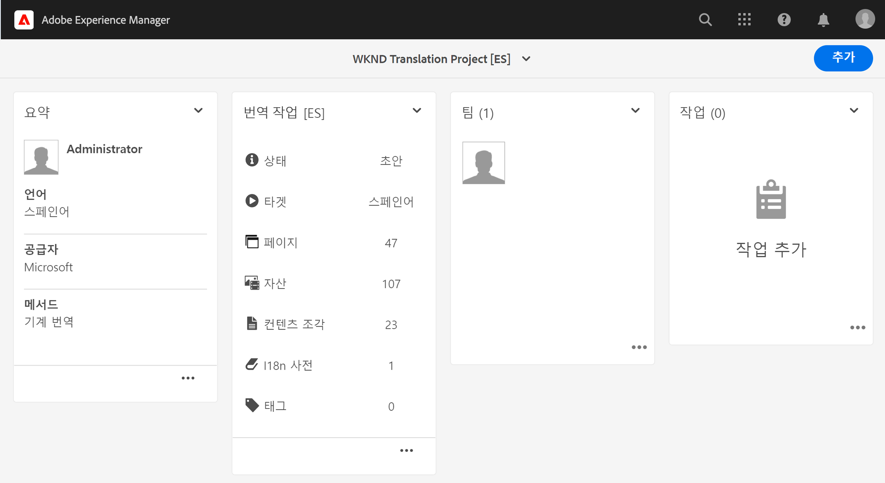

프로젝트는 여러 카드로 나눠집니다.

* **요약** - 이 카드는 소유자, 언어 및 번역 공급업체 포함한 프로젝트의 기본 헤더 정보를 보여 줍니다.
* **번역 작업** - 이 카드는 상태, 에셋 수 등은 포함하여 실제 번역 작업에 대한 개요를 제공합니다. 일반적으로 언어당 작업 이름에 ISO-2 코드가 추가된 하나의 작업이 있습니다.
   * [자동으로 번역 작업을 생성](#automatically-creating)할 때, AEM은 비동기적으로 작업을 생성하며 이들 작업은 프로젝트 내에 즉시 표시되지 않을 수 있습니다.
* **팀** - 이 카드는 이 번역 프로젝트에 대해 공동 작업 중인 사용자를 보여 줍니다. 이 여정에서는 이 주제를 다루지 않습니다.
* **작업** - 수행할 항목 또는 워크플로 항목과 같이 콘텐츠 번역과 연결된 추가 작업입니다. 이 여정에서는 이 주제를 다루지 않습니다.

AEM의 번역 흐름을 더 잘 이해하려면 프로젝트 설정 변경이 유용할 수 있습니다. 이 단계는 프로덕션 번역에 필요하지는 않지만 프로세스를 이해하는 데 도움이 됩니다.

1. **요약** 카드에서 카드 하단의 생략 부호를 탭하거나 클릭합니다.
1. **고급** 탭에서 **홍보 후 론치 삭제** 옵션의 선택을 해제합니다.

   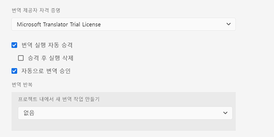

1. **저장 및 닫기**&#x200B;를 탭하거나 클릭합니다.

이제 번역 프로젝트를 사용할 준비가 완료되었습니다. 번역 프로젝트를 사용하는 방법은 생성 방법에 따라 달라집니다(AEM에 의해 자동으로 생성 또는 수동으로 생성).

### 자동으로 생성된 번역 프로젝트 사용 {#using-automatic-project}

번역 프로젝트를 자동으로 생성할 때 AEM은 이전에 정의한 번역 규칙을 기반으로 사용자가 선택한 경로의 콘텐츠를 평가합니다. 이러한 평가를 기반으로 번역에 필요한 콘텐츠를 새 번역 프로젝트에 추출합니다.

이 프로젝트에 포함된 콘텐츠 세부 정보를 보려면 다음 작업을 수행하십시오.

1. **번역 작업** 카드에서 하단의 생략 부호를 탭하거나 클릭합니다.
1. **번역 작업** 창에 작업에 있는 모든 항목이 나열됩니다.

   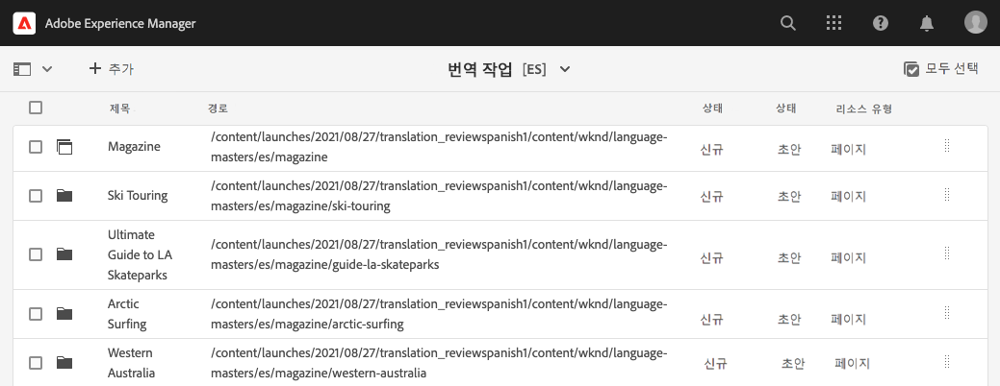

1. 라인을 탭하거나 클릭하여 해당 라인의 세부 정보를 표시합니다. 한 라인에 번역할 여러 내용 콘텐츠 항목이 표시될 수 있습니다.
1. 라인 항목에 대한 선택 확인란을 탭하거나 클릭하면 작업에서 항목을 삭제하거나 사이트 콘솔에서 볼 수 있는 옵션과 같은 추가 옵션이 표시됩니다.

   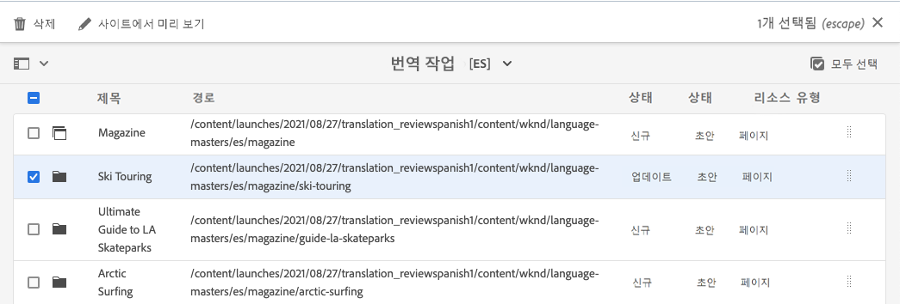

일반적으로 번역 작업의 콘텐츠는 **번역 작업** 창의 **상태** 열에 표시된 **초안** 상태에서 시작합니다.

번역 작업을 시작하려면 번역 프로젝트 개요로 돌아가 **번역 작업** 카드 상단에서 V자 버튼을 탭하거나 클릭하여 **시작**&#x200B;을 선택합니다.

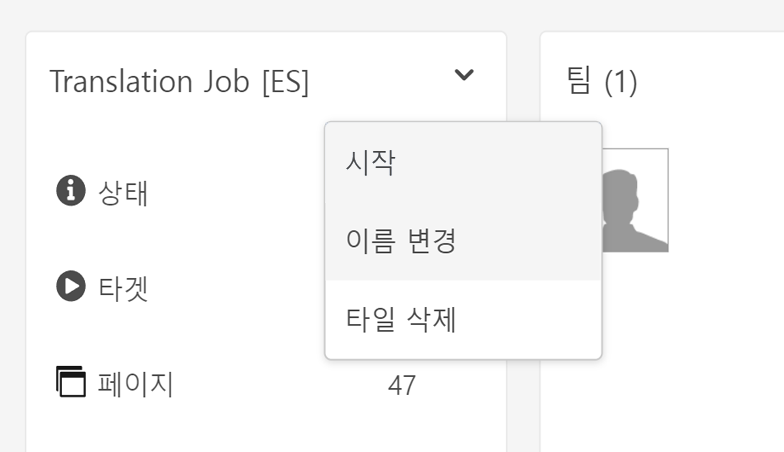

이제 AEM은 번역 구성 및 커넥터와 통신하여 콘텐츠를 번역 서비스로 전송합니다. **번역 작업** 창으로 돌아가 항목의 **상태** 열을 보면 번역 진행률을 볼 수 있습니다.

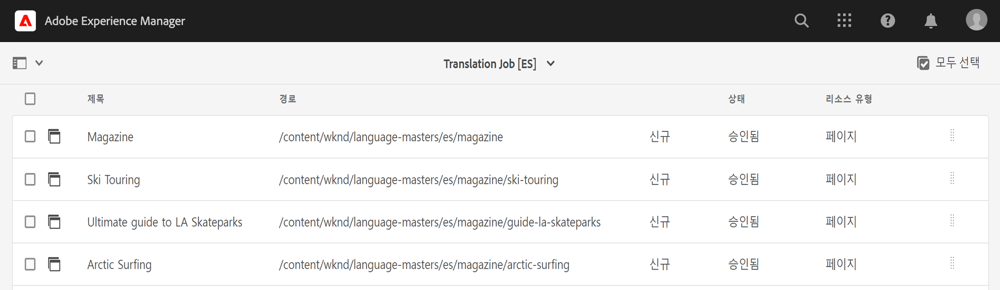

기계 번역은 **승인됨** 상태로 자동 반환됩니다. 사람 번역은 더 많은 상호 작용을 허용하지만, 이는 이 여정에서 다루지 않습니다.

>[!TIP]
>
>번역 작업을 처리하는 데 약간의 시간이 소요될 수 있으며, 번역 항목이 **승인됨** 상태에 도달하기 전에 **초안** 상태에서 **번역 진행 중**, **검토 준비됨** 상태로 이동하는 것을 확인할 수 있습니다. 이는 예상되는 진행 상황입니다.

>[!NOTE]
>
>[이전 섹션에서 설명된](#using-translation-project) 대로 프로젝트 옵션인 **홍보 후 론치 삭제**&#x200B;를 비활성화하지 않으면 번역된 항목이 **삭제됨** 상태로 표시됩니다. AEM은 번역된 항목이 도착하면 번역 기록을 자동으로 폐기하므로 이는 정상적인 현상입니다. 번역된 항목은 언어 사본으로 가져와졌으며, 번역 기록은 더 이상 필요하지 않아 삭제되었습니다.
>
>이것이 명확하게 이해되지 않아도 걱정하지 마십시오. 이는 AEM이 어떻게 작동하는지에 대한 심층적인 세부 정보이며, 여정에 대한 이해에 영향을 미치지 않습니다. AEM의 번역 처리 방법에 대해 자세히 알아보려면 이 문서 끝의 [추가 리소스](#additional-resources) 섹션을 참조하십시오.

### 수동으로 생성된 번역 프로젝트 사용 {#using-manual-project}

번역 프로젝트를 수동으로 생성할 때, AEM에서는 필요한 작업이 생성되지만 해당 작업에 포함할 콘텐츠는 자동으로 선택되지 않습니다. 이를 통해 번역 프로젝트 관리자는 번역할 콘텐츠를 유연하게 선택할 수 있습니다.

번역 작업에 콘텐츠를 추가하려면 다음 작업을 수행하십시오.

1. **번역 작업** 카드 중 하나에서 하단의 생략 부호를 탭하거나 클릭합니다.
1. 작업에 콘텐츠가 없는지 확인합니다. 창 맨 위에서 **추가** 버튼을 탭하거나 클릭한 다음 드롭다운에서 **에셋/페이지**&#x200B;를 탭하거나 클릭합니다.

   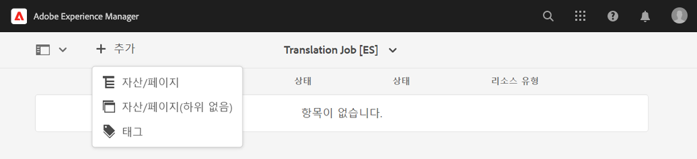

1. 경로 브라우저가 열려 추가할 콘텐츠를 구체적으로 선택할 수 있습니다. 콘텐츠를 찾은 다음 탭하거나 클릭하여 선택합니다.

   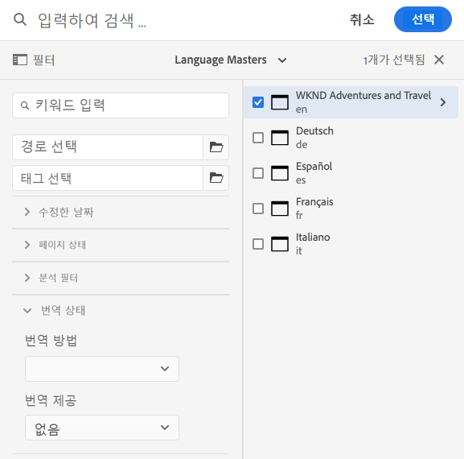

1. **선택**&#x200B;을 탭하거나 클릭하여 선택한 콘텐츠를 작업에 추가합니다.
1. **번역** 대화 상자에서 **언어 사본을 생성**&#x200B;하도록 지정합니다.

   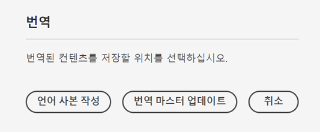

1. 이제 콘텐츠가 작업에 포함됩니다.

   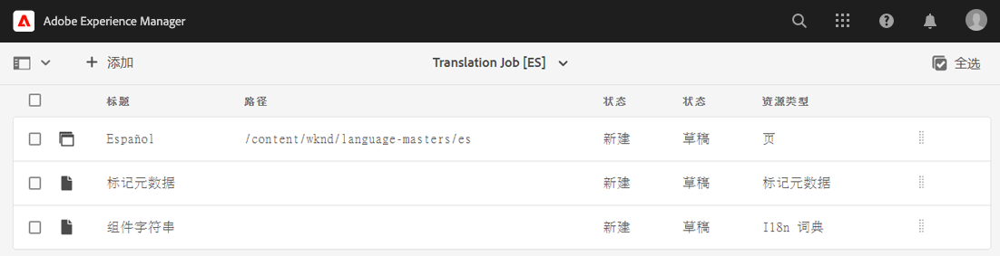

1. 라인 항목에 대한 선택 확인란을 탭하거나 클릭하면 작업에서 항목을 삭제하거나 사이트 콘솔에서 볼 수 있는 옵션과 같은 추가 옵션이 표시됩니다.

   

1. 필요한 모든 콘텐츠를 작업에 포함하려면 이들 단계를 반복하십시오.

>[!TIP]
>
>경로 브라우저는 콘텐츠를 검색하고, 필터링하고, 탐색할 수 있는 강력한 도구입니다. **콘텐츠 전용/필터** 버튼을 탭하거나 클릭하여 측면 패널을 토글하고 **수정된 날짜** 또는 **번역 상태**&#x200B;와 같은 고급 필터를 표시합니다.
>
>[추가 리소스 섹션](#additional-resources)에서 경로 브라우저에 대해 자세히 알아볼 수 있습니다.

이전 단계를 사용하여 프로젝트의 모든 언어(작업)에 필요한 콘텐츠를 추가할 수 있습니다. 모든 콘텐츠를 선택한 다음에는 번역을 시작할 수 있습니다.

일반적으로 번역 작업의 콘텐츠는 **번역 작업** 창의 **상태** 열에 표시된 **초안** 상태에서 시작합니다.

번역 작업을 시작하려면 번역 프로젝트 개요로 돌아가 **번역 작업** 카드 상단에서 V자 버튼을 탭하거나 클릭하여 **시작**&#x200B;을 선택합니다.


이제 AEM은 번역 구성 및 커넥터와 통신하여 콘텐츠를 번역 서비스로 전송합니다. **번역 작업** 창으로 돌아가 항목의 **상태** 열을 보면 번역 진행률을 볼 수 있습니다.


기계 번역은 **승인됨** 상태로 자동 반환됩니다. 사람 번역은 더 많은 상호 작용을 허용하지만, 이는 이 여정에서 다루지 않습니다.

>[!TIP]
>
>번역 작업을 처리하는 데 약간의 시간이 소요될 수 있으며, 번역 항목이 **승인됨** 상태에 도달하기 전에 **초안** 상태에서 **번역 진행 중**, **검토 준비됨** 상태로 이동하는 것을 확인할 수 있습니다. 이는 예상되는 진행 상황입니다.

>[!NOTE]
>
>[이전 섹션에서 설명된](#using-translation-project) 대로 프로젝트 옵션인 **홍보 후 론치 삭제**&#x200B;를 비활성화하지 않으면 번역된 항목이 **삭제됨** 상태로 표시됩니다. AEM은 번역된 항목이 도착하면 번역 기록을 자동으로 폐기하므로 이는 정상적인 현상입니다. 번역된 항목은 언어 사본으로 가져와졌으며, 번역 기록은 더 이상 필요하지 않아 삭제되었습니다.
>
>이것이 명확하게 이해되지 않아도 걱정하지 마십시오. 이는 AEM이 어떻게 작동하는지에 대한 심층적인 세부 정보이며, 여정에 대한 이해에 영향을 미치지 않습니다. AEM의 번역 처리 방법에 대해 자세히 알아보려면 이 문서 끝의 [추가 리소스](#additional-resources) 섹션을 참조하십시오.

## 번역된 콘텐츠 검토 {#reviewing}

[앞에서 보았던 것처럼,](#using-translation-project) 기계 번역 콘텐츠는 **승인됨** 상태로 AEM으로 다시 흐릅니다. 기계 번역을 사용 중이므로 사람의 개입이 필요 없다고 간주되기 때문입니다. 그러나 물론 번역된 콘텐츠를 계속 검토할 수 있습니다.

완료된 번역 작업으로 이동하여 확인란을 탭하거나 클릭하여 라인 항목을 선택하십시오. 도구 모음에 **사이트에서 미리보기** 아이콘이 표시됩니다.

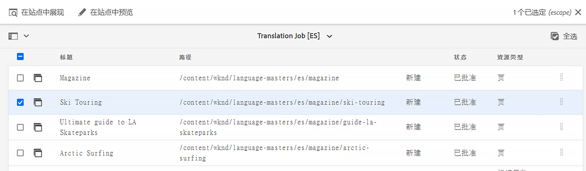

이 아이콘을 탭하거나 클릭하여 해당 콘솔에서 번역된 콘텐츠를 열고 번역된 콘텐츠의 세부 정보를 볼 수 있습니다.

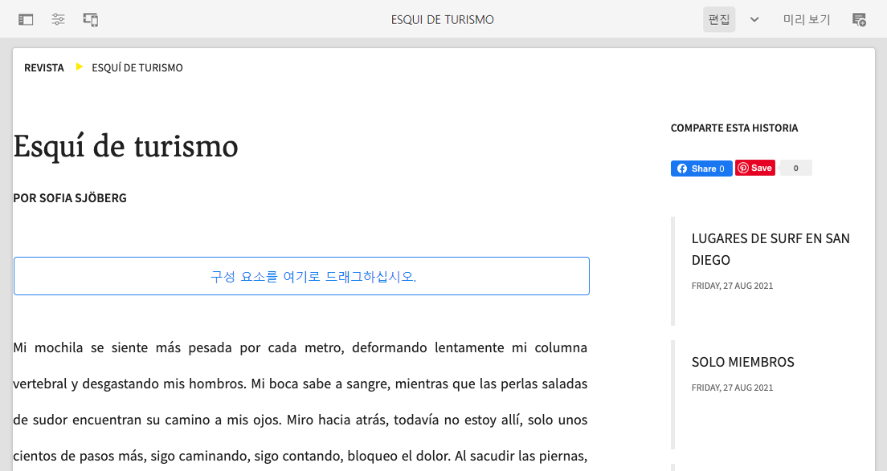

올바른 권한을 보유하고 있는 경우 번역된 콘텐츠를 추가로 수정할 수 있지만, 콘텐츠 편집 작업은 이 여정에서 다루지 않습니다. 이 주제에 대한 자세한 내용은 이 문서 끝에 있는 [추가 리소스](#additional-resources) 섹션을 참조하십시오.

이 프로젝트의 목적은 간편한 액세스와 명확한 개요 제공을 위해 번역과 관련된 모든 리소스를 한 곳에 수집하는 것입니다. 그러나 번역된 항목의 세부 정보에서 확인할 수 있듯이 번역 자체는 번역 언어의 사이트 폴더로 다시 흐릅니다. 이 예에서 폴더의 상태는 다음과 같습니다.

```text
/content/<your-project>/es
```

**탐색** -> **사이트**&#x200B;를 통해 이 폴더로 이동하면 번역된 콘텐츠를 볼 수 있습니다.

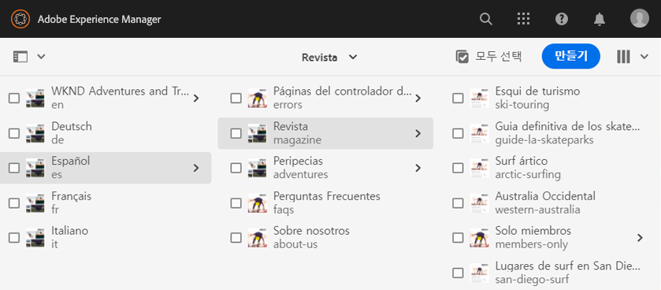

AEM의 번역 프레임워크는 번역 커넥터로부터 번역을 수신한 다음 자동으로 언어 루트를 기반으로 하며 커넥터가 제공하는 번역을 사용하는 콘텐츠 구조를 만듭니다.

이 콘텐츠는 게시되지 않았으므로 사용할 수 없습니다. 번역 여정의 다음 단계에서는 이 작성자-게시 구조에 대해 알아보고 번역된 콘텐츠를 게시하는 방법을 살펴보겠습니다.

## 사람 번역 {#human-translation}

번역 서비스가 사람 번역을 제공하는 경우 검토 프로세스에서 더 많은 옵션을 사용할 수 있습니다. 예를 들어 번역은 **초안** 상태로 프로젝트에 다시 돌아가며 이를 수동으로 검토한 다음 승인 또는 거부해야 합니다.

사람 번역은 이 현지화 여정에서 다루지 않습니다. 이 주제에 대한 자세한 내용은 이 문서 끝에 있는 [추가 리소스](#additional-resources) 섹션을 참조하십시오. 그러나 추가 승인 옵션 외에 사람 번역의 워크플로는 이 여정에서 설명된 대로 기계 번역과 동일합니다.

## 다음 단계 {#what-is-next}

AEM Sites 번역 여정의 한 부분을 완료했으므로,

* 번역 프로젝트에 대해 이해할 수 있습니다.
* 새 번역 프로젝트를 만들 수 있습니다.
* 번역 프로젝트를 사용하여 콘텐츠를 번역할 수 있습니다.

이 지식을 기반으로 다음 문서인 [번역된 콘텐츠 게시](publish-content.md)를 검토하여 AEM Sites 번역 여정을 계속하십시오. 여기에서는 번역된 콘텐츠를 게시하는 방법 및 언어 루트 콘텐츠가 변경될 때 이러한 번역을 업데이트하는 방법에 대해 알아보게 됩니다.

## 추가 리소스 {#additional-resources}

다음 문서인 [번역된 콘텐츠 게시](publish-content.md)를 검토하여 번역 여정의 다음 부분으로 넘어가는 것이 좋습니다. 다음은 이 문서에 나열된 몇 가지 개념을 자세히 알아보는 추가적인 옵션 리소스이며, 이들 리소스를 여정에서 계속 사용할 필요는 없습니다.

* [번역 프로젝트 관리](/help/sites-cloud/administering/translation/managing-projects.md) - 사람 번역 워크플로 및 다국어 프로젝트와 같은 번역 프로젝트 및 추가 기능의 세부 정보에 대해 알아봅니다.
* [작성 환경 및 도구](/help/sites-cloud/authoring/fundamentals/environment-tools.md##path-selection) - AEM은 강력한 경로 브라우저를 포함하여 콘텐츠 구성 및 편집을 위한 다양한 메커니즘을 제공합니다.
