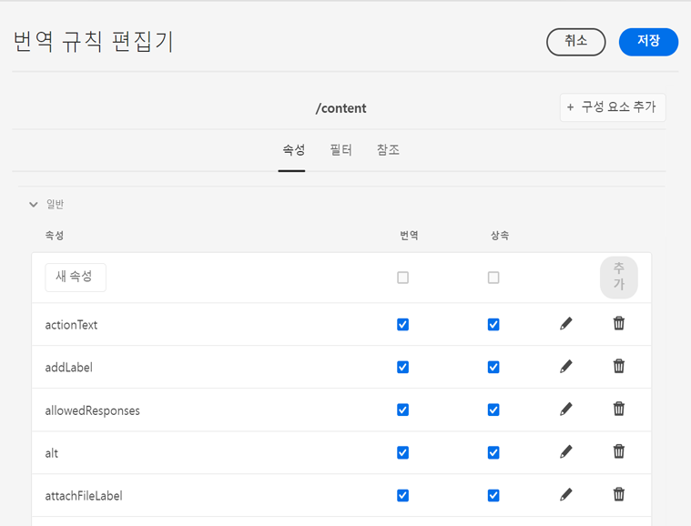

# 번역 규칙 구성 {#configure-translation-rules}

번역 규칙을 정의하여 번역할 콘텐츠를 식별하는 방법에 대해 알아봅니다.

## 지금까지의 스토리 {#story-so-far}

AEM Sites 번역 여정의 이전 문서인 [번역 커넥터 구성](configure-connector.md)에서는 번역 커넥터를 설치하고 구성하는 방법에 대해 알아보았습니다. 여기에서 알게 된 내용은 다음과 같습니다.

* AEM 번역 통합 프레임워크의 중요한 매개변수를 이해할 수 있습니다.
* 번역 서비스에 대해 나만의 연결을 설정할 수 있습니다.

이제 커넥터를 설정했으므로 이 문서는 번역할 콘텐츠를 식별하는 다음 단계를 소개합니다.

## 목표 {#objective}

이 문서는 AEM의 번역 규칙을 사용하여 번역 콘텐츠를 식별하는 방법을 이해하는 데 도움이 됩니다. 이 문서를 읽고 나면

* 번역 규칙의 역할에 대해 이해할 수 있습니다.
* 나만의 번역 규칙을 정의할 수 있습니다.

## 번역 규칙 {#translation-rules}

AEM Sites 페이지는 다양한 정보를 포함할 수 있습니다. 프로젝트 요구 사항에 따라 페이지 내의 일부 정보만 번역할 수도 있습니다.

번역 규칙은 번역 프로젝트에 포함되어 있거나 번역 프로젝트에서 제외된 콘텐츠를 식별합니다. 콘텐츠가 번역되면 AEM은 이러한 규칙에 따라 콘텐츠를 추출하거나 수집합니다. 이러한 방식으로 번역해야 하는 콘텐츠만 번역 서비스로 전송할 수 있습니다.

번역 규칙에는 다음과 같은 정보가 포함됩니다.

* 규칙이 적용되는 콘텐츠의 경로
   * 규칙은 콘텐츠의 하위 항목에도 적용됩니다.
* 번역할 콘텐츠가 포함된 속성의 이름
   * 속성은 특정 리소스 타입 또는 모든 리소스 타입에 한정될 수 있습니다.

AEM은 사이트 페이지에 대한 번역 규칙을 자동으로 생성하지만, 각 프로젝트의 요구 사항이 다르기 때문에 프로젝트에 필요한 규칙을 검토하고 조정하는 방법을 이해하는 것이 중요합니다.

## 번역 규칙 생성 {#creating-rules}

복잡한 번역 요구 사항을 지원하도록 여러 규칙을 만들 수 있습니다. 예를 들어 작업 중인 프로젝트 중 하나에서는 모든 페이지 정보를 번역해야 하지만, 다른 페이지에서는 제목을 번역하지 않은 채 설명만 번역해야 할 수 있습니다.

번역 규칙은 이러한 시나리오를 처리할 수 있도록 설계되었습니다. 그러나 이 예제에서는 간단한 단일 구성에 초점을 맞추어 규칙을 만드는 방법에 대해 설명합니다.

**번역 구성** 콘솔을 사용하여 번역 규칙을 구성할 수 있습니다.

다음 방법으로 액세스할 수 있습니다.

1. **도구** -> **일반**&#x200B;으로 이동합니다.
1. **번역 구성**&#x200B;을 탭하거나 클릭합니다.

AEM은 모든 콘텐츠에 대한 번역 규칙을 자동으로 생성합니다. 이러한 규칙을 보려면 다음 작업을 수행하십시오.

1. `/content` 컨텍스트를 선택한 다음 도구 모음에서 **편집** 옵션을 선택합니다.
1. 규칙 변환 규칙 편집기가 열리며 AEM이 `/content` 경로에 대해 자동으로 생성한 규칙이 표시됩니다.

   

1. 번역할 페이지 속성은 목록의 **일반** 섹션 아래에 위치합니다. 번역에 명시적으로 포함하고자 하는 기존 속성 이름을 추가하거나 업데이트할 수 있습니다.
   1. **새 속성** 필드에 속성 이름을 입력합니다.
   1. **번역** 및 **상속** 옵션은 자동으로 선택되어 있습니다.
   1. **추가**&#x200B;를 탭하거나 클릭합니다.
   1. 번역해야 하는 모든 필드에 대해 이들 단계를 반복하십시오.
   1. **저장**&#x200B;을 탭하거나 클릭합니다.

이제 번역 규칙을 구성했습니다.

>[!NOTE]
>
>AEM은 번역 규칙을 자동으로 생성합니다. 간단한 번역 설정 또는 번역 워크플로 테스트의 경우 새 규칙을 만들거나 자동으로 생성된 기존 규칙을 수정할 필요가 없습니다. 이들 단계의 세부 정보는 규칙의 작동 방식을 설명하고 AEM의 번역 처리 방법에 대한 컨텍스트를 제공하기 위해 표시됩니다.

>[!TIP]
>
>또한 번역 구성 콘솔에서 **컨텍스트 추가** 버튼을 탭하거나 클릭하여 특정 경로 또는 프로젝트에 대한 규칙만 만들 수도 있습니다. 이 주제는 이 여정에서 다루지 않습니다.

## 고급 사용 {#advanced-usage}

여러 가지 추가 속성을 번역 규칙의 일부로 구성할 수 있습니다. 또한 XML로 직접 규칙을 지정할 수 있으므로 보다 구체적이고 유연하게 규칙을 지정할 수 있습니다.

이러한 기능은 일반적으로 콘텐츠 현지화를 시작하기 위해 필요하지 않지만, 관심이 있는 경우 [추가 리소스](#additional-resources) 섹션에서 자세한 내용을 확인할 수 있습니다.

## 다음 단계 {#what-is-next}

AEM Sites 번역 여정의 한 부분을 완료했으므로,

* 번역 규칙의 역할에 대해 이해할 수 있습니다.
* 나만의 번역 규칙을 정의할 수 있습니다.

이 지식을 기반으로 다음 문서인 [콘텐츠 번역](translate-content.md)을 검토하여 AEM Sites 번역 여정을 계속하십시오. 여기에서는 커넥터와 규칙을 함께 사용하여 콘텐츠를 번역하는 방법에 대해 알아보게 됩니다.

## 추가 리소스 {#additional-resources}

다음 문서인 [콘텐츠 번역](translate-content.md)을 검토하여 번역 여정의 다음 부분으로 넘어가는 것이 좋습니다. 다음은 이 문서에 나열된 몇 가지 개념을 자세히 알아보는 추가적인 옵션 리소스이며, 이들 리소스를 여정에서 계속 사용할 필요는 없습니다.

* [번역할 콘텐츠 식별](/help/sites-cloud/administering/translation/rules.md) - 번역 규칙이 번역이 필요한 콘텐츠를 식별하는 방법에 대해 알아봅니다.
