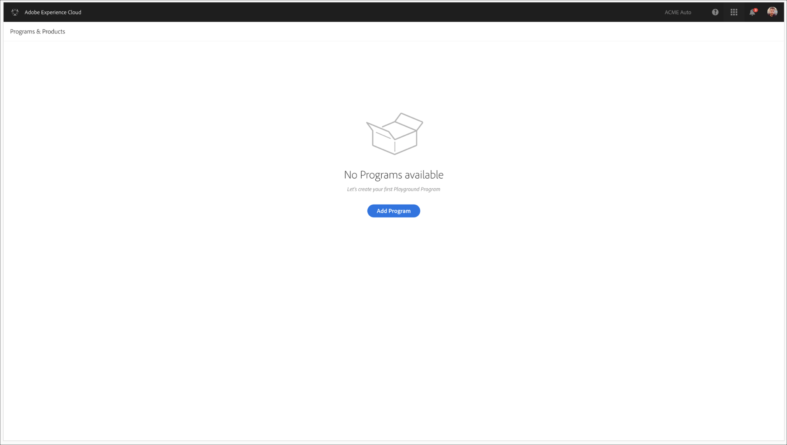
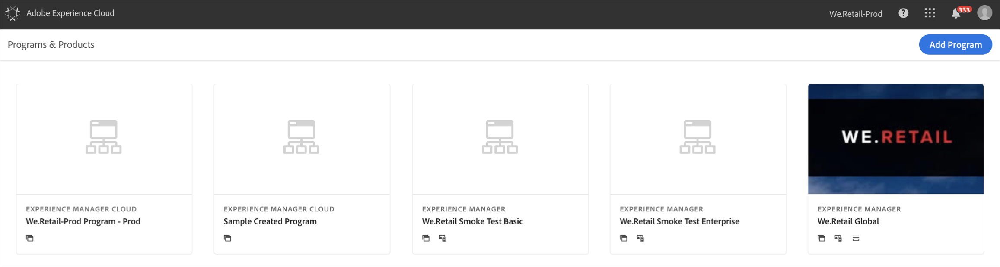

# 프로그램 만들기 {#create-a-program}

클라우드 기본 솔루션은 사용자에게 필요한 권한과 셀프 서비스 모델에 대한 프로그램을 만들 수 있는 기능을 제공합니다.

프로그램 만들기 마법사는 특정 고객 또는 조직에서 사용할 수 있는 범위 내에서 프로그램을 만드는 사용자의 목적에 따라 자세한 내용을 제출하도록 요청합니다.

Cloud Manager에 처음으로 액세스하거나 테넌트에 프로그램이 없는 경우 사용자는 **첫 번째 프로그램 만들기** 화면이 표시됩니다. 사용자가 *Esc*&#x200B;을 선택하거나 대화 상자를 클릭하면 다음 화면이 표시됩니다.

## 프로그램 만들기 마법사 사용 {#using-create-program-wizard}

특정 고객/조직에서 사용할 수 있는 범위 내에서 프로그램을 만드는 사용자의 목적에 따라 프로그램 생성 마법사는 사용자에게 하나 이상의 세부 사항을 제출하도록 요청합니다.

>[!NOTE]
>프로그램이 이미 존재하는 경우 아래 그림과 같이 랜딩 페이지의 오른쪽 상단에 **프로그램 추가**&#x200B;가 표시됩니다.

## 샌드박스 프로그램 만들기 {#create-sandbox-program}

아래의 단계에 따라 샌드박스 프로그램을 만드십시오.

1. 프로그램 만들기 마법사에서 **샌드박스 설정**&#x200B;을 선택합니다. 사용자가 **만들기**&#x200B;를 선택하기 전에 프로그램 이름을 제출합니다.

   

1. 사용자는 랜딩 페이지에 새로운 샌드박스 프로그램 카드를 보고 그 위로 마우스를 가져가 클라우드 관리자 아이콘을 선택하여 클라우드 관리자 개요 페이지로 이동할 수 있습니다. 이 카드는 사용자가 새로 만든 샌드박스 프로그램의 자동 설정 상태를 알려줍니다. 사용자에게 진행 상태가 표시됩니다.

   

1. 프로그램 설정 및 프로젝트 생성 단계가 완료되면 사용자는 아래 그림과 같이 **Git 관리** 링크에 액세스할 수 있습니다.

   

   >[!NOTE]
   >
   >Cloud Manager UI에서 셀프 서비스 Git 계정 관리를 사용하여 Git 리포지토리에 액세스하고 관리하는 방법에 대한 자세한 내용은 [Git 액세스](/help/implementing/cloud-manager/accessing-git.md)를 참조하십시오.

1. 개발 환경이 만들어지면 사용자는 아래 그림과 같이 **AEM** 링크에 액세스할 수 있습니다.

   

1. 개발에 배포되는 비프로덕션 파이프라인이 완료되면 마법사가 사용자에게 AEM(개발 중)에 액세스하거나 코드를 개발 환경에 배포하도록 안내합니다.

   

   >[!NOTE]
   >아래와 같이 Cloud Manager 개요 페이지에서 프로그램을 편집, 전환 또는 추가할 수도 있습니다.

   

## 샌드박스 프로그램 삭제 {#delete-sandbox-program}

클라우드 관리자의 *비즈니스 소유자* 또는 *배포 관리자* 역할의 샌드박스 프로그램 사용자는 클라우드 관리자 UI를 통해 프로덕션 및 스테이지 환경 설정을 삭제할 수 있습니다.

>[!NOTE]
>프로덕션 또는 스테이지에서 삭제 옵션을 선택하면 세트에 있는 다른 옵션도 삭제됩니다.

아래와 같이 랜딩 페이지에서 삭제 옵션을 사용할 수 있습니다.

또는,

샌드박스 프로그램을 삭제하려면 **프로그램 개요** 페이지에서 **프로그램 삭제**&#x200B;를 선택합니다.

## 정규 프로그램 {#create-regular-program} 만들기

*Regular* 프로그램은 AEM 및 Cloud Manager에 익숙하고 프로덕션 팀에 배포하는 목적에 따라 코드 작성, 작성 및 테스트를 시작할 준비가 된 사용자를 위한 것입니다.

아래 절차에 따라 일반 프로그램을 만드십시오.

1. 프로그램 만들기 마법사에서 **프로덕션**&#x200B;에 대해 설정을 선택하여 일반 프로그램을 만듭니다. 사용자는 **계속**&#x200B;을 선택하기 전에 기본 프로그램 이름을 수락하거나 편집할 수 있습니다.

   

1. 사용자는 위의 화면 다음에 표시될 화면의 프로그램에 포함될 솔루션을 선택합니다.

   >[!NOTE]
   >
   >아래 화면은 두 개 이상의 솔루션을 구매한 고객 세그먼트에 대해서만 표시됩니다. 하나의 솔루션만 구매한 고객의 경우 아래의 솔루션 선택 화면이 표시되지 않습니다.

   

1. 솔루션을 선택하고 나면 **만들기**&#x200B;를 클릭합니다.

   

1. 랜딩 페이지에 프로그램 카드가 표시되면 마우스를 올려 클라우드 관리자 아이콘을 선택하여 클라우드 관리자 **개요** 페이지로 이동합니다.

   

1. 기본 클릭유도카드는 사용자가 환경을 만들고 비프로덕션 파이프라인을 생성하며 마지막으로 프로덕션 파이프라인을 만들도록 안내합니다.
   

   >[!NOTE]
   >
   >일반 프로그램에는 **자동 설정** 기능이 없습니다.

