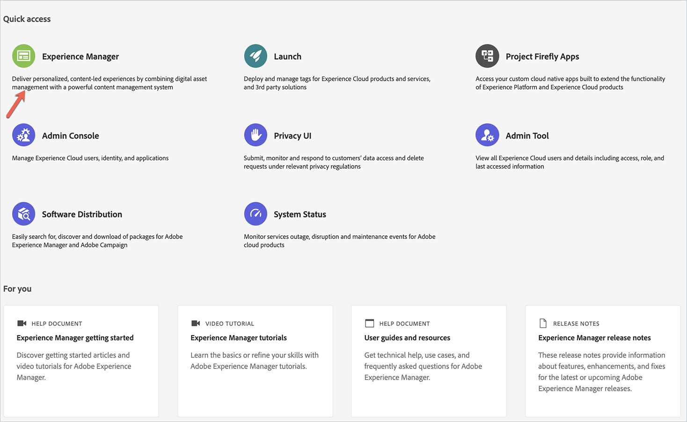
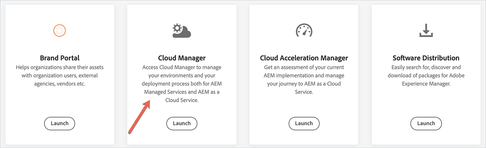

# 클라우드 관리자 랜딩 페이지 {#first-time-login}

시스템 관리자가 Cloud Manager에 대한 액세스 권한을 부여하면 Cloud Manager 로그인 페이지로 이동하는 이메일을 받게 됩니다.

Cloud Manager에 액세스하려면 아래 절차를 따르십시오.

1. Adobe ID을 사용하여 [Experience Cloud](https://experience.adobe.com/)으로 이동합니다.
1. **Experience Manager**을 선택합니다.
   

1. 클라우드 관리자 카드의 **시작**을 클릭합니다.
[!UICONTROL 클라우드 관리자]에 로그인하면 사용자 인터페이스(UI)를 사용할 수 있습니다.
   

   >[!NOTE]
   >
   >[!UICONTROL 클라우드 관리자]에 할당된 역할 및 응용 프로그램 상태에 따라 [!UICONTROL 클라우드 관리자] UI를 사용하는 동안 다른 화면이 표시됩니다.

## 클라우드 관리자의 프로그램 {#cloud-manager-landing-page}

[!UICONTROL 클라우드 관리자]에 성공적으로 로그인하면 랜딩 페이지에 조직에 있는 기존 프로그램의 카드가 표시됩니다.

>[!NOTE]
>
>Cloud Service에 있는 프로그램은 아래와 같이 자막 **Experience Manager 클라우드**(AMS 프로그램의 경우 **Experience Manager**&#x200B;와는 반대)로 표시됩니다.

환경에 따라 두 옵션 중 하나가 표시됩니다.

* **Cloud Manager에 프로그램이 없습니다.**

* **프로그램이 Cloud Manager에 이미 있습니다.**

조직에 프로그램이 없는 경우 아래 그림과 같이 랜딩 페이지에서 첫 번째 프로그램을 만들 수 있습니다.

조직에 프로그램이 이미 존재하는 경우 랜딩 페이지에서 다른 프로그램을 추가하고 아래 그림과 같이 기존의 모든 프로그램을 표시합니다.

>[!NOTE]
>Cloud Service에 있는 프로그램은 자막 **Experience Manager 클라우드**&#x200B;로 표시됩니다(AMS 프로그램의 경우 **Experience Manager**와는 반대).
>예를 들어 위의 그림에서 **We.Retail Global**&#x200B;은 AMS 프로그램이고, **We.Retail-Prod Program - Prod**&#x200B;는 Cloud Service을 통해 사용할 수 있는 프로그램입니다.

Cloud Manager에서 프로그램을 추가하는 방법에 대해 알아보려면 다음을 참조하십시오.

* [프로덕션 프로그램 만들기](/help/onboarding/getting-access-to-aem-in-cloud/creating-production-program.md)
* [샌드박스 프로그램 만들기](/help/onboarding/getting-access-to-aem-in-cloud/creating-sandbox-program.md)

