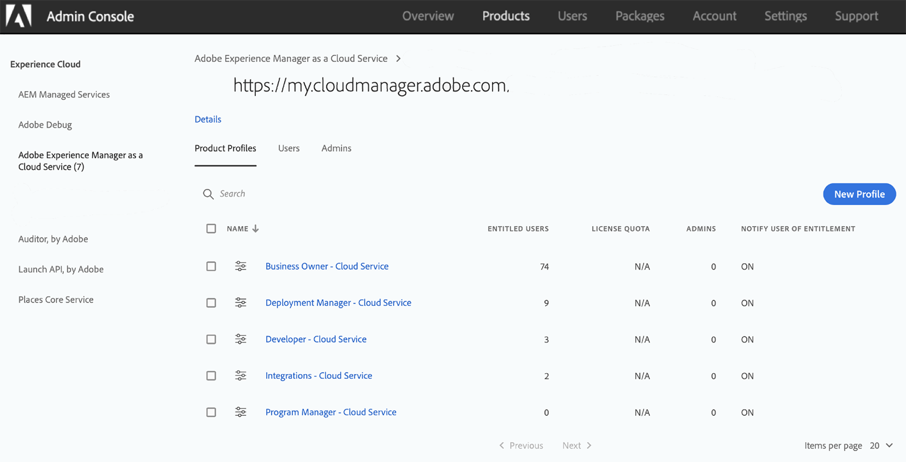
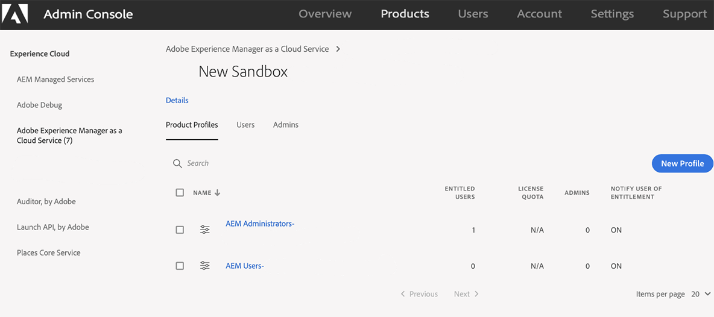

# 클라우드 서비스로서의 Experience Manager 액세스 {#navigation}

시스템 관리자가 Cloud Manager에 대한 액세스 권한을 부여하면 Adobe Experience Cloud를 통해서도 액세스할 수 있는 Cloud Manager 로그인 페이지로 안내하는 이메일을 [받게 됩니다](https://my.cloudmanager.adobe.com/).

로그인이 성공하면 아래와 같이 Cloud Manager의 랜딩 페이지로 이동합니다.

## SysAdmin 작업 {#sysadmin-tasks}

이제 SysAdmin 역할의 사용자는 관리 콘솔에 직접 액세스하여 역할 및 권한 및 AEM 인스턴스에 대한 액세스를 관리할 수 있습니다.

### 역할 관리 {#manage-roles}

SysAdmin 역할의 사용자는 한 번의 클릭으로 Cloud Manager에 대한 사용자 역할 또는 권한이 관리되는 관리 **콘솔** 위치에 액세스할 수 있습니다.

프로필에 [사용자를 추가하는 방법에 대한 자세한 내용은 클라우드 관리자](https://docs.adobe.com/content/help/en/experience-manager-cloud-service/security/ims-support.html#accessing-cloud-manager) 액세스를 참조하십시오.

>[!NOTE]
>2020년 1월 이전에 클라우드 서비스로 AEM에 대한 액세스 권한이 부여된 일부 조직의 경우 Adobe 관리 콘솔로 이동되고 제품 및 환경 제품 프로필을 선택해야 합니다.

1. 클라우드 관리자의 랜딩 페이지로 이동하고 액세스 **관리를 클릭합니다**.

   

1. 액세스 **관리** 를 **클릭하면** Cloud Manager에 대한 사용자 역할 또는 권한을 관리할 수 있는 관리 콘솔로 이동합니다.

   

### 작성자 인스턴스에 대한 액세스 관리 {#manage-access-aem}

SysAdmin 역할의 사용자는 한 번의 클릭으로 **관리 콘솔에** 액세스할 수 있습니다. 여기서 작성자 인스턴스로 직접 이동하여 액세스 권한을 관리할 수 있습니다.

>[!NOTE]
>2020년 1월 이전에 클라우드 서비스로 AEM에 대한 액세스 권한이 부여된 일부 조직의 경우 Adobe 관리 콘솔로 이동되고 제품 및 환경 제품 프로필을 선택해야 합니다.

자세한 [내용은 AEM의 인스턴스 액세스를 클라우드 서비스로](https://docs.adobe.com/content/help/en/experience-manager-cloud-service/security/ims-support.html#accessing-instance-cloud-service) 참조하십시오.

1. 아래 그림과 같이 **개요** 페이지 ** 또는 **환경** 페이지에서 **환경** 카드로 이동하여 액세스관리옵션을 사용합니다.

   

1. 액세스 **관리** 를 **클릭하면** 환경의 작성자 인스턴스에 대한 액세스 권한이 있는 관리 콘솔로이동합니다.

   

## 기존 AMS 고객의 경우 {#existing-aem}

기존 AMS(Adobe Managed Services) 고객이고 클라우드 서비스에 액세스할 수 있는 경우, 랜딩 페이지의 오른쪽 상단에 기존 프로그램과 **프로그램** 추가 단추가 표시됩니다.

프로그램 **추가** 단추가 보이지 않고 클라우드 서비스 액세스에 대한 질문이 있는 경우 Adobe 담당자에게 문의하십시오.

자세한 [내용은 기존 프로그램과 함께 클라우드 서비스의 새 프로그램](/help/onboarding/getting-access-to-aem-in-cloud/first-time-login.md#existing-program) 추가를 참조하십시오.

## 신규 클라우드 서비스 고객의 경우 {#new-cloud-services}

새 클라우드 서비스 고객인 경우 빈 랜딩 페이지의 오른쪽 상단 모서리에 **프로그램** 추가 단추가 표시됩니다. 클라우드 서비스에 새 프로그램을 추가하려고 합니다.

자세한 [내용은 기존 프로그램](/help/onboarding/getting-access-to-aem-in-cloud/first-time-login.md#no-program) 없이 클라우드 서비스에서 새 프로그램 추가를 참조하십시오.

