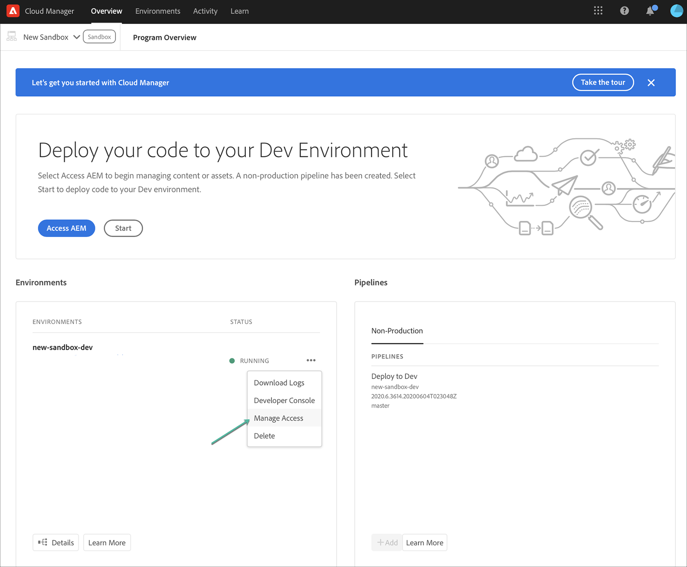

# AEM용 Cloud Manager에 Cloud Service {#navigation}(으)로 액세스

시스템 관리자가 Cloud Manager에 대한 액세스 권한을 부여하면 [Adobe Experience Cloud](https://my.cloudmanager.adobe.com/)을(를) 통해서도 액세스할 수 있는 Cloud Manager 로그인 페이지로 안내하는 이메일을 받게 됩니다.

로그인하면 아래와 같이 Cloud Manager의 랜딩 페이지로 이동합니다.

## SysAdmin 작업 {#sysadmin-tasks}

SysAdmin 역할의 사용자는 **액세스 관리**&#x200B;를 선택하여 Admin Console에 직접 액세스하여 역할 및 권한 및 AEM 인스턴스에 대한 액세스를 관리할 수 있습니다.

### 역할 관리 {#manage-roles}

SysAdmin 역할의 사용자는 Cloud Manager에 대한 사용자 역할이나 권한이 관리되는 **Admin Console**&#x200B;의 위치에 대한 한 번의 클릭으로 액세스할 수 있습니다.

프로필에 사용자를 추가하는 방법에 대한 자세한 내용은 [Accessing Cloud Manager](https://docs.adobe.com/content/help/en/experience-manager-cloud-service/security/ims-support.html#accessing-cloud-manager)를 참조하십시오.

>[!NOTE]
>2020년 1월 이전에 Cloud Service으로 AEM에 대한 액세스 권한을 받은 일부 조직의 경우 Adobe Admin Console으로 이동하여 제품 및 환경 제품 프로필을 선택해야 합니다.

1. 클라우드 관리자의 랜딩 페이지로 이동하고 **액세스 관리**&#x200B;를 클릭합니다.

   

1. **액세스 관리**&#x200B;를 클릭하면 Cloud Manager에 대한 사용자 역할이나 권한을 관리할 수 있는 **Admin Console**&#x200B;으로 이동합니다.

   

### 작성자 인스턴스 {#manage-access-aem}에 대한 액세스 관리

SysAdmin 역할의 사용자는 작성자 인스턴스로 직접 이동하고 액세스를 관리할 수 있는 **Admin Console**&#x200B;에 대한 한 번의 클릭으로 액세스할 수 있습니다.

>[!NOTE]
>2020년 1월 이전에 Cloud Service으로 AEM에 대한 액세스 권한을 받은 일부 조직의 경우 Adobe Admin Console으로 이동하여 제품 및 환경 제품 프로필을 선택해야 합니다.

자세한 내용은 [AEM에서 인스턴스 액세스를 Cloud Service](https://docs.adobe.com/content/help/en/experience-manager-cloud-service/security/ims-support.html#accessing-instance-cloud-service)로 참조하십시오.

1. **프로그램 개요** 페이지에서 **환경** 카드로 이동하고 **액세스 관리**&#x200B;를 클릭합니다.

   

   또는,

   **환경** 에서 세부 사항 **** 을 클릭하면 관리 단추에서 액세스  **** 관리를 사용할 수  **** 있습니다.

   

1. **액세스 관리**&#x200B;를 클릭하면 환경의 작성자 인스턴스에 대한 액세스 권한이 있는 **Admin Console**&#x200B;으로 이동합니다.

   

## 기존 AMS 고객의 경우 {#existing-aem}

기존 AMS(Adobe Managed Services) 고객이고 Cloud Service에 액세스할 수 있는 경우, 랜딩 페이지의 오른쪽 상단 모서리에 기존 프로그램과 **프로그램 추가** 단추가 표시됩니다.

**프로그램 추가** 단추가 보이지 않고 Cloud Service 액세스에 대한 질문이 있는 경우 Adobe 담당자에게 문의하십시오.

## 새 Cloud Service 고객의 경우 {#new-cloud-services}

새 Cloud Service 고객인 경우 빈 랜딩 페이지의 오른쪽 상단 모서리에 **프로그램 추가** 단추가 표시됩니다. Cloud Service에 새 프로그램을 추가하려고 합니다.

Cloud Manager에서 프로그램을 추가하는 방법에 대해 알아보려면 다음을 참조하십시오.
* [프로덕션 프로그램 만들기](/help/onboarding/getting-access-to-aem-in-cloud/creating-production-program.md)
* [샌드박스 프로그램 만들기](/help/onboarding/getting-access-to-aem-in-cloud/creating-sandbox-program.md)
