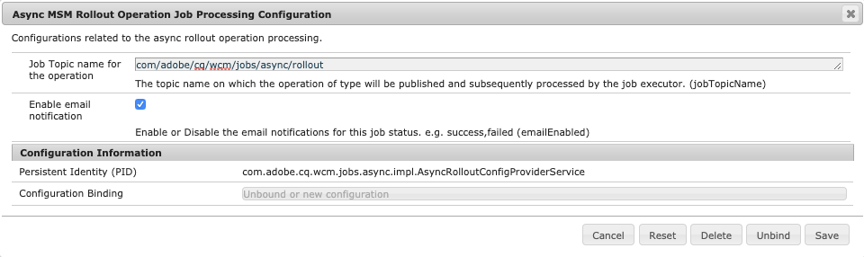

# 비동기 작업 {#asynchronous-operations}

Adobe 성능에 대한 부정적인 영향을 줄이기 위해 Experience Manager는 장기 실행 및 리소스 집약적인 특정 작업을 백그라운드 작업과 비동기적으로 처리합니다. 비동기 처리에는 시스템 리소스의 가용성에 따라 여러 작업을 대기열에 넣고 이를 연속적으로 실행하는 작업이 포함됩니다.

이러한 작업은 다음과 같습니다.

* 여러 자산 삭제
* 여러 참조가 있는 많은 자산 또는 자산 이동
* 자산 메타데이터의 일괄 내보내기/가져오기
* 원격 Experience Manager 배포에서 임계값을 초과하는 자산 가져오기
* Live Copy 롤아웃

다음에서 비동기 작업의 상태를 볼 수 있습니다. **[!UICONTROL 백그라운드 작업]** 다음 위치에 대시보드: **전역 탐색** > **도구** > **일반** > **작업**.

>[!NOTE]
>
>기본적으로 비동기 작업은 동시에 실행됩니다. *`n`*&#x200B;이(가) CPU 코어 수인 경우 기본적으로 *`n/2`* 작업을 동시에 실행할 수 있습니다. 작업 큐에 대한 사용자 지정 설정을 사용하려면 웹 콘솔에서 **[!UICONTROL 비동기 작업 기본 큐 구성]** 및 **비동기 작업 페이지 이동 및 롤아웃 구성**&#x200B;을 수정하십시오.
>
>자세한 내용은 [큐 구성](https://sling.apache.org/documentation/bundles/apache-sling-eventing-and-job-handling.html#queue-configurations)을 참조하십시오.

## 비동기 작업 상태 모니터링 {#monitor-the-status-of-asynchronous-operations}

AEM이 비동기 방식으로 작업을 처리할 때마다 [받은 편지함](/help/sites-cloud/authoring/inbox.md) 및 이메일(활성화된 경우)을 통해 알림을 받게 됩니다.

비동기 작업의 상태를 자세히 보려면 **[!UICONTROL 백그라운드 작업]** 페이지를 가리키도록 업데이트하는 중입니다.

1. Experience Manager 인터페이스에서 를 선택합니다. **전역 탐색** > **도구** > **일반** > **작업**.

1. 다음에서 **[!UICONTROL 백그라운드 작업]** 페이지, 작업 세부 사항을 검토합니다.

   

   특정 작업의 진행 상태를 확인하려면 **[!UICONTROL 상태]** 열의 값을 참조합니다. 진행 상태에 따라 다음 상태 중 하나가 표시됩니다.

   * **[!UICONTROL 활성]**: 작업을 처리 중입니다.

   * **[!UICONTROL 성공]**: 작업이 완료되었습니다.

   * **[!UICONTROL 실패]** 또는 **[!UICONTROL 오류]**: 작업을 처리할 수 없습니다.

   * **[!UICONTROL 예약됨]**: 나중에 처리하도록 작업이 예약되었습니다.

1. 활성 작업을 중지하려면 목록에서 해당 작업을 선택하고 도구 모음에서 **[!UICONTROL 중지]**&#x200B;를 클릭합니다.

   

1. 설명 및 로그 등 추가 세부 정보를 보려면 작업을 선택하고 **[!UICONTROL 열기]** 을 클릭합니다.

   

   작업 세부 사항 페이지가 표시됩니다.

   

1. 목록에서 작업을 삭제하려면 도구 모음에서 **[!UICONTROL 삭제]**&#x200B;를 선택합니다. CSV 파일로 세부 사항을 다운로드하려면 **[!UICONTROL 다운로드]**&#x200B;를 클릭합니다.

   >[!NOTE]
   >
   >상태가 **활성** 또는 **큐에 있음**&#x200B;인 경우 작업을 삭제할 수 없습니다.

## 비동기 작업 처리 옵션 구성 {#configure}

구성할 수 있는 비동기 작업 관련 몇 가지 옵션이 있습니다. 다음 예제는 로컬 개발 시스템에서 구성 관리자를 사용하여 이 작업을 수행하는 방법을 보여 줍니다.

>[!NOTE]
>
>[OSGi 구성](/help/implementing/deploying/configuring-osgi.md#creating-osgi-configurations) 는 변경 가능한 콘텐츠로 간주되며 이러한 구성은 프로덕션 환경을 위한 콘텐츠 패키지로 배포해야 합니다.

### 완료된 작업 제거 {#purging-completed-jobs}

AEM은 매일 01:00에 제거 작업을 실행하여 하루 이상 경과한 완료된 비동기 작업을 삭제합니다.

삭제 작업에 대한 일정 및 완료된 작업의 세부 사항이 삭제되기 전에 보존 기간을 수정할 수 있습니다. 특정 시점에 세부 사항이 유지되도록 완료된 작업의 최대 수를 구성할 수도 있습니다.

1. 에서 AEM SDK Quickstart Jar의 AEM 웹 콘솔에 로그인합니다. `https://<host>:<port>/system/console` 를 관리자로 사용하십시오.
1. 다음으로 이동 **OSGi** > **구성**
1. **[!UICONTROL Adobe Granite 비동기 작업 제거 예약 작업]** 작업을 엽니다.
1. 지정:
   * 완료된 작업을 삭제한 후 임계 기간(일)입니다.
   * 내역에 세부 사항이 유지되는 최대 작업 수입니다.
   * 제거 실행 시점의 크론 표현식입니다.

   

1. 변경 사항을 저장합니다.

### 비동기 자산 삭제 작업 구성 {#configuring-synchronous-delete-operations}

삭제할 자산 또는 폴더의 수가 임계값 수를 초과하는 경우 삭제 작업이 비동기적으로 수행됩니다.

1. 에서 AEM SDK Quickstart Jar의 AEM 웹 콘솔에 로그인합니다. `https://<host>:<port>/system/console` 를 관리자로 사용하십시오.
1. 다음으로 이동 **OSGi** > **구성**
1. 웹 콘솔에서 **[!UICONTROL 비동기 프로세스 기본 큐 구성]**&#x200B;을 엽니다.
1. **[!UICONTROL 자산 임계값 수]** 상자에서 삭제 작업의 비동기 처리를 위한 자산/폴더의 임계값 수를 지정합니다.

   

1. 이 작업 상태에 대한 이메일 알림을 수신하려면 **이메일 알림 활성화** 옵션을 선택합니다. 예를 들어, 성공, 실패 입니다.
1. 변경 사항을 저장합니다.

### 비동기 자산 이동 작업 구성 {#configuring-asynchronous-move-operations}

이동할 자산/폴더 또는 참조 수가 임계값 수를 초과하는 경우 이동 작업이 비동기식으로 수행됩니다.

1. 에서 AEM SDK Quickstart Jar의 AEM 웹 콘솔에 로그인합니다. `https://<host>:<port>/system/console` 를 관리자로 사용하십시오.
1. 다음으로 이동 **OSGi** > **구성**
1. 웹 콘솔에서 **[!UICONTROL 비동기 이동 작업 처리 구성]**&#x200B;을 엽니다.
1. **[!UICONTROL 자산/참조 임계값 수]** 상자에서 이동 작업의 비동기 처리를 위한 자산/폴더 또는 참조의 임계값 수를 지정합니다.

   

1. 이 작업 상태에 대한 이메일 알림을 수신하려면 **이메일 알림 활성화** 옵션을 선택합니다. 예를 들어, 성공, 실패 입니다.
1. 변경 사항을 저장합니다.

### 비동기 MSM 작업 구성 {#configuring-asynchronous-msm-operations}

1. 에서 AEM SDK Quickstart Jar의 AEM 웹 콘솔에 로그인합니다. `https://<host>:<port>/system/console` 를 관리자로 사용하십시오.
1. 다음으로 이동 **OSGi** > **구성**
1. 웹 콘솔에서 **[!UICONTROL 비동기 페이지 이동 작업 처리 구성]**&#x200B;을 엽니다.
1. 이 작업 상태에 대한 이메일 알림을 수신하려면 **이메일 알림 활성화** 옵션을 선택합니다. 예를 들어, 성공, 실패 입니다.

   

1. 변경 사항을 저장합니다.

>[!MORELIKETHIS]
>
>* [페이지 관리](/help/sites-cloud/authoring/sites-console/managing-pages.md)
>* [자산 메타데이터 일괄적으로 가져오거나 내보냅니다](/help/assets/metadata-import-export.md).
>* [연결된 자산을 사용하여 원격 배포에서 DAM 자산을 공유할 수 있습니다](/help/assets/use-assets-across-connected-assets-instances.md).
