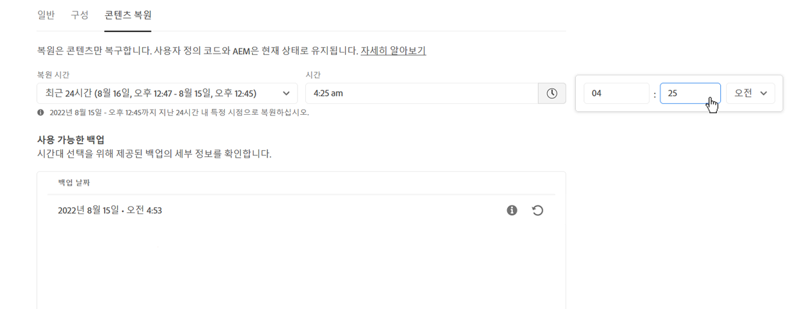

# AEM as a Cloud Service 콘텐츠 복원 {#content-restore}

>[!CONTEXTUALHELP]
>id="aemcloud_golive_backuprestore"
>title="백업 및 복원"
>abstract="Cloud Manager를 사용하여 백업에서 AEM as a Cloud Service 콘텐츠를 복원하는 방법에 대해 알아봅니다."

Cloud Manager를 사용하여 백업에서 AEM as a Cloud Service 콘텐츠를 복원하는 방법에 대해 알아봅니다.

>[!NOTE]
>
>* 이 기능은 단계적으로 배포되고 있으며 Cloud Manager의 일부 테넌트에서 아직 활성화되지 않았을 수 있습니다.
>* 이 기능은 현재 스테이징 및 개발 환경으로 제한됩니다. 이러한 환경 유형의 기능 사용 및 피드백을 통해 가까운 미래에 프로덕션 환경으로 성공적으로 배포할 수 있습니다.

## 개요 {#overview}

Cloud Manager의 셀프서비스 복원 프로세스는 Adobe 시스템 백업에서 데이터를 복사하고 원래 환경으로 복원합니다. 복원 작업은 손실, 손상 또는 실수로 삭제된 데이터를 원래 상태로 반환하기 위해 수행됩니다.

복원 프로세스는 콘텐츠에만 영향을 미치며 코드 및 AEM 버전은 변경되지 않습니다. 언제든지 개별 환경의 복원 작업을 시작할 수 있습니다.

Cloud Manager는 콘텐츠를 복원할 수 있는 두 가지 유형의 백업을 제공합니다.

* **시점(PIT):** 이 유형은 현재 시간으로부터 지난 24시간 동안의 연속 시스템 백업에서 복원됩니다.
* **지난 주:** 이 유형은 이전 24시간을 제외하고 지난 7일 동안의 시스템 백업에서 복원됩니다.

두 경우 모두 사용자 지정 코드의 버전 및 AEM 버전은 변경되지 않은 상태로 유지됩니다.

AEM as a ContentService에서 콘텐츠 복원의 성능 메트릭은 표준화된 벤치마크를 참조합니다.

* **복구 목표 시간(RTO):** 복구 목표 시간은 저장소 크기에 따라 다르지만 통상적으로 복구 시퀀스가 시작되고 나서 약 30분이 소요됩니다.
* **RPO( 복구 시점 목표 ):** 복구 지점 목표는 인스턴스가 작동한 기간에 따라 다릅니다.
   * 처음 24시간 동안: 그 24시간 동안 어떤 때라도.
   * 처음 24시간 후: 이전 6일간 최대 12시간.

>[!TIP]
>
>[공개 API를 사용](https://developer.adobe.com/experience-cloud/cloud-manager/reference/api/)하여 백업을 복원할 수도 있습니다.

## 제한 사항 {#limitations}

셀프서비스 복원 메커니즘을 사용하는 경우 다음과 같은 제한 사항이 적용됩니다.

* 복원 작업은 7일로 제한됩니다. 즉, 7일 이상 오래된 스냅샷은 복원할 수 없습니다.
* 달력의 한 달당 프로그램의 모든 환경에서 최대 10회의 복원이 허용됩니다.
* 환경이 생성된 후 첫 번째 백업 스냅샷을 만드는 데에는 6시간이 소요됩니다. 이 스냅샷을 생성할 때까지 환경에서 복원 작업을 수행할 수 없습니다.
* 현재 환경에 대해 실행 중인 전체 스택 또는 웹 계층 구성 파이프라인이 있는 경우 복원 작업이 시작되지 않습니다.
* 동일한 환경에서 다른 복구가 이미 실행 중인 경우에는 복원을 시작할 수 없습니다.
* 드문 경우지만 24시간/7일 백업 제한으로 인해 선택한 백업이 선택되었을 때와 복원이 시작된 시점 사이의 지연 때문에 선택한 백업을 사용할 수 없는 경우가 있습니다.
* 삭제된 환경의 데이터는 영구적으로 손실되어 복구할 수 없습니다.

## 콘텐츠 복원 {#restoring-content}

먼저 복원할 콘텐츠의 시간대를 결정합니다. 그런 다음 백업에서 환경 콘텐츠를 복원하려면 다음 단계를 수행합니다.

>[!NOTE]
>
>복원 작업을 시작하려면 **사업주** 또는 **배포 관리자** 역할이 있는 사용자가 로그인해야 합니다.

1. [my.cloudmanager.adobe.com](https://my.cloudmanager.adobe.com/)에서 Cloud Manager에 로그인한 다음 적절한 조직을 선택합니다.

1. 복원을 시작할 프로그램을 클릭합니다.

1. **프로그램 개요** 페이지의 **환경** 카드에서 복원을 시작하고자 하는 환경 옆에 있는 생략 부호를 클릭한 다음 **콘텐츠 복원**&#x200B;을 선택합니다.

   

   * 또는 특정 환경의 환경 세부 정보 페이지에서 **콘텐츠 복원** 탭으로 바로 이동할 수 있습니다.

1. 환경 세부 정보 페이지의 **콘텐츠 복원** 탭에서는 먼저 **복원할 시간** 드롭다운에서 복원 시간대를 선택합니다.

   1. **지난 24시간**&#x200B;을 선택한 경우 인접한 **시간** 필드를 사용하여 지난 24시간 내에서 정확한 복원 시간을 지정할 수 있습니다.

      

   1. **지난 주**&#x200B;를 선택한 경우 인접한 **날짜** 필드를 사용하여 이전 24시간을 제외한 지난 7일 내에서 날짜를 선택할 수 있습니다.

      

1. 날짜를 선택하거나 시간을 지정했다면 아래의 **사용 가능한 백업** 섹션에 복원할 수 있는 사용 가능한 백업 목록이 표시됩니다.

   

1. 정보 아이콘을 사용하여 복원하고자 하는 백업을 찾아 해당 백업에 포함된 코드 및 AEM 릴리스 버전과 관련된 정보를 확인하고 [백업 선택](#choosing-the-right-backup) 시 복원이 미치는 영향을 고려합니다.

   

   * 복원 옵션에 대해 표시되는 타임스탬프는 사용자의 컴퓨터 시간대를 기준으로 합니다.

1. 복원 프로세스를 시작하려면 복원할 백업을 나타내는 행 오른쪽 끝에 있는 **복원** 아이콘을 클릭합니다.

1. 다음에서 세부 사항을 검토합니다. **콘텐츠 복원** 대화 상자를 클릭하여 요청을 확인합니다. **복원**.

   

백업 프로세스가 시작되며 그 상태는 **[활동 복원](#restore-activity)** 표에서 확인할 수 있습니다. 복원 작업을 완료하는 데 필요한 시간은 복원 중인 콘텐츠의 크기 및 프로필에 따라 다릅니다.

복원이 정상적으로 완료되면 환경은 다음과 같이 작동합니다.

* 복원 작업을 시작할 때와 동일한 코드 및 AEM 릴리스를 실행합니다.
* 선택한 스냅샷의 타임스탬프에서 사용할 수 있었던 것과 동일한 콘텐츠를 사용하며 현재 코드와 일치하도록 다시 빌드된 인덱스를 사용합니다.

## 적합한 백업 선택 {#choosing-backup}

콘텐츠 복원만 AEM으로 복원합니다. 따라서 현재 커밋 ID와 복원 대상 ID 사이의 커밋 내역을 검토하여 원하는 복원 시점과 현재 시간 사이에 수행된 코드 변경 사항을 신중하게 고려해야 합니다.

다음과 같은 몇 가지 예시 상황이 있습니다.

* 환경의 사용자 정의 코드와 복원이 동일한 저장소 및 동일한 분기에 있습니다.
* 환경의 사용자 정의 코드와 복원이 동일한 저장소에 있지만 공통 커밋이 있는 다른 분기에 있습니다.
* 환경의 사용자 정의 코드와 복원이 다른 저장소에 있습니다.
   * 이 경우 커밋 ID가 표시되지 않습니다.
   * 저장소를 복제하고 비교 도구를 사용하여 분기를 비교하는 것이 좋습니다.

또한 복원으로 인해 프로덕션 및 스테이징 환경이 동기화되지 않을 수 있습니다. 콘텐츠를 복원하는 경우의 결과에 대해 책임은 사용자 본인에게 있습니다.

## 활동 복원 {#restore-activity}

**활동 복원** 표에는 활성 복원 작업을 포함하여 가장 최근 10개의 복원 요청의 상태가 표시됩니다.

백업에 대한 정보 아이콘을 클릭하면 해당 백업에 대한 로그를 다운로드할 수 있을 뿐만 아니라 복원이 시작된 시점의 스냅샷과 데이터 간의 차이점을 포함한 코드 세부 정보를 검사할 수 있습니다.

## 오프사이트 백업 {#offsite-backup}

일반 백업은 AEM Cloud Services 내에서 실수로 삭제하거나 또는 기술적 오류가 발생할 수 있는 위험을 해결하지만 지역 오류로 인해 추가 위험이 발생할 수 있습니다. 가용성과 더불어 이러한 지역 중단의 가장 큰 위험은 데이터 손실입니다.

AEM as a Cloud Service는 모든 AEM 콘텐츠를 원격 영역에 지속적으로 복사하여 3개월 동안 복구에 사용할 수 있도록 함으로써 모든 AEM 프로덕션 환경에 대한 이러한 위험을 완화합니다. 이러한 기능을 오프사이트 백업이라고 합니다.

오프사이트 백업에서의 스테이징 및 프로덕션 환경에 대한 AEM Cloud Services 복원은 데이터 지역이 중단되는 경우 AEM Service Reliability Engineering에서 수행됩니다.
