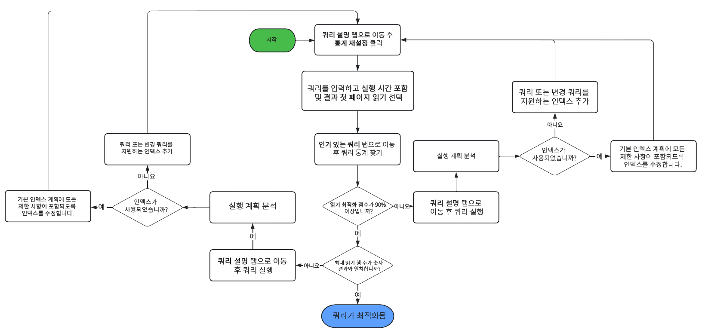

# 쿼리 및 색인화 모범 사례 {#query-and-indexing-best-practices}

AEM as a Cloud Service에서는 색인화와 관련된 모든 운영 측면이 자동화됩니다. 이를 통해 개발자는 효율적인 쿼리와 그에 해당하는 색인 정의를 생성하는 데 집중할 수 있습니다.

## 쿼리 사용 시기 {#when-to-use-queries}

쿼리는 콘텐츠에 액세스하는 방법 중 하나이지만 유일한 방법인 것은 아닙니다. 많은 경우에서 기타 수단을 통해 더 효과적으로 저장소의 콘텐츠에 액세스할 수 있습니다. 해당되는 사용 사례에서 콘텐츠에 액세스할 수 있는 가장 효율적인 최선의 방법이 쿼리가 맞는지 고려해야 합니다.

### 저장소 및 분류법 디자인 {#repository-and-taxonomy-design}

저장소 분류법을 디자인할 때 여러 가지 요인을 고려해야 합니다. 여기에는 액세스 제어, 지역화, 구성 요소 및 페이지 속성 상속 등이 포함됩니다.

이러한 우려사항을 고려한 분류법을 디자인하는 동안, 색인화 디자인의 &quot;트래버스 가능성&quot; 또한 고려하는 것이 중요합니다. 이 맥락에서 트래버스 가능성이란 콘텐츠가 그 경로에 따라 예측 가능한 방식으로 액세스될 수 있게 하는 분류법의 기능을 말합니다. 이는 여러 개의 쿼리를 실행해야 하는 시스템에 비해 유지 관리가 더 용이한 보다 효율적인 시스템을 완성합니다.

또한 분류법을 디자인할 때는 순서 지정 여부가 중요한지 고려해야 합니다. 명확한 순서 지정이 필요하지 않고 대량의 형제 노드가 예상되는 경우에는 `sling:Folder` 또는 `oak:Unstructured`와 같은 비순차 노드 유형을 사용하는 것이 바람직합니다. 순서 지정이 필요한 경우에는 `nt:unstructured` 및 `sling:OrderedFolder`가 더 적합할 것입니다.

### 구성 요소에서의 쿼리 {#queries-in-components}

쿼리는 AEM 시스템에서 수행하는 비교적 더 까다로운 작업들 중 하나일 수 있기 때문에 구성 요소에서는 이를 피하는 것이 좋습니다. 페이지가 렌더링될 때마다 여러 쿼리가 실행되도록 할 경우 종종 시스템 성능이 저하될 수 있습니다. 구성 요소 렌더링 시 쿼리 실행을 피하는 데 이용할 수 있는 전략은 두 가지로, **[노드 트래버스](#traversing-nodes)** 전략과 **[결과 프리페치](#prefetching-results)** 전략입니다.

### 노드 트래버스 {#traversing-nodes}

필요한 데이터의 위치에 대한 사전 지식이 가능한 방식으로 저장소를 디자인한 경우 쿼리를 실행하여 찾을 필요 없이 필요한 경로에서 이 데이터를 검색하는 코드를 배포할 수 있습니다.

예를 들어 특정 카테고리에 부합하는 콘텐츠를 렌더링하는 경우가 있습니다. 한 가지 접근법은 카테고리에서 항목을 표시하는 구성 요소를 채우도록 쿼리할 수 있는 카테고리 속성을 가진 콘텐츠를 구성하는 것입니다.

그보다 나은 접근법은 이 콘텐츠를 카테고리별 분류법에 따라 구성하여 수동으로 가져올 수 있도록 하는 것입니다.

예를 들어 콘텐츠가 다음과 유사한 분류법으로 저장된다고 가정해봅시다.

```xml
/content/myUnstructuredContent/parentCategory/childCategory/contentPiece
```

`/content/myUnstructuredContent/parentCategory/childCategory` 노드를 간편하게 가져올 수 있으며, 그 자식 항목들은 구문 분석되어 구성 요소 렌더링에 사용될 수 있습니다.

또한 작은 크기 또는 같은 형식의 결과 세트를 다룰 때, 동일 결과 세트를 반환하는 쿼리를 만드는 것보다 저장소를 트래버스하고 필요 노드를 모으는 것이 더 빠를 수 있습니다. 일반적인 고려사항은 가능하면 쿼리를 피하는 것입니다.

### 결과 프리페치 {#prefetching-results}

가끔 콘텐츠나 구성 요소에 관한 요구 사항 때문에, 필요 데이터를 가져오는 방법으로 노드 트래버스를 사용할 수 없는 경우가 있습니다. 이 경우, 구성 요소가 렌더링되기 전에 필요 쿼리를 실행해야 최적의 성능을 보장할 수 있습니다.

구성 요소에 필요한 결과를 구성 요소 제작 당시에 계산할 수 없고 콘텐츠가 변경될 것으로 예상되지 않는 상황에서는 변경이 이루어진 후에 쿼리를 실행할 수 있습니다.

데이터나 콘텐츠가 규칙적으로 변경되는 경우에는 일정에 따라 쿼리를 실행하거나 기반 데이터의 업데이트에 대한 리스너를 사용하여 쿼리를 실행할 수 있습니다. 그러면 저장소의 공유 위치에 결과를 작성할 수 있습니다. 이 경우, 런타임 시 쿼리를 실행할 필요 없이 이 데이터를 필요로 하는 모든 구성 요소가 이 단일 노드에서 해당 값을 가져올 수 있습니다.

시작 시에 채워지고 변경사항이 적용될 때마다 업데이트되는 인메모리 캐시 결과를 보관할 때도 이와 유사한 전략을 사용할 수 있습니다(JCR `ObservationListener` 또는 Sling `ResourceChangeListener` 사용).

## 쿼리 최적화 {#optimizing-queries}

Oak 문서는 [쿼리 실행 방식에 대한 높은 수준의 개요를 제공합니다.](https://jackrabbit.apache.org/oak/docs/query/query-engine.html#query-processing) 이는 본 문서에서 설명하는 모든 최적화 활동의 기반을 구성합니다.

AEM as a Cloud Service는 효율적인 쿼리 구현을 보조하도록 디자인된 쿼리 성능 도구를 제공합니다.

* 이 도구는 이미 실행된 쿼리를 그 관련 성능 특성 및 쿼리 계획과 함께 표시합니다.
* 이 도구를 사용하면 단순히 쿼리 플랜을 표시하는 것부터 전체 쿼리를 실행하는 것까지 다양한 수준에서 애드혹 쿼리를 수행할 수 있습니다.

쿼리 성능 도구는 [Cloud Manager의 개발자 콘솔을 통해 접근 가능합니다.](https://experienceleague.adobe.com/docs/experience-manager-learn/cloud-service/debugging/debugging-aem-as-a-cloud-service/developer-console.html#queries) AEM as a Cloud Service의 쿼리 성능 도구는 AEM 6.x 이상 버전에서의 쿼리 실행에 관한 세부 정보를 제공합니다.

이 차트는 쿼리 최적화를 위해 쿼리 성능 도구를 사용하는 일반적인 흐름을 설명합니다.



### 색인 사용 {#use-an-index}

모든 쿼리는 최적의 성능을 제공하기 위해 색인을 사용해야 합니다. 대다수의 경우 기존의 기본 제공 색인으로 충분히 쿼리를 처리할 수 있습니다.

가끔은 기존 색인에 사용자 정의 속성을 추가하여, 색인을 사용해 추가적인 제한을 쿼리할 수 있습니다. 자세한 내용은 [콘텐츠 검색 및 색인화](/help/operations/indexing.md#changing-an-index) 문서를 참조하십시오. 다음 [JCR 쿼리 치트시트](#jcr-query-cheatsheet) 이 문서의 섹션에서는 특정 쿼리 유형을 지원하기 위해 색인의 속성 정의를 찾는 방법에 대해 설명합니다.

### 올바른 기준 사용 {#use-the-right-criteria}

모든 쿼리에 대한 주 제한은 속성 일치여야 합니다. 이것이 가장 효율적인 유형이기 때문입니다. 부가적인 속성 제한을 추가하면 결과가 더욱 제한됩니다.

쿼리 엔진은 단일 색인만 고려합니다. 즉, 더 많은 사용자 정의 색인 속성을 추가하여 기존 색인을 사용자 정의하는 것이 가능하고 필요하다는 의미입니다.

본 문서의 [JCR 쿼리 치트시트](#jcr-query-cheatsheet) 섹션은 이용 가능한 제한의 목록을 나열하며 또한 색인 정의가 선택되려면 어떤 형태여야 하는지 설명합니다. [쿼리 성능 도구](#query-performance-tool)를 사용하여 쿼리를 테스트할 수 있으며 올바른 색인이 사용되었는지 및 쿼리 엔진이 색인 외의 제한을 평가할 필요는 없는지 확인할 수 있습니다.

### 순서 지정 {#ordering}

결과의 특정한 순서가 필요하다면 쿼리 엔진에서 두 가지 방법으로 이를 구성할 수 있습니다.

1. 색인이 결과를 완전하게 올바른 순서에 따라 제공할 수 있습니다.
   * 이는 색인 정의에서 순서 지정에 사용되는 속성에 `ordered=true` 주석이 추가될 경우 가능합니다.
1. 쿼리 엔진이 순서 지정 프로세스를 수행합니다.
   * 이는 쿼리 엔진이 색인 외에서 필터링을 수행하거나 순서 지정 속성에 `ordered=true` 속성 주석이 추가되어 있지 않은 경우 발생할 수 있습니다.
   * 이 경우, 정렬을 위해 메모리에서 완전한 결과 세트를 읽어야 하며 이는 첫 번째 방법보다 훨씬 속도가 더딥니다.

### 결과 크기 제한 {#restrict-result-size}

쿼리 결과를 가져온 크기는 쿼리 수행에 있어 중요한 요인입니다. 결과는 소극적 방식으로 가져오게 되기 때문에, 단순히 첫 20개 결과를 가져오는 것과 10,000개 결과를 가져오는 것은 런타임과 메모리 사용량 모두의 측면에서 차이가 있습니다.

이는 또한 모든 결과를 가져오는 경우에만 결과 세트의 크기를 정확하게 측정할 수 있다는 의미입니다. 이러한 이유로 인해, 쿼리를 보강(자세한 내용은 본 문서의 [JCR 쿼리 치트시트](#jcr-query-cheatsheet) 섹션 참조)하거나 결과 읽기를 제한하여, 가져온 결과 세트는 항상 제한해야 합니다.

이러한 제한은 쿼리 엔진이 100,000노드의 **트래버스 제한**&#x200B;에 도달하는 것 또한 예방합니다. 이 제한에 도달하면 쿼리가 강제 정지됩니다.

잠재적으로 크기가 큰 결과 세트를 꼭 완전하게 처리해야 하는 경우, [결과 크기가 큰 쿼리](#queries-with-large-result-sets) 섹션을 참조하십시오.

## JCR 쿼리 치트시트 {#jcr-query-cheatsheet}

효율적인 JCR 쿼리 및 색인 정의를 생성하는 데 도움을 얻고 싶다면 [JCR 쿼리 치트시트](https://experienceleague.adobe.com/docs/experience-manager-65/deploying/practices/best-practices-for-queries-and-indexing.html#jcrquerycheatsheet)를 다운로드하여 개발 중 참조할 수 있습니다.

여기에는 쿼리 성능이 다양한 여러 시나리오를 포괄하는 QueryBuilder, XPath, SQL-2에 대한 샘플 쿼리가 포함되어 있습니다. 이 치트시트는 또한 Oak 색인을 구축하거나 사용자 정의하는 방법에 대한 권장 사항도 제공합니다. 이 치트시트의 콘텐츠는 AEM as a Cloud Service와 AEM 6.5에 적용됩니다.

## 결과 세트 크기가 큰 쿼리 {#queries-with-large-result-sets}

결과 세트 크기가 큰 쿼리는 피하는 것이 바람직하지만 이러한 결과 세트를 꼭 처리해야 하는 경우도 존재합니다. 결과의 크기를 정확하게 알 수 없는 경우가 많기 때문에 신뢰성 있는 처리를 위해서는 몇 가지 예방 조치를 실시해야 합니다.

* 쿼리는 요청 내에서 실행해서는 안 됩니다. 대신, Sling Job이나 AEM 워크플로의 일부로서 쿼리를 실행해야 합니다. 이 두 방법은 총 런타임에 제한이 전혀 없으며, 쿼리와 그 결과를 처리하는 동안 인스턴스가 정지되면 재시작됩니다.
* 100,000노드의 쿼리 제한을 극복하려면 [키세트 페이지 매김](https://jackrabbit.apache.org/oak/docs/query/query-engine.html#Keyset_Pagination)의 사용을 고려해야 하며 쿼리를 다양한 하위 쿼리로 분할해야 합니다.

## 저장소 트래버스 {#repository-traversal}

저장소를 트래버스하는 쿼리는 색인을 사용하지 않으며 다음과 유사한 메시지를 사용해 기록합니다.

```text
28.06.2022 13:32:52.804 *WARN* [127.0.0.1 [1656415972414] POST /libs/settings/granite/operations/diagnosis/granite_queryperformance.explain.json HTTP/1.1] org.apache.jackrabbit.oak.plugins.index.Cursors$TraversingCursor Traversed 98000 nodes with filter Filter(query=select [jcr:path], [jcr:score], * from [nt:base] as a /* xpath: //* */, path=*) called by com.adobe.granite.queries.impl.explain.query.ExplainQueryServlet.getHeuristics; consider creating an index or changing the query
```

이러한 로그 스니펫을 통해 다음을 파악할 수 있습니다.

* 쿼리 자체: `//*`
* 이 쿼리를 실행한 Java 코드: 쿼리 생성자를 식별하도록 도와주는 `com.adobe.granite.queries.impl.explain.query.ExplainQueryServlet::getHeuristics`.

이 정보가 있으면 본 문서의 [쿼리 최적화](#optimizing-queries) 섹션에 설명된 방법으로 이 쿼리를 최적화할 수 있습니다.
