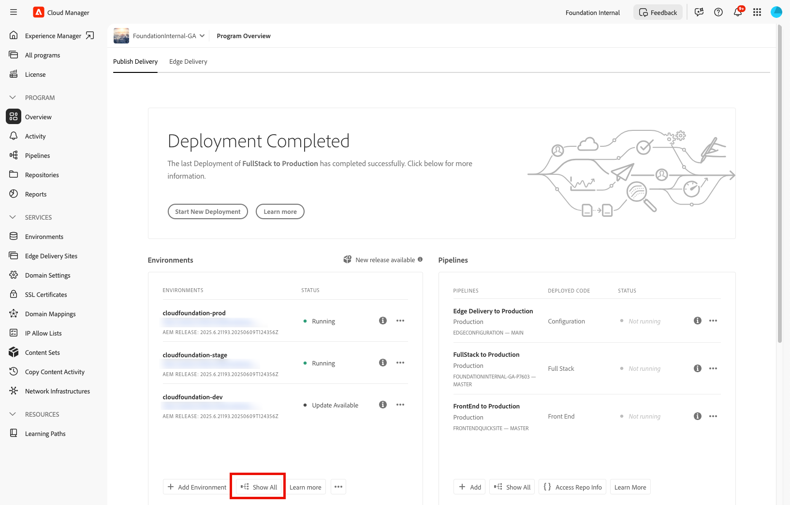

# AEM as a Cloud Service에 배포된 이전 소스 코드 복원 {#restore-previous-code-deployed}

<!-- BETA BADGE REMOVED FOR NOVEMBER 2025 CM RELEASE badge: label="Beta" type="Positive" url="/help/implementing/cloud-manager/release-notes/current.md#gitlab-bitbucket"

>[!NOTE]
>
>The feature described in this article is only available through the beta program. To sign up for the beta, see [One-click rollback for pipeline deployments](/help/implementing/cloud-manager/release-notes/current.md##one-click-rollback). -->

**배포된 이전 코드 복원**&#x200B;을 사용하여 환경을 마지막으로 성공한 빌드로 즉시 롤백합니다. 파이프라인을 실행할 필요가 없습니다.

선택한 환경의  메뉴를 열고 **복원** > **배포된 이전 코드**&#x200B;를 선택하여 가장 최근에 배포된 소스 코드를 초 단위로 롤백하면 됩니다.

[AEM as a Cloud Service에서 콘텐츠 복원](/help/operations/restore.md)도 참조하세요.

>[!TIP]
>
>**일반** 탭의 환경 세부 정보 보기에서 사용 중인 활성 소스 코드 버전을 볼 수 있습니다. [환경의 세부 정보 보기](/help/implementing/cloud-manager/manage-environments.md#viewing-environment)를 참조하세요.
>
>

**배포된 이전 코드 복원**&#x200B;은(는) 다음 조건이 충족되는 경우에만 사용할 수 있습니다.

* 성공한 파이프라인 실행당 하나의 복원만 허용됩니다. 다시 복원하려면 성공한 다른 파이프라인 실행을 완료하십시오.
* **환경 복원 만들기** 권한이 있습니다. 권한 관리에 대한 자세한 내용은 [사용자 지정 권한](/help/implementing/cloud-manager/custom-permissions.md)을 참조하세요.
* 이 기능을 보호하는 기능 플래그가 활성화됩니다(켜짐).
* 프로그램은 AEM as a Cloud Service에서 실행됩니다.
* 해당 환경에 대한 마지막 파이프라인이 정상적으로 완료되었으며 **30일 미만** 전에 실행되었습니다.
* 환경 상태가 *실행 중*&#x200B;이고 진행 중인 파이프라인이 없습니다.

**배포된 이전 코드 복원**&#x200B;은(는) `Production` 환경, `Development` 환경 및 `Stage` 외에도 `Specialized Testing Environment` 환경에서 작동합니다. 확인을 하면 Cloud Manager이 복원을 시작하고 성공적으로 완료되면 푸시 알림을 전송합니다.

>[!IMPORTANT]
>
>Adobe에서는 위험을 줄이고 안정성을 보장하기 위해 `Stage`에서 *before*&#x200B;의 프로시저를 `Production`에서 사용하여 확인하는 것이 좋습니다.

확인이 실패하면 Cloud Manager에서 하나 이상의 충족되지 않은 조건을 나열하는 다음 대화 상자를 열어 **확인**&#x200B;을 비활성화하여 복원을 방지합니다.

.

손실되거나 손상되거나 실수로 삭제된 데이터만 원래 상태로 복원하려면 [AEM as a Cloud Service에서 콘텐츠 복원](/help/operations/restore.md)을 사용할 수 있습니다. 이 복원 프로세스는 콘텐츠에만 영향을 미치며 AEM의 소스 코드와 버전은 변경되지 않습니다.

**배포된 이전 코드를 복원하려면:**

1. [my.cloudmanager.adobe.com](https://my.cloudmanager.adobe.com/)에서 Cloud Manager에 로그인한 다음 적절한 조직을 선택합니다.

1. 복원을 시작할 프로그램을 클릭합니다.

1. 다음 중 하나를 수행하여 프로그램의 모든 환경을 나열합니다.

   * 왼쪽 메뉴에서 **서비스** 아래의  **환경**&#x200B;을 클릭합니다.

     

   * 왼쪽 메뉴에서 **프로그램** 아래의 **개요**&#x200B;를 클릭한 다음 **환경** 카드에서  **모두 표시**&#x200B;를 클릭합니다.

     

     >[!NOTE]
     >
     >**환경** 카드에는 세 가지 환경만 나열됩니다. 카드의 **모두 표시**&#x200B;를 클릭하면 프로그램의 *모두* 환경을 볼 수 있습니다.

1. 환경 테이블에서 복원할 소스 코드가 있는 환경의 오른쪽에 있는 을 클릭한 다음 **복원** > **배포된 이전 코드**&#x200B;를 클릭합니다.

   

1. **배포된 이전 코드 복원** 대화 상자에서 현재 배포된 버전과 복원할 버전을 검토한 다음 **확인**&#x200B;을 클릭합니다.

   

1. Cloud Manager은 환경을 이전 빌드로 되돌리고, 콘텐츠와 구성을 그대로 유지하며, 배포가 완료될 때까지 환경 페이지에서 환경을 **복원**&#x200B;합니다.

   

1. 페이지 오른쪽 상단 모서리에서  **알림**&#x200B;을 클릭하여 복원이 시작되고 종료되는 시기를 확인합니다.

   
   *이전 코드 복원 작업에 대한 알림입니다.*
