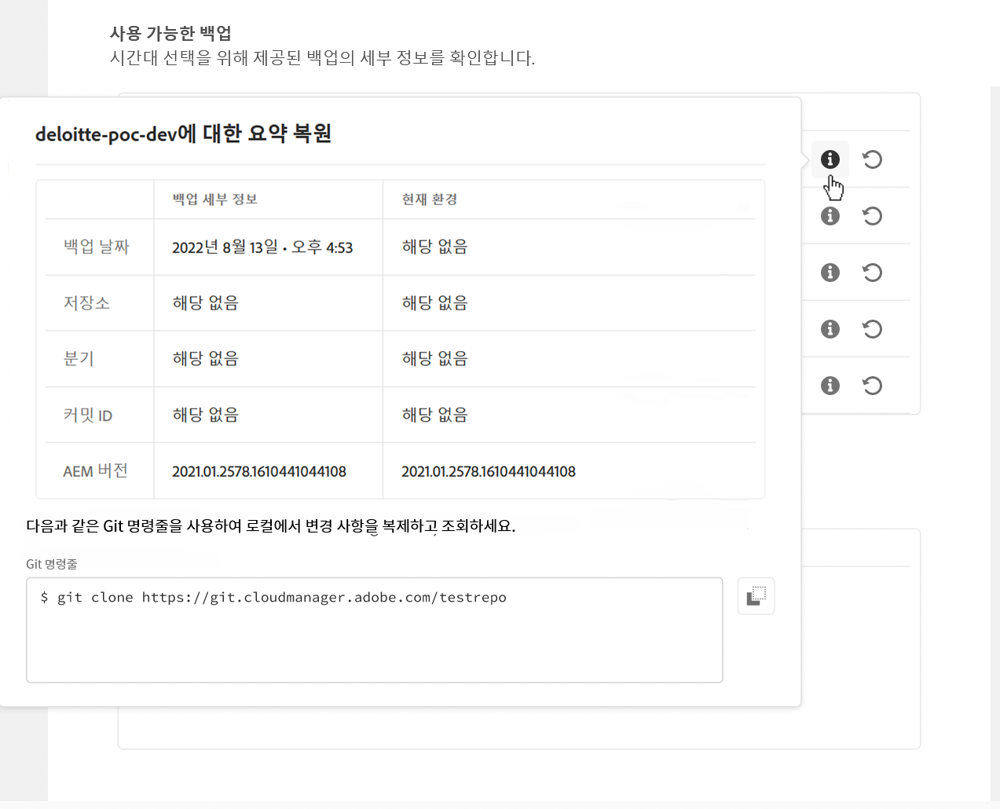
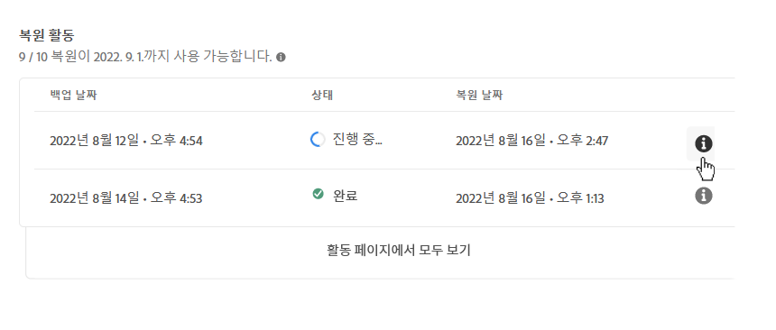

# Cloud Service로서의 AEM에서 컨텐츠 복원 {#content-restore}

Cloud Manager를 사용하여 백업에서 AEM as a Cloud Service 컨텐츠를 복원할 수 있습니다.

Cloud Manager의 셀프서비스 복원 프로세스는 Adobe 시스템 백업에서 데이터를 복사하고 원래 환경으로 복원합니다. 복원 작업은 손실, 손상 또는 실수로 삭제된 데이터를 원래 상태로 반환하기 위해 수행됩니다.

복원 프로세스는 콘텐츠에만 영향을 미치며 코드 및 AEM 버전은 변경되지 않습니다. 언제든지 개별 환경의 복원 작업을 시작할 수 있습니다.

새 파이프라인 실행을 시작할 필요 없이 이전에 배포된 소스 코드를 쉽고 빠르게 복원해야 하는 경우 배포된[ 이전 Code 복원을 사용할 ](/help/operations/restore-previous-code-deployed.md)수 있습니다.

Cloud Manager는 콘텐츠를 복원할 수 있는 두 가지 유형의 백업을 제공합니다.

* **PIT(특정 시점):** 이 옵션은 지난 24시간 이내에 캡처된 연속 백업을 복원합니다.
* **지난 주:** 이 유형은 이전 24시간을 제외하고 지난 7일 동안의 시스템 백업에서 복원됩니다.

두 경우 모두 사용자 정의 코드 및 AEM 버전은 변경되지 않습니다.

>[!TIP]
>
>공용 API를 사용하여 백업을 [복원할 수도 있습니다](https://developer.adobe.com/experience-cloud/cloud-manager/reference/api/).

>[!WARNING]
>
>* 이 기능은 코드나 컨텐츠 중에 심각한 문제가 있는 경우에만 사용해야 합니다.
>* 백업을 복원하면 해당 백업 이후에 추가된 모든 데이터가 삭제됩니다. 스테이징도 이전 버전으로 되돌아갑니다.
>* 컨텐츠 복원을 시작하기 전에 다른 선택적 컨텐츠 복원 옵션을 고려하십시오.

## 선택적 컨텐츠 복원 옵션 {#selective-options}

전체 컨텐츠 복원으로 복원하기 전에 이러한 옵션을 고려하여 컨텐츠를 보다 쉽게 복원하십시오.

* 삭제된 경로에 대한 패키지를 사용할 수 있는 경우 패키지 관리자[ 를 ](/help/implementing/developing/tools/package-manager.md)사용하여 패키지를 다시 설치합니다.
* 삭제된 경로가 Sites의 페이지 인 경우 트리 복원 기능을[ 사용하십시오](/help/sites-cloud/authoring/sites-console/page-versions.md).
* 삭제 된 경로가 자산 폴더이고 원본 파일을 사용할 수있는 경우 Assets 콘솔[을 통해 ](/help/assets/add-assets.md)다시 업로드 하십시오.
* 컨텐츠 삭제가 자산인 경우 이전 버전의 자산을[ 복원하는 것이 좋습니다](/help/assets/manage-digital-assets.md).

위의 옵션 중 어느 것도 작동하지 않고 삭제된 경로의 내용이 중요한 경우 다음 섹션에 설명된 대로 컨텐츠 복원을 수행합니다.

## 사용자 역할 만들기 {#user-role}

기본적으로 개발, 프로덕션 또는 스테이징 환경에서 컨텐츠 복원을 실행할 수 있는 권한이 있는 사용자는 없습니다. 이 권한 권한을 특정 사용자 또는 그룹에 위임하려면 다음 일반 단계를 사용합니다.

1. 컨텐츠 복원을 참조하는 표현적인 이름으로 제품 프로필을 만들기.
1. **필요한 프로그램에 대한 프로그램 액세스** 권한 제공
1. 사용 사례에 **따라 필요한 환경 또는 프로그램의 모든 환경에 대한 환경 복원 만들기** 권한 제공합니다.
1. 해당 프로필에 사용자를 할당합니다.

사용 권한 관리에 대한 자세한 내용은 사용자 지정 사용 권한을[ 참조하십시오](/help/implementing/cloud-manager/custom-permissions.md).

## 환경의 컨텐츠 복원 {#restoring-content}

>[!NOTE]
>
>사용자 복원 작업을 시작할 수 있는 적절한 권한이[ 있어야 합니다](#user-role).

**환경의 컨텐츠 복원하기:**

1. [my.cloudmanager.adobe.com](https://my.cloudmanager.adobe.com/)에서 Cloud Manager에 로그인한 다음 적절한 조직을 선택합니다.

1. 복원을 시작할 프로그램을 클릭합니다.

1. 다음 중 하나를 수행하여 프로그램의 모든 환경을 나열합니다.

   * 왼쪽 메뉴의 **Services(서비스**)에서 Data(데이터) 아이콘Environments(환경&#x200B;**)를 클릭합니다**.

     

   * 왼쪽 메뉴의 **Program(프로그램**)에서 Overview **(개요)를 클릭한**&#x200B;다음 Environments(**환경**) 카드에서 Workflow(워크플로우) 아이콘  보기 All(모두&#x200B;**)을 클릭합니다**.

     

     >[!NOTE]
     >
     >환경&#x200B;**카드 목록에는**&#x200B;세 가지 환경만 나열됩니다. 딸깍 하는 소리 **모두** 보기 프로그램의 모든&#x200B;*환경을 보려면*&#x200B;카드.

1. 환경 테이블에서 컨텐츠 복원을 원하는 환경의 오른쪽에 있는 추가 아이콘 또는 줄임표 메뉴 아이콘을 클릭한  복원을 클릭합니다&#x200B;**.**

   

1. **환경 페이지의 콘텐츠** 복원 탭에 있는 **복원** 시간 드롭다운 목록에서 복원 시간대를 선택합니다.

   

   * Last 24 hours(지난 24시간&#x200B;**)를 선택한**&#x200B;경우 인접한 **Time(시간**) 필드에서 지난 24시간 내의 복원할 정확한 시간을 지정합니다.
   * 지난 주를&#x200B;**선택한**&#x200B;경우 인접한 **일** 필드에서 이전 24시간을 제외하고 지난 7일 이내의 날짜를 선택합니다.

1. 날짜를 선택하거나 시간을 지정했다면 아래의 **사용 가능한 백업** 섹션에 복원할 수 있는 사용 가능한 백업 목록이 표시됩니다.

1. 백업 옆에 있는 정보 아이콘을 클릭하여  선택 참조[).](#choosing-backup)

   

   복원 옵션에 대해 표시되는 타임스탬프는 컴퓨터의 사용자 표준 시간대를 기준으로 합니다.

1. 복원할 백업 행의 오른쪽 끝에서 CCW 굵게 회전 또는 복원복원 프로세스를 시작합니다.

1. Restore Content(콘텐츠 복원) **대화 상자에서 세부 사항을 검토한 다음 Restore(복원**)를 클릭합니다&#x200B;**.**

   

백업 프로세스가 시작됩니다. 복원 작업&#x200B;**[목록에서 해당 상태를](#restore-activity)**&#x200B;볼 수 있습니다. 복원 작업을 완료하는 데 필요한 시간은 복원 중인 콘텐츠의 크기 및 프로필에 따라 다릅니다.

복원이 성공적으로 완료되면 환경에서 다음을 수행합니다.

* 복원 작업을 시작할 때와 동일한 코드 및 AEM 릴리스를 실행합니다.
* 선택한 스냅샷의 타임스탬프에서 사용할 수 있었던 것과 동일한 컨텐츠 콘텐츠가 있으며 인덱스는 현재 코드와 일치하도록 다시 작성됩니다.

## 올바른 백업 선택 {#choosing-backup}

Cloud Manager의 셀프서비스 복원 프로세스는 콘텐츠를 AEM으로만 복원합니다. 따라서 원하는 복원 지점과 현재 시간 사이에 변경된 코드를 신중하게 고려해야 합니다. 현재 커밋 ID와 복원되는 커밋 ID 간의 커밋 기록을 검토합니다.

다음과 같은 몇 가지 예시 상황이 있습니다.

* 환경 사용자 지정 코드 및 복원은 동일한 저장소 및 동일한 분기 내에 있습니다.
* 환경 사용자 지정 코드 및 복원은 하나의 저장소를 공유하고, 별도의 분기를 사용하며, 공통 커밋에서 시작됩니다.
* 환경 사용자 지정 코드와 복원은 서로 다른 리포지토리에 있습니다.
   * 이 경우 커밋 ID가 표시되지 않습니다.
   * Adobe Systems 에서는 두 리포지토리를 모두 복제하고 diff 도구 를 사용하여 분기를 비교할 것을 적극 권장합니다.

또한 복원으로 인해 프로덕션 및 스테이징 환경이 동기화 해제될 수 있습니다. 콘텐츠를 복원하는 경우의 결과에 대해 책임은 사용자 본인에게 있습니다.

## 복원 활동 {#restore-activity}

**활동 복원** 목록에는 활성 복원 작업을 포함하여 가장 최근 10개의 복원 요청의 상태가 표시됩니다.

백업에 대한 정보 아이콘을해당 백업에 대한 로그를 다운로드하고 복원이 시작된 시점의 스냅샷과 데이터 간의 차이점을 포함하여 코드 세부 정보를 검사할 수 있습니다.

## 오프사이트 백업 {#offsite-backup}

일반 백업은 AEM Cloud Services 내에서 실수로 삭제하거나 또는 기술적 오류가 발생할 수 있는 위험을 해결하지만 지역 오류로 인해 추가 위험이 발생할 수 있습니다. 가용성과 더불어 이러한 지역 중단의 가장 큰 위험은 데이터 손실입니다.

AEM as a Cloud Service은 모든 AEM 프로덕션 환경에서 이러한 위험을 완화합니다. 즉, 모든 AEM 컨텐츠를 원격 지역에 연속적으로 복사합니다. 이 프로세스를 통해 컨텐츠 복구는 3개월 동안 가능합니다. 이 기능을 오프사이트 백업 이라고 합니다.

AEM Service Reliability Engineering은 데이터 지역 중단 시 오프사이트 백업에서 스테이징 및 프로덕션 AEM Cloud Service 환경을 복원합니다.

## 데이터 영역 매핑 원칙 {#data-region-mapping-principles}

Adobe Systems 는 일련의 내부 지침에 따라 AEM as a Cloud Service **용 데이터 지역 매핑**&#x200B;을 결정합니다. 이러한 지침은 운영 효율성을 지원하고, 지역 규정 요구 사항을 준수하며, 글로벌 시장에서 일관된 고객 경험 제공하도록 설계되었습니다.

### 영역 매핑 투명도 {#region-mapping-transparency}

Adobe Systems는 자세한 지역-지역 매핑 정보를 공개하지 않습니다.\
고객이 지역별 배포, 데이터 레지던시 또는 규정 준수에 미치는 영향에 대해 구체적이거나 정당한 질문이 있는 경우 공식 지원 또는 계정 채널을 통해 Adobe Systems에 직접 문의하는 것이 좋습니다.

### 데이터 영역 매핑의 핵심 원칙 {#core-principles}

적합한 데이터 지역 매핑을 결정할 때 Adobe Systems 에서는 다음과 같이 우선 순위가 지정된 몇 가지 기준을 적용합니다.

1. **글로벌 지역 나가기 말 것**\
   배포는 주요 글로벌 지역인 **APAC,****EMEA** 및 **미주 중 하나에 남아 있습니다**.

2. **대륙을 떠나지 마라**\
   가능한 경우 데이터 복제 및 장애 조치는 동일한 대륙에 유지됩니다.

3. **출국하지 마십시오**\
   기술적으로 가능한 경우 데이터는 동일한 국경 내에 유지됩니다.

### 예외 처리 {#handling-exceptions}

기술 또는 인프라 제한으로 인해 위의 기준을 충족할 수 없는 경우 Adobe Systems 에서는 다음과 같은 추가 고려 사항을 적용합니다.

* **유럽별 가이드라인**\
  백업 또는 보조 지역은 비 EU 국가에 위치해서는 안 됩니다.\
  (그 반대의 경우, 즉 EU 국가를 비 EU 프라이머리의 백업 수단으로 사용하는 경우, 더 나은 동일 국가 옵션이 없는 경우 허용될 수 있습니다.)

* **특정 지역 피하기**\
  제한적인 데이터 정책 또는 규제 위험이 높은 지역은 백업 또는 장애 조치(failover) 위치로 피해야 합니다.

고객에게 설명이 필요하거나 규정 준수에 중점을 둔 요구 사항이 있는 경우 Adobe Systems는 Adobe Systems 계정 팀 또는 지원 조직에 연락하여 특정 시나리오에 맞는 지침을 받는 것이 좋습니다.

## 제한 사항 {#limitations}

셀프서비스 복원 메커니즘을 사용하는 경우 다음과 같은 제한 사항이 적용됩니다.

* 복원 작업은 7일로 제한됩니다. 즉, 7일 이상 오래된 스냅샷은 복원할 수 없습니다.
* 달력의 한 달당 프로그램의 모든 환경에서 최대 10회의 복원이 허용됩니다.
* 환경이 생성된 후 첫 번째 백업 스냅샷을 만드는 데에는 6시간이 소요됩니다. 이 스냅샷을 생성할 때까지 환경에서 복원 작업을 수행할 수 없습니다.
* 환경에 대해 현재 실행 중인 전체 스택 또는 웹 계층 구성 파이프라인이 있는 경우 복원 작업이 시작되지 않습니다.
* 동일한 환경에서 다른 복원이 이미 실행 중인 경우에는 복원을 시작할 수 없습니다.
* 드문 경우지만 24시간/7일 백업 제한으로 인해 선택한 백업이 선택되었을 때와 복원이 시작된 시점 사이의 지연 때문에 선택한 백업을 사용할 수 없는 경우가 있습니다.
* 삭제된 환경의 데이터는 영구적으로 손실되어 복구할 수 없습니다.
