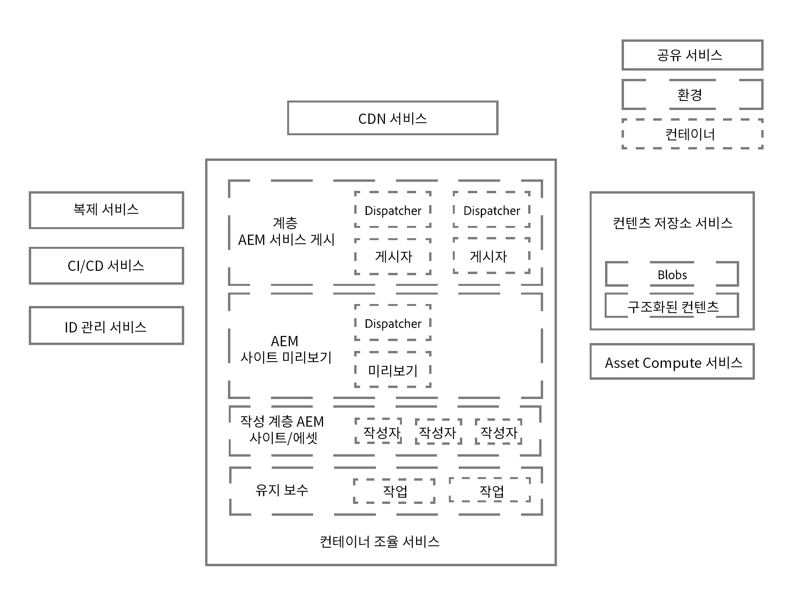
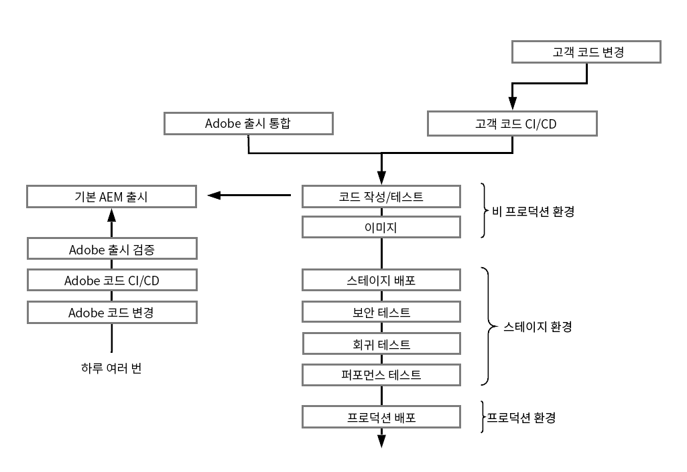
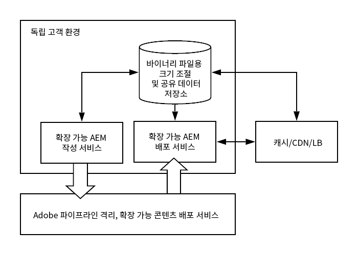

# Adobe Experience Manager as a Cloud Service 아키텍처 소개 {#an-introduction-to-the-architecture-adobe-experience-manager-as-a-cloud-service}

>[!CONTEXTUALHELP]
>id="intro_aem_cloudservice_architecture"
>title="AEM as a Cloud Service 아키텍처 소개"
>abstract="이 탭에서는 AEM as a Cloud Service의 새 아키텍처를 확인하고 변경 내용을 알아볼 수 있습니다. AEM에서 다양한 수의 이미지를 가진 동적 아키텍처를 빌드했으므로 클라우드 아키텍처를 이해하는 시간을 가져 보십시오."
>additional-url="https://video.tv.adobe.com/v/330542/" text="아키텍처 개요"

Adobe Experience Manager(AEM) as a Cloud Service의 아키텍처가 변경되었습니다.

## 크기 조정 {#scaling}

이제 AEM as a Cloud Service에는

* AEM 이미지의 수가 다양한 동적 아키텍처가 있습니다.

이 아키텍처는

* *실제* 트래픽과 *실제* 활동을 기반으로 크기가 조절됩니다.

* 필요한 경우에만 실행되는 개별 인스턴스를 포함합니다.

* 모듈식 애플리케이션을 사용합니다.

* 작성 클러스터를 기본값으로 포함합니다. 이로 인해 유지 관리 작업의 다운타임이 줄어듭니다.

따라서 다양한 사용 패턴을 자동으로 적용할 수 있습니다.

이를 위해 AEM as a Cloud Service의 모든 인스턴스는 동일하게 생성되며, 이때 각 인스턴스는 노드 수, 할당된 메모리 및 할당된 컴퓨팅 용량의 측면에서 동일한 기본 크기 특성을 갖습니다.

AEM as a Cloud Service은 다음과 같은 작업을 수행하는 오케스트레이션 엔진 사용을 기반으로 합니다.

* 지속해서 서비스 상태를 모니터링합니다.

* 실제 요구 사항에 따라 각 서비스 인스턴스의 크기를 동적으로 적절하게 확대하거나 축소할 수 있습니다.

이 기능은

* 노드 수, 메모리 용량 및 각 노드의 할당된 CPU 용량에 적용할 수 있습니다.

* 트래픽 패턴이 변화할 때 AEM as a Cloud Service이 트래픽 패턴을 수용할 수 있도록 해 줍니다.

서비스의 테넌트당 인스턴스에 대한 크기 조절은 두 축에서 자동 또는 수동으로 수행될 수 있습니다.

* 세로: 할당된 메모리 및 CPU 용량은 고정된 수의 노드에 대해 확대하거나 축소할 수 있습니다.

* 가로: 주어진 서비스에 대한 노드 수는 늘리거나 줄일 수 있습니다.

## 환경 {#environments}

>[!NOTE]
>자세한 내용은 [배포 - 실행 모드](/help/implementing/deploying/overview.md#runmodes)를 참조하십시오.

AEM as a Cloud Service는 개별 인스턴스로서 사용할 수 있게 되었으며, 이때 각 인스턴스는 전체 AEM 환경을 나타냅니다.

AEM as a Cloud Service에서 사용할 수 있는 환경에는 세 가지 유형이 있습니다.

* **프로덕션 환경**: 비즈니스 전문가를 위한 애플리케이션을 호스팅합니다.

* **스테이징 환경**: 항상 1:1 관계에서 단일 프로덕션 환경에 연결됩니다. 스테이징 환경은 애플리케이션 변경 사항이 프로덕션 환경에 푸시되기 전에 다양한 성능 및 품질 테스트에 사용됩니다.

* **개발 환경**: 개발자가 스테이지 및 프로덕션 환경과 동일한 런타임 조건으로 AEM 애플리케이션을 구현할 수 있도록 해 줍니다.

   자세한 내용은 [환경 관리](https://experienceleague.adobe.com/docs/experience-manager-cloud-service/implementing/using-cloud-manager/manage-environments.html?lang=ko-kr#using-cloud-manager)를 참조하십시오.

* **신속한 개발 환경**: 신규 또는 기존 코드 디버깅을 위한 신속한 개발 반복이 가능합니다.

## 프로그램 {#programs}

모든 새 AEM 프로젝트는 항상 프로젝트에 대한 구성 및 사용자 정의 코드를 모두 저장할 수 있는 하나의 특정 코드 베이스에 연결되어 있습니다. 이 정보는 일반적인 Git 클라이언트를 통해 액세스할 수 있는 코드 리포지토리에 저장되며, 새 프로그램을 만들 때 사용할 수 있습니다.

AEM 프로그램은 다음을 포함하는 컨테이너입니다.

|  프로그램 요소 |  번호 |
|--- |--- |
| 코드 리포지토리 (Git) |  1 |
| 기준 이미지 (사이트 또는 에셋) |  1 |
| 스테이지 및 프로덕션 환경 세트 (1:1) | 0 또는 1 |
| 비프로덕션 환경 (RDE, 개발 또는 데모) | 0 ~ N |
| 각 환경을 위한 파이프라인 | 0 또는 1 |

처음에는 AEM as a Cloud Service에 두 가지 프로그램을 사용할 수 있습니다.

* AEM 클라우드 사이트 서비스

* AEM 클라우드 에셋 서비스

이 두 가지 모두 다양한 기능을 이용할 수 있습니다. 작성자 계층에는 모든 프로그램에 대한 모든 Sites 및 Assets 기능이 포함되지만 Assets 프로그램에는 기본적으로 게시 계층 및 미리보기 계층이 포함되지 않습니다.

## 런타임 아키텍처 {#runtime-architecture}

이 새로운 아키텍처에는 다음과 같이 다양한 주요 구성 요소가 있습니다.

<!--- needs reworking -->

* AEM Sites as a Cloud Service의 경우:

   * 각 환경에 대한 작성 계층과 게시 계층의 개념이 계속 있습니다(높은 수준).

   * 작성 계층은 단일 작성 클러스터 내에 두 개 이상의 노드로 구성됩니다. 작성 활동에 따라 자동으로 크기가 조절됩니다.

      * 콘텐츠 작성자/생성자는 AEM 작성자 계층에 로그인하여 콘텐츠를 작성, 편집 및 관리합니다.

      * 작성 계층에 로그인하는 것은 Adobe IMS(Identity Management Services)에서 관리합니다.

      * 에셋 통합 및 처리에서는 전용 Assets Compute Service를 사용합니다.
   * 미리보기 계층은 단일 미리보기 노드로 구성되어 있습니다. 게시 계층에 게시하기 전 콘텐츠의 품질 보증에 사용됩니다.

   * 게시 계층은 단일 게시 팜 내에 있는 두 개 이상의 노드로 구성됩니다. 이 노드들은 서로 독립적으로 작동할 수 있습니다. 각 노드는 AEM Publisher와 AEM Dispatcher 모듈이 장착된 웹 서버로 구성되며, 사이트 트래픽 요구 사항에 따라 크기가 자동으로 조정됩니다.

      * 최종 사용자 또는 사이트 방문자는 AEM 게시 서비스를 통해 웹 사이트를 방문합니다.

* AEM Assets as a Cloud Service의 경우:

   * 아키텍처가 작성 환경만 포함합니다.

* 작성자 계층, 미리보기 계층 및 게시 계층은 모두 콘텐츠 저장소 서비스의 콘텐츠를 읽고 유지합니다.

   * 게시 계층 및 미리보기 계층은 지속성 레이어의 콘텐츠를 읽기만 합니다.

   * 작성자 계층은 지속성 레이어의 콘텐츠를 읽고 씁니다.

   * 블롭 스토리지는 게시, 미리보기 및 작성자 계층에 걸쳐 공유되며, 파일은 *이동*&#x200B;하지 않습니다.

   * 작성자 계층에서 콘텐츠가 승인되면 이것은 해당 콘텐츠가 활성화되었음을 나타내고, 따라서 게시 계층 지속성 레이어 또는 필요한 경우 미리보기 계층에 적용됩니다. 이 작업은 미들웨어 파이프라인인 복제 서비스를 통해 수행됩니다. 이 파이프라인은 해당 파이프라인에 적용된 콘텐츠를 구독하는 개별 게시 서비스(또는 미리보기 서비스) 노드를 통해 새 콘텐츠를 수신합니다.

      >[!NOTE]
      >
      >자세한 내용은 [복제](/help/operations/replication.md)를 참조하십시오.

   * 개발자 및 관리자는 [Cloud Manager](/help/overview/what-is-new-and-different.md#cloud-manager)를 통해 제공되는 CI/CD(Continuous Integration/Continuous Delivery) 서비스를 사용하여 AEM as a Cloud Service 애플리케이션을 관리합니다. 이러한 관리에는 Cloud Manager의 CI/CD 파이프라인을 사용한 코드 및 구성 배포가 포함됩니다. 모니터링, 유지 관리 및 문제 해결과 관련된 모든 사항(예: 로그 파일)은 Cloud Manager 내에서 고객에게 표시됩니다.

   * 작성 및 게시 계층 액세스는 항상 로드 밸런서를 통해 수행됩니다. 이 기능은 항상 각 계층의 활성 노드에서 최신 상태로 유지됩니다.

   * 게시 계층 및 미리보기 계층의 경우 Continuous Delivery Network(CDN) 서비스를 첫 번째 진입점으로 사용할 수 있습니다.

* AEM as a Cloud Service의 데모 인스턴스의 경우 아키텍처는 단일 작성 노드로 간소화됩니다. 따라서 표준 개발, 스테이지 또는 프로덕션 환경의 모든 특성을 제공하지는 않습니다. 이것은 또한 일정한 다운타임이 있을 수 있고 백업/복원 작업을 지원하지 않는다는 것을 의미합니다.

## 배포 아키텍처 {#deployment-architecture}

Cloud Manager는 AEM as a Cloud Service 인스턴스에 대한 모든 업데이트를 관리합니다. 이는 작성자, 미리보기 및 게시 계층 모두에 고객 애플리케이션을 빌드하고, 테스트하고, 배포할 수 있는 유일한 방법이므로 필수적인 작업입니다. 이러한 업데이트는 새로운 버전의 AEM Cloud Service가 준비되었을 때 Adobe가 또는 새로운 버전의 애플리케이션이 준비되었을 때 고객이 트리거할 수 있습니다.

기술적으로, 이는 프로그램 내의 각 환경에 연결된 배포 파이프라인의 개념 때문에 구현됩니다. Cloud Manager 파이프라인이 실행 중일 때 작성자, 미리보기 및 게시 계층 모두에 대해 새 버전의 고객 애플리케이션을 생성합니다. 이 작업은 최신 고객 패키지를 최신 기준 Adobe 이미지와 결합함으로써 수행됩니다. 새로운 이미지가 성공적으로 만들어지고 테스트되면 Cloud Manager는 롤링 업데이트 패턴을 사용하여 모든 서비스 노드를 업데이트함으로써 최신 버전의 이미지로의 전환을 완전히 자동화합니다. 이렇게 되면 작성 또는 게시 서비스에 대한 다운타임이 발생하지 않습니다.

<!--- needs reworking -->

## 콘텐츠 배포 {#content-distribution}

Adobe Experience Manager as a Cloud Service는 콘텐츠 게시가 작동하는 방식을 수정했습니다. AEM as a Cloud Service를 사용하는 경우, 이전 AEM 버전의 복제 프레임워크는 이제 페이지를 게시하는 데 사용되지 않습니다(변경 내용을 작성 인스턴스에서 게시 인스턴스로 이동).

이제 AEM as a Cloud Service에서는 [Sling 콘텐츠 배포](https://sling.apache.org/documentation/bundles/content-distribution.html) 기능을 사용하여 적절한 콘텐츠를 옮깁니다. 이 작업에서는 AEM 런타임의 외부에 있는 Adobe I/O에서 실행되는 파이프라인 서비스를 사용합니다.

자동 자체 구성을 포함하여 이 설정은 게시 노드가 런타임 중에 추가, 제거 또는 재활용될 때 자동화됩니다.

단일 게시 또는 게시 취소 요청은 여러 리소스를 포함할 수 있지만 모든 리소스에 적용된 단일 상태를 반환합니다. 즉, AEM 게시 서비스의 모든 리소스에 대해 성공하거나 모든 리소스에 실패합니다. 이렇게 되면 AEM 게시 서비스 내의 리소스들이 일관성 없는 상태가 되지 않습니다.

**높은 수준 콘텐츠 배포 아키텍처 다이어그램**

## 주요 개선 사항 {#key-evolutions}

AEM as a Cloud Service를 위한 새로운 아키텍처에서는 이전 세대와 비교하여 몇 가지 근본적인 변경 사항과 획기적인 기능을 제공합니다.

* 모든 파일(Blob)은 클라우드 데이터 리포지토리에서 바로 업로드되고 제공됩니다. 연관된 비트 스트림은 AEM 작성 및 게시 서비스의 JVM을 거치지 않습니다. 그 결과, AEM 작성 및 게시 서비스의 노드는 크기가 더 작아질 수 있고 빠른 자동 크기 조절에 대한 기대를 더 잘 충족합니다. 비즈니스 전문가의 경우 이에 따라 이미지, 비디오 등을 더 빨리 업로드하고 다운로드할 수 있습니다.

* 이제 콘텐츠 게시로 구성된 모든 작업에 구독 패턴을 따르는 파이프라인이 포함됩니다. 게시된 콘텐츠는 파이프라인의 다양한 큐에 푸시되어 게시 서비스의 모든 노드가 이 콘텐츠를 구독합니다. 따라서 작성 계층은 게시 서비스의 노드 수를 인식할 필요가 없으며, 따라서 게시 계층의 자동 크기 조절 기능이 빨라집니다.

* 게시 노드의 수명 주기를 자동화하기 위해 골든 마스터 개념이 도입되었습니다. 골든 마스터는 전문화된 게시 노드로서 최종 사용자가 액세스할 수 없으며, 게시 서비스의 모든 노드 생성이 시작되는 노드입니다. 압축과 같은 유지 관리 작업은 골든 마스터에 첨부된 콘텐츠 리포지토리에서 수행됩니다. 게시 노드는 매일 재활용되며 반복적인 유지 관리가 필요하지 않습니다. 이전에는 이러한 유지 관리를 위해 특히 작성 인스턴스에 대해 일정한 다운타임이 필요했습니다.

* 아키텍처는 애플리케이션 코드와 구성에서 애플리케이션 콘텐츠를 완전히 분리합니다. 모든 코드와 구성은 사실상 변경할 수 없으며 작성 및 게시 서비스의 다양한 노드를 만드는 데 사용되는 기준 이미지에 결합됩니다. 그 결과, 각 노드는 같아지고, 코드 및 구성의 변경은 Cloud Manager 파이프라인을 실행해야만 전역적으로 수행할 수 있습니다.
