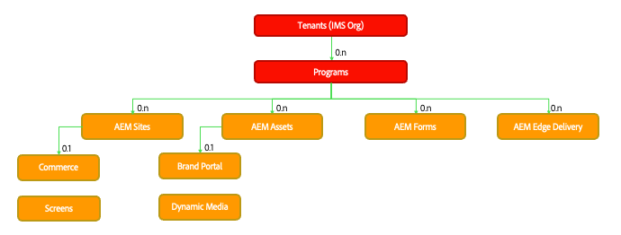
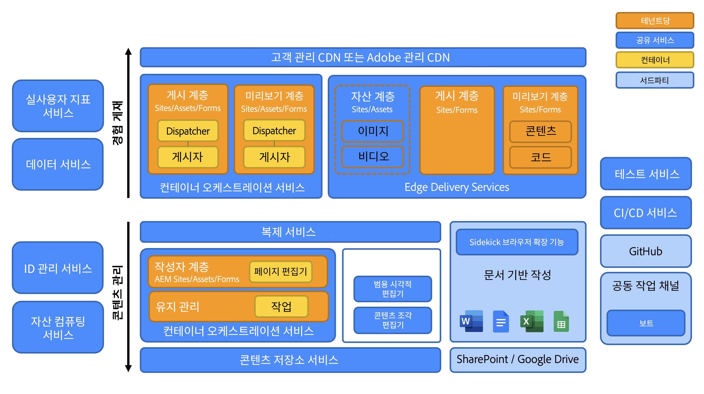
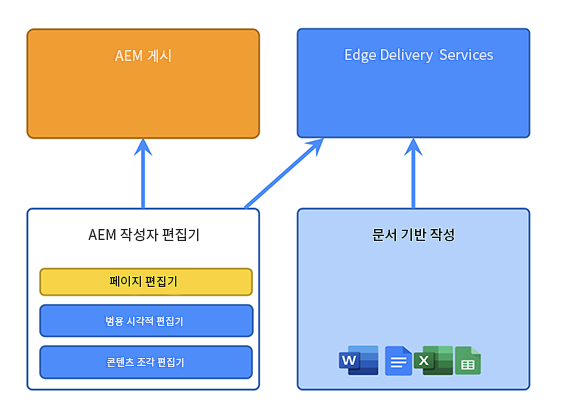
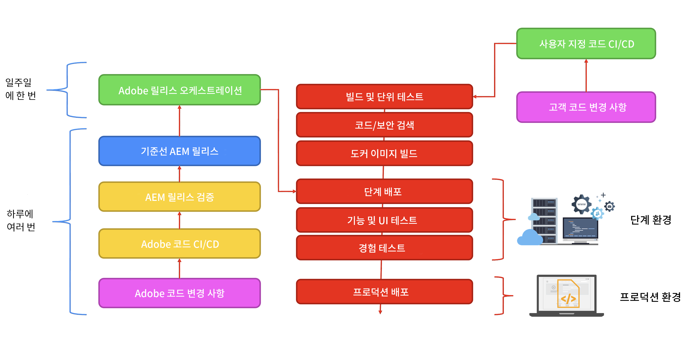

# Adobe Experience Manager as a Cloud Service 아키텍처 소개 {#an-introduction-to-the-architecture-adobe-experience-manager-as-a-cloud-service}

>[!CONTEXTUALHELP]
>id="intro_aem_cloudservice_architecture"
>title="AEM as a Cloud Service 아키텍처 소개"
>abstract="이 탭에서는 AEM as a Cloud Service의 새 아키텍처를 확인하고 변경 내용을 알아볼 수 있습니다. AEM에서 다양한 수의 이미지를 가진 동적 아키텍처를 구축했으므로 클라우드 아키텍처를 이해하는 시간을 가져 보십시오."
>additional-url="https://video.tv.adobe.com/v/330542/" text="아키텍처 개요"

Adobe Experience Manager(AEM as a Cloud Service) 는 영향력이 큰 경험을 만들고 관리할 수 있도록 컴포저블 서비스 세트를 제공합니다.

이 페이지에서는 논리 아키텍처, 서비스 아키텍처, 시스템 아키텍처 및 AEM용 개발 아키텍처를 as a Cloud Service으로 소개합니다.

## 논리적 아키텍처 {#logical-architecture}

AEM as a Cloud Service은 AEM Sites, AEM Assets 및 AEM Forms과 같은 높은 수준의 솔루션으로 구성됩니다. 이러한 서비스는 개별적으로 라이선스가 부여되지만 협업하여 사용할 수 있습니다. 각 솔루션은 각각의 사용 사례에 따라 AEM에서 as a Cloud Service으로 제공하는 구성 가능한 서비스의 조합을 사용합니다.

### 프로그램 {#programs}

AEM 응용 프로그램은 다음과 같은 형태로 구체화됩니다. [프로그램](/help/implementing/cloud-manager/getting-access-to-aem-in-cloud/program-types.md) 라이선스 권한에 따라 Cloud Manager 애플리케이션에서 생성합니다. 이러한 프로그램을 통해 특정 프로젝트의 컨텍스트에서 연관된 AEM 애플리케이션의 이름 지정, 구성 및 권한 할당 방법을 완벽하게 제어할 수 있습니다.

고객은 일반적으로 Adobe으로 **임차인**&#x200B;라고도 함 *IMS 조직* (Identity Management 시스템). 테넌트는 필요한 만큼 많은 프로그램을 가질 수 있으며 라이선스가 부여됩니다. 예를 들어, AEM Assets에 대한 중앙 프로그램이 표시되는 반면 AEM Sites은 여러 온라인 경험에 해당하는 여러 프로그램에서 사용될 수 있습니다.

>[!NOTE]
>
>AEM Edge Delivery Services은 Cloud Manager에서 최상위 솔루션으로 노출되지만 라이센스 관점에서 다른 주요 솔루션의 일부입니다. (예: Edge Delivery Services이 있는 AEM Sites)

높은 수준의 솔루션과 각 솔루션의 조합으로 프로그램을 구성할 수 있으며, 각 솔루션은 일대다 추가 기능을 지원할 수 있습니다. 예: AEM Sites용 Commerce 또는 Screens, Dynamic Media용 Brand Portal 또는 AEM Assets용 Screens.

### 환경 {#environments}

AEM Sites, AEM Assets 또는 AEM Forms 솔루션을 사용하여 프로그램을 만들면 연결된 AEM 인스턴스가 이 프로그램에서 AEM 환경 형태로 표시됩니다.

다음 네 가지 유형이 있습니다 [환경](/help/implementing/cloud-manager/manage-environments.md) AEM as a Cloud Service 사용 가능:

* 프로덕션 환경:

   * 프로덕션 환경은 비즈니스 전문가를 위한 애플리케이션을 호스팅하고 라이브 환경을 실행합니다.

* 스테이징 환경:

   * 스테이지 환경은 일반적으로 1:1 관계에서 프로덕션 환경에 연결됩니다.
   * 스테이지 환경은 주로 애플리케이션 변경 사항이 프로덕션 환경에 푸시되기 전에 자동화된 테스트를 위해 설계되었습니다.
      * 유지 관리 업데이트의 일부로 Adobe이 시작하거나 코드 배포가 시작하는 변경 사항과는 독립적입니다.
      * 코드 배포의 경우 수동 테스트를 수행할 수도 있습니다.
   * 스테이지 환경의 콘텐츠는 일반적으로 셀프서비스 콘텐츠 복사 기능을 사용하여 프로덕션 콘텐츠와 계속 동기화됩니다.
* 개발 환경:
   * 개발 환경을 사용하면 개발자가 스테이지 및 프로덕션 환경과 동일한 런타임 조건으로 AEM 애플리케이션을 구현하고 테스트할 수 있습니다.
   * 변경 사항은 프로덕션 배포 파이프라인과 동일한 코드 품질 및 보안 게이트를 허용하는 배포 파이프라인을 통해 전달됩니다.
* 신속한 개발 환경(RDE):
   * RDE 환경을 사용하면 일반 개발 환경에서 볼 수 있는 정식 배포 파이프라인을 거치지 않고 RDE 인스턴스에 새 코드 또는 기존 코드를 배포할 때 개발 반복을 빠르게 수행할 수 있습니다.

### Edge Delivery Services {#logical-architecture-edge-delivery-services}

AEM 프로그램은 [Edge Delivery Services](/help/edge/overview.md) 또한.

구성하고 나면 AEM에서 Edge Delivery Services을 사용하여 경험을 빌드하는 데 사용되는 GitHub 코드 저장소를 참조할 수 있습니다. 따라서 관련 경험에 새 구성 옵션을 사용할 수 있습니다. 여기에는 Adobe 관리 CDN 설정, 라이선스 지표 또는 SLA 보고서 액세스 등이 포함됩니다.

## 서비스 아키텍처 {#service-architecture}

AEM as a Cloud Service의 높은 수준의 구성 가능한 서비스 목록은 콘텐츠 관리 및 경험 전달 의 두 가지 세그먼트로 나타낼 수 있습니다.

콘텐츠 관리의 경우, 콘텐츠 작성을 위한 두 가지 주요 서비스 세트가 있으며, 둘 다 로 표시됩니다. *콘텐츠 소스*:

* AEM 작성자 계층: 웹 컨텐츠 관리를 위한 웹 기반 인터페이스(관련 API 포함)를 제공합니다. 이 기능은 두 가지 접근 방식 모두에 대해 작동합니다.
   * 헤드풀 - 페이지 편집기 및 범용 편집기를 통해
   * Headless - 콘텐츠 조각 편집기 사용
* 문서 기반 작성 계층: 다음과 같은 표준 애플리케이션을 사용하여 컨텐츠를 작성할 수 있습니다.
   * Microsoft Word 및 Excel - SharePoint 사용
   * Google Docs and Sheets - Google 드라이브 사용

AEM Sites 또는 AEM Forms을 사용하는 경험 전달의 경우 상호 배타적이지 않고 서로 다른 출처로 공유 Adobe 관리 CDN(Content Delivery Network)에서 작동하는 두 가지 주요 서비스 세트도 있습니다.

* AEM 게시 계층:
   * 표준 AEM 게시자 및 디스패처 팜을 실행하여 게시된 콘텐츠로 어셈블된 웹 페이지 및 API 콘텐츠(예: GraphQL)를 동적으로 렌더링할 수 있습니다.
   * 주로 서버측 애플리케이션 논리를 기반으로 합니다.
* Edge 게재 게시 계층:
   * AEM 작성자 계층 또는 문서 기반 작성 계층과 같은 다양한 콘텐츠 소스의 웹 페이지 및 API 콘텐츠를 동적으로 렌더링할 수 있습니다.
   * 클라이언트측 애플리케이션 논리를 기반으로 하며 최대 성능을 제공하도록 설계되었습니다.

또한 다음과 같은 주요 인접 서비스가 있습니다.

* Edge 게재 자산 계층:
   * AEM Assets에서 승인되고 게시된 미디어 항목의 전달을 허용합니다. 예: 이미지 및 비디오
   * 미디어 항목은 일반적으로 AEM 게시 계층 또는 Edge 게재 게시 계층에서 실행되는 경험 또는 AEM Assets과 통합된 다른 Adobe Experience Cloud 애플리케이션에서 참조됩니다.
* AEM 미리보기 계층 및 Edge Delivery Services 미리보기 계층:
   * AEM 게시 계층 또는 Edge 게재 게시 계층으로 각각 빌드된 경험에도 사용할 수 있습니다.
   * 콘텐츠 작성자는 게시 작업 전에 컨텍스트 내에서 콘텐츠를 미리 볼 수 있습니다.

>[!NOTE]
>
>기본적으로 Assets 전용 프로그램에는 게시 계층과 미리보기 계층이 없습니다.

인접한 다른 서비스가 있습니다.

* 복제 서비스:
   * 콘텐츠 관리 계층과 경험 전달 계층 사이에 위치합니다.
   * 은(는) 다음을 처리합니다. *게시* 콘텐츠 작성자가 실행한 다음 게시된 콘텐츠를 게시 계층에 제공하는 작업(AEM 또는 Edge 게재).

  >[!NOTE]
  >이전 AEM 버전의 복제 프레임워크가 더 이상 AEM을 게시하는 데 사용되지 않으므로 복제 서비스는 6.x 버전의 와 비교하여 완전히 재디자인되었습니다.
  >
  >최신 아키텍처는 *게시 및 구독* 클라우드 기반 콘텐츠 큐 접근 방식. AEM 게시 계층의 경우 다양한 수의 게시자가 게시 콘텐츠를 구독할 수 있으며 AEM as a Cloud Service의 실질적이고 빠른 자동 크기 조절을 수행하는 데 필수적인 부분입니다

* 콘텐츠 저장소 서비스:
   * AEM 작성자 계층에서 사용됩니다.
   * Apache Oak 기술로 구현된 JCR 호환 콘텐츠 저장소의 클라우드 기반 인스턴스입니다.
   * 콘텐츠의 지속성은 주로 Blob 기반 클라우드 스토리지를 기반으로 합니다.
* CI/CD 서비스:
   * AEM 환경에 대한 배포 파이프라인 관리 전용 Cloud Manager 기능의 하위 집합을 나타냅니다.
* 테스트 서비스:
   * 실행에 사용되는 기본 인프라를 나타냅니다.
      * 기능 테스트,
      * UI 테스트: 예를 들어 Selenium 또는 Cypress 스크립트를 기반으로
      * 경험 감사 테스트: 예를 들어 Lighthouse 점수,

     AEM 환경에 대한 배포 파이프라인의 일부로 또는 Edge 게재 코드 저장소에 대한 GitHub 가져오기 요청의 일부로.
* 데이터 서비스:
   * 라이선스 지표(예: 콘텐츠 요청, 스토리지, 사용자) 또는 사용 보고서(예: 업로드 수, 다운로드 수)와 같은 고객 데이터를 표시하는 역할을 합니다.
   * 고객 데이터는 API를 통해 제품 사용자 인터페이스(예: Cloud Manager) 내에서 노출될 수 있습니다.
* RUM(실시간 사용자 지표) 서비스:
   * 은 고객 경험에서 주요 지표(예: 페이지 보기 수, 핵심 웹 변수, 전환 이벤트)를 수집하고 관련 쿼리(예: 지난 7일 동안 주어진 도메인에 대한 상위 페이지 보기 수)에 응답할 책임이 있습니다.
* Assets Compute 서비스:
   * 은(는) 업로드된 이미지, 비디오 및 문서(예: PDF 및 Adobe Photoshop 파일) 처리를 담당합니다. 처리는 Adobe Sensei을 사용하여 이미지 및 비디오 메타데이터(예: 설명 태그 또는 기본 색상 톤)를 추출한 다음 Adobe Photoshop 및 Adobe Lightroom API와 같은 API에 액세스하여 렌디션(예: 다양한 크기 또는 형식)을 생성할 수 있습니다.
* Identity Management 서비스(IMS):
   * 지정된 Adobe Experience Cloud 애플리케이션(예: Cloud Manager 또는 AEM 작성자 계층)에 대한 사용자 및 사용자 그룹을 관리 및 인증하는 중앙 위치입니다.
   * Adobe Admin Console을 통해 액세스합니다.

## 시스템 아키텍처 {#system-architecture}

### AEM 작성자, 미리보기 및 게시 계층 {#aem-author-preview-publish-tiers}

AEM 작성자 및 게시 계층은 표준 Container Orchestration Service에 의해 운영되는 도커 컨테이너 세트로 구현됩니다. 그 결과 컨테이너화된 아키텍처는 실제 활동(콘텐츠 관리)과 실제 트래픽(경험 전달)에 따라 다양한 수의 pod가 있는 완전히 동적인 시스템을 의미합니다. 이렇게 하면 트래픽 패턴이 변화할 때 AEM이 as a Cloud Service으로 트래픽 패턴을 수용할 수 있습니다.

AEM 작성자 계층은 단일 콘텐츠 저장소를 공유하는 AEM 작성자 pod의 클러스터로 작동합니다. 유지 관리 작업이 실행 중이거나 배포 프로세스가 진행되는 동안 Pod가 두 개 이상 있으면 무중단 업무 운영이 가능합니다.

AEM 게시 계층은 각각 게시된 콘텐츠의 자체 콘텐츠 저장소가 있는 AEM 게시 인스턴스의 팜으로 작동합니다. 각 게시자는 컨텐츠의 구체화된 뷰를 위해 AEM Dispatcher 모듈이 장착된 단일 Apache 인스턴스에 연결되어 Adobe 관리 CDN의 원본 역할을 합니다. 비즈니스 연속성도 최소 2개의 Pod로 가능하지만 트래픽이 많은 시기에 이 숫자가 증가하는 것은 예사롭지 않습니다.

AEM 미리보기 계층은 단일 AEM 노드로 구성됩니다. 게시 계층에 게시하기 전에 콘텐츠의 품질 보증에 사용됩니다. 특히 배포 중에 가끔 다운타임이 미리보기 계층에서 발생할 수 있습니다.

### Edge Delivery Services {#system-architecture-edge-delivery-services}

Edge Delivery Services은 가장 성능 좋은 방식으로 페이지를 어셈블하기 위해 CDN 및 서버를 사용하지 않는 인프라 위에서 작동합니다. 리소스가 요청되면 서버리스 인프라는 게시된 콘텐츠를 의미 있는 HTML으로 변환하고 CDN의 원본 역할을 합니다.

시맨틱 HTML으로 변환은 AEM 작성 계층 또는 문서 기반 작성 환경에서 제공하는 게시된 콘텐츠에서 발생합니다.

다음 다이어그램은 Microsoft Word에서 사이트 콘텐츠를 편집하고(문서 기반 작성) Edge Delivery에 게시하는 방법을 보여 줍니다. 또한 다양한 편집기를 사용하는 기존 AEM 게시 방법을 보여 줍니다.

Edge Delivery Services은 Adobe Experience Manager의 일부이므로 Edge Delivery, AEM Sites 및 AEM Assets은 동일한 도메인에 공존할 수 있습니다. 이는 대규모 웹 사이트의 일반적인 사용 사례입니다. 예를 들어, 고객은 트래픽이 많은 특정 페이지를 Edge Delivery Services으로 마이그레이션하고 다른 모든 페이지는 AEM 게시 계층에 남아 있을 수 있습니다.

## 개발 아키텍처 {#development-architecture}

### 코드 저장소 {#code-repositories}

AEM 프로젝트에 대한 코드 및 구성은 코드 저장소에 저장되며, 코드 저장소에서 변경 사항이 적용되면 배포 파이프라인이 실행됩니다. 코드 리포지토리에는 여러 유형이 있습니다.

* AEM 전체 스택:
   * AEM 작성자 및 게시 계층에 대한 서버측 Java 코드 및 OSGI 구성을 저장하기 위한 것입니다.
* AEM 프론트엔드:
   * 클라이언트측 JS, CSS 및 AEM 작성자 및 게시 계층에 대한 HTML 코드 저장
clientlib에 대한 자세한 내용은 [AEM에서 클라이언트측 라이브러리 as a Cloud Service 사용.](/help/implementing/developing/introduction/clientlibs.md)
* AEM 웹 계층:
   * AEM 게시 계층에 대한 Dispatcher 구성 파일을 저장합니다.
* AEM 구성:
   * AEM 게시 계층 및 Edge Delivery Services 게시 계층에 대한 다양한 구성 옵션(예: CDN 설정 또는 유지 관리 작업 설정)을 저장할 수 있습니다.
* AEM edge 게재:
   * 클라이언트측 JS, CSS 및 Edge Delivery Services으로 빌드된 사이트용 HTML 코드 저장

### 배포 파이프라인 {#deployment-pipelines}

AEM 개발자 및 관리자는 Cloud Manager를 통해 제공되는 CI/CD(Continuous Integration/Continuous Delivery) 서비스를 사용하여 as a Cloud Service 애플리케이션을 관리합니다. 또한 Cloud Manager는 모니터링, 유지 관리, 문제 해결(예: 로그 파일에 대한 액세스) 및 라이선스와 관련된 모든 것을 노출합니다.

Cloud Manager는 AEM 인스턴스에 대한 모든 업데이트를 as a Cloud Service으로 관리합니다. 이는 필수 작업이며 고객 애플리케이션을 작성, 미리보기 및 게시 계층에 빌드, 테스트 및 배포할 수 있는 유일한 방법입니다. 이러한 업데이트는 새 버전의 AEM Cloud Service이 준비되었을 때 Adobe에 의해 또는 새 버전의 애플리케이션이 준비되었을 때 직접 트리거될 수 있습니다.

이는 프로그램 내의 각 환경에 연결된 배포 파이프라인에 의해 구현됩니다. Cloud Manager 파이프라인이 실행되면 작성 계층과 게시 계층 모두에 대해 고객 애플리케이션의 새 버전이 만들어집니다. 이 작업은 최신 고객 패키지를 최신 기준 Adobe 이미지와 결합함으로써 수행됩니다.

배포 파이프라인은 고객이 코드를 변경하거나 Adobe이 새 유지 관리 릴리스를 배포할 때 트리거됩니다.

두 경우 모두 동일한 자동화된 테스트 세트가 실행됩니다. 테스트로 구성됩니다.

* 제품 무결성을 보장하기 위해 Adobe이 기여
* 고객이 제공한 테스트
   * 기능 테스트: AEM 작성자 또는 게시 계층에 대한 http 요청을 통해
   * UI 테스트: Selenium 또는 Cypress 기술 기반

이러한 자동화된 테스트는 스테이징 환경에서 실행되므로 스테이징 환경 콘텐츠를 프로덕션 인스턴스의 콘텐츠에 최대한 가깝게 유지하는 것이 중요합니다.

모든 테스트가 정상적으로 통과하면 새 코드가 프로덕션 환경에 배포됩니다.

### 롤링 업데이트 {#rolling-updates}

Cloud Manager는 롤링 업데이트 패턴을 사용하여 모든 서비스 노드를 업데이트함으로써 AEM 애플리케이션의 최신 버전으로의 컷오버를 완전히 자동화합니다. 이는 다음 항목이 있음을 의미합니다. **다운타임 없음** 작성자 또는 게시 서비스용.

## AEM 6.x 이후 주요 혁신 {#major-innovations-since-aem-6x}

AEMas a Cloud Service 용 최신 아키텍처에서는 이전 세대(AEM 6.x 및 이전 세대)와 비교하여 몇 가지 근본적인 변경 사항과 혁신을 도입했습니다.

* 모든 파일은 클라우드 데이터 저장소에서 직접 업로드되고 제공됩니다. 연관된 비트 스트림은 AEM 작성 및 게시 서비스의 JVM을 거치지 않습니다. 그 결과, AEM 작성 및 게시 서비스의 노드는 크기가 더 작아질 수 있으므로 빠른 자동 크기 조절에 대한 기대와 더 호환됩니다. 비즈니스 전문가의 경우 이렇게 하면 이미지, 비디오 및 기타 작업을 더 빨리 업로드하고 다운로드할 수 있습니다.

* 이제 콘텐츠 게시로 구성된 모든 작업에 구독 패턴을 따르는 파이프라인이 포함됩니다. 게시된 콘텐츠는 파이프라인의 다양한 큐에 푸시되어 게시 서비스의 모든 노드가 이 콘텐츠를 구독합니다. 따라서 작성 계층은 게시 서비스의 노드 수를 인식할 필요가 없으며, 따라서 게시 계층의 자동 크기 조절 기능이 빨라집니다.

* 아키텍처는 애플리케이션 코드와 구성에서 애플리케이션 콘텐츠를 완전히 분리합니다. 모든 코드와 구성은 사실상 변경할 수 없으며 작성 및 게시 서비스의 다양한 노드를 만드는 데 사용되는 기준 이미지에 결합됩니다. 그 결과, 각 노드는 같아지고, 코드 및 구성의 변경은 Cloud Manager 파이프라인을 실행해야만 전역적으로 수행할 수 있습니다.

* 아키텍처에는 특히 Adobe I/O 런타임과 함께 서버리스 기술을 기반으로 구축된 여러 마이크로 서비스가 포함됩니다

## 추가 정보 {#further-information}

추가 참조:

* Edge Delivery Services:

   * [AEM as a Cloud Service 개요 - Edge Delivery Services 포함](/help/edge/overview.md)
   * [Edge Delivery Services 사용](/help/edge/using.md)
   * [Edge Delivery Services를 사용하여 AEM as a Cloud Service의 기본 아키텍처와 중요한 부분을 살펴보기](https://experienceleague.adobe.com/docs/experience-manager-learn/cloud-service/introduction/architecture.html)
