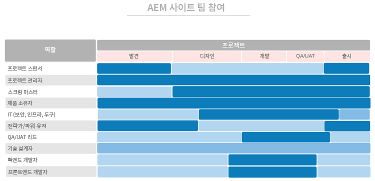

# 첫 번째, 적합한 사람에게 적합한 역할 부여하기 {#get-the-right-people-in-the-right-roles}

>[!CONTEXTUALHELP]
>id="aemcloud_chooseteam"
>title="적합한 팀 선택"
>abstract="Adobe Experience Manager 배포를 정상적으로 이끌 수 있도록 적합한 인력을 배치하십시오."
>additional-url="https://experienceleague.adobe.com/docs/experience-manager-cloud-service/onboarding/best-practices/aligning-kpis.html?lang=ko" text="KPI 정렬"
>additional-url="https://experienceleague.adobe.com/docs/experience-manager-cloud-service/onboarding/best-practices/assessing-kpis.html?lang=ko" text="KPI 평가"

조직 내 여러 부서에서 디지털 환경의 다양한 측면을 보일 수 있습니다. 거버넌스를 갖추지 않으면 끝없는 논쟁과 내분, 혼란의 상황이 발생할 것입니다.

디지털 거버넌스는 디지털에 초점을 맞춘 작업을 누가 담당하고 누가 수행하는지 파악하는 것에서부터 시작합니다. 필요한 기술을 더하기 위해 전략적인 채용을 해야 할 수도 있습니다. 훨씬 더 큰 과제는 새로운 기술에 대한 폭넓은 지원을 구축하고 사람들이 새로운 작업 방식에 익숙해지도록 돕는 등 문화 변화를 주도하는 것입니다. 그러한 노력의 핵심 부분은 사람들이 서로 배우고 지원할 수 있는 디지털 커뮤니티를 형성하는 것입니다.

지금은 Adobe Experience Manager 배포 구축에 도움이 되는 적합한 인력을 배치하는 데 중점을 두고 있습니다. 각 핵심 제품(Experience Manager Sites 및 Experience Manager Assets)에 대해 Adobe은 사용자가 수행해야 하는 역할 목록과 함께 다양한 역할을 효율적으로 수행할 수 있는 기술, 전문 지식 수준 및 속성을 제공했습니다.

이번 주 귀하의 과제는 구현 팀과 함께 두 목록을 검토하고 각 역할에 대해 관련 자격 조건을 갖춘 인력이 있는지 확인하는 것입니다.

## **AEM Experience Manager Sites에 대한 주요 역할**

성과가 좋은 팀은 귀사의 배포 팀과 같이 9명의 인원이 적절한 자리에 배치되어야 합니다. Adobe Experience Manager Sites를 통한 귀사의 성공 여부는 팀원의 힘과 이들 팀원이 협력하는 정도에 따라 결정됩니다. 제안된 자격 요건을 갖춘 사람들에게 이러한 9가지의 역할을 할당해야 합니다.

| 역할 | 기술 | 능력 수준 | 자질 |
|--- |--- |--- |--- |
| 프로젝트 관리자 | PMP 인증, Agile 인증, 위험 관리 경험 | 전문가 | 공정함, 일관적, 책임 있음, 체계적, 긍정적, 사교적, 변화에 수용적 |
| 스크럼 마스터 | ScrumMaster 인증, Agile 인증, 간편화 경험 | 전문가 | 일관적, 창의적 |
| 제품 소유자 | Agile 인증, 비즈니스 요구 사항에 대한 깊은 이해 | 전문가 | 균형적, 자신감 있음 |
| 보안, 인프라, 도구를 위한 IT 리드 | CISM 인증, Adobe Experience Manager 구성 요소 개발자 인증 | 전문가 | 세부 지향적 |
| 전략가/고급 사용자 | Adobe Experience Manager Sites에서의 숙련도 | 초보자부터 전문가 | 완강함, 호기심 많음, 철저함, 개방적, 변화에 수용적, 협력적 |
| QA/UAT 리드 | Agile 인증, SDLC에 대한 이해 | 초보자부터 중급자 | 세부 지향적, 프로세스 중심, 일관적 |
| 기술 설계자 | IT 인프라 경험 | 전문가 | 세부 지향적, 프로세스 중심, 일관적 |
| 백엔드 개발자 | Agile 인증, 컴퓨터 프로그래밍 및 컴퓨터 과학에 대한 경험 | 초보자부터 중급자 | 세부 지향적, 프로세스 중심, 일관적 |
| 프론트엔드 개발자 | Agile 인증, HTML, CSS 및 JavaScript에 대한 이해 | 초보자부터 중급자 | 세부 지향적, 프로세스 중심, 일관적 |

필요한 역할이 무엇인지 알았으므로 아래 표를 참조하여 구현 프로세스에서 각 역할이 언제 수행되는지 확인하십시오.

 

**구현 팀과 함께 이 목록을 검토**&#x200B;하고 각 역할에 대해 관련 자격 조건을 갖춘 인력이 있는지 확인하십시오. Adobe Experience Cloud에 익숙하지 않은 팀원은 [Experience League](https://experienceleague.adobe.com/#recommended/solutions/experience-manager) 학습 리소스를 사용하여 [Adobe 디지털 학습](https://learning.adobe.com/certification.html)을 통해 인증을 받을 수 있습니다.

## **AEM Experience Manager Assets에 대한 주요 역할**

설계자부터 스크럼 마스터까지, DAM 라이브러리 관리자를 포함한 이 팀의 모든 역할은 없어서는 안 될 구성원입니다.

Adobe Experience Manager Assets 구현을 정상적으로 실행하기 위해 필요한 대부분의 인력을 갖추고 있을 수 있습니다. 이 목록은 Adobe Experience Manager Sites용 목록과 유사하며, 디지털 에셋을 쉽게 찾을 수 있도록 조직하고 레이블을 지정하려면 라이브러리 관리자가 필요합니다.

| 역할 | 기술 | 능력 수준 | 자질 |
|--- |--- |--- |--- |
| 프로젝트 관리자 | PMP 인증, Agile 인증, 위험 관리 경험 | 전문가 | 공정함, 일관적, 책임 있음, 체계적, 긍정적, 사교적, 변화에 수용적 |
| 스크럼 마스터 | ScrumMaster 인증, Agile 인증, 간편화 경험 | 전문가 | 일관적, 창의적 |
| 제품 소유자 | Agile 인증, 비즈니스 요구 사항에 대한 깊은 이해 | 전문가 | 균형적, 자신감 있음 |
| 보안, 인프라, 도구를 위한 IT 리드 | CISM 인증, Adobe Experience Manager 구성 요소 개발자 인증 | 전문가 | 세부 지향적 |
| 전략가/고급 사용자 | Adobe Experience Manager Sites에서의 숙련도 | 초보자부터 전문가 | 완강함, 호기심 많음, 철저함, 개방적, 변화에 수용적, 협력적 |
| QA/UAT 리드 | Agile 인증, SDLC에 대한 이해 | 초보자부터 중급자 | 세부 지향적, 프로세스 중심, 일관적 |
| 기술 설계자 | IT 인프라 경험 | 전문가 | 세부 지향적, 프로세스 중심, 일관적 |
| 백엔드 개발자 | Agile 인증, 컴퓨터 프로그래밍 및 컴퓨터 과학에 대한 경험 | 초보자부터 중급자 | 세부 지향적, 프로세스 중심, 일관적 |
| 프론트엔드 개발자 | Agile 인증, HTML, CSS 및 JavaScript에 대한 이해 | 초보자부터 중급자 | 세부 지향적, 프로세스 중심, 일관적 |
| DAM 라이브러리 관리자 | 라이브러리 과학 배경 지식 및 학위 | 전문가 | 세부 지향적, 프로세스 중심, 조직적 |

필요한 역할이 무엇인지 알았으므로 아래 표를 참조하여 구현 프로세스에서 각 역할이 언제 수행되는지 확인하십시오.

 

>[!TIP]
>
> [Experience League](https://experienceleague.adobe.com/#recommended/solutions/experience-manager)에서 Adobe Experience Cloud 및 사용 리소스에 대한 자세한 내용을 살펴보고 [Adobe 디지털 학습](https://learning.adobe.com/certification.html)을 통해 인증을 받으십시오.
