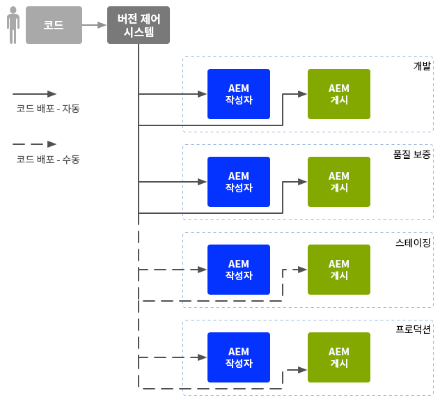
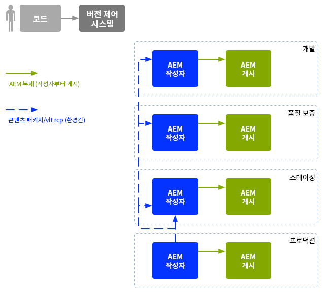

# 엔터프라이즈 DevOps{#enterprise-devops}

DevOps는 다음 작업에 필요한 프로세스, 방법 및 커뮤니케이션을 다룹니다.

* 다양한 환경에서 소프트웨어를 쉽게 배포합니다.
* 개발, 테스트 및 배포 팀 간의 공동 작업을 간소화합니다.

DevOps는 다음과 같은 문제를 방지하는 것을 목표로 합니다.

* 수동 오류
* 누락된 요소(예: 파일, 구성 세부 사항)
* 불일치(예: 개발자의 로컬 환경과 다른 환경 간의 불일치)

## 환경 {#environments}

Adobe Experience Manager (AEM) as a Cloud Service는 일반적으로 서로 다른 수준에서 다른 용도로 사용되는 여러 환경으로 구성됩니다.

* [개발](#development)
* [품질 보증](#quality-assurance)
* [스테이징](#staging)
* [프로덕션](#production-author-and-publish)

>[!NOTE]
>
>프로덕션 환경에는 작성자와 게시 환경이 각각 적어도 한 개 이상 있어야 합니다.
>
>다른 모든 환경도 프로덕션 환경을 반영하고 조기 테스트를 활성화할 수 있도록 작성자 및 게시 환경으로 구성된 것이 좋습니다.

### 개발 {#development}

개발자는 필요한 모든 기능을 갖춘 제안된 프로젝트(웹 사이트, 모바일 애플리케이션, DAM 구현 등)를 개발 및 사용자 정의할 책임이 있습니다. 절차는 다음과 같습니다.

* 필요한 요소 개발 및 사용자 정의(예: 템플릿, 구성 요소, 워크플로, 애플리케이션)
* 디자인 실현
* 필요한 기능을 구현하는 데 필요한 서비스 및 스크립트 개발

[개발](/help/implementing/developing/introduction/development-guidelines.md) 환경의 구성은 일반적으로 다음과 같이 구성된 여러 요인에 따라 달라질 수 있습니다.

* 통합된 코드 베이스를 제공할 수 있게 버전 제어 기능을 갖춘 통합된 개발 시스템. 통합된 이 코드 베이스는 각 개발자가 사용하는 개별 개발 환경에서 코드를 병합하고 통합하는 데 사용됩니다.
* 개발자별 개인 환경. 일반적으로 로컬 시스템에 상주합니다. 코드가 적절한 간격으로 버전 제어 시스템과 동기화됨

시스템의 크기에 따라 개발 환경에 작성자와 게시 인스턴스가 모두 있을 수 있습니다.

### 품질 보증 {#quality-assurance}

이 환경은 품질 보증 팀이 새 시스템의 디자인과 기능을 모두 종합적으로 테스트하기 위해 사용합니다. 적절한 콘텐츠를 사용한 작성자 및 게시 환경이 모두 있어야 하며, 전체 테스트를 활성화하는 데 필요한 모든 서비스를 제공해야 합니다.

### 스테이징 {#staging}

스테이징 환경은 구성, 코드 및 콘텐츠와 같은 프로덕션 환경의 미러여야 합니다.

* 실제 배포를 구현하는 데 사용되는 스크립트를 테스트하는 데 사용됩니다.
* 프로덕션 환경에 배포하기 전에 최종 테스트(디자인, 기능 및 인터페이스)에 사용할 수 있습니다.
* 항상 프로덕션 환경과 동일한 스테이징 환경을 가질 수는 없지만 가능한 한 비슷한 환경이어야 성능 및 로드 테스트를 활성화할 수 있습니다.

### 프로덕션 - 작성 및 게시 {#production-author-and-publish}

프로덕션 환경은 구현을 [작성 및 게시](/help/sites-cloud/authoring/author-publish.md)하는 데 필요한 환경으로 구성됩니다.

프로덕션 환경은 한 개 이상의 작성자 인스턴스와 한 개의 게시 인스턴스로 구성됩니다.

* 콘텐츠 입력에 대한 [작성](#author) 인스턴스.
* 방문자/사용자가 사용할 수 있는 콘텐츠의 [게시](#publish) 인스턴스.

프로젝트 규모에 따라 여러 작성자 및/또는 게시자로 구성되는 경우가 많습니다. 하위 수준에서 저장소가 여러 인스턴스로 클러스터링될 수도 있습니다.

#### 작성 {#author}

일반적으로 작성자 인스턴스는 내부 방화벽 뒤에 있습니다. 내부 방화벽은 사용자 및 동료가 다음과 같은 작성 작업을 수행하는 환경입니다.

* 전체 시스템 관리
* 콘텐츠 입력
* 콘텐츠의 레이아웃 및 디자인 구성
* 게시 환경에 콘텐츠 활성화

활성화된 콘텐츠는 패키지화되어 작성자 환경의 복제 큐에 배치됩니다. 그런 다음 복제 프로세스는 해당 콘텐츠를 게시 환경에 전송합니다.

게시 환경에 생성된 데이터를 다시 작성자 환경으로 복제하려면 작성자 환경의 복제 리스너가 게시 환경을 폴링하고, 게시 환경의 역방향 복제 출력소에서 해당 콘텐츠를 검색합니다.

#### 게시 {#publish}

일반적으로 게시 환경은 DMZ(Demilitarized Zone)에 있습니다. 이 환경은 방문자가 귀하의 콘텐츠(예: 웹 사이트 또는 모바일 애플리케이션 형식을 통해)에 액세스하여 상호 작용하는 곳으로, 인트라넷 내에서 공개적입니다. 게시 환경:

* 작성자 환경에서 복제된 콘텐츠 저장
* 방문자가 해당 콘텐츠를 사용할 수 있도록 함
* 댓글 또는 기타 양식 제출과 같이 방문자가 생성한 사용자 데이터 저장
* 작성자 환경에 역복제를 위해 그러한 사용자 데이터를 보낸 편지함에 추가하도록 구성할 수 있음

게시 환경은 동적이며 실시간으로 콘텐츠를 생성하며 각 개별 사용자에 맞게 콘텐츠를 개인화할 수 있습니다.

## 코드 이동 {#code-movement}

코드는 항상 아래쪽에서 위쪽으로 전파해야 합니다.

* 코드는 처음에 로컬 개발 환경에서 개발된 후 통합된 개발 환경에서 개발됨
* QA 환경에서 철저한 테스트 수행
* 그런 다음 스테이징 환경에서 다시 테스트됨
* 그런 다음 코드를 프로덕션 환경에 배포해야 함

일반적으로 코드(예: 사용자 정의된 웹 애플리케이션 기능 및 디자인 템플릿)는 다른 콘텐츠 저장소 간에 패키지를 내보내고 가져와서 전송합니다. 이 복제를 자동 프로세스로 구성할 수 있습니다.

AEM as a Cloud Service 프로젝트는 종종 코드 배포를 다음과 같은 방법으로 트리거합니다.

* 자동: 배포 및 QA 환경으로 전송
* 수동: 스테이징 및 프로덕션 환경에 대한 배포는 보다 잘 관리되는 방식으로, 종종 수동으로 수행됩니다. 단, 필요한 경우 자동화가 가능합니다.

## 콘텐츠 이동 {#content-movement}

프로덕션에 대해 만들어지는 콘텐츠는 **항상** 프로덕션 작성 인스턴스에서 작성해야 합니다.

콘텐츠는 낮은 환경에서 더 높은 환경으로 이동하는 코드를 따라서는 안 됩니다. 작성자가 로컬 컴퓨터나 낮은 환경에서 콘텐츠를 만든 다음 프로덕션 환경으로 이동하는 것은 좋지 않습니다. 오류 및 불일치를 초래할 수 있기 때문입니다.

프로덕션 콘텐츠는 스테이징 환경에서 효율적이고 정확한 테스트 환경을 제공하도록 프로덕션 환경에서 스테이징 환경으로 이동해야 합니다.

>[!NOTE]
>
>이 방식은 스테이징 콘텐츠를 프로덕션과 계속 동기화해야 한다는 의미가 아닙니다. 정기적인 업데이트로도 충분하지만, 특히 새로운 코드를 반복 테스트하기 전에 업데이트해야 합니다. QA 및 개발 환경의 콘텐츠는 자주 업데이트할 필요가 없습니다. 프로덕션 콘텐츠를 잘 표현해야 합니다.

콘텐츠를 다음과 같이 전송할 수 있습니다.

* 다른 환경 간에 패키지를 내보내고 가져옵니다.
* 다른 인스턴스 간에 HTTP 또는 HTTPS 연결을 사용하여 콘텐츠를 직접 복제(AEM as a Cloud Service 복제)합니다.

