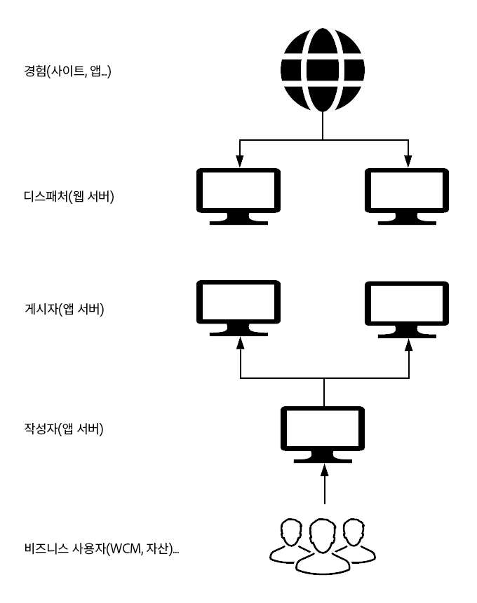
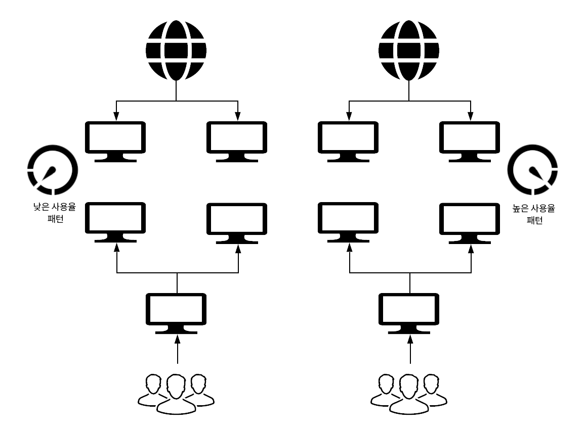

# 새로운 기능과 다른 기능 {#what-is-new-and-what-is-different}

AEM은 여러 해 동안 다음과 같이 사용할 수 있습니다.

* On-Premise

* as a Managed Service

이러한 이전 접근 방식과 클라우드 서비스로서의 AEM은 본질적으로 다릅니다.

* [아키텍처](#architecture)
* [업그레이드](#upgrades)
* [Cloud Manager](#cloud-manager)
* [온보딩](#onboarding)
* [개발](#developing)
* [운영 및 성능](#operations-and-performance)
* [ID 관리](#identity-management)
* [작성 사용자 인터페이스](#authoring-user-interface)
* [AEM Sites](#aem-sites)
* [AEM Assets](#aem-assets)

>[!NOTE]
>
>이러한 개요는 철저하지 않지만, 소개를 제공하기 위한 것입니다.

<!-- change link when 6.5 hub page migrated -->

>[!NOTE]
>
>온-프레미스 및 관리 서비스 버전에 대한 자세한 내용은 AEM [6.5에 대한 설명서를 참조하십시오](https://helpx.adobe.com/support/experience-manager/6-5.html).

<!-- * [Miscellaneous](#miscellaneous) -->

## 아키텍처 {#architecture}

>[!NOTE]
>
>자세한 내용은 아키텍처를 [참조하십시오](/help/core-concepts/architecture.md).

### 이전 버전 {#previous-versions-architecture}

AEM 온프레미스 및 Managed Services의 AEM 모두 고정된 수의 시스템과 인스턴스로 구성된 정적 아키텍처를 사용했습니다.

다음과 같습니다.

* 최대 *트래픽(인터넷) 및* 최대 ** 활동(마케팅)을 위해 크기를 조정했으며, 이로 인해 상당 기간 동안 유휴 상태가 되었습니다.
   

* 단일 애플리케이션(빠른 시작)입니다.

* 단일 작성자 인스턴스가 있습니다.유지 관리 기간 동안 다운타임이 발생할 수 있었습니다.

### 클라우드 서비스로 AEM 사용 {#aem-as-a-cloud-service-architecture}

이제 클라우드 서비스로 AEM에 다음이 포함됩니다.

* AEM 이미지 수가 다양한 동적 아키텍처입니다.

이 아키텍처:

* 실제 *트래픽과* 실제 ** 활동을 기반으로 크기를 조절합니다.

* 필요한 경우에만 실행되는 개별 인스턴스가 있습니다.

* 모듈식 애플리케이션을 사용합니다.

* 작성자 클러스터가 기본값으로 있음;이로 인해 유지 관리 작업의 중단 시간이 줄어듭니다.

이렇게 하면 다양한 사용 패턴을 자동으로 적용할 수 있습니다.

## 업그레이드 {#upgrades}

<!--
>[!NOTE]
>
>For further details see the [Deploying Introduction](/help/sites/deploying/introduction.md).
-->

### 이전 버전 {#previous-versions-upgrades}

AEM 온프레미스 및 Managed Services의 AEM 모두 서비스 팩, 기능 팩 및 핫픽스별 연간 주요 릴리스의 고정 패턴이 적용되었습니다. 종종 인스턴스는 2년 이상 주 버전을 실행합니다.

업그레이드 유형에 따라 분석, 개발 및 테스트로 구성된 상당한 준비 과정을 거친 후 실제 업그레이드에 대한 가동 중지 시간이 발생할 수 있습니다.

### 클라우드 서비스로 AEM 사용 {#aem-as-a-cloud-service-upgrades}

이제 클라우드 서비스로 AEM은 연속 통합 및 연속 배달(CI/CD)을 사용하여 프로젝트가 완전히 최신 상태인지 확인합니다. 따라서 모든 업그레이드 작업은 완전히 자동화되므로 사용자가 서비스를 중단할 필요가 없습니다.

Adobe는 서비스의 모든 운영 인스턴스를 최신 버전의 AEM 코드 베이스로 업데이트할 것을 적극적으로 처리합니다.

* 버그 수정:

   * 매일 출시될 수 있습니다.

   * 최신 버그 수정으로 인스턴스가 자주 업데이트됩니다. 변경 사항이 정기적으로 적용되면 서비스 영향이 증가하므로 서비스에 미치는 영향이 줄어듭니다.

   * 대부분의 업데이트는 유지 관리 및 보안을 위한 것입니다.

* 새로운 기능:

   * 예측 가능한 월별 일정을 통해 릴리스됩니다.

>[!NOTE]
>
>자세한 내용은 배포 [아키텍처를 참조하십시오](/help/core-concepts/architecture.md#deployment-architecture).

## Cloud Manager {#cloud-manager}

Adobe Cloud Manager는 인스턴스에 대한 모든 업데이트를 제어하므로 AEM을 클라우드 서비스로 지속적으로 업그레이드할 때 없어서는 안 될 필수 사항입니다.

새로운 버전의 클라우드 서비스를 사용할 수 있는 경우 Adobe에서 업데이트를 트리거할 수 있습니다. 또는 Cloud Manager에서 제공하는 파이프라인을 사용하여 애플리케이션 업데이트를 트리거할 수 있습니다.

Cloud Manager:

* aem 프로그램 및 환경을 관리하는 데 사용됩니다.

* 클라우드 서비스로서 AEM의 필수 구성 요소각 새 테넌트는 먼저 클라우드 관리자 액세스에 대해 프로비저닝됩니다.

* 운영 및 개발 담당 직원을 위한 단일 시작 지점

특히, 클라우드 관리자에서 만들 수 있는 AEM 프로그램의 수와 유형은 다음 중 하나를 파생시킵니다.

* 고객 라이센스 계약에서

* AEM을 클라우드 서비스로 사용하는 경우 내부 제어 행위자로부터 지원 또는 트레이닝에

* 시험버전과 같은 외부 기반 업무 처리 과정을 Adobe.com에서 시작했습니다.

Cloud Manager는 AEM의 클라우드 서비스로 기본 구성 요소를 만들고 구성할 수 있는 셀프 서비스 포털로 발전했습니다.

* 새로운 프로그램 제작 및 관리

* 이러한 프로그램 내에서 AEM 환경 만들기 및 관리

* 고객 코드 및 관련 구성을 특정 환경에 배포하기 위한 파이프라인을 만들고 관리합니다.

* 이러한 구성 요소에 대한 중요한 라이프사이클 이벤트에 대한 알림을 받습니다(예: 제품 업데이트).

현재 Cloud Manager는 3개의 지리적 지역에서 환경을 만들 수 있습니다(다음 지역이 더 많음).

* 미국(동부)

* EMEA(네덜란드)

* APAC(오스트레일리아)

## 온보딩 {#onboarding}

<!--
>[!NOTE]
>
>For further details see [Onboarding - An Overview](/help/onboarding/overview.md).
-->

### 이전 버전 {#previous-versions-onboarding}

AEM 프로젝트 구현은 기본적으로 기존 프로젝트 관리 방법을 따릅니다.

### 클라우드 서비스로 AEM 사용 {#aem-as-a-cloud-service-onboarding}

AEM 프로젝트를 Adobe가 많은 측면을 담당하므로 클라우드 서비스로 AEM을 사용하는 경우 AEM 프로젝트를 시작하고 관리하는 것이 훨씬 쉽습니다.

* 기본 AEM 이미지는 특정 사용 사례에 맞게 최적화되어 있습니다.

* 수동 구성 작업 중 많은 작업이 중복되었습니다.

그것은 또한 지금 있는 것과 크게 다릅니다.

* 모든 전제 조건이 충족되었는지 확인하는 평가 단계포함: 예:

   * 법적 요건

   * 계약

   * 고객이 맞춤화한 기존 컨텐츠 및/또는 코드에 대한 기술 요구 사항

* 배포 요구 사항:

   * 코드 업데이트;이전 버전의 AEM용으로 개발된 모든 고객 애플리케이션을 검토하고 업데이트해야 합니다.

   * 컨텐츠 마이그레이션

## 개발 {#developing}

>[!NOTE]
>
>자세한 내용은 개발 지침 [설명서를](/help/implementing/developing/introduction/development-guidelines.md) 참조하십시오.

<!--
>[!NOTE]
>
>For further details start with [The Developing Experience](/help/sites/developing/introduction/developer-experience.md, [Developing - The Basics](/help/sites/developing/introduction/the-basics.md) and [Developing Best Practices](/help/sites/best-practices/developing.md).
-->

### 이전 버전 {#previous-versions-developing}

<!-- needs more detail -->
개발은 로컬에서 수행한 집중적인 작업이었고 그 다음에 프로덕션 인스턴스에 배포했습니다.

### 클라우드 서비스로 AEM 사용 {#aem-as-a-cloud-service-developing}

<!-- Will need information for new customers -->
클라우드 서비스로 AEM을 지원하는 새로운 아키텍처에는 전반적인 개발자 경험에 대한 몇 가지 주요 변경 사항이 포함됩니다. AEM을 클라우드 서비스로 사용하는 주요 목표 중 하나는 경험 있는 고객(온-프레미스 또는 Adobe Managed Services 컨텍스트에서 AEM을 사용함)이 사용자 지정된 코드의 대부분을 다시 쓰지 않고도 가능한 한 빨리 클라우드 서비스로 마이그레이션할 수 있도록 하는 것입니다. 그러나 일부 조정이 필요할 수 있습니다.

#### 클라우드 개발 {#aem-as-a-cloud-service-developing-cloud-development}

기존 AEM 애플리케이션이 클라우드 서비스로 AEM에서 실행되도록 하려면 다음 단계가 필요합니다.

* 애플리케이션 코드와 구성은 관련 Cloud Manager 프로그램의 Git 코드 리포지토리에 저장해야 합니다.
* 애플리케이션 코드 및 구성은 매일 변경될 수 있는 기준 AEM 이미지의 최신 버전과 호환되어야 합니다.
   * 고객 애플리케이션은 Cloud Manager 환경과 연결된 Cloud Manager 파이프라인을 사용하여 구축 및 배포해야 합니다.
* 고객 애플리케이션은 파이프라인에 적용되는 모든 코드 품질, 보안 및 성능 게이트를 전달해야 합니다.
* 고객 애플리케이션을 위해 만들어진 이미지는 Cloud Manager 파이프라인에 의해 배포되어야 합니다.

<!-- duration of what? -->
이 프로세스를 클라우드 우선 개발이라고 합니다. 종단 간 지속 시간은 몇 분(애플리케이션의 복잡도에 따라 20~50분)이 소요되므로 대기 중인 코드와 구성 변경 사항을 클라우드에서 시도하기 전에 신속한 개발 방법론을 수용해야 합니다.

<!-- is this really relevant at this point? -->
OSGI 번들 및 관련 구성이 관리되고 이전의 AEM QuickStart의 일부인 웹 콘솔은 더 이상 AEM 사용자가 클라우드 서비스 환경으로 직접 액세스할 수 없습니다. 이 인터페이스는 여전히 새 개발자 콘솔을 사용하여 읽기 전용 모드로 액세스할 수 있습니다. 이 콘솔을 사용하여 개발자는 작성자 또는 게시 서비스의 특정 노드를 선택하여 바로 로그인한 다음 기본적으로 차단된 영역에 액세스할 수 있습니다.

개발자는 다양한 환경의 로그 파일에 신속하게 액세스할 수 있어야 합니다. AEM을 클라우드 서비스로 사용하면 작성 및 게시 노드에 있는 다른 노드의 로그 파일을 클라우드 관리자를 통해 다운로드하거나 API를 통해 사용할 수 있습니다.

코드와 컨텐츠가 명확히 구분되어 있으므로 개발자는 특정 프로세스를 사용하여 배포의 일부로 컨텐츠를 업데이트할 수 있습니다. 변경 가능한 컨텐츠에 대한 일반적인 사용 사례는 다음과 같습니다.

* 고객 프로젝트에 속하는 표준 *기본* 컨텐츠(예: 폴더, 템플릿, 워크플로우 등)

* 색인 정의 검색

* ACL 및 권한

* 서비스 사용자 및 사용자 그룹

#### 로컬 개발 {#aem-as-a-cloud-service-developing-local-development}

신속한 반복 및 개발을 지원하기 위해 AEM 외부에서 클라우드 서비스 컨텍스트로 AEM 애플리케이션을 개발할 수도 있습니다. 따라서 개발자는 다음 결함을 사용할 수 있습니다.

* AEM을 클라우드 서비스 빠른 시작:동일한 기능 및 API 표면이 있는 최신 AEM 코드 베이스의 `.jar` 독립 실행형 기반 설치 프로그램입니다.

* 클라우드 서비스 디스패처 SDK로 AEM:로컬에서 Dispatcher 구성을 테스트 및 검증하기 위한 이미지 기반 프로세스

>[!NOTE]
>
>클라우드 QuickStart는 모든 AEM 사이트 및 AEM 자산 기능을 허용하지 않습니다. 대부분의 익스텐션을 개발 및 테스트할 수 있는 간단한 작성 환경으로 구성됩니다.

## 운영 및 성능 {#operations-and-performance}

>[!NOTE]
>
>자세한 내용은 백업, [인덱싱](/help/operations/backup.md)및 [기타 유지 관리](/help/operations/indexing.md)작업을 [참조하십시오](/help/operations/maintenance.md).

### 이전 버전 {#previous-versions-operations-and-performance}

이전에는, 특히 작성자측에서 인스턴스를 정기적으로 중지할 필요가 있었습니다.를 참조하십시오. 일부 고객의 경우 주간 다운타임이 몇 시간 동안 발생했습니다.

### 클라우드 서비스로 AEM 사용 {#aem-as-a-cloud-service-operatioms-and-performance}

AEM을 클라우드 서비스로 사용하는 경우 이러한 작업은 자동화되므로 더 이상 서비스를 중단할 필요가 없습니다.

다음 영역에서 다음을 수행합니다.

* 많은 작업이 자동화되었습니다.

* 토폴로지는 최대한의 복원력과 효율성을 위해 최적화되었습니다.예를 들어 바이너리스 복제는 기본값입니다.

* 큐, 작업 및 벌크 처리 작업과 같은 무거운 로드 작업이 핵심 AEM 인스턴스에서 이동하여 공유 및 전용 마이크로 서비스에 의해 처리됩니다.

AEM을 클라우드 서비스로 사용하는 작업은 새로운 모니터링, 보고 및 경고 인프라에서도 지원됩니다. 이를 통해 Adobe SRE(Site 신뢰성 엔지니어)는 적극적으로 서비스를 건강하게 유지할 수 있습니다. 그 건축의 다양한 요소들은 다양한 건강 진단을 갖추고 있다. 어떤 이유로 아키텍처의 특정 노드가 비정상적이라고 간주되면 서비스에서 제거되고 자동으로 새로운 건강한 노드로 대체됩니다.

## ID 관리 {#identity-management}

<!--
>[!NOTE]
>
>For further details see [Security - Single Sign-On](/help/sites/security/single-sign-on.md).
-->

### 이전 버전 {#previous-versions-identity-management}

기본적으로 ID 관리는 AEM에 내적입니다.

>[!NOTE]
>
>AEM 6.4.3.0 도입:
>
>* AEM 인스턴스에 대한 관리 콘솔 지원.
>* AEM Managed Services 고객을 위한 Adobe IMS(Identity Management System) 기반 인증

### 클라우드 서비스로 AEM 사용 {#aem-as-a-cloud-service-identity-management}

클라우드 서비스로서 AEM에 대한 주요 변경 사항은 작성자 계층에 액세스하기 위해 Adobe ID를 완벽하게 통합한 것입니다.

이를 위해서는 사용자 및 사용자 그룹을 [관리하기 위해 Adobe Admin 콘솔을](https://helpx.adobe.com/enterprise/using/admin-console.html) 사용해야 합니다. 사용자 계정은 사용자 프로필 정보가 모든 클라우드 서비스에서 공유되도록 Adobe IMS(Identity Management System)에서 중앙 집중화되므로 사용자가 Adobe 제품 및 서비스에 액세스할 수 있도록 합니다. AEM에 대한 액세스 권한이 할당되면, 사용자 계정은 AEM에서 이전과 같이 클라우드 서비스로 참조될 수 있습니다.예를 들어 AEM 보안 사용자 인터페이스에서 역할 및 권한을 정의하는 경우

여기에는 다음과 같은 이점이 포함됩니다.

* IMS(Adobe Identity Management System)를 사용하여 모든 Adobe 클라우드 애플리케이션에서 Single Sign-On을 제공합니다.

* 사용자 기본 설정은 클라우드 서비스로 AEM의 각 특정 인스턴스에 대해 로컬에 남아 있습니다.

## 작성 사용자 인터페이스 {#authoring-user-interface}

<!--
>[!NOTE]
>
>For further details, the [Basic Handling](/help/sites/authoring/getting-started/basic-handling.md) and [Best Practices](/help/sites/best-practices/authoring.md) are good starting points.
-->

### 이전 버전 {#previous-versions-authoring}

사이트 및 자산 모두에 대해 작성 인스턴스(UI)의 사용자 인터페이스는 터치 활성화 및 클래식 UI 모두를 사용하여 모든 사용 사례에 맞게 점진적으로 개발되고 최적화되었습니다.

### 클라우드 서비스로 AEM 사용 {#aem-as-a-cloud-service-authoring}

사이트 및 자산 모두에 대한 UI(작성 사용자 인터페이스)의 기본 원칙은 이전에 AEM을 사용한 모든 사람에게 매우 익숙할 것입니다.

주요 차이점은 UI가 터치를 사용하는 것입니다.클래식 UI는 더 이상 사용할 수 없습니다. 그렇지 않으면 기본 사항은 변경되지 않고 작은 변경 사항만 표시됩니다.

## AEM Sites {#aem-sites}

Adobe Experience Manager Sites as a Cloud Service를 사용하면 AEM Content Management System의 강력한 기능과 AEM Digital Asset Management를 결합하여 개인화된 콘텐츠 중심의 경험을 고객에게 제공할 수 있습니다.

자세한 내용은 사이트 변경 [사항의 개요를 참조하십시오](/help/sites-cloud/sites-cloud-changes.md).

## AEM Assets {#aem-assets}

Adobe Experience Manager Assets as a Cloud Service는 클라우드 기반의 SaaS 솔루션을 제공하므로 기업은 신속하고 효과적으로 디지털 자산 관리 및 다이내믹 미디어 작업을 수행할 수 있을 뿐만 아니라 항상 최신 방식으로 이용할 수 있고 항상 학습할 수 있는 시스템에서 AI/ML과 같은 차세대 스마트 기능을 사용할 수 있습니다.

에셋 서비스에는 클라우드에서 차세대 에셋 처리 및 고성능 에셋 수집 및 검색이 포함됩니다.

자세한 내용은 [개요와 Assets as a Cloud Service 소개를 참조하십시오](/help/assets/overview.md).

