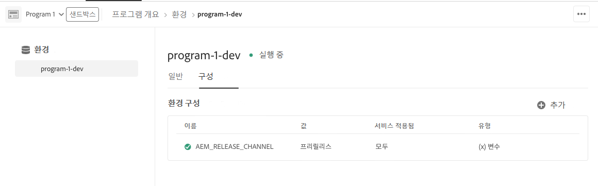

# [!DNL Adobe Experience Manager] as a Cloud Service 프리릴리스 채널 {#prerelease-channel}


## 소개 {#introduction}

[!DNL Adobe Experience Manager] as a Cloud Service는 [Experience Manager 릴리스 로드맵](https://experienceleague.adobe.com/docs/experience-manager-release-information/aem-release-updates/update-releases-roadmap.html?lang=ko-kr#aem-as-cloud-service)의 일정에 따라 월간 케이던스로 새로운 기능을 제공합니다. 다음 달 출시가 예정된 기능에 익숙해지려면 표준 프로그램 개발 환경 또는 샌드박스 프로그램 환경에 적절하게 구성하여 액세스할 수 있는 프리릴리스 채널을 구독하면 됩니다. Sites 콘솔 변경 내용을 미리 볼 수 있으며 새 프리릴리스 API에 대해 코드를 작성할 수 있습니다.

지정된 달에 대한 프리릴리스 기능 목록은 [월별 릴리스 정보](/help/release-notes/release-notes-cloud/release-notes-current.md)에 게시됩니다.

>[!VIDEO](/help/release-notes/assets/prerelease-overview.mp4)

## 프리릴리스 활성화 방법 {#enable-prerelease}

다음과 같이 다양한 방식으로 프리릴리스 기능을 경험할 수 있습니다.

* 클라우드 환경(표준 프로그램 개발 환경 또는 샌드박스 프로그램 환경 유형)
* 로컬 SDK

### 클라우드 환경 {#cloud-environments}

프리릴리스를 사용할 수 있도록 클라우드 환경을 업데이트하려면 Cloud Manager의 환경 구성 UI를 사용하여 새 [환경 변수](../implementing/cloud-manager/environment-variables.md)를 추가하십시오.

1. **프로그램** > **환경** > 업데이트하고자 하는 **환경 구성**&#x200B;으로 이동합니다.
1. 새 [환경 변수](../implementing/cloud-manager/environment-variables.md) 추가

   | 이름 | 값 | 적용된 서비스 | 유형 |
   |------|-------|-----------------|------|
   | `AEM_RELEASE_CHANNEL` | `prerelease` | 모두 | 변수 |

1. 변경 내용을 저장하면 환경은 프리릴리스 기능 전환이 활성화되며 새로 고침됩니다.

   


**또는** Cloud Manager API 및 CLI를 사용하여 환경 변수를 업데이트할 수 있습니다.

* [Cloud Manager API의 환경 변수 끝점](https://developer.adobe.com/experience-cloud/cloud-manager/reference/api/#operation/patchEnvironmentVariables)을 사용하여 **AEM_RELEASE_CHANNEL** 환경 변수를 **프리릴리스** 값으로 설정합니다.

   ```
   PATCH /program/{programId}/environment/{environmentId}/variables
   [
           {
                   "name" : "AEM_RELEASE_CHANNEL",
                   "value" : "prerelease",
                   "type" : "string"
           }
   ]
   ```

* [https://github.com/adobe/aio-cli-plugin-cloudmanager#aio-cloudmanagerset-environment-variables-environmentid](https://github.com/adobe/aio-cli-plugin-cloudmanager#aio-cloudmanagerset-environment-variables-environmentid)의 지침에 따라 Cloud Manager CLI를 사용할 수도 있습니다.

   ```aio cloudmanager:environment:set-variables <ENVIRONMENT_ID> --programId=<PROGRAM_ID> --variable AEM_RELEASE_CHANNEL “prerelease”```


환경을 정기적인(비 프리릴리스) 채널의 비헤이비어로 복원하고자 하는 경우 변수를 삭제하거나 다른 값으로 다시 설정할 수 있습니다.

### 로컬 SDK {#local-sdk}

Maven 프로젝트에서 Maven Central에 위치한 프리릴리스 `API Jar`를 참조하도록 하여 로컬 빠른 시작 SDK에 있는 Sites 콘솔의 새 기능 및 프리릴리스의 새 API에 대한 코드를 확인할 수 있습니다. 또한 프리릴리스 모드에서 일반 빠른 시작 SDK를 시작하여 이들 프리릴리스 기능을 로컬 컴퓨터에서도 확인할 수 있습니다.

* [AEM as a Cloud Service SDK에 액세스](/help/implementing/developing/introduction/aem-as-a-cloud-service-sdk.md)에 설명된 바와 같이 소프트웨어 배포 포털에서 SDK를 다운로드한 다음 설치합니다.
* SDK 빠른 시작을 실행하면 인수 `-r prerelease`를 포함합니다.
* 값은 *고정*&#x200B;되므로 처음 시작할 때만 선택할 수 있습니다. SDK를 다시 설치하여 명령줄 옵션을 변경합니다.

월별 기능 릴리스 간에는 여러 AEM 유지 관리 릴리스가 있으므로 이들 새 SDK를 다운로드하고 Maven 프로젝트에 새 SDK API Jar 버전을 참조할 수 있습니다. 유지 관리 릴리스에는 프리릴리스 기능이 추가되지 않지만 버그 수정, 보안 수정 및 성능 개선과 같은 사소한 변경 내용이 포함될 수 있습니다.
JavaDoc은 Maven Central에 게시됩니다.

프리릴리스 SDK에 대해 작성하는 방법

1. Maven 프로젝트의 pom.xml을 수정하고 개별 프리릴리스 SDK API Jar를 참조하여 Maven central에 게시합니다. 여기에는 프리릴리스 기능에 대한 새 Java API가 포함되어 있으며 이는 SDK API Jar에 종속됩니다. 동일한 버전을 사용합니다.

   예를 들어 상위 pom의 종속성 관리 섹션에 일반 API Jar를 참조하는 스니펫이 있다고 가정해 보겠습니다.

   ```
   <dependencyManagement>
    <dependencies>
        <dependency>
            <groupId>com.adobe.aem</groupId>
            <artifactId>aem-sdk-api</artifactId>
            <version>${aem.sdk.api}</version>
            <scope>provided</scope>
        </dependency>
   ```

   모듈의 사용은 다음과 같습니다.

   ```
    <dependencies>
     <dependency>
         <groupId>com.adobe.aem</groupId>
         <artifactId>aem-sdk-api</artifactId>
     </dependency>
   ```

   프리릴리스 SDK를 변경하려면 아래의 설명처럼 `com.adobe.aem:aem-sdk-api`에서 `com.adobe.aem:aem-prerelease-sdk-api`로 종속성을 변경하기만 하면 됩니다.

   ```
   <dependencyManagement>
    <dependencies>
      <dependency>
            <groupId>com.adobe.aem</groupId>
            <artifactId>aem-prerelease-sdk-api</artifactId>
            <version>${aem.sdk.api}</version>
            <scope>provided</scope>
      </dependency>
   <dependencies>
      <dependency>
         <groupId>com.adobe.aem</groupId>
         <artifactId>aem-prerelease-sdk-api</artifactId>
      </dependency>
   ```

   평소와 같이 개별 프로젝트에서는 종속성을 사용할 수 있습니다.

1. 로컬 서버에 배포
1. 로컬에서 정상적으로 작동하는 경우 개발 분기에 코드를 커밋하고 Cloud Manager 비프로덕션 파이프라인을 사용하여 프리릴리스 채널을 구독하는 환경에 배포합니다.

>[!CAUTION]
> 
> 스테이지 및 프로덕션에 배포 시 `aem-prerelease-sdk-api` artifactId를 사용해야 합니다. 프로덕션 파이프라인을 통해 배포 시 항상 aem-sdk-api를 사용하십시오. 마찬가지로 프리릴리스 API를 참조하는 코드는 프로덕션 파이프라인을 통해 배포할 수 없습니다.

[AEM CS SDK Build Analyzer Maven 플러그인 v1.0 이상](https://experienceleague.adobe.com/docs/experience-manager-core-components/using/developing/archetype/build-analyzer-maven-plugin.html?lang=ko-KR#developing)은 종속성 검사를 통해 프로젝트에서 프리릴리스 API가 사용되는지 감지합니다. 분석기가 사용을 감지하면 프리릴리스 SDK API를 사용하여 프로젝트를 분석합니다.

## 고려 사항 {#considerations}

다음은 프리릴리스 채널에 대해 알아야 할 몇 가지 사항입니다.

* 다음 달에 적용되는 일부 기능은 프리릴리스 채널에 포함되지 않을 수 있습니다.
* 프리릴리스에 있는 기능은 엄격한 품질 보증을 통해 출시되며 Beta 품질이 아닌 완전한 품질을 갖춘 기능을 제공하기 위해 설계되었습니다. 문제가 발생하는 경우 정규 AEM 릴리스의 기능에서 버그가 의심되는 경우와 마찬가지로 보고하십시오.
* 환경이 프리릴리스 채널에 대해 구성되는지 파악하려면 AEM 콘솔의 **정보** 페이지로 이동하여 AEM 버전 번호에 ```Adobe Experience Manager 2021.4.5226.20210427T070726Z-210429-PRERELEASE```와 같이 *프리릴리스* 접미사가 포함되는지 확인하십시오.


