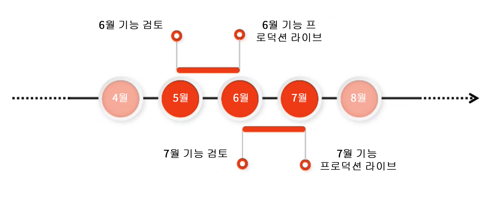

# Adobe Experience Manager as a Cloud Service 프리릴리스 채널 {#prerelease-channel}

프리릴리스 채널을 사용하여 AEM as a Cloud Service에 대한 예정된 기능을 미리 보는 방법에 대해 알아보십시오.

## 소개 {#introduction}

Adobe Experience Manager as a Cloud Service는 [Experience Manager 릴리스 로드맵](https://experienceleague.adobe.com/docs/experience-manager-release-information/aem-release-updates/update-releases-roadmap.html#aem-as-cloud-service)에 따라 정기적으로 새로운 기능을 제공합니다.

다음 기능 릴리스에서 실행할 예정인 기능에 익숙해지려면 개발 환경 또는 원하는 샌드박스 환경을 구성하여 액세스할 수 있는 프리릴리스 채널을 구독하면 됩니다. AEM UI를 통해 변경 내용을 미리 볼 수 있으며 새 프리릴리스 API에 대해 코드를 작성할 수 있습니다.

지정된 기능 릴리스에 대한 프리릴리스 기능 목록은 [릴리스 정보](/help/release-notes/release-notes-cloud/release-notes-current.md)에 게시됩니다.

## AEM as a Cloud Service 릴리스 {#releases}

AEM as a Cloud Service에는 두 가지 유형의 릴리스가 있습니다.

* **기능 릴리스**&#x200B;에서는 활성화 시 AEM as a Cloud Service에 기능이 추가됩니다.
* **유지 관리 릴리스**&#x200B;에는 보안 업데이트, 성능 향상 및 버그 수정이 추가되며 정기적으로 자주 적용됩니다.

이러한 패턴으로 서비스 중단 없이 지속적인 릴리스가 이루어집니다.

프리릴리스 채널을 사용하면 다가오는 기능 릴리스에 예정된 기능을 미리 확인하여 예정된 기능을 평가하고 프로젝트에 대해 가능한 구현을 계획할 수 있습니다. 이를 통해 다음 기능 릴리스를 미리 계획할 수 있습니다.

예를 들어 지금이 5월이고 프리릴리스 채널을 구독 중인 경우 다가오는 6월 릴리스의 기능을 미리 평가할 수 있습니다.



프리릴리스는 다가오는 AEMaaCS 기능에 대한 1개월의 롤링 기간을 제공하므로, 새로운 기능이 프로젝트 및 맞춤화에 미치는 영향을 평가하고 이러한 기능, 테스트 및 사용자 교육의 개시를 계획할 수 있습니다.

프리릴리스 채널을 효과적으로 활용하는 방법은 4단계로 구성되어 있습니다.

1. [달력 표시](#mark-calendars)
1. [릴리스 정보 검토](#release-notes)
1. [새로운 기능 액세스 및 사용](#new-features)
1. [사용자 교육](#train-users)

## 달력 표시 {#mark-calendars}

기능 릴리스는 미리 일정이 예정되어 있으며 기능 릴리스 활성화 날짜는 [Adobe Experience League](https://experienceleague.adobe.com/docs/experience-manager-release-information/aem-release-updates/update-releases-roadmap.html#aem-as-cloud-service)에 게시됩니다.

예정된 기능을 검토하고 테스트할 시간을 계획할 수 있도록 릴리스 날짜를 기록해 두십시오.

## 릴리스 정보 검토 {#release-notes}

달력에 릴리스 날짜를 표시해 두었다면 릴리스 당일 [Adobe Experience League](/help/release-notes/release-notes-cloud/release-notes-current.md) 웹 사이트에서 최신 릴리스 정보를 확인하십시오.

각 릴리스에는 해당 릴리스의 새로운 기능뿐만 아니라 프리릴리스 평가에 사용할 수 있는 기능을 문서화한 릴리스 정보가 함께 제공됩니다. 미리 알아본 정보로 AEMaaCS의 최신 기능을 활용할 계획을 세워 보십시오.

또한 각 릴리스와 함께 게시되는 [알려진 문제](/help/release-notes/maintenance/latest.md)를 확인하여 새로운 기능의 평가 및 최종 채택에 문제가 될 수 있는 기술적 문제에 대해 알아볼 수도 있습니다.

## 프리릴리스 채널을 활성화하여 새로운 기능 액세스 및 사용 {#new-features}

프리릴리스 채널은 모든 개발 또는 샌드박스 환경에서 활성화할 수 있습니다. 스테이징 또는 프로덕션 환경에서는 프리릴리스를 활성화할 수 없습니다.

다음과 같이 다양한 방식으로 프리릴리스 기능을 경험할 수 있습니다.

* [클라우드 환경](#cloud-environments)
* [로컬 SDK](#local-sdk)

### 클라우드 환경 {#cloud-environments}

클라우드 환경을 업데이트하여 프리릴리스를 사용하려면 새 환경 변수를 추가해야 합니다. Cloud Manager UI를 사용하거나 CLI를 통해 이 작업을 수행할 수 있습니다.

#### UI를 사용하여 환경 변수 추가 {#add-with-ui}

1. [my.cloudmanager.adobe.com](https://my.cloudmanager.adobe.com/)에서 Cloud Manager에 로그인한 다음 적절한 조직을 선택합니다.

1. 프리릴리스를 활성화할 프로그램으로 이동합니다.

1. 프리릴리스를 활성화하고자 하는 환경을 선택한 다음 **프로그램** > **환경** > **환경 구성**&#x200B;을 통해 해당 구성에 액세스합니다.

1. 새 [환경 변수](../implementing/cloud-manager/environment-variables.md)를 추가합니다.

   | 이름 | 값 | 적용된 서비스 | 유형 |
   |------|-------|-----------------|------|
   | `AEM_RELEASE_CHANNEL` | `prerelease` | 모두 | 변수 |

1. 변경 내용을 저장하면 환경은 프리릴리스 기능 전환이 활성화되며 새로 고침됩니다.

   

#### CLI를 사용하여 환경 변수 추가 {#add-with-cli}

Cloud Manager API 및 CLI를 사용하여 환경 변수를 업데이트할 수도 있습니다.

* [Cloud Manager API의 환경 변수 엔드포인트](https://developer.adobe.com/experience-cloud/cloud-manager/reference/api/#operation/patchEnvironmentVariables)를 사용하여 `AEM_RELEASE_CHANNEL` 환경 변수를 `prerelease` 값으로 설정합니다.

   ```text
   PATCH /program/{programId}/environment/{environmentId}/variables
   [
           {
                   "name" : "AEM_RELEASE_CHANNEL",
                   "value" : "prerelease",
                   "type" : "string"
           }
   ]
   ```

* [Cloud Manager CLI](https://github.com/adobe/aio-cli-plugin-cloudmanager#aio-cloudmanagerset-environment-variables-environmentid)를 사용할 수도 있습니다.

   ```shell
   aio cloudmanager:environment:set-variables <ENVIRONMENT_ID> --programId=<PROGRAM_ID> --variable AEM_RELEASE_CHANNEL “prerelease
   ```

환경을 정기적인(비 프리릴리스) 채널의 비헤이비어로 복원하고자 하는 경우 변수를 삭제하거나 다른 값으로 다시 설정할 수 있습니다.

### 로컬 SDK {#local-sdk}

Maven 프로젝트에서 Maven Central에 위치한 프리릴리스 `API Jar`를 참조하도록 구성하여 로컬 SDK 빠른 시작에 있는 사이트 콘솔의 새 기능 및 프리릴리스의 새 API에 대한 코드를 확인할 수 있습니다. 또한 프리릴리스 모드에서 일반 SDK 빠른 시작을 시작하여 이들 프리릴리스 기능을 로컬 개발 환경에서도 확인할 수 있습니다.

#### 프리릴리스 모드에서 SDK 빠른 시작 {#prerelease-mode}

1. [AEM as a Cloud Service SDK에 액세스](/help/implementing/developing/introduction/aem-as-a-cloud-service-sdk.md)에 설명된 바와 같이 소프트웨어 배포 포털에서 SDK를 다운로드한 다음 설치합니다.
1. SDK 빠른 시작을 실행하면 인수 `-r prerelease`를 포함합니다.

값은 고정되므로 처음 시작할 때만 선택할 수 있습니다. SDK를 다시 설치하여 명령줄 옵션을 변경합니다.

월별 기능 릴리스 간에는 여러 AEM 유지 관리 릴리스가 있으므로 이들 새 SDK를 다운로드하고 Maven 프로젝트에 새 SDK API Jar 버전을 참조할 수 있습니다. 유지 관리 릴리스에는 프리릴리스 기능이 추가되지 않지만 버그 수정, 보안 수정 및 성능 개선과 같은 사소한 변경 내용이 포함될 수 있습니다.
JavaDoc은 Maven Central에 게시됩니다.

#### 프리릴리스 SDK에 대해 구축 {#build-sdk}

1. Maven 프로젝트의 `pom.xml`을 수정하고 Maven Central에 게시되는 개별 프리릴리스 SDK API Jar를 참조합니다. 여기에는 프리릴리스 기능에 대한 새 Java API가 포함되어 있으며 이는 SDK API Jar에 종속됩니다. 동일한 버전을 사용합니다.

   예를 들어 상위 pom의 종속성 관리 섹션에 일반 API Jar를 참조하는 스니펫이 있다고 가정해 보겠습니다.

   ```
   <dependencyManagement>
    <dependencies>
        <dependency>
            <groupId>com.adobe.aem</groupId>
            <artifactId>aem-sdk-api</artifactId>
            <version>${aem.sdk.api}</version>
            <scope>provided</scope>
        </dependency>
   ```

   모듈의 사용은 다음과 같습니다.

   ```
    <dependencies>
     <dependency>
         <groupId>com.adobe.aem</groupId>
         <artifactId>aem-sdk-api</artifactId>
     </dependency>
   ```

   프리릴리스 SDK를 변경하려면 아래의 설명처럼 `com.adobe.aem:aem-sdk-api`에서 `com.adobe.aem:aem-prerelease-sdk-api`로 종속성을 변경하기만 하면 됩니다.

   ```
   <dependencyManagement>
    <dependencies>
      <dependency>
            <groupId>com.adobe.aem</groupId>
            <artifactId>aem-prerelease-sdk-api</artifactId>
            <version>${aem.sdk.api}</version>
            <scope>provided</scope>
      </dependency>
   <dependencies>
      <dependency>
         <groupId>com.adobe.aem</groupId>
         <artifactId>aem-prerelease-sdk-api</artifactId>
      </dependency>
   ```

   평소와 같이 개별 프로젝트에서는 종속성을 사용할 수 있습니다.

1. 로컬 서버에 배포.

1. 로컬에서 의도한 대로 작동하는 경우 개발 분기에 코드를 커밋하고 Cloud Manager 비프로덕션 파이프라인을 사용하여 프리릴리스 채널을 구독하는 환경에 배포합니다.

>[!CAUTION]
> 
> 스테이지 및 프로덕션에 배포 시 `aem-prerelease-sdk-api` artifactId를 사용해야 합니다. 프로덕션 파이프라인을 통해 배포 시 항상 `aem-sdk-api`를 사용하십시오. 마찬가지로 프리릴리스 API를 참조하는 코드는 프로덕션 파이프라인을 통해 배포할 수 없습니다.

[AEM CS SDK Build Analyzer Maven 플러그인 v1.0 이상](https://experienceleague.adobe.com/docs/experience-manager-core-components/using/developing/archetype/build-analyzer-maven-plugin.html#developing)은 종속성 검사를 통해 프로젝트에서 프리릴리스 API가 사용되는지 감지합니다. 분석기가 사용을 감지하면 프리릴리스 SDK API를 사용하여 프로젝트를 분석합니다.

## 사용자 교육 {#train-users}

프리릴리스 채널에서 새로운 기능을 테스트하고 이를 프로젝트에 활용하기로 결정했다면 사용자를 교육해야 합니다.

Adobe Experience League는 AEMaaCS에 대해 알아볼 수 있는 많은 리소스를 제공합니다.

* [AEMaaCS 설명서](https://experienceleague.adobe.com/docs/experience-manager-cloud-service.html)
* [튜토리얼](https://experienceleague.adobe.com/docs/experience-manager-learn/aem-tutorials/overview.html)
* 릴리스 정보 [월별 릴리스 개요 비디오](/help/release-notes/release-notes-cloud/release-notes-current.md#release-video)

## 고려 사항 {#considerations}

다음은 프리릴리스 채널 사용 시 알아 두어야 할 몇 가지 항목입니다.

* 프리릴리스 채널에 다음 릴리스에서 출시될 모든 새로운 기능이 반드시 포함되는 것은 아닙니다.
* 프리릴리스에 있는 기능은 엄격한 품질 보증을 통해 출시되며 Beta 품질이 아닌 완전한 품질을 갖춘 기능을 제공하기 위해 설계되었습니다. 문제가 발생하는 경우 정규 AEM 릴리스의 기능에서 버그가 의심되는 경우와 마찬가지로 보고하십시오.
* 환경이 프리릴리스 채널에 대해 구성되는지 파악하려면 AEM 콘솔의 **정보** 페이지로 이동하여 AEM 버전 번호에 ```Adobe Experience Manager 2021.4.5226.20210427T070726Z-210429-PRERELEASE```와 같이 *프리릴리스* 접미사가 포함되는지 확인하십시오.


