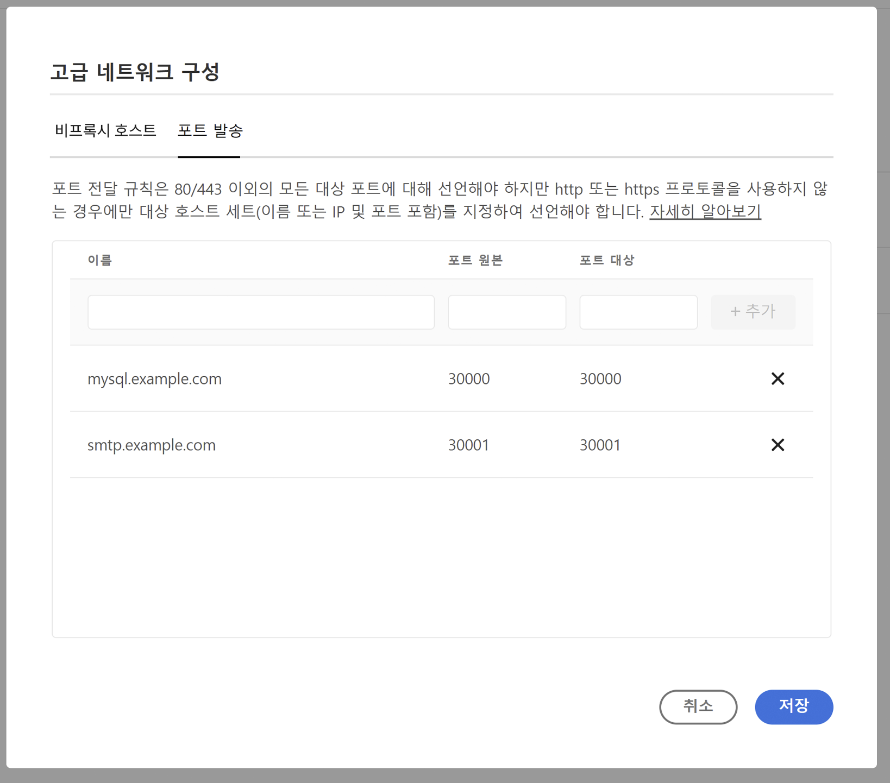

# AEM as a Cloud Service에 대한 고급 네트워킹 구성 {#configuring-advanced-networking}

이 문서에서는 VPN의 셀프서비스 및 API 프로비저닝, 비표준 포트 및 전용 이그레스 IP 주소를 포함하여 AEM as a Cloud Service의 다양한 고급 네트워킹 기능에 대해 소개합니다.

>[!TIP]
>
>이 문서 외에도 이 [위치](https://experienceleague.adobe.com/ko/docs/experience-manager-learn/cloud-service/networking/advanced-networking)의 각 고급 네트워킹 옵션을 안내하도록 고안된 일련의 튜토리얼도 있습니다.

## 개요 {#overview}

AEM as a Cloud Service는 다음과 같은 고급 네트워킹 옵션을 제공합니다.

* [유연한 포트 이그레스](#flexible-port-egress) - 비표준 포트에서 아웃바운드 트래픽을 허용하도록 AEM as a Cloud Service를 구성합니다.
* [전용 이그레스 IP 주소](#dedicated-egress-ip-address) - AEM as a Cloud Service의 트래픽을 고유 IP에서 생성되도록 구성합니다.
* [VPN (Virtual Private Network)](#vpn) - VPN이 있는 경우, 인프라와 AEM as a Cloud Service 간의 트래픽을 보호합니다.

이 문서에서는 Cloud Manager UI와 API를 사용하여 구성하는 방법을 설명하기에 앞서 이러한 각 옵션 및 해당 옵션을 사용하는 이유를 자세히 설명합니다. 이 문서는 몇 가지 고급 사용 사례로 마무리됩니다.

>[!CAUTION]
>
>이전 전용 이그레스 기술이 이미 프로비저닝되어 있고 이러한 고급 네트워킹 옵션 중 하나를 구성하려면 [Adobe 고객 지원 센터에 문의](https://experienceleague.adobe.com/?support-solution=Experience+Manager#home)하십시오.
>
>이전 이그레스 기술을 사용하여 고급 네트워킹을 구성하려고 하면 사이트 연결에 영향을 미칠 수 있습니다.

### 요구 사항 및 제한 사항 {#requirements}

고급 네트워킹 기능을 구성할 때는 다음 제한 사항이 적용됩니다.

* 프로그램은 단일 고급 네트워킹 옵션(유연한 포트 이그레스, 전용 이그레스 IP 주소 또는 VPN)을 프로비저닝할 수 있습니다.
* [샌드박스 프로그램](/help/implementing/cloud-manager/getting-access-to-aem-in-cloud/program-types.md)에서는 고급 네트워킹을 사용할 수 없습니다.
* 사용자가 프로그램에 네트워크 인프라를 추가하고 구성하려면 **관리자** 역할을 보유하고 있어야 합니다.
* 프로그램에 네트워크 인프라를 추가하려면 우선 프로덕션 환경을 만들어야 합니다.
* 네트워크 인프라는 프로덕션 환경의 기본 지역과 동일한 지역에 있어야 합니다.
   * 프로덕션 환경에 [추가 게시 지역](/help/implementing/cloud-manager/manage-environments.md#multiple-regions)이 있는 경우, 각 추가 지역을 미러링하는 다른 네트워크 인프라를 만들 수 있습니다.
   * 프로덕션 환경에서 구성된 최대 지역 수보다 더 많은 네트워크 인프라를 만들 수 없습니다.
   * 프로덕션 환경에서 사용 가능한 지역 수만큼 네트워크 인프라를 정의할 수 있지만, 새 인프라는 이전에 만든 인프라와 동일한 유형이어야 합니다.
   * 여러 인프라를 만들 때 고급 네트워킹 인프라가 만들어지지 않은 지역에서만 선택할 수 있습니다.

### 고급 네트워킹 구성 및 활성화 {#configuring-enabling}

고급 네트워킹 기능을 사용하려면 다음 두 단계가 필요합니다.

1. [유연한 포트 이그레스,](#flexible-port-egress) [전용 이그레스 IP 주소,](#dedicated-egress-ip-address) 또는 [VPN](#vpn) 여부에 관계없이 고급 네트워킹 옵션은 먼저 프로그램 수준에서 구성해야 합니다.
1. 사용하려면 [환경 수준에서 고급 네트워킹 옵션을 활성화](#enabling)해야 합니다.

두 단계 모두 Cloud Manager UI나 Cloud Manager API를 사용하여 수행할 수 있습니다.

* Cloud Manager UI를 사용하는 경우에는 프로그램 수준에서 마법사를 사용하여 고급 네트워크 구성을 만든 다음 구성을 활성화하려는 각 환경을 편집하는 것을 의미합니다.

* Cloud Manager API를 사용하는 경우, 프로그램 수준에서 `/networkInfrastructures` API 엔드포인트가 호출되어 원하는 고급 네트워킹 유형을 선언합니다. 그런 다음 각 환경에 대해 `/advancedNetworking` 엔드포인트가 호출되어 인프라를 활성화하고 환경별 매개변수를 구성합니다.

## 유연한 포트 이그레스 {#flexible-port-egress}

이 고급 네트워킹 기능을 사용하면 기본적으로 열려 있는 HTTP(포트 80) 및 HTTPS(포트 443) 이외의 포트를 통해 이그레스 트래픽에 AEM as a Cloud Service를 구성할 수 있습니다.

>[!TIP]
>
>유연한 포트 이그레스와 전용 이그레스 IP 주소 사이에서 결정할 때, 특정 IP 주소가 필요하지 않은 경우 유연한 포트 이그레스를 선택하는 것이 좋습니다. Adobe에서 유연한 포트 이그레스 트래픽의 성능을 최적화할 수 있기 때문입니다.

>[!NOTE]
>
>일단 생성되면 유연한 포트 이그레스 인프라 유형을 편집할 수 없습니다. 구성 값을 변경하는 유일한 방법은 해당 값을 삭제한 다음 다시 만드는 것입니다.

### UI 구성 {#configuring-flexible-port-egress-provision-ui}

1. [my.cloudmanager.adobe.com](https://my.cloudmanager.adobe.com/)에서 Cloud Manager에 로그인한 다음 적절한 조직을 선택합니다.

1. **[내 프로그램](/help/implementing/cloud-manager/navigation.md#my-programs)** 콘솔에서 프로그램을 선택합니다.

1. **프로그램 개요** 페이지에서 **환경** 탭으로 이동한 다음, 왼쪽 패널에서 **네트워크 인프라**&#x200B;를 선택합니다.

   

1. **네트워크 인프라 추가** 마법사에서 **유연한 포트 이그레스** 및 **지역** 드롭다운 메뉴에서 생성해야 하는 지역을 선택한 다음 **계속**&#x200B;을 클릭합니다.

   

1. **확인** 탭에는 선택 사항과 다음 단계가 요약되어 있습니다. 인프라를 만들려면 **저장**&#x200B;을 클릭합니다.

   

인프라 유형, 상태, 지역 및 활성화된 환경에 대한 세부 정보를 포함하여 사이드 패널의 **네트워크 인프라** 제목 아래에 새 레코드가 표시됩니다.


>[!NOTE]
>
>유연한 포트 이그레스의 인프라를 생성하는 데 최대 한 시간이 걸릴 수 있으며, 그 후 환경 수준에서 구성할 수 있습니다.

### API 구성 {#configuring-flexible-port-egress-provision-api}

프로그램당 한 번씩 POST `/program/<programId>/networkInfrastructures` 엔드포인트가 호출되어 `kind` 매개변수 및 지역에 대한 `flexiblePortEgress` 값이 간단히 전달됩니다. 해당 엔드포인트는 `network_id`와 상태 등의 기타 정보에 응답합니다.

호출되면 네트워킹 인프라가 프로비저닝되는 데 일반적으로 약 15분이 소요됩니다. Cloud Manager의 [네트워크 인프라 GET 엔드포인트](https://developer.adobe.com/experience-cloud/cloud-manager/reference/api/#operation/getNetworkInfrastructure) 호출은 **준비됨** 상태로 표시됩니다.

>[!TIP]
>
>전체 매개변수 세트, 정확한 구문 및 나중에 변경할 수 없는 매개변수와 같은 중요한 정보는 [API 문서에서 참조할 수 있습니다.](https://developer.adobe.com/experience-cloud/cloud-manager/reference/api/#operation/createNetworkInfrastructure)

### 트래픽 라우팅 {#flexible-port-egress-traffic-routing}

80 또는 443 이외의 포트로 이동하는 HTTP 또는 HTTPS 트래픽의 경우 다음 호스트 및 포트 환경 변수를 사용하여 프록시를 구성해야 합니다.

* HTTP: `AEM_PROXY_HOST` / `AEM_HTTP_PROXY_PORT ` (`proxy.tunnel:3128`로 기본값 설정(AEM 릴리스) &lt; 6094)
* HTTPS: `AEM_PROXY_HOST` / `AEM_HTTPS_PROXY_PORT ` (`proxy.tunnel:3128`로 기본값 설정(AEM 릴리스) &lt; 6094)

`www.example.com:8443`으로 요청을 전송하는 샘플 코드로 예를 들어 보겠습니다.

```java
String url = "www.example.com:8443"
String proxyHost = System.getenv().getOrDefault("AEM_PROXY_HOST", "proxy.tunnel");
int proxyPort = Integer.parseInt(System.getenv().getOrDefault("AEM_HTTPS_PROXY_PORT", "3128"));
HttpClient client = HttpClient.newBuilder()
      .proxy(ProxySelector.of(new InetSocketAddress(proxyHost, proxyPort)))
      .build();
 
HttpRequest request = HttpRequest.newBuilder().uri(URI.create(url)).build();
HttpResponse<String> response = client.send(request, BodyHandlers.ofString());
```

비표준 Java™ 네트워킹 라이브러리를 사용하는 경우 모든 트래픽에 대해 위의 속성을 사용하여 프록시를 구성할 수 있습니다.

`portForwards` 매개변수에 선언된 포트를 통한 대상이 있는 비 HTTP/S 트래픽은 매핑된 포트와 함께 `AEM_PROXY_HOST`라는 속성을 참조해야 합니다. 예:

```java
DriverManager.getConnection("jdbc:mysql://" + System.getenv("AEM_PROXY_HOST") + ":53306/test");
```

아래 표에서는 트래픽 라우팅에 대해 설명합니다.

<table>
<thead>
  <tr>
    <th>트래픽</th>
    <th>대상 조건</th>
    <th>포트</th>
    <th>연결</th>
    <th>외부 대상 예</th>
  </tr>
</thead>
<tbody>
  <tr>
    <td><b>HTTP 또는 HTTPS 프로토콜</b></td>
    <td>표준 HTTP/S 트래픽</td>
    <td>80 또는 443</td>
    <td>허용됨</td>
    <td></td>
  </tr> 
  <tr>
    <td></td>
    <td>다음 환경 변수 및 프록시 포트 번호를 사용하여 구성된 HTTP 프록시를 통한 80 또는 443 이외의 포트의 비표준 트래픽. Cloud Manager API 호출의 portForwards 매개변수에서 대상 포트를 선언하지 마십시오.<br><ul>
     <li>AEM_PROXY_HOST (`proxy.tunnel`로 기본값 설정(AEM 릴리스) &lt; 6094)</li>
     <li>AEM_HTTPS_PROXY_PORT (포트 3128로 기본값 설정(AEM 릴리스) &lt; 6094)</li>
    </ul>
    <td>80 또는 443 이외의 포트</td>
    <td>허용됨</td>
    <td>example.com:8443</td>
  </tr>
  <tr>
    <td></td>
    <td>HTTP 프록시를 사용하지 않는 포트 80 또는 443 이외의 다른 포트의 비표준 트래픽</td>
    <td>80 또는 443 이외의 포트</td>
    <td>차단됨</td>
    <td></td>
  </tr>
  <tr>
    <td><b>비 HTTP 또는 비 HTTPS</b></td>
    <td>클라이언트가 <code>portForwards</code> API 매개변수에서 선언된 <code>portOrig</code>를 사용하여 <code>AEM_PROXY_HOST</code> 환경 변수를 연결합니다.</td>
    <td>임의</td>
    <td>허용됨</td>
    <td><code>mysql.example.com:3306</code></td>
  </tr>
  <tr>
    <td></td>
    <td>기타</td>
    <td>임의</td>
    <td>차단됨</td>
    <td><code>db.example.com:5555</code></td>
  </tr>
</tbody>
</table>

#### Apache/Dispatcher 구성 {#apache-dispatcher}

위에서 설명한 속성을 사용하여 AEM Cloud Service Apache/Dispatcher 계층의 `mod_proxy` 지시문을 구성할 수 있습니다.

```
ProxyRemote "http://example.com:8080" "http://${AEM_PROXY_HOST}:3128"
ProxyPass "/somepath" "http://example.com:8080"
ProxyPassReverse "/somepath" "http://example.com:8080"
```

```
SSLProxyEngine on //needed for https backends
 
ProxyRemote "https://example.com:8443" "http://${AEM_PROXY_HOST}:3128"
ProxyPass "/somepath" "https://example.com:8443"
ProxyPassReverse "/somepath" "https://example.com:8443"
```

## 전용 이그레스 IP 주소 {#dedicated-egress-ip-address}

전용 IP 주소를 사용하면 CRM 공급업체와 같은 SaaS 공급업체 또는 IP 주소 허용 목록을 제공하는 AEM as a Cloud Service 외부의 다른 통합과 통합 시 보안을 강화할 수 있습니다. 전용 IP 주소를 허용 목록에 추가하면 AEM Cloud Service의 트래픽만 외부 서비스로 연결되도록 허용할 수 있습니다. 다른 허용된 IP의 트래픽도 포함됩니다.

동일한 전용 IP가 프로그램의 모든 환경에 적용되며 작성자 및 게시 서비스 모두에 적용됩니다.

전용 IP 주소 기능을 활성화하지 않으면 AEM as a Cloud Service의 트래픽이 다른 AEM as a Cloud Service 고객과 공유된 IP 집합을 통해 흐릅니다.

전용 이그레스 IP 주소의 구성은 [유연한 포트 이그레스와 유사합니다.](#flexible-port-egress) 주요 차이점은 구성한 후에 트래픽이 항상 전용 고유 IP에서 이그레스된다는 것입니다. 해당 IP를 찾으려면 DNS Resolver를 사용하여 `p{PROGRAM_ID}.external.adobeaemcloud.com`과 연계된 IP 주소를 식별하십시오. 해당 IP 주소는 변경되지 않지만 변경해야 하는 경우 고급 알림이 제공됩니다.

>[!TIP]
>
>유연한 포트 이그레스와 전용 이그레스 IP 주소 사이에서 결정할 때, 특정 IP 주소가 필요하지 않은 경우 유연한 포트 이그레스를 선택하십시오. Adobe에서 유연한 포트 이그레스 트래픽의 성능을 최적화할 수 있기 때문입니다.

>[!NOTE]
>
>2021년 9월 30일 이전(즉, 2021년 9월 릴리스 이전)에 전용 이그레스 IP로 프로비저닝된 경우, 전용 이그레스 IP 기능은 HTTP 및 HTTPS 포트만 지원합니다.
>
>여기에는 암호화 시 HTTP/1.1 및 HTTP/2가 포함됩니다. 또한 하나의 전용 이그레스 엔드포인트는 각각 포트 80/443에서 HTTP/HTTPS를 통해서만 대상과 통신할 수 있습니다.

>[!NOTE]
>
>생성되면 전용 이그레스 IP 주소의 인프라 유형을 편집할 수 없습니다. 구성 값을 변경하는 유일한 방법은 해당 값을 삭제한 다음 다시 만드는 것입니다.

>[!INFO]
>
>전용 이그레스 IP가 구성된 경우 Splunk 전달에서는 동적 이그레스 범위를 계속 사용합니다. 전용 이그레스 IP를 사용하도록 Splunk 전달을 구성할 수 없습니다.

### UI 구성 {#configuring-dedicated-egress-provision-ui}

1. [my.cloudmanager.adobe.com](https://my.cloudmanager.adobe.com/)에서 Cloud Manager에 로그인한 다음 적절한 조직을 선택합니다.

1. **[내 프로그램](/help/implementing/cloud-manager/navigation.md#my-programs)** 콘솔에서 프로그램을 선택합니다.

1. **프로그램 개요** 페이지에서 **환경** 탭으로 이동한 다음, 왼쪽 패널에서 **네트워크 인프라**&#x200B;를 선택합니다.

   

1. 시작하는 **네트워크 인프라 추가** 마법사에서 **전용 이그레스 IP 주소** 및 **지역** 드롭다운 메뉴에서 생성해야 하는 지역을 선택한 다음 **계속**&#x200B;을 클릭합니다.

   

1. **확인** 탭에는 선택 사항과 다음 단계가 요약되어 있습니다. 인프라를 만들려면 **저장**&#x200B;을 클릭합니다.

   

인프라 유형, 상태, 지역 및 활성화된 환경에 대한 세부 정보를 포함하여 사이드 패널의 **네트워크 인프라** 제목 아래에 새 레코드가 표시됩니다.


>[!NOTE]
>
>유연한 포트 이그레스의 인프라를 생성하는 데 최대 한 시간이 걸릴 수 있으며, 그 후 환경 수준에서 구성할 수 있습니다.

### API 구성 {#configuring-dedicated-egress-provision-api}

프로그램당 한 번씩 POST `/program/<programId>/networkInfrastructures` 엔드포인트가 호출되어 `kind` 매개변수 및 지역에 대한 `dedicatedEgressIp` 값이 간단히 전달됩니다. 해당 엔드포인트는 `network_id`와 상태 등의 기타 정보에 응답합니다.

호출되면 네트워킹 인프라가 프로비저닝되는 데 일반적으로 약 15분이 소요됩니다. Cloud Manager의 [네트워크 인프라 GET 엔드포인트](https://developer.adobe.com/experience-cloud/cloud-manager/reference/api/#operation/getNetworkInfrastructure) 호출은 **준비됨** 상태로 표시됩니다.

>[!TIP]
>
>전체 매개변수 세트, 정확한 구문 및 나중에 변경할 수 없는 매개변수와 같은 중요한 정보는 [API 문서에서 참조할 수 있습니다.](https://developer.adobe.com/experience-cloud/cloud-manager/reference/api/#operation/createNetworkInfrastructure)

### 트래픽 라우팅 {#dedicated-egress-ip-traffic-routing}

프록시 구성에 표준 Java™ 시스템 속성을 사용하는 경우 http 또는 https 트래픽은 사전 구성된 프록시를 통해 전달됩니다.

`portForwards` 매개변수에 선언된 포트를 통한 대상이 있는 비 HTTP/S 트래픽은 매핑된 포트와 함께 `AEM_PROXY_HOST`라는 속성을 참조해야 합니다. 예:

```java
DriverManager.getConnection("jdbc:mysql://" + System.getenv("AEM_PROXY_HOST") + ":53306/test");
```

<table>
<thead>
  <tr>
    <th>트래픽</th>
    <th>대상 조건</th>
    <th>포트</th>
    <th>연결</th>
    <th>외부 대상 예</th>
  </tr>
</thead>
<tbody>
  <tr>
    <td><b>HTTP 또는 HTTPS 프로토콜</b></td>
    <td>Azure(*.windows.net) 또는 Adobe 서비스로의 트래픽</td>
    <td>임의</td>
    <td>전용 IP가 아닌 공유 클러스터 IP를 통해</td>
    <td>adobe.io<br>api.windows.net</td>
  </tr>
  <tr>
    <td></td>
    <td><code>nonProxyHosts</code> 매개변수와 일치하는 호스트</td>
    <td>80 또는 443</td>
    <td>공유 클러스터 IP를 통해</td>
    <td></td>
  </tr>
  <tr>
    <td></td>
    <td><code>nonProxyHosts</code> 매개변수와 일치하는 호스트</td>
    <td>80 또는 443 이외의 포트</td>
    <td>차단됨</td>
    <td></td>
  </tr>
  <tr>
    <td></td>
    <td>기본적으로 표준 Java™ HTTP 클라이언트 라이브러리를 사용하여 HTTP/S 트래픽에 대해 구성되는 HTTP 프록시 구성을 통해</td>
    <td>임의</td>
    <td>전용 이그레스 IP를 통해</td>
    <td></td>
  </tr>
  <tr>
    <td></td>
    <td>HTTP 프록시 구성 무시(예: 표준 Java™ HTTP 클라이언트 라이브러리에서 명시적으로 제거된 경우 또는 표준 프록시 구성을 무시하는 Java™ 라이브러리를 사용하는 경우)</td>
    <td>80 또는 443</td>
    <td>공유 클러스터 IP를 통해</td>
    <td></td>
  </tr>
  <tr>
    <td></td>
    <td>HTTP 프록시 구성 무시(예: 표준 Java™ HTTP 클라이언트 라이브러리에서 명시적으로 제거된 경우 또는 표준 프록시 구성을 무시하는 Java™ 라이브러리를 사용하는 경우)</td>
    <td>80 또는 443 이외의 포트</td>
    <td>차단됨</td>
    <td></td>
  </tr>
  <tr>
    <td><b>비 HTTP 또는 비 HTTPS</b></td>
    <td>클라이언트가 <code>portForwards</code> API 매개변수에서 선언된 <code>portOrig</code>를 사용하여 <code>AEM_PROXY_HOST</code> 환경 변수 연결</td>
    <td>임의</td>
    <td>전용 이그레스 IP를 통해</td>
    <td><code>mysql.example.com:3306</code></td>
  </tr>
  <tr>
    <td></td>
    <td>기타</td>
    <td></td>
    <td>차단됨</td>
    <td></td>
  </tr>
</tbody>
</table>

### 기능 사용 {#feature-usage}

해당 기능은 프록시 구성에 표준 Java™ 시스템 속성을 사용하는 경우 아웃바운드 트래픽을 생성하는 Java™ 코드 또는 라이브러리와 호환됩니다. 따라서 가장 일반적인 라이브러리가 포함되어야 합니다.

다음은 코드 샘플입니다.

```java
public JSONObject getJsonObject(String relativePath, String queryString) throws IOException, JSONException {
  String relativeUri = queryString.isEmpty() ? relativePath : (relativePath + '?' + queryString);
  URL finalUrl = endpointUri.resolve(relativeUri).toURL();
  URLConnection connection = finalUrl.openConnection();
  connection.addRequestProperty("Accept", "application/json");
  connection.addRequestProperty("X-API-KEY", apiKey);

  try (InputStream responseStream = connection.getInputStream(); Reader responseReader = new BufferedReader(new InputStreamReader(responseStream, Charsets.UTF_8))) {
    return new JSONObject(new JSONTokener(responseReader));
  }
}
```

일부 라이브러리는 프록시 구성에 표준 Java™ 시스템 속성을 사용하려면 명시적인 구성이 필요합니다.

[`HttpClientBuilder.useSystemProperties()`](https://hc.apache.org/httpcomponents-client-4.5.x/current/httpclient/apidocs/org/apache/http/impl/client/HttpClientBuilder.html)에 대한 명시적인 호출이 필요하거나 [`HttpClients.createSystem()`](https://hc.apache.org/httpcomponents-client-4.5.x/current/httpclient/apidocs/org/apache/http/impl/client/HttpClients.html#createSystem())을 사용하는 Apache HttpClient를 사용하는 예는 다음과 같습니다.

```java
public JSONObject getJsonObject(String relativePath, String queryString) throws IOException, JSONException {
  String relativeUri = queryString.isEmpty() ? relativePath : (relativePath + '?' + queryString);
  URL finalUrl = endpointUri.resolve(relativeUri).toURL();

  HttpClient httpClient = HttpClientBuilder.create().useSystemProperties().build();
  HttpGet request = new HttpGet(finalUrl.toURI());
  request.setHeader("Accept", "application/json");
  request.setHeader("X-API-KEY", apiKey);
  HttpResponse response = httpClient.execute(request);
  String result = EntityUtils.toString(response.getEntity());
}
```

### 디버깅 고려 사항 {#debugging-considerations}

예상되는 전용 IP 주소에 트래픽이 실제로 송신되는지 확인하려면 가능한 경우 대상 서비스의 로그를 확인하십시오. 그렇지 않으면 [https://ifconfig.me/ip](https://ifconfig.me/ip)와 같이 호출 IP 주소를 반환하는 디버깅 서비스를 호출하는 것이 유용할 수 있습니다.

## VPN (Virtual Private Network) {#vpn}

VPN을 사용하면 작성자, 게시 또는 미리보기 인스턴스에서 On-Premise 인프라 또는 데이터센터에 연결할 수 있습니다. 예를 들면 데이터베이스에 대한 액세스를 보호하는 데 유용할 수 있습니다. 또한 VPN을 사용하면 이를 지원하는 CRM 공급업체와 같은 SaaS 공급업체에 연결하거나 기업 네트워크에서 AEM as a Cloud Service 작성자, 미리보기 또는 게시 인스턴스에 연결할 수 있습니다.

대부분의 IPSec 기술이 내장된 VPN 디바이스가 지원됩니다. [이 디바이스 목록의 **RouteBased 구성 지침** 열에 기재된 정보를 참조하십시오.](https://learn.microsoft.com/ko-kr/azure/vpn-gateway/vpn-gateway-about-vpn-devices#devicetable) 표에 설명된 대로 디바이스를 구성합니다.

>[!NOTE]
>
>다음은 VPN 인프라에 대한 제한 사항입니다.
>
>* 지원은 단일 VPN 연결로 제한됩니다.
>* VPN 연결에는 Splunk 전달 기능을 사용할 수 없습니다.
>* 비공개 호스트 이름을 확인하려면 DNS Resolver가 게이트웨이 주소 공간에 나열되어야 합니다.

### UI 구성 {#configuring-vpn-ui}

1. [my.cloudmanager.adobe.com](https://my.cloudmanager.adobe.com/)에서 Cloud Manager에 로그인한 다음 적절한 조직을 선택합니다.

1. **[내 프로그램](/help/implementing/cloud-manager/navigation.md#my-programs)** 콘솔에서 프로그램을 선택합니다.

1. **프로그램 개요** 페이지에서 **환경** 탭으로 이동한 다음, 왼쪽 패널에서 **네트워크 인프라**&#x200B;를 선택합니다.

   

1. 시작하는 **네트워크 인프라 추가** 마법사에서 **Virtual private network**&#x200B;를 선택하고 필요한 정보를 입력한 다음 **계속**&#x200B;을 클릭합니다.

   * **지역** - 인프라를 만들어야 하는 지역입니다.
   * **주소 공간** - 주소 공간은 자체 공간에서 하나의 /26 CIDR(64 IP 주소) 또는 더 큰 IP 범위만 가능합니다.
      * 이 값은 나중에 변경할 수 없습니다.
   * **DNS 정보** - 원격 DNS Resolver 목록입니다.
      * DNS 서버 주소를 입력하여 다른 주소를 추가한 다음 `Enter`를 누릅니다.
      * 제거하려면 주소 뒤의 `X`를 클릭합니다.
   * **공유 키** - VPN 사전 공유 키입니다.
      * 값을 다시 확인하기 위해 키를 표시하려면 **Show shared key(공유 키 표시)**&#x200B;를 선택합니다.

   

1. 마법사의 **연결** 탭에서 **연결** 이름을 입력하여 VPN 연결을 확인하고 **연결 추가**&#x200B;를 클릭합니다.

   

1. **연결 추가** 대화 상자에서 VPN 연결을 정의한 다음 **저장**&#x200B;을 클릭합니다.

   * **연결 이름** - 이전 단계에서 제공한 VPN 연결의 설명적인 이름이며 여기에서 업데이트할 수 있습니다.
   * **주소** - VPN 디바이스 IP 주소입니다.
   * **주소 공간** - VPN을 통해 라우팅할 IP 주소 범위입니다.
      * 범위를 입력하여 다른 범위를 추가한 다음 `Enter`를 누릅니다.
      * 제거하려면 범위 뒤의 `X`를 클릭합니다.
   * **IP 보안 정책** - 필요에 따라 기본값에서 조정

   

1. 대화 상자가 닫히고 마법사의 **연결** 탭으로 돌아갑니다. **계속**&#x200B;을 클릭합니다.

   

1. **확인** 탭에는 선택 사항과 다음 단계가 요약되어 있습니다. 인프라를 만들려면 **저장**&#x200B;을 클릭합니다.

   

인프라 유형, 상태, 지역 및 활성화된 환경에 대한 세부 정보를 포함하여 사이드 패널의 **네트워크 인프라** 제목 아래에 새 레코드가 표시됩니다.

### API 구성 {#configuring-vpn-api}

프로그램당 한 번씩 POST `/program/<programId>/networkInfrastructures` 엔드포인트가 호출됩니다. 구성 정보의 페이로드를 전달합니다. 해당 정보는 `kind` 매개변수, 지역, 주소 공간(CIDR 목록 - 나중에 수정할 수 없음)에 대한 **vpn** 값, 고객 네트워크의 이름 확인을 위한 DNS Resolver를 포함합니다. 또한 게이트웨이 구성, 공유 VPN 키 및 IP 보안 정책과 같은 VPN 연결 정보도 포함합니다. 해당 엔드포인트는 `network_id`와 상태 등의 기타 정보에 응답합니다.

호출되면 네트워킹 인프라가 프로비저닝되는 데 일반적으로 45~60분이 소요됩니다. API의 GET 메서드를 호출하여 상태를 반환하고 `creating`에서 `ready`로 전환할 수 있습니다. 모든 상태에 대한 내용은 API 설명서를 참조하십시오.

>[!TIP]
>
>전체 매개변수 세트, 정확한 구문 및 나중에 변경할 수 없는 매개변수와 같은 중요한 정보는 [API 문서에서 참조할 수 있습니다.](https://developer.adobe.com/experience-cloud/cloud-manager/reference/api/#operation/createNetworkInfrastructure)

### 트래픽 라우팅 {#vpn-traffic-routing}

아래 표에서는 트래픽 라우팅에 대해 설명합니다.

<table>
<thead>
  <tr>
    <th>트래픽</th>
    <th>대상 조건</th>
    <th>포트</th>
    <th>연결</th>
    <th>외부 대상 예</th>
  </tr>
</thead>
<tbody>
  <tr>
    <td><b>HTTP 또는 HTTPS 프로토콜</b></td>
    <td>Azure 또는 Adobe 서비스로의 트래픽</td>
    <td>임의</td>
    <td>전용 IP가 아닌 공유 클러스터 IP를 통해</td>
    <td>adobe.io<br>api.windows.net</td>
  </tr>
  <tr>
    <td></td>
    <td><code>nonProxyHosts</code> 매개변수와 일치하는 호스트</td>
    <td>80 또는 443</td>
    <td>공유 클러스터 IP를 통해</td>
    <td></td>
  </tr>
  <tr>
    <td></td>
    <td><code>nonProxyHosts</code> 매개변수와 일치하는 호스트</td>
    <td>80 또는 443 이외의 포트</td>
    <td>차단됨</td>
    <td></td>
  </tr>
  <tr>
    <td></td>
    <td>IP가 <i>VPN 게이트웨이 주소</i> 공간 범위에 해당하는 경우, 기본적으로 표준 Java™ HTTP 클라이언트 라이브러리를 사용하여 HTTP/S 트래픽에 대해 구성되는 HTTP 프록시 구성을 통해</td>
    <td>임의</td>
    <td>VPN을 통해</td>
    <td><code>10.0.0.1:443</code><br>호스트 이름일 수도 있습니다.</td>
  </tr>
  <tr>
    <td></td>
    <td>IP가 <i>VPN 게이트웨이 주소 공간</i> 범위에 해당하지 않는 경우 기본적으로 표준 Java™ HTTP 클라이언트 라이브러리를 사용하여 HTTP/S 트래픽에 대해 구성되는 HTTP 프록시 구성을 통해</td>
    <td>임의</td>
    <td>전용 이그레스 IP를 통해</td>
    <td></td>
  </tr>
  <tr>
    <td></td>
    <td>HTTP 프록시 구성 무시(예: 표준 Java™ HTTP 클라이언트 라이브러리에서 명시적으로 제거된 경우 또는 표준 프록시 구성을 무시하는 Java™ 라이브러리를 사용하는 경우)
</td>
    <td>80 또는 443</td>
    <td>공유 클러스터 IP를 통해</td>
    <td></td>
  </tr>
  <tr>
    <td></td>
    <td>HTTP 프록시 구성 무시(예: 표준 Java™ HTTP 클라이언트 라이브러리에서 명시적으로 제거된 경우 또는 표준 프록시 구성을 무시하는 Java™ 라이브러리를 사용하는 경우)</td>
    <td>80 또는 443 이외의 포트</td>
    <td>차단됨</td>
    <td></td>
  </tr>
  <tr>
    <td><b>비 HTTP 또는 비 HTTPS</b></td>
    <td>IP가 <i>VPN 게이트웨이 주소 공간</i> 범위에 해당하고 클라이언트가 <code>portForwards</code> API 매개변수에서 선언된 <code>portOrig</code>를 사용하여 <code>AEM_PROXY_HOST</code> 환경 변수를 연결하는 경우</td>
    <td>임의</td>
    <td>VPN을 통해</td>
    <td><code>10.0.0.1:3306</code><br>호스트 이름일 수도 있습니다.</td>
  </tr>
  <tr>
    <td></td>
    <td>IP가 <i>VPN 게이트웨이 주소 공간</i> 범위에 해당하지 않고 클라이언트가 <code>portForwards</code> API 매개변수에서 선언된 <code>portOrig</code>를 사용하여 <code>AEM_PROXY_HOST</code> 환경 변수를 연결하는 경우</td>
    <td>임의</td>
    <td>전용 이그레스 IP를 통해</td>
    <td></td>
  </tr>
  <tr>
    <td></td>
    <td>기타</td>
    <td>임의</td>
    <td>차단됨</td>
    <td></td>
  </tr>
</tbody>
</table>

### 구성에 유용한 도메인 {#vpn-useful-domains-for-configuration}

아래 표에서는 구성 및 개발에 유용한 도메인 및 IP 집합에 대해 설명합니다.

<table>
<thead>
  <tr>
    <th>도메인 패턴</th>
    <th>AEM으로부터의 이그레스 의미</th>
    <th>AEM으로의 인그레스 의미</th>
  </tr>
</thead>
<tbody>
  <tr>
    <td><code>p{PROGRAM_ID}.external.adobeaemcloud.com</code></td>
    <td>비공개 네트워크를 통하지 않고 인터넷으로 이동하는 트래픽에 대한 전용 이그레스 IP 주소 </td>
    <td>VPN으로부터의 연결은 CDN에 이 IP로부터 오는 연결로 표시됩니다. VPN에서 AEM으로 이동하는 연결만 허용하려면 이 IP만 허용하고 그 외 다른 모든 IP는 차단하도록 Cloud Manager를 구성하십시오. 자세한 내용은 “VPN 연결 인그레스 제한” 섹션을 확인하십시오.</td>
  </tr>
  <tr>
    <td><code>p{PROGRAM_ID}.{REGION}-gateway.external.adobeaemcloud.com</code></td>
    <td>해당 사항 없음</td>
    <td>AEM측 VPN 게이트웨이의 IP입니다. 네트워크 엔지니어링 팀에서 이 IP를 사용하여 특정 IP 주소의 VPN 게이트웨이에 대한 VPN 연결만 허용할 수 있습니다. </td>
  </tr>
</tbody>
</table>

### VPN을 인그레스 연결로 제한 {#restrict-vpn-to-ingress-connections}

AEM으로의 VPN 액세스만 허용하려면 `p{PROGRAM_ID}.external.adobeaemcloud.com`에 의해 정의된 IP만 환경에 접근할 수 있도록 Cloud Manager에 환경 허용 목록을 구성해야 합니다. 이 작업은 Cloud Manager의 다른 IP 기반 허용 목록과 동일한 방식으로 수행할 수 있습니다.

규칙이 경로 기반이어야 하는 경우 Dispatcher 수준에서 표준 HTTP 지시문을 사용하여 특정 IP를 거부하거나 허용하십시오. 요청이 항상 도메인에 도착하도록 원하는 경로도 CDN에서 캐시할 수 없어야 합니다.

#### HTTPd 구성 예 {#httpd-example}

```
Order deny,allow
Deny from all
Allow from 192.168.0.1
Header always set Cache-Control private
```

## 환경에서 고급 네트워킹 구성 활성화 {#enabling}

프로그램에 대한 고급 네트워킹 옵션을 구성한 후에는 [유연한 포트 이그레스,](#flexible-port-egress) [전용 이그레스 IP 주소,](#dedicated-egress-ip-address) 또는 [VPN](#vpn)에 관계없이 이를 사용하려면 환경 수준에서 활성화해야 합니다.

환경에 대한 고급 네트워킹 구성을 활성화하면 옵션인 포트 전달 및 비프록시 호스트도 활성화할 수 있습니다. 유연성을 제공하기 위해 환경별로 매개변수를 구성할 수 있습니다.

* **포트 전달** - 80/443 이외의 모든 대상 포트에 대해 포트 전달 규칙을 선언해야 하지만 http 또는 https 프로토콜을 사용하지 않는 경우에만 해당됩니다.
   * 포트 전달 규칙은 대상 호스트 집합(이름이나 IP 및 포트)을 지정하여 정의됩니다.
   * http/https를 통해 포트 80/443을 사용하는 클라이언트 연결은 연결에 고급 네트워킹 속성을 적용하려면 연결 시 프록시 설정을 사용해야 합니다.
   * 각 대상 호스트에 대해 원하는 대상 포트를 30000에서 30999 사이의 포트에 매핑해야 합니다.
   * 포트 전달 규칙은 모든 고급 네트워킹 유형에 사용할 수 있습니다.

* **비프록시 호스트** - 비프록시 호스트를 사용하면 전용 IP가 아닌 공유 IPS 주소 범위를 통해 라우팅해야 하는 호스트 세트를 선언할 수 있습니다.
   * 공유 IPS를 통해 이그레스되는 트래픽이 더욱 최적화될 수 있으므로 유용할 수 있습니다.
   * 비프록시 호스트는 전용 이그레스 IP 주소 및 VPN 고급 네트워킹 유형에만 사용할 수 있습니다.

>[!NOTE]
>
>환경이 **업데이트** 상태인 경우, 환경에 고급 네트워킹 구성을 활성화할 수 없습니다.

### UI를 사용하여 활성화 {#enabling-ui}

1. [my.cloudmanager.adobe.com](https://my.cloudmanager.adobe.com/)에서 Cloud Manager에 로그인한 다음 적절한 조직을 선택합니다.

1. **[내 프로그램](/help/implementing/cloud-manager/navigation.md#my-programs)** 콘솔에서 프로그램을 선택합니다.

1. **프로그램 개요** 페이지에서 **환경** 탭으로 이동하고 왼쪽 패널의 **환경** 제목 아래에서 고급 네트워킹 구성을 활성화하고자 하는 환경을 선택합니다. 그런 다음 선택한 환경의 **고급 네트워크 구성** 탭을 선택한 다음 **네트워크 인프라 활성화**&#x200B;를 클릭합니다.

   

1. **고급 네트워킹 구성** 대화 상자가 열립니다.

1. 전용 이그레스 IP 주소 및 VPN의 경우 **비프록시 호스트** 탭에서 필요에 따라 호스트 세트를 정의할 수 있습니다. 이렇게 정의된 호스트는 **비프록시 호스트** 필드에 호스트 이름을 입력하고 **추가**&#x200B;를 클릭하여 전용 IP가 아닌 공유 IP 주소 범위를 통해 라우팅되어야 합니다.

   * 호스트가 탭의 호스트 목록에 추가됩니다.
   * 여러 호스트를 추가하려면 이 단계를 반복합니다.
   * 호스트를 제거하려면 행 오른쪽에 있는 X를 클릭합니다.
   * 유연한 포트 이그레스 구성에는 이 탭을 사용할 수 없습니다.

   

1. **포트 전달** 탭에서 HTTP 또는 HTTPS를 사용하지 않는 경우 옵션으로 80/443 이외의 대상 포트에 대한 포트 전달 규칙을 정의할 수 있습니다. **이름**, **포트 원본** 및 **포트 대상**&#x200B;을 입력하고 **추가**&#x200B;를 클릭합니다.

   * 탭의 규칙 목록에 규칙이 추가됩니다.
   * 여러 규칙을 추가하려면 이 단계를 반복합니다.
   * 규칙을 제거하려면 행 오른쪽에 있는 X를 클릭합니다.

   

1. 대화 상자에서 **저장**&#x200B;을 클릭하여 환경에 구성을 적용합니다.

고급 네트워킹 구성이 선택한 환경에 적용됩니다. **환경** 탭으로 돌아가서 선택한 환경에 적용된 구성의 세부 정보와 해당 상태를 확인할 수 있습니다.


### API를 사용하여 활성화 {#enabling-api}

환경에 대한 고급 네트워킹 구성을 활성화하려면 환경별로 `PUT /program/<program_id>/environment/<environment_id>/advancedNetworking` 엔드포인트를 호출해야 합니다.

API는 몇 초 안에 응답하여 `updating` 상태를 표시합니다. 약 10분 후 Cloud Manager의 환경 GET 엔드포인트에 대한 호출은 환경에 대한 업데이트가 적용되었음을 나타내는 `ready` 상태를 표시합니다.

환경당 포트 전달 규칙은 `PUT /program/{programId}/environment/{environmentId}/advancedNetworking` 엔드포인트를 호출하고 하위 집합이 아닌 전체 구성 매개변수 세트를 포함하여 업데이트할 수 있습니다.

전용 이그레스 IP 주소와 VPN 고급 네트워킹 유형은 `nonProxyHosts` 매개변수를 지원합니다. 이를 통해 전용 IP가 아닌 공유 IP 주소 범위로 라우팅해야 하는 호스트 세트를 선언할 수 있습니다. `nonProxyHost` URL은 `example.com` 또는 `*.example.com`의 패턴을 따르며, 여기서 와일드카드는 도메인의 시작 위치에서만 지원됩니다.

환경 트래픽 라우팅 규칙(호스트 또는 우회)이 없더라도 빈 페이로드와 함께 `PUT /program/<program_id>/environment/<environment_id>/advancedNetworking`을 호출해야 합니다.

>[!TIP]
>
>전체 매개변수 세트, 정확한 구문 및 나중에 변경할 수 없는 매개변수와 같은 중요한 정보는 [API 문서에서 참조할 수 있습니다.](https://developer.adobe.com/experience-cloud/cloud-manager/reference/api/#operation/createNetworkInfrastructure)

## 환경의 고급 네트워킹 구성 편집 및 삭제 {#editing-deleting-environments}

[환경에 대한 고급 네트워킹 구성을 활성화](#enabling)하면 해당 구성의 세부 정보를 업데이트하거나 삭제할 수 있습니다.

>[!NOTE]
>
>**생성**, **업데이트** 또는 **삭제** 상태인 경우 네트워크 인프라를 편집할 수 없습니다.

### UI를 사용하여 편집 또는 삭제 {#editing-ui}

1. [my.cloudmanager.adobe.com](https://my.cloudmanager.adobe.com/)에서 Cloud Manager에 로그인한 다음 적절한 조직을 선택합니다.

1. **[내 프로그램](/help/implementing/cloud-manager/navigation.md#my-programs)** 콘솔에서 프로그램을 선택합니다.

1. **프로그램 개요** 페이지에서 **환경** 탭으로 이동하고 왼쪽 패널의 **환경** 제목 아래에서 고급 네트워킹 구성을 활성화하고자 하는 환경을 선택합니다. 그런 다음 선택한 환경의 **고급 네트워크 구성** 탭을 선택하고 줄임표 버튼을 클릭합니다.

   

1. 줄임표 메뉴에서 **편집** 또는 **삭제**&#x200B;를 선택합니다.

   * **편집**&#x200B;을 선택한 경우, 이전 섹션인 [UI를 사용하여 활성화](#enabling-ui)에서 설명된 단계에 따라 정보를 업데이트한 다음 **저장**&#x200B;을 클릭합니다.
   * **삭제**&#x200B;를 선택한 경우, **삭제**&#x200B;로 **네트워크 구성 삭제** 대화 상자에서 삭제를 확인하거나 **취소**&#x200B;를 선택하여 중단합니다.

이러한 변경 사항은 **환경** 탭에 반영됩니다.

### API를 사용하여 편집 또는 삭제 {#editing-api}

특정 환경에 대한 고급 네트워킹을 삭제하려면 `DELETE [/program/{programId}/environment/{environmentId}/advancedNetworking]()`을 호출합니다.

>[!TIP]
>
>전체 매개변수 세트, 정확한 구문 및 나중에 변경할 수 없는 매개변수와 같은 중요한 정보는 [API 문서에서 참조할 수 있습니다.](https://developer.adobe.com/experience-cloud/cloud-manager/reference/api/#operation/createNetworkInfrastructure)

## 프로그램의 네트워크 인프라 편집 및 삭제 {#editing-deleting-program}

프로그램에 대한 네트워크 인프라가 생성되면 제한된 속성만 편집할 수 있습니다. 더 이상 필요하지 않은 경우, 전체 프로그램에 대한 고급 네트워킹 인프라를 삭제할 수 있습니다.

>[!NOTE]
>
>다음은 네트워크 인프라 편집 및 삭제에 대한 제한 사항입니다.
>
>* 삭제는 모든 환경에서 고급 네트워크 작업이 비활성화된 경우에만 인프라를 삭제합니다.
>* **생성**, **업데이트** 또는 **삭제** 상태인 경우 네트워크 인프라를 편집할 수 없습니다.
>* 일단 생성되면 VPN 고급 네트워킹 인프라 유형만 편집할 수 있으며 이후에는 제한된 필드만 편집할 수 있습니다.
>* 보안상의 이유로 고급 VPN 네트워킹 인프라를 편집할 때는 키 자체를 편집하지 않더라도 **공유 키**&#x200B;를 항상 제공해야 합니다.

### UI를 사용한 편집 및 삭제 {#delete-ui}

1. [my.cloudmanager.adobe.com](https://my.cloudmanager.adobe.com/)에서 Cloud Manager에 로그인한 다음 적절한 조직 선택

1. **[내 프로그램](/help/implementing/cloud-manager/navigation.md#my-programs)** 콘솔에서 프로그램을 선택합니다.

1. **프로그램 개요** 페이지에서 **환경** 탭으로 이동한 다음, 왼쪽 패널에서 **네트워크 인프라** 제목을 선택합니다. 그런 다음 삭제하려는 인프라 옆에 있는 줄임표 버튼을 클릭합니다.

   

1. 줄임표 메뉴에서 **편집** 또는 **삭제**&#x200B;를 선택합니다.

1. **편집**&#x200B;을 선택하면 **네트워크 인프라 편집** 마법사가 열립니다. 인프라를 만들 때 설명된 단계대로 필요에 따라 편집합니다.

1. **삭제**&#x200B;를 선택한 경우, **삭제**&#x200B;로 **네트워크 구성 삭제** 대화 상자에서 삭제를 확인하거나 **취소**&#x200B;를 선택하여 중단합니다.

이러한 변경 사항은 **환경** 탭에 반영됩니다.

### API를 사용한 편집 및 삭제 {#delete-api}

프로그램의 네트워크 인프라를 **삭제**&#x200B;하려면 `DELETE /program/{program ID}/networkinfrastructure/{networkinfrastructureID}`를 호출하십시오.

## 프로그램의 고급 네트워킹 인프라 유형 변경 {#changing-program}

프로그램에 대해 한 번에 한 가지 유형의 고급 네트워킹 인프라만 구성할 수 있습니다. 고급 네트워킹 인프라는 유연한 포트 이그레스, 전용 이그레스 IP 주소 또는 VPN 중 하나여야 합니다.

이미 구성한 유형이 아닌 다른 고급 네트워킹 인프라 유형이 필요하다고 판단되면 기존 유형을 삭제하고 다른 유형을 만듭니다. 다음 작업을 수행합니다.

1. [모든 환경에서 고급 네트워킹을 삭제합니다.](#editing-deleting-environments)
1. [고급 네트워킹 인프라를 삭제합니다.](#editing-deleting-program)
1. [유연한 포트 이그레스](#flexible-port-egress) [전용 이그레스 IP 주소](#dedicated-egress-ip-address) 또는 [VPN](#vpn) 등 현재 필요한 고급 네트워킹 인프라 유형을 만듭니다.
1. [환경 수준에서 고급 네트워킹을 다시 활성화합니다.](#enabling)

>[!WARNING]
>
> 이 절차를 사용하면 삭제와 재생성 사이에 고급 네트워킹 서비스의 가동이 중단될 수 있습니다.
> 가동 중단으로 인해 심각한 비즈니스 영향이 발생하는 경우 고객 지원 센터에 문의하여 이미 생성된 내용과 변경 이유를 설명하십시오.

## 다른 게시 지역에 대한 고급 네트워킹 구성 {#advanced-networking-configuration-for-additional-publish-regions}

추가 지역이 고급 네트워킹이 이미 구성된 환경에 추가되면 고급 네트워킹 규칙과 일치하는 추가 게시 지역의 트래픽이 기본 지역을 통해 기본적으로 라우팅합니다. 단, 기본 지역을 사용할 수 없을 경우 고급 네트워킹이 추가 지역에서 활성화되지 않으면 고급 네트워킹 트래픽이 삭제됩니다. 지역 중 하나가 작동이 중단된 경우 지연 시간을 최적화하고 가용성을 높이려면 추가 게시 지역의 고급 네트워킹을 활성화해야 합니다. 다음 섹션에서 서로 다른 두 가지 시나리오를 설명합니다.

>[!NOTE]
>
>모든 지역이 [환경 고급 네트워킹 구성](https://developer.adobe.com/experience-cloud/cloud-manager/reference/api/#tag/Environment-Advanced-Networking-Configuration)을 공유하므로 트래픽이 이그레스되는 지역에 따라 서로 다른 대상으로 트래픽을 라우팅할 수 없습니다.

### 전용 이그레스 IP 주소 {#additional-publish-regions-dedicated-egress}

#### 기본 지역에서 이미 활성화된 고급 네트워킹 {#already-enabled}

고급 네트워킹 구성이 기본 지역에서 이미 활성화된 경우 다음 단계를 수행합니다.

1. 전용 AEM IP 주소가 허용 목록에 추가되도록 인프라를 잠갔다면 해당 인프라에서 거부 규칙을 일시적으로 비활성화합니다. 이 작업이 완료되지 않으면 새 지역의 IP 주소의 요청이 짧은 기간 동안 자체 인프라에서 거부됩니다. 모든 AEM 지역이 동일한 FQDN(Fully Qualified Domain Name)에서 고급 네트워킹 트래픽을 이그레스하기 때문에(예: `p1234.external.adobeaemcloud.com`) FQDN을 통해 인프라를 잠그는 경우에는 해당되지 않습니다.
1. 고급 네트워킹 설명서에 따라 Cloud Manager Create Network Infrastructure API에 대한 POST 호출을 통해 이차 지역의 프로그램에서 설정한 네트워킹 인프라를 만듭니다. 기본 지역과 비교하여 페이로드 JSON 구성의 유일한 차이점은 지역 속성입니다.
1. AEM 트래픽 허용을 위해 IP를 통해 인프라를 잠가야 하는 경우 `p1234.external.adobeaemcloud.com`과 일치하는 IPS를 추가합니다. 지역별로 하나의 IPS가 있어야 합니다.

#### 모든 지역에서 아직 구성되지 않은 고급 네트워킹 {#not-yet-configured}

절차는 대부분 이전 지침과 유사합니다. 단, 프로덕션 환경이 고급 네트워킹에 대해 아직 활성화되지 않은 경우 스테이징 환경에서 먼저 활성화하여 구성을 테스트할 수 있습니다.

1. [Cloud Manager Create Network Infrastructure API](https://developer.adobe.com/experience-cloud/cloud-manager/reference/api/#tag/Network-infrastructure/operation/createNetworkInfrastructure)에 대한 POST 호출을 통해 모든 지역에 네트워킹 인프라를 만듭니다. 기본 지역과 비교하여 페이로드 JSON 구성의 유일한 차이점은 지역 속성입니다.
1. 스테이징 환경의 경우 `PUT api/program/{programId}/environment/{environmentId}/advancedNetworking`을 실행하여 환경에서 설정한 고급 네트워킹을 활성화하고 구성합니다. 자세한 내용은 [API 설명서](https://developer.adobe.com/experience-cloud/cloud-manager/reference/api/#tag/Environment-Advanced-Networking-Configuration/operation/enableEnvironmentAdvancedNetworkingConfiguration)를 참조하십시오.
1. 필요한 경우, FQDN을 통해 외부 인프라를 잠급니다(예: `p1234.external.adobeaemcloud.com`). 그렇지 않으면 IP 주소를 통해 잠글 수 있습니다.
1. 스테이징 환경이 예상대로 작동하는 경우 프로덕션의 환경에서 설정한 고급 네트워킹 구성을 활성화하고 구성합니다.

#### VPN {#vpn-regions}

절차는 전용 이그레스 IP 주소 지침과 거의 동일합니다. 유일한 차이점은 지역 속성을 기본 지역과 다르게 구성하는 것 외에도 `connections.gateway` 필드를 선택적으로 구성할 수 있다는 것입니다. 구성은 조직에서 운영하는 다른 VPN 엔드포인트로 라우팅할 수 있습니다(새 지역에 지리적으로 더 가깝게).

## 문제 해결

다음은 문제 해결을 위한 유용한 지침으로, 모범 사례가 포함되어 있습니다. 이러한 권장 사항은 문제를 효과적으로 진단하고 해결하는 데 도움이 되도록 하기 위한 것입니다.

### 연결 풀링 {#connection-pooling-advanced-networking}

연결 풀링은 연결 저장소를 생성하고 유지하도록 맞춤화된 기술로, 연결 저장소를 필요로 하는 모든 스레드에서 즉시 사용할 수 있습니다. 여러 온라인 플랫폼과 리소스에서 수많은 연결 풀링 기술을 찾을 수 있으며 각각 고유한 장점과 고려 사항이 있습니다. 당사는 고객이 이러한 방법론을 파악하여 시스템 아키텍처와 가장 호환되는 방법을 식별하도록 권장합니다.

적절한 연결 풀링 전략을 구현하면 종종 최적이 아닌 성능으로 이어지는 시스템 구성의 일반적인 감독을 수정하기 위한 사전 조치가 됩니다. Adobe Experience Manager(AEM)는 연결 풀을 올바르게 설정해 외부 호출의 효율성을 향상시킬 수 있습니다. 이를 통해 리소스 소비를 줄일 수 있을 뿐만 아니라 서비스 중단의 위험을 완화하고 업스트림 서버와 통신할 때 요청이 실패할 확률을 줄일 수 있습니다.

이러한 정보를 바탕으로 현재 AEM 구성을 재평가하고 고급 네트워킹 설정과 함께 연결 풀링을 의도적으로 통합하는 것이 좋습니다. 병렬 연결의 수를 관리하고 오래된 연결의 가능성을 최소화함으로써 프록시 서버가 연결 한도에 도달할 위험을 줄여 줍니다. 따라서 이 전략적 구현은 요청이 외부 엔드포인트에 도달하지 못할 가능성을 줄이도록 설계되었습니다.

#### 연결 제한 FAQ

고급 네트워킹을 사용하는 경우 환경 전체의 안정성을 보장하고 낮은 환경에서 사용 가능한 연결이 소진되는 것을 방지하기 위해 연결 수가 제한됩니다.

연결은 AEM 인스턴스당 1000개로 제한되며 숫자가 750개에 도달하면 고객에게 경고가 전송됩니다.

##### 연결 제한은 비표준 포트의 아웃바운드 트래픽에만 적용됩니까, 아니면 모든 아웃바운드 트래픽에 적용됩니까?

이 제한은 고급 네트워킹(비표준 포트의 이그레스, 전용 이그레스 IP 또는 VPN 사용)을 사용하는 연결에만 적용됩니다.

##### 발신 연결 수에는 큰 차이가 없습니다. 지금 알림을 받는 이유는 무엇입니까?

고객이 연결을 동적으로 생성하는 경우(예: 각 요청에 대해 하나 이상의 연결 생성) 트래픽 증가로 인해 연결에 스파이크가 발생할 수 있습니다.

##### 과거에 비슷한 상황을 경험했지만 경고를 받지 않았을 수 있습니까?

경고는 가벼운 제한에 도달한 경우에만 전송됩니다.

##### 최대 한도에 도달하면 어떻게 됩니까?

엄격한 제한에 도달하면 DoS 공격으로부터 보호하기 위해 고급 네트워킹(전용 이그레스 IP 또는 VPN을 사용하는 비표준 포트의 이그레스)을 통한 AEM의 새로운 이그레스 연결이 삭제됩니다.

##### 제한을 높일 수 있습니까?

아니요. 연결 수가 많으면 성능에 심각한 영향을 미치며 포드와 환경 전반에 걸쳐 DoS가 발생할 수 있습니다.

##### 특정 기간이 경과하면 AEM 시스템에 의해 연결이 자동으로 종료됩니까?

예, 연결은 JVM 수준과 네트워킹 인프라의 다양한 지점에서 종료됩니다. 그러나 이는 모든 프로덕션 서비스에 너무 늦습니다. 더 이상 필요하지 않은 경우 연결을 명시적으로 종료하거나 연결 풀링을 사용할 때 풀에 반환해야 합니다. 그렇지 않으면 리소스 소비가 너무 높아 리소스가 소진될 수 있습니다.

##### 최대 연결 제한에 도달하면 라이선스에 영향을 미치며 추가 비용이 발생합니까?

아니요. 이 제한과 관련된 라이선스나 비용은 없습니다. 이는 기술적 제한입니다.

##### 제한에 얼마나 근접합니까? 최대 제한은 얼마입니까?

연결이 750개를 초과하면 경고가 트리거됩니다. 최대 제한은 AEM 인스턴스당 연결 1000개입니다.

##### 이 제한이 VPN에 적용됩니까?

예, VPN을 포함하여 고급 네트워킹을 사용하는 연결에는 해당 제한이 적용됩니다.

##### 전용 이그레스 IP를 사용하는 경우에도 이 제한이 계속 적용됩니까?

예, 전용 이그레스 IP를 사용하는 경우에도 제한이 적용됩니다.
