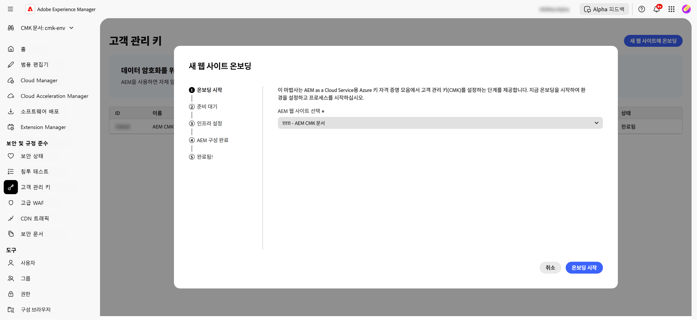
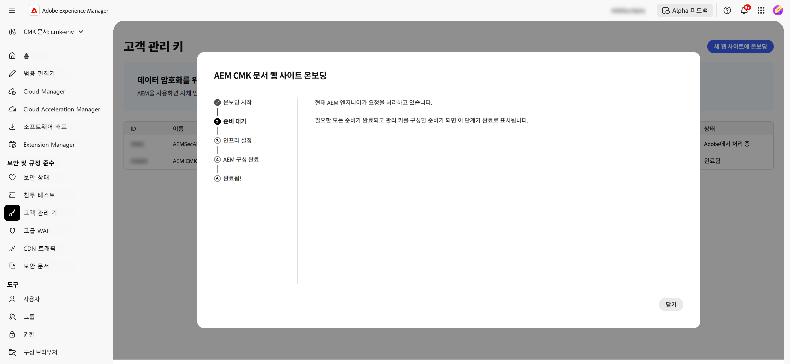
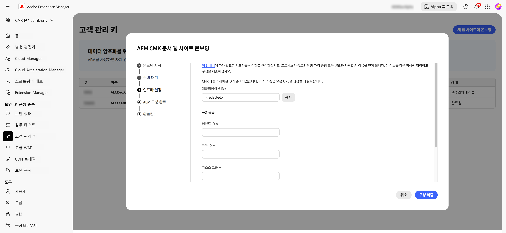
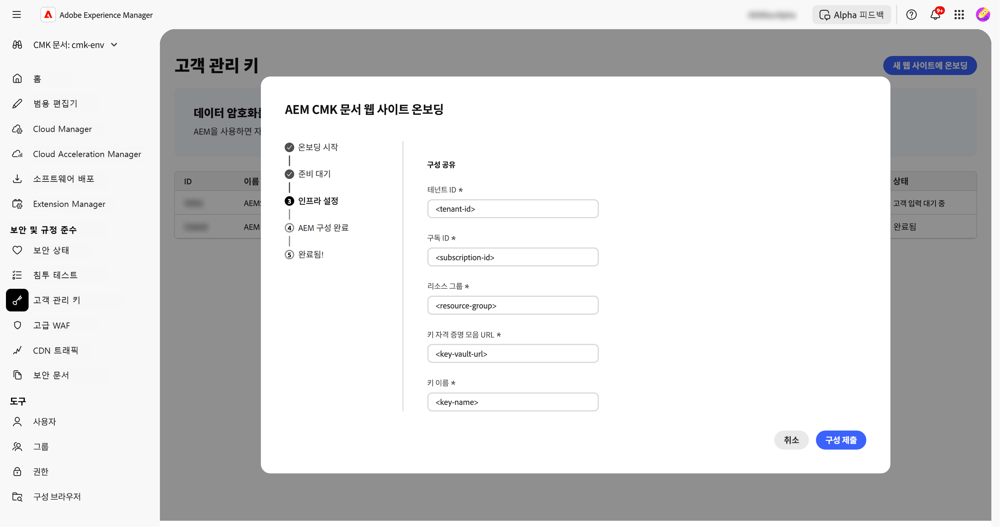
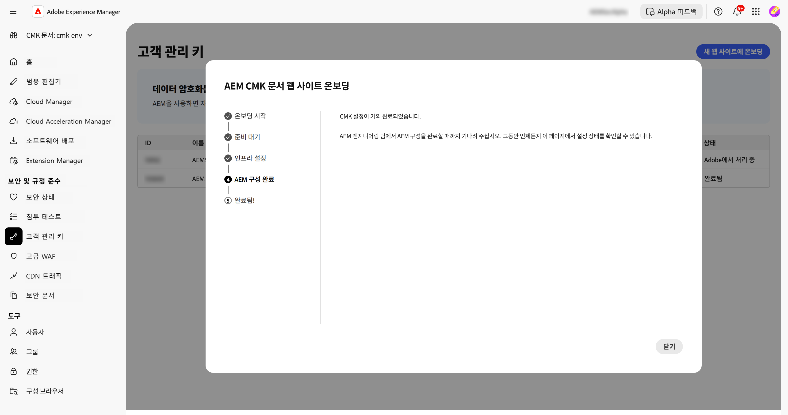
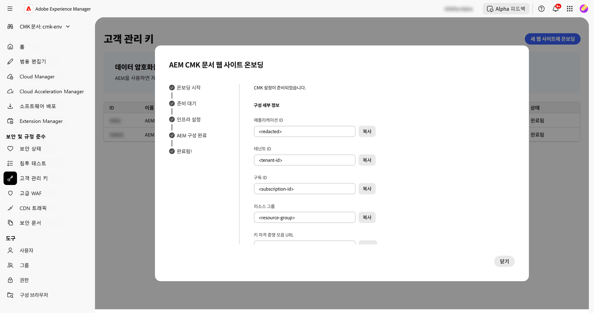

# AEM as a Cloud Service에 대한 고객 관리 키 설정 {#customer-managed-keys-for-aem-as-a-cloud-service}

AEM as a Cloud Service는 현재 고객 데이터를 Azure Blob Storage와 MongoDB에 저장하고 있으며, 기본적으로 공급자가 관리하는 암호화 키를 사용하여 데이터를 보호하고 있습니다. 이 설정은 많은 조직의 보안 요구 사항을 충족하지만 규제 산업에 종사하는 기업이나 데이터 보안 강화가 필요한 기업은 암호화 관행에 대한 더 큰 통제력을 원할 수 있습니다. 데이터 보안, 규정 준수, 암호화 키 관리 능력을 우선시하는 조직을 위해 고객 관리 키(CMK) 솔루션은 중요한 향상 기능을 제공합니다.

## 해결 중인 문제 {#the-problem-being-solved}

공급자 관리 키 때문에 추가적인 개인정보 보호 및 무결성을 필요한 기업은 걱정이 있을 수 있습니다. 키 관리를 통제하지 못하면 조직은 규정 준수 요구 사항을 충족하고 맞춤형 보안 정책을 시행하며 완전한 데이터 보안을 보장하기 어렵습니다.

고객 관리 키(CMK)의 도입은 AEM 고객이 암호화 키를 완벽하게 제어할 수 있도록 함으로써 이러한 문제를 해결합니다. Microsoft Entra ID(이전의 Azure Active Directory)를 통해 인증하면 AEM CS는 고객의 Azure Key Vault에 안전하게 연결되어 키 생성, 순환 및 해지를 포함한 암호화 키의 수명 주기를 관리할 수 있습니다.

CMK는 여러 가지 장점을 제공합니다.

* **데이터 및 애플리케이션 암호화 제어:** AEM 애플리케이션과 데이터 암호화 키를 직접 관리하여 보안을 강화합니다.
* **기밀성과 무결성 향상:** 완전한 암호화 관리를 통해 민감하거나 독점적인 데이터에 대한 우발적인 접근 및 공개 가능성을 줄입니다.
* **Azure Key Vault 지원:** Azure Key Vault를 사용하면 키 저장, 비밀 작업 처리, 키 회전을 수행할 수 있습니다.

CMK를 도입함으로써 고객은 데이터 보안 및 암호화 관행에 대한 통제력을 높이고 보안을 강화하며 위험을 완화하는 동시에 AEM CS의 확장성과 유연성을 계속 누릴 수 있습니다.

AEM as a Cloud Service를 사용하면 데이터를 암호화하기 위한 암호화 키를 직접 가져올 수 있습니다. 이 안내서는 Azure Key Vault에서 AEM as a Cloud Service를 위한 고객 관리 키(CMK)를 설정하는 방법을 설명합니다.

>[!WARNING]
>
>CMK를 설정한 후에는 시스템 관리 키로 되돌릴 수 없습니다. 귀하는 Azure 내에서 키를 안전하게 관리하고 키 자격 증명 모음, 키, CMK 앱에 대한 액세스 권한을 제공하여 데이터에 대한 액세스 권한이 상실되지 않도록 할 책임이 있습니다.

또한 필요한 인프라를 만들고 구성하기 위한 다음 단계도 안내해 드립니다.

1. 환경 설정
1. Adobe에서 애플리케이션 ID 받기
1. 새 리소스 그룹 만들기
1. 키 자격 증명 모음 만들기
1. Adobe에 키 자격 증명 모음에 대한 액세스 권한 부여
1. 암호화 키 만들기

키 자격 증명 모음 URL, 암호화 키 이름 및 키 자격 증명 모음에 대한 정보를 Adobe와 공유해야 합니다.

## 환경 설정 {#setup-your-environment}

이 안내서에는 Azure 명령줄 인터페이스(CLI)만 필요합니다. Azure CLI가 아직 설치되지 않은 경우 [여기](https://learn.microsoft.com/en-us/cli/azure/install-azure-cli)에서 공식 설치 지침을 따릅니다.

이 안내서의 나머지 부분을 진행하기 전에 `az login`으로 CLI에 로그인하십시오.

>[!NOTE]
>
>이 안내서는 Azure CLI를 사용하지만 Azure 콘솔을 통해 동일한 작업을 수행할 수 있습니다. Azure 콘솔을 사용하려면 아래 명령을 참조하십시오.


## AEM as a Cloud Service에 대한 CMK 구성 프로세스 시작하기 {#request-cmk-for-aem-as-a-cloud-service}

UI를 통해 AEM as a Cloud Service 환경에 대한 고객 관리 키(CMK) 구성을 요청해야 합니다. 이렇게 하려면 **고객 관리 키** 섹션 아래 AEM 홈 보안 UI로 이동하십시오.
그런 다음 **온보딩 시작** 버튼을 클릭하여 온보딩 프로세스를 시작할 수 있습니다.




## Adobe에서 애플리케이션 ID 받기 {#obtain-an-application-id-from-adobe}

온보딩 프로세스를 시작하면 Adobe에서 Entra 애플리케이션 ID를 제공합니다. 이 애플리케이션 ID는 가이드의 나머지 부분에서 필요하며 Adobe가 키 자격 증명 모음에 액세스할 수 있도록 하는 서비스 주체를 만드는 데 사용됩니다. 아직 애플리케이션 ID가 없다면 Adobe에서 제공할 때까지 기다려야 합니다.



요청이 완료되면 CMK UI에서 애플리케이션 ID를 볼 수 있습니다.



## 새 리소스 그룹 만들기 {#create-a-new-resource-group}

원하는 위치에 새로운 리소스 그룹을 만듭니다.

```powershell
# Choose a location and a name for the resource group.
$location="<AZURE LOCATION>"
$resourceGroup="<RESOURCE GROUP>"

# Create the resource group.
az group create --location $location --resource-group $resourceGroup
```

이미 리소스 그룹이 있는 경우, 대신 사용해도 됩니다. 이 안내서의 나머지 부분에서는 리소스 그룹의 위치와 이름이 각각 `$location`과 `$resourceGroup`으로 식별됩니다.

## 키 자격 증명 모음 만들기 {#create-a-key-vault}

암호화 키를 저장하려면 키 자격 증명 모음을 만들어야 합니다. 키 자격 증명 모음은 삭제 방지 기능이 활성화되어 있어야 합니다. 다른 Azure 서비스에서 사용하지 않는 데이터를 암호화하려면 삭제 방지 기능이 필요합니다. Adobe 서비스가 키 자격 증명 모음에 액세스할 수 있도록 하려면 공용 네트워크 액세스도 활성화해야 합니다.

>[!IMPORTANT]
>공용 네트워크 액세스가 비활성화한 상태에서 키 자격 증명 모음을 생성하면 키 생성 또는 회전과 같은 모든 키 자격 증명 모음 관련 작업을 네트워크 액세스가 있는 KeyVault 환경(예: KeyVault에 액세스할 수 있는 VM)에서 실행해야 합니다.

```powershell
# Reuse this information from the previous step.
$location="<AZURE LOCATION>"
$resourceGroup="<RESOURCE GROUP>"

# Choose a name for the key vault.
$keyVaultName="<KEY VAULT NAME>"

# Create the key vault.
az keyvault create `
  --location $location `
  --resource-group $resourceGroup `
  --name $keyVaultName `
  --default-action=Allow `
  --enable-purge-protection `
  --enable-rbac-authorization `
  --public-network-access Enabled
```

## Adobe에 키 자격 증명 모음에 대한 액세스 권한 부여 {#grant-adobe-access-to-the-key-vault}

이 단계에서는 Adobe가 Entra 애플리케이션을 통해 키 자격 증명 모음에 액세스할 수 있도록 허용합니다. Entra 애플리케이션의 ID는 Adobe에서 이미 제공되어야 합니다.

우선 Entra 애플리케이션에 연결된 서비스 주체를 만들고 이를 **키 자격 증명 모음 리더** 및 **키 자격 증명 모음 암호화 사용자** 역할로 할당해야 합니다. 역할은 이 안내서에서 생성된 키 자격 증명 모음으로 제한됩니다.

```powershell
# Reuse this information from the previous steps.
$resourceGroup="<RESOURCE GROUP>"
$keyVaultName="<KEY VAULT NAME>"

# The application ID is provided by Adobe.
$appId="<APPLICATION ID>"

# Retrieve the ID of the key vault.
$keyVaultId=(az keyvault show --resource-group $resourceGroup --name $keyVaultName --query id --output tsv)

# Create a new service principal.
$servicePrincipalId=(az ad sp create --id $appId --query id --out tsv)

# Assign the roles to the service principal.
az role assignment create --assignee $servicePrincipalId --role "Key Vault Reader" --scope $keyVaultId
az role assignment create --assignee $servicePrincipalId --role "Key Vault Crypto User" --scope $keyVaultId
```

## 암호화 키 만들기 {#create-an-encryption-key}

마지막으로, 키 자격 증명 모음에 암호화 키를 생성할 수 있습니다. 이 단계를 완료하려면 **키 자격 증명 모음 암호화 책임자** 역할이 필요합니다. 로그인한 사용자에게 이 역할이 없는 경우 시스템 관리자에게 문의하여 이 역할을 부여받거나 이미 해당 역할을 가진 사람에게 이 단계를 완료하도록 요청하십시오.

암호화 키를 만들려면 키 자격 증명 모음에 대한 네트워크 액세스가 필요합니다. 먼저 키 자격 증명 모음에 액세스하여 키를 생성할 수 있는지 확인합니다.

```powershell
# Reuse this information from the previous steps.
$keyVaultName="<KEY VAULT NAME>"

# Choose a name for your key.
$keyName="<KEY NAME>"

# Create the key.
az keyvault key create --vault-name $keyVaultName --name $keyName
```

## 키 자격 증명 모음 정보 공유 {#share-the-key-vault-information}

이제 모든 준비가 끝났습니다. CMK UI를 통해 필요한 정보를 공유하기만 하면 환경 구성 프로세스가 시작됩니다.

```powershell
# Reuse this information from the previous steps.
$resourceGroup="<RESOURCE GROUP>"
$keyVaultName="<KEY VAULT NAME>"

# Retrieve the URL of your key vault.
$keyVaultUri=(az keyvault show --name $keyVaultName `
    --resource-group $resourceGroup `
    --query properties.vaultUri `
    --output tsv)

# In addition we would need the tenantId and the subscriptionId in order to setup the connection.
$tenantId=(az keyvault show --name $keyVaultName `
    --resource-group $resourceGroup `
    --query properties.tenantId `
    --output tsv)
$subscriptionId="<Subscription ID>"
```

CMK UI에서 이 정보 제공:


## 키 액세스 권한 해지의 의미 {#implications-of-revoking-key-access}

키 자격 증명 모음, 키 또는 CMK 앱에 대한 액세스 권한을 해지하거나 비활성화하면 플랫폼 운영에 큰 변경이 발생하는 등 상당한 장애가 발생할 수 있습니다. 이러한 키가 비활성화되면 플랫폼의 데이터에 액세스할 수 없게 되고, 이 데이터에 의존하는 모든 다운스트림 작업이 중단될 수 있습니다. 주요 구성을 변경하기 전에 다운스트림 영향을 완전히 이해하는 것이 중요합니다.

데이터에 대한 플랫폼 액세스 권한을 해지하기로 결정했다면 Azure 내의 키 자격 증명 모음에서 애플리케이션과 관련된 사용자 역할을 제거하면 됩니다.

## 다음 단계 {#next-steps}

CMK UI에서 필요한 정보를 입력하고 나면 Adobe는 AEM as a Cloud Service 환경에 대한 구성 프로세스를 시작합니다. 이 과정은 시간이 다소 걸릴 수 있으며, 완료되면 알림을 받게 됩니다.




## CMK 설정 완료 {#complete-the-cmk-setup}

구성 프로세스가 완료되면 UI에서 CMK 설정 상태를 볼 수 있습니다. 또한 키 자격 증명 모음과 암호화 키도 볼 수 있습니다.


## 질문 및 지원 {#questions-and-support}

AEM as a Cloud Service의 고객 관리 키 설정과 관련하여 질문 또는 문의 사항이 있거나 도움이 필요하면 저희에게 문의하십시오. Adobe 지원 센터에서 모든 질문에 답변해 드리도록 하겠습니다.
